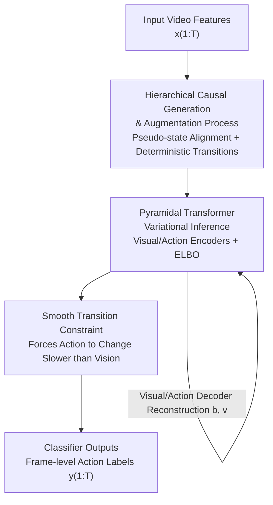

# Hierarchical Action Learning for Weakly-Supervised Action Segmentation

**Conference**: CVPR 2026  
**Paper**: [CVF Open Access](https://openaccess.thecvf.com/content/CVPR2026/html/Huang_Hierarchical_Action_Learning_for_Weakly-Supervised_Action_Segmentation_CVPR_2026_paper.html)  
**Code**: https://github.com/DMIRLAB-Group/HAL (Available)  
**Area**: Video Understanding / Weakly-Supervised Action Segmentation  
**Keywords**: Weakly-supervised action segmentation, Causal representation learning, Hierarchical latent variables, Identifiability, Smoothing constraints

## TL;DR
HAL leverages the time-scale asymmetry—where low-level visual features change rapidly while high-level action semantics change slowly—to construct a hierarchical causal generative process with a smooth transition constraint. This allows the model to learn identifiable high-level action latent variables under weak supervision using only action transcripts, mitigating over-segmentation and achieving new SOTA results on the Breakfast, CrossTask, Hollywood, and GTEA benchmarks.

## Background & Motivation
**Background**: Weakly-supervised action segmentation only provides an "ordered list of actions" (transcript, e.g., `take→crack egg→pour milk`) without frame-level annotations, yet aims to output frame-level action labels. Prevailing methods fall into two categories: iterative two-stage methods (e.g., ISBA, TASL) that refine pseudo-labels through repeated alignment, and single-stage methods (e.g., ATBA, 2by2) that align transcripts and video frames end-to-end.

**Limitations of Prior Work**: Most existing methods are built upon **visual-level representations**. In videos, the appearance of adjacent frames fluctuates frequently due to lighting, perspective, or hand occlusions. Models often mistake these visual fluctuations for action transitions, leading to **over-segmentation and noisy boundaries**. For instance, as shown in Figure 1(a) for the CrossTask dataset, visual changes during the "pouring milk" process are incorrectly sliced into several false boundaries.

**Key Challenge**: True action semantics are structured across multiple abstract levels organized by a few key transitions. However, the fast dynamics of visual features and the slow dynamics of action semantics are modeled within the same layer. Without explicit constraints, these two become entangled, causing high-level semantics to be disrupted by low-level jitter.

**Goal**: To explicitly layer "fast-changing visuals" and "slow-changing actions" and ensure that the learned high-level action variables are **identifiable** rather than arbitrarily entangled, subsequently using these for segmentation.

**Key Insight**: The authors observe an exploitable inductive bias—**time-scale asymmetry**: low-level visual latent variables change rapidly frame-by-frame, whereas high-level action latent variables evolve slowly and capture stable semantics. Slow-evolving action variables naturally smooth out visual jitter and suppress over-segmentation.

**Core Idea**: Construct a **hierarchical causal generative process** where high-level latent actions govern low-level visual dynamics. A **smooth transition constraint** is employed to force high-level actions to change more slowly than low-level visuals, decoupling action variables from visual fluctuations to achieve theoretical identifiability for segmentation.

## Method

### Overall Architecture
The input to HAL consists of $T$ frames of video features $X=[x_1,\dots,x_T]$, and the output is a frame-level action label sequence $\hat Y=[\hat y_1,\dots,\hat y_T]$. During training, only an ordered transcript $A=[a_1,\dots,a_M]$ is available. The pipeline utilizes two layers of latent variables: visual latents $v_{1:T}$ (fast-changing) and action latents $c_{1:T'}$ (slow-changing, $T'\le T$).

The method first modifies the causal graph on the **generative side** into an "augmented generative process." Since there are fewer true action variables than visual variables, a standard equal-length backbone cannot be applied directly. Thus, **pseudo-states** are introduced to pad the action variables to the same length as the visual variables, while the transitions between pseudo-states are set as **deterministic** (introducing no extra noise, meaning the padded states represent the same action). On the **inference side**, a pyramidal Transformer backbone extracts features, paired with visual/action encoders and decoders for variational auto-encoding. Finally, the smooth transition constraint enforces the "slow action" prior in the latent space.

### Key Designs

**1. Hierarchical Causal Generation & Augmentation: Encoding "Slow Action" via Pseudo-states and Deterministic Transitions**

A key issue is that action variables are naturally fewer than visual variables (one action covers many frames), while standard sequence backbones require equal-length inputs. The paper formulates the generative process: observations $x_t=g(v_t)$ are generated from visual variables via an invertible mixing function. Visual variables $v_{t,i}=f_i^v(\mathrm{Pa}_d(v_{t,i}),\mathrm{Pa}_h(v_{t,i}),\epsilon_{t,i}^v)$ depend on both **delayed parents** $\mathrm{Pa}_d$ (local temporal dependency) and **hierarchical parents** $\mathrm{Pa}_h$ (stable high-level action context), while action variables $c_{t,i}=f_i^c(\mathrm{Pa}_d(c_{t,i}),\epsilon_{t,i}^c)$ depend only on their own delayed parents.

Augmentation involves inserting **pseudo-states** into the action sequence to match the length of the visual sequence, making transitions between pseudo-states **deterministic**. This ensures that transitions $c_{t-1}\dashrightarrow c_t\dashrightarrow c_{t+1}$ introduce no new information, representing the **same latent action**. This aligns the action and visual sequences while maintaining the "slow evolution" prior.

**2. Pyramidal Transformer + Variational Inference: Decoupling Visual/Action Latents**

HAL performs variational auto-encoding (VAE) at the feature level. A visual Transformer backbone $\phi$ encodes $x_{1:T}$ into low-dimensional features $b_{1:T}$. Then, a visual encoder $\psi$ and action encoder $\eta$ infer $\hat v_{1:T}=\psi(b_{1:T})$ and $\hat c_{1:T}=\eta(\hat v_{1:T})$, respectively. Visual decoder $\kappa$ and action decoder $\xi$ perform reconstructions $\hat b_{1:T}=\kappa(\hat v_{1:T})$ and $\hat v_{1:T}'=\xi(\hat c_{1:T})$. The training objective is the ELBO:

$$ELBO=\underbrace{\mathbb{E}_{q(v_{1:T}|b_{1:T})}\log p(b_{1:T}|v_{1:T})}_{\mathcal{L}_r}-\underbrace{\Big(D_{KL}(q(v_{1:T}|b_{1:T})\|p(v_{1:T}))+D_{KL}(q(c_{1:T}|v_{1:T})\|p(c_{1:T}))\Big)}_{\mathcal{L}_{KL}}$$

The **pyramidal** structure captures dependencies across multiple time scales: lower layers capture fast visual changes while higher layers capture slow action semantics.

**3. Smooth Transition Constraint $\mathcal{L}_s$: Optimizing the "Slow-Action" Prior**

To ensure the model learns the "slow action, fast visual" property, an explicit constraint is applied to the **latent action variables**. Both latent variables are L2-normalized to the same scale $\overline v_{1:T}=L2(v_{1:T})$ and $\overline c_{1:T}=L2(c_{1:T})$. Stepwise changes are calculated as $\Delta\overline V=\{|\overline v_2-\overline v_1|,\dots\}$ and $\Delta\overline C=\{|\overline c_2-\overline c_1|,\dots\}$. The constraint is:

$$\mathcal{L}_s=\underbrace{\mathrm{ReLU}\Big(\sum_{t=1}^{T-1}\mathbf{w}_c\Delta\overline C-\sum_{i=1}^{T-1}\mathbf{w}_v\Delta\overline V\Big)}_{\textbf{(i)}}+\underbrace{\delta\sum_{t=1}^{T-1}\mathbf{w}_c\Delta\overline C}_{\textbf{(ii)}}$$

Weights $\mathbf{w}_c$ and $\mathbf{w}_v$ focus on large changes. **Term (i)** is a ReLU gate that penalizes when action changes exceed visual changes, while **Term (ii)** (controlled by $\delta$) provides global penalization to encourage temporal smoothness in actions.

### Loss & Training
The total loss combines the segmentation classification loss, ELBO, and the smoothing constraint:

$$\mathcal{L}_{total}=\mathcal{L}_y-\alpha\cdot ELBO+\beta\cdot\mathcal{L}_s$$

where $\alpha, \beta$ are hyperparameters. Theoretically, the paper proves that matching the joint distribution of 5 consecutive frames $\{x_{t-2},\dots,x_{t+2}\}$ allows for block-identifiability of $(v_t,c_t)$.

## Key Experimental Results

### Main Results
Comparison on Breakfast and CrossTask (HAL vs. ATBA / CtrlNS):

| Dataset | Metric | HAL (Ours) | ATBA | CtrlNS | Note |
|--------|------|------|------|--------|------|
| Breakfast | MoF | **56.3±1.3** | 53.9±1.2 | — | +2.4 |
| Breakfast | IoU | **42.6±1.9** | 41.1±0.7 | — | Sharper boundaries |
| Breakfast | IoD | **62.4±2.5** | 61.7±1.1 | — | — |
| CrossTask | MoF | **54.0±0.8** | 50.6±1.3 | 54.0±0.9 | Comparable to CtrlNS |
| CrossTask | MoF-Bg | **35.0±1.1** | 31.3±0.7 | — | +3.7 |
| CrossTask | IoU | **21.6±0.4** | 20.9±0.4 | 15.7±0.5 | Significant lead |

HAL gains primarily stem from the **smooth transition constraint $\mathcal{L}_s$**, which enhances temporal consistency and alignment with ground truth (IoU/IoD).

### Ablation Study

| Configuration | MoF | IoU | IoD | Note |
|------|------|------|------|------|
| Baseline | 53.3 | 40.1 | 58.7 | Starting point |
| $\mathcal{L}_r$ only | 54.3 | 38.4 | 61.6 | MoF↑ but IoU↓ |
| $\mathcal{L}_s$ only | 54.6 | 40.3 | 61.6 | Individual gain |
| $\mathcal{L}_{KL}$ only | 54.5 | **42.0** | 61.0 | High impact on IoU |
| Full | **56.6** | **42.6** | **62.1** | Optimal synergy |

### Key Findings
- **Synergy of Components**: All loss terms contribute positively to MoF, and their combination maximizes overall performance.
- **Reconstruction Trade-off**: Adding $\mathcal{L}_r$ alone causes action segments to "expand," lowering IoU—the $KL$ and $s$ terms are necessary for correction.
- **Improved Separability**: T-SNE visualizations show HAL’s high-level action variables cluster more tightly than low-level ones, explaining the suppression of over-segmentation.
- **Boundary Precision**: While MoF is competitive, the lead in IoU/IoD highlights HAL's superiority in producing clean boundaries and coherent segments.

## Highlights & Insights
- **Leveraging Time-Scale Asymmetry**: Using common-sense observations as a lever for theoretical identifiability is a significant contribution.
- **Deterministic Transitions**: This alignment trick allows standard backbones to satisfy hierarchical priors without complex modifications.
- **Latent-Level Smoothing**: Unlike label-level smoothing, HAL addresses the root cause by smoothing the learned representations.

## Limitations & Future Work
- **Static Backgrounds**: Performance on complex, diverse backgrounds (like Hollywood) remains a challenge.
- **Theoretical Gap**: Identifiability proofs rely on strong assumptions (e.g., non-singular Jacobians) that may not strictly hold in all real-world videos.
- **Local Window**: The 5-frame local window used for identifiability might be insufficient for capturing very long-term action dynamics.

## Related Work & Insights
- **vs. ATBA**: HAL improves boundary quality by moving the smoothing constraint from the labels to the latent action variables.
- **vs. CtrlNS**: Unlike the single-layer CtrlNS, HAL’s hierarchical structure better models multi-scale temporal factors.
- **vs. ICA**: HAL extends non-linear ICA identifiability theories to a dual-layer "high-level action governing low-level visual" framework for video understanding.

## Rating
- Novelty: ⭐⭐⭐⭐⭐ 
- Experimental Thoroughness: ⭐⭐⭐⭐ 
- Writing Quality: ⭐⭐⭐⭐ 
- Value: ⭐⭐⭐⭐ 

<!-- RELATED:START -->

## Related Papers

- [\[CVPR 2026\] Frequency-Aware Affinity for Weakly Supervised Semantic Segmentation](frequency-aware_affinity_for_weakly_supervised_semantic_segmentation.md)
- [\[CVPR 2026\] Leveraging Class Distributions in CLIP for Weakly Supervised Semantic Segmentation](leveraging_class_distributions_in_clip_for_weakly_supervised_semantic_segmentati.md)
- [\[CVPR 2026\] Rethinking Box Supervision: Bias-Free Weakly Supervised Medical Segmentation](rethinking_box_supervision_bias-free_weakly_supervised_medical_segmentation.md)
- [\[CVPR 2026\] LaDy: Lagrangian-Dynamic Informed Network for Skeleton-based Action Segmentation via Spatial-Temporal Modulation](lady_lagrangian-dynamic_informed_network_for_skeleton-based_action_segmentation_.md)
- [\[ICCV 2025\] Joint Self-Supervised Video Alignment and Action Segmentation](../../ICCV2025/segmentation/joint_self-supervised_video_alignment_and_action_segmentation.md)

<!-- RELATED:END -->
