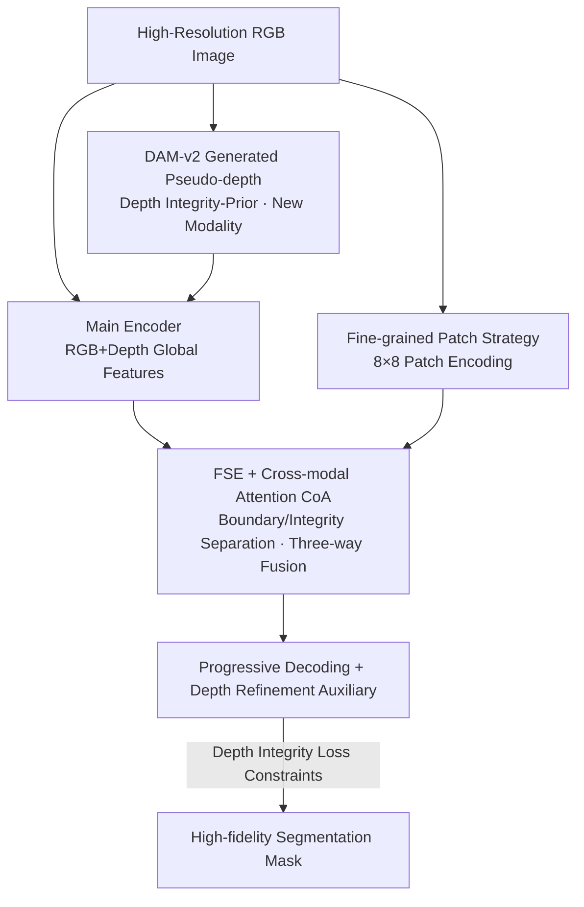

# High-Precision Dichotomous Image Segmentation via Depth Integrity-Prior and Fine-Grained Patch Strategy

**Conference**: CVPR 2026  
**Paper**: [CVF Open Access](https://openaccess.thecvf.com/content/CVPR2026/html/Liu_High-Precision_Dichotomous_Image_Segmentation_via_Depth_Integrity-Prior_and_Fine-Grained_Patch_CVPR_2026_paper.html)  
**Code**: https://tennine2077.github.io/PDFNet.github.io/ (Available)  
**Area**: Dichotomous Image Segmentation / High-Precision Segmentation  
**Keywords**: Dichotomous Image Segmentation (DIS), Pseudo-depth Prior, Cross-modal Attention, Fine-grained Patching, High-resolution Segmentation

## TL;DR
Addressing the dilemma in high-precision Dichotomous Image Segmentation (DIS) where "non-diffusion models are fast but semantically weak, while diffusion models are accurate but heavy and slow," this paper observes that complete objects in depth maps exhibit "low variance, smooth interiors, and sharp boundaries," while the background shows "high variance and chaos." Termed the **depth integrity-prior**, the authors utilize a pre-existing monocular depth estimation model (DAM-v2) to generate pseudo-depth as a new modality. Combined with the cross-modal fusion network PDFNet, a depth integrity loss, and an 8×8 fine-grained patch strategy, the method achieves SOTA results on DIS-VD with $F^{max}_\beta=0.915$ using less than half the parameters of diffusion-based methods.

## Background & Motivation
**Background**: Dichotomous Image Segmentation (DIS) requires pixel-level extraction of foreground objects with fine structures (e.g., cutouts, hair, fence gaps) from high-resolution images, making it more demanding than standard salient object detection. Research follows two paths: non-diffusion (CNN/Transformer, e.g., IS-Net, MVANet, BiRefNet) and diffusion-based (GenPercept, DiffDIS).

**Limitations of Prior Work**: Non-diffusion methods are lightweight (10M–300M) and fast (FPS > 3) but struggle with a fundamental contradiction: expanding the receptive field to capture global structure weakens detail modeling, while tightening it to preserve local details leads to inaccurate global structures. This results in weak semantics and lack of stable spatial priors, causing frequent false positives/negatives (e.g., misidentifying sofa patterns as targets or breaking continuous object interiors). Diffusion methods achieve high consistency via strong generative priors from billions of images but suffer from explosive parameter counts (>865M) and extremely slow inference (FPS < 1), making practical deployment infeasible.

**Key Challenge**: The trade-off between accuracy and efficiency. To break this, a **task-adaptive prior** is needed that is easy to acquire (low cost from existing reliable models), high-performing (small parameters, fast inference), and provides strong guidance (clear distinction between target and background).

**Key Insight**: The authors observe a neglected geometric fact—in depth maps, a complete object presents as a region with "low variance, smooth interior, and sharp boundary depth mutations" due to continuous surfaces. In contrast, the background consists of fragmented surfaces at different depths, creating a "high-variance, chaotic" pattern (verified in Paper Fig. 1: depth variance in GT regions is significantly lower than in the background or the whole image). This satisfies strong guidance requirements. Since DIS data lacks depth maps, the authors propose using the off-the-shelf monocular depth model DAM-v2 to generate **pseudo-depth**, which is both easy to acquire (DAM-v2-Base runs at >10 FPS) and low-cost.

**Core Idea**: Introduce depth as the **first new modality** in DIS, replacing expensive generative priors with the "depth integrity-prior" to provide structural guidance. This gains strong semantics while maintaining the lightweight and fast nature of the non-diffusion paradigm.

## Method

### Overall Architecture
The input to PDFNet (Prior-guided Depth Fusion Network) is a high-resolution RGB image $I\in\mathbb{R}^{B\times3\times H\times W}$. First, a frozen DAM-v2 generates a normalized pseudo-depth map $D\in\mathbb{R}^{B\times1\times H\times W}$ (range $[0,1]$). The output is a high-fidelity segmentation mask. The architecture employs multi-branch encoding and a progressive refinement decoder:

- **Multi-branch Feature Extraction**: The main encoder extracts RGB visual features $\{F^v_i\}$ and depth features $\{F^d_i\}$ to provide global spatial context. A parallel patch branch divides the input into 64 patches ($8\times8$), rearranged into a large batch for a specialized patch encoder to extract detail features $\{F^p_i\}$, which are then reassembled into high-resolution sequences for high-fidelity details.
- **FSE Refinement Decoder**: Each stage of the decoder embeds a Feature Selection and Extraction (FSE) module. Based on prior stage predictions, it analyzes "boundary/integrity" cues and dynamically fuses the three-way features using Cross-modal Attention (CoA).
- **Depth Refinement Auxiliary Task**: A lightweight depth decoder performs pseudo-depth reconstruction as regularization, forcing the shared encoder to learn fine-grained representations beneficial for both segmentation and depth.
- Deep supervision is applied throughout, with progressive upsampling and fusion of shallow features to obtain the final mask.

### Key Designs

**1. Depth Integrity-Prior: Turning "Complete Object = Low Variance Depth" into Free Spatial Guidance**

This is the foundation of the work, addressing the "weak semantics and unstable spatial prior" of non-diffusion methods. The key observation is that real object surfaces are continuous, appearing in depth maps as regions with **low variance, smooth interiors, and sharp boundaries**. Backgrounds are **high-variance and chaotic**. Tests on DIS-TR show depth variance in GT regions is significantly lower than elsewhere, proving this prior is universal and discriminative. Since DIS lacks depth data, using DAM-v2 to generate pseudo-depth marks the **first time depth has been introduced as a modality in DIS**. It works because it satisfies "easy acquisition, low cost, and strong guidance," replacing the billion-parameter priors of diffusion models with zero-cost geometric cues.

**2. FSE Module + Cross-modal Attention: Boundary/Integrity Separation + Three-way Feature Fusion**

Patch encoders extract details by limiting the receptive field but lose contextual connections between patches. The FSE (Feature Selection and Extraction) module fills this gap. It performs "boundary-integrity separation" on the previous prediction $P_{i+1}$: average pooling yields $P_{p_{i+1}}=\text{AvgPool}(P_{i+1})$, and areas where the absolute difference exceeds threshold $\tau=0.1$ are set to 1 to create a boundary map $B_i$. Integrity maps $S_i=\text{ReLU}(P_{i+1}-B_i)$ focus on the target interior. $B_i$ is divided into 64 patches; any patch containing a boundary is scored $Bd_i=1$, selectively enhancing "target boundary" blocks.

Fusion utilizes Cross-modal Attention (CoA) (based on cross-attention with RMSNorm, SwiGLU FFN, and residuals). It injects boundary scores and integrity maps as soft weights into the corresponding modalities, merging local details and depth structure into the global visual context:

$$FN^{p*}_i = \text{CoA}(FP^p_i\odot(1+Bd_i),\; FP^{vd}_i),\quad FN^{d*}_i = \text{CoA}(FP^d_i\odot(1+S_i),\; FP^{vp}_i)$$

$$FN^{v1*}_i = \text{CoA}(F^{v*}_i, FN^{p*}_i),\quad FN^{v2*}_i = \text{CoA}(FN^{v1*}_i, FN^{d*}_i)$$

This allows the network to explicitly focus on boundary patches and continuous interior regions, restoring context to the patch branch and integrating depth constraints.

**3. Depth Integrity Loss: Direct Mask Consistency via Pseudo-depth Mean and Gradient**

Beyond using depth as input, the "integrity prior" is embedded into the loss function $l_{inte}=(l_v+l_g)/2$ to fix misdetections. **Depth Stability Constraint** $l_v$ assumes high depth consistency within the target. It calculates the mean depth $\mu$ within the GT mask and uses depth deviation $\text{diff}=(D-\mu)^2$ for adaptive weighted cross-entropy—punishing false positives (FP) with high deviation and encouraging the inclusion of false negatives (FN) with depth consistent with the mean:

$$l_v = \mathbb{E}[-\log P_y \odot (\text{diff}\odot(\text{FP}-\text{FN})+\text{FN})]$$

The **Depth Continuity Constraint** $l_g$ leverages the fact that target boundaries often correspond to depth gradient mutations, using Sobel gradients to weight segmentation errors at high-gradient locations: $l_g=\mathbb{E}[-\log P_y\odot(|G_x|+|G_y|)]$. This combination forces the model to learn structurally coherent representations.

**4. Fine-grained Patch Strategy: Scaling from MVANet's 2×2 to 8×8 with Adaptive Selection**

DIS is a high-resolution task where details are critical. While MVANet uses $2\times2=4$ patches, performance collapses as patches increase ($3\times3$ drops to 0.803, $4\times4$ to 0.707) because it lacks global context. PDFNet increases this to $8\times8=64$ patches, using FSE for adaptive selection to enhance boundary patches while suppressing non-target regions. Because PDFNet maintains a full-resolution main branch for global context, the patch branch can focus solely on local details without losing the big picture. Performance peaks at 64 patches ($F^{max}_\beta=0.915$) and only drops at 256 patches ($16\times16$) due to insufficient context.

### Loss & Training
Segmentation supervision uses $l=l_{wBCE}+l_{wIoU}+l_{SSIM}/2+l_{inte}$. The depth refinement branch uses Scale-Invariant Logarithmic error $l_{SILog}$. The overall loss is weighted across deep supervision stages:

$$L = l_f + \lambda_1\sum_{i=1}^{5}l^i_f + \lambda_2\cdot\Big(l_{SILog}+\lambda_1\sum_{i=1}^{5}l^i_{SILog}\Big),\quad \lambda_1=0.5,\;\lambda_2=0.1$$

Backbone: Swin-B (ImageNet-21K pre-trained). Input: $1024^2$. Optimizer: AdamW, LR $1\times10^{-5}$, batch=1, 100 epochs on a single RTX-4090.

## Key Experimental Results

### Main Results
Comparison on DIS-5K (5,470 images, 225 classes). Key results for DIS-VD and DIS-TE(ALL). Parameters include external depth generators:

| Method | Modality | Params | DIS-VD $F^{max}_\beta$ | DIS-TE(ALL) $F^{max}_\beta$ | $M$↓ |
|------|------|--------|------|------|------|
| MVANet | RGB | 93M | .904 | .908 | .035 |
| BiRefNet | RGB | 215M | .897 | .900 | .035 |
| GenPercept (Diff.) | RGB | 865M+84M | .877 | .875 | .036 |
| DiffDIS (Diff.) | RGB | 865M+84M | .908 | .911 | .027 |
| CPNet | RGB-D | 216M+335M | .892 | .893 | .035 |
| **PDFNet-L** | RGB-D | 94M+335M | **.915** | **.915** | **.030** |

PDFNet-L outperforms MVANet on DIS-TE(ALL) by 0.7%, 1.5%, 0.6%, 1.2%, and 0.5% across five metrics. It achieves SOTA levels, involving **fewer than half the parameters of diffusion methods (94M+335M vs 865M+84M)**. FPS for PDFNet-S/B/L is 5.7/4.5/3.9, significantly faster than DiffDIS (0.8).

### Ablation Study
Component ablation (DIS-VD, $S$=Integrity Map, $Bd$=Boundary Score, FSE, Depth):

| Config | $F^{max}_\beta$ | $M$↓ | FPS | Note |
|------|------|------|------|------|
| Baseline (enc-dec + 8×8) | .841 | .057 | 7.30 | Starting Point |
| + Depth | .872 | .044 | 4.53 | Biggest single jump (+0.031) |
| + FSE | .885 | .043 | 6.27 | Fusion with FSE |
| + $S$ + $Bd$ + Depth | .903 | .036 | 6.04 | Synergy |
| + $S$ + $Bd$ + FSE + Depth (full) | **.907** | .032 | 3.93 | Full model (w/o depth loss) |

Patch size ablation (Table 5):

| Config | $F^{max}_\beta$ | FPS |
|------|------|------|
| MVANet 2×2 | .904 | 6.53 |
| MVANet 4×4 | .707 | 6.36 |
| PDFNet 1×1 | .907 | 7.23 |
| PDFNet 4×4 | .911 | 6.50 |
| **PDFNet 8×8** | **.915** | 6.04 |
| PDFNet 16×16 | .910 | 3.38 |

### Key Findings
- **Depth modality is the major contributor**: Adding Depth to the Baseline provides the largest jump (+0.031), confirming "depth integrity-prior" as the main engine.
- **Fine-grained patching requires a global branch**: Unlike MVANet, which collapses with more patches, PDFNet peaks at 8×8 due to its full-resolution main branch preserving global context.
- **$l_{inte}$ is a universal constraint**: It improves performance on other models like MAGNet (+0.003) and CPNet (+0.003).
- **Robust to pseudo-depth quality**: $F^{max}_\beta$ stays between .904–.917 regardless of whether DAM-Small or DepthPro is used.
- **Generalizes to HRSOD**: PDFNet-L outperforms PGNet and BiRefNet on HRSOD-TE/UHRSD-TE, showing transferability.

## Highlights & Insights
- **Repackaging "Geometric Integrity" as a Free Prior**: Utilizing the "objects in depth = low variance" insight with pseudo-depth effectively bypasses the lack of depth data in DIS.
- **Matching SOTA with Half the Parameters**: Demonstrates that strong priors do not require billion-parameter generative models; geometric cues and lightweight fusion can suffice.
- **Plug-and-play Depth Integrity Loss**: The $l_{inte}$ loss is model-agnostic and relies only on pseudo-depth statistics, making it easily transferable.
- **Division of Labor Paradigm**: The "main branch for global + patch branch for details" approach explains why this method succeeds where previous patch-based models failed.

## Limitations & Future Work
- **External Depth Estimator Dependency**: While robust to quality, the pipeline requires an external model, lowering overall FPS (3.9 vs MVANet's 6.5). End-to-end training is a future direction.
- **Thin/Transparent Objects**: The prior assumes depth structures; it may weaken for glass or thin objects where depth matches the background.
- **Training Constraints**: Batch size = 1 on a single GPU. Performance under larger batches or multi-GPU environments is untested.
- **Comparison Caveat**: Comparing with diffusion methods requires noting that metrics like $F^{max}_\beta$ are affected by post-processing differences.

## Related Work & Insights
- **vs MVANet**: MVANet lacks a global branch, causing it to fail with more patches. Ours uses an 8×8 grid with a global anchor.
- **vs BiRefNet**: BiRefNet is single-modality RGB; Ours complements RGB with structural depth priors.
- **vs DiffDIS / GenPercept**: Ours matches diffusion performance with <50% of the parameters and significantly higher FPS.
- **vs CPNet / MAGNet**: These are for SOD and often require real depth. Ours is for DIS and uses pseudo-depth, with a loss function that also benefits SOD models.

## Rating
- Novelty: ⭐⭐⭐⭐⭐ First introduction of depth modality to DIS with a systematic "depth integrity-prior" implementation.
- Experimental Thoroughness: ⭐⭐⭐⭐⭐ Comprehensive DIS-5K subsets, multi-group ablations, robustness tests, and HRSOD generalization.
- Writing Quality: ⭐⭐⭐⭐ Clear motivation and methodology; some symbols in FSE are dense but clear upon inspection.
- Value: ⭐⭐⭐⭐⭐ Significant for practical deployment, matching diffusion SOTA with half the parameters and offering portable loss functions.

<!-- RELATED:START -->

## Related Papers

- [\[CVPR 2026\] FlowDIS: Language-Guided Dichotomous Image Segmentation with Flow Matching](flowdis_language-guided_dichotomous_image_segmentation_with_flow_matching.md)
- [\[CVPR 2026\] CDICS: Delving Into Fine-Grained Attribute for In-Context Segmentation via Compositional Prompts and Phased Decoupling](cdics_delving_into_fine-grained_attribute_for_in-context_segmentation_via_compos.md)
- [\[CVPR 2026\] Training-Free Open-Vocabulary Camouflaged Object Segmentation via Fine-Grained Object Binding and Adaptive Hybrid Prompt](training-free_open-vocabulary_camouflaged_object_segmentation_via_fine-grained_o.md)
- [\[CVPR 2026\] CompetitorFormer: Mitigating Query Conflicts for 3D Instance Segmentation via Competitive Strategy](competitorformer_mitigating_query_conflicts_for_3d_instance_segmentation_via_com.md)
- [\[ICCV 2025\] LawDIS: Language-Window-based Controllable Dichotomous Image Segmentation](../../ICCV2025/segmentation/lawdis_language-window-based_controllable_dichotomous_image_segmentation.md)

<!-- RELATED:END -->
