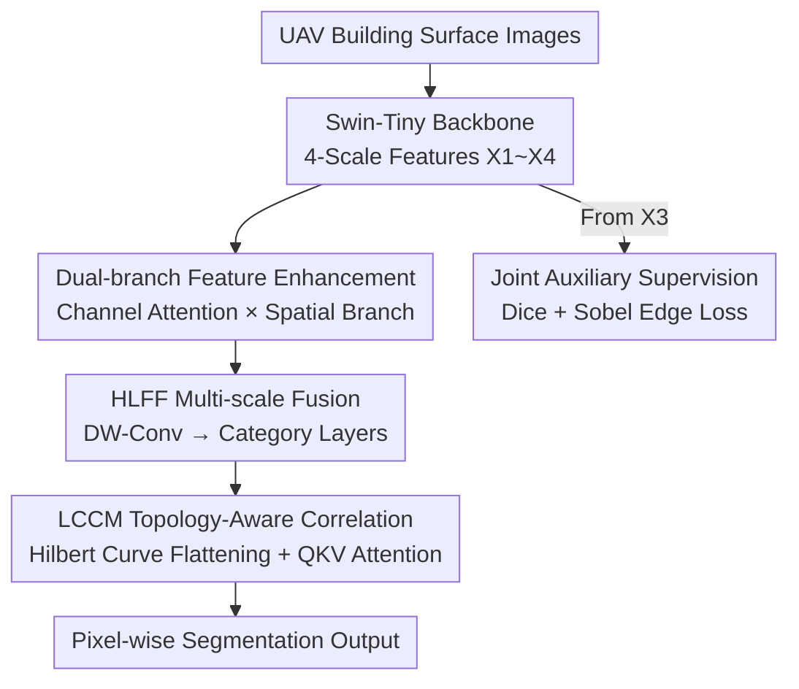

# Hilbert Curve-Based Attention Enabling Topology-Preserving Image Tensor Representation for Semantic Segmentation Network

**Conference**: CVPR 2026  
**Paper**: [CVF Open Access](https://openaccess.thecvf.com/content/CVPR2026/html/Xu_Hilbert_Curve-Based_Attention_Enabling_Topology_Preserving_Image_Tensor_Representation_for_Semantic_CVPR_2026_paper.html)  
**Code**: https://github.com/mumu-k/TPSegformer  
**Area**: Semantic Segmentation  
**Keywords**: Building Defect Segmentation, Hilbert Curve, Topology Preservation, Self-Attention, UAV Inspection

## TL;DR
Aiming at building surface defect segmentation from UAV images, this paper proposes TPSegformer. Before the attention calculation in the decoder, it utilizes the **Hilbert curve** instead of traditional row-major flattening to compress 2D features into 1D sequences, thereby preserving the spatial adjacency of pixels during dimensionality reduction. Combined with dual-branch feature enhancement, high-low resolution fusion, and joint auxiliary supervision using Dice and edge losses, it achieves 80.77% mIoU and 90.22% Acc on the self-built BD3 defect dataset.

## Background & Motivation
**Background**: Semantic segmentation is well-established in autonomous driving and medical imaging. The mainstream approach involves using strong backbones (CNN / Transformer) to extract multi-scale features, followed by decoders for step-by-step upsampling to recover resolution. Recently, self-attention has been widely introduced to model long-range dependencies.

**Limitations of Prior Work**: Applying these methods to **UAV-based building surface defect inspection** is challenging. Diverse building materials (stone, plaster), complex structures, and drastic changes in lighting and perspectives cause defects like cracks, spalling, and moss to be easily misclassified—for instance, stone textures under certain lighting may resemble cracks. Furthermore, when introducing self-attention, most methods use **row-major traversal** to flatten feature maps into sequences. Jumping from the end of a row to the start of the next causes originally adjacent pixels to be pulled far apart in the 1D sequence, destroying spatial continuity and weakening the model's structural perception.

**Key Challenge**: Attention requires "straightening" 2D features into 1D sequences to calculate correlations, but **the straightening process itself destroys 2D topology**—adjacent pixels are scattered, and structures sensitive to adjacency, such as defect boundaries, suffer most. Prior works introducing the Hilbert curve to segmentation (e.g., Zheng et al.) merely replaced the traversal method without systematically comparing different curves or providing a theoretical analysis of the impact on attention.

**Goal**: To develop a lightweight yet accurate defect segmentation network focusing on **preserving spatial topology** during the attention dimensionality reduction stage while balancing multi-scale fusion and inter-class correlation modeling.

**Key Insight**: The author notes that space-filling curves are inherently designed to maintain local continuity during "1D ↔ nD mappings." Compared to Z-order or row-major traversal, the Hilbert curve ensures that points adjacent in the 1D sequence remain as close as possible in the 2D space.

**Core Idea**: Replace row-major traversal with the Hilbert curve for 2D-to-1D reduction before attention, ensuring that "straightening" no longer destroys topology, and embedding this into a lightweight decoder called TPDecoder.

## Method

### Overall Architecture
TPSegformer follows the pipeline: "Swin-Tiny backbone for multi-scale feature extraction → Dual-branch enhancement → High-low resolution fusion to generate category layers → Topology-preserving inter-class correlation calculation → Output." The input is an RGB image of a building surface captured by a UAV, and the output is pixel-wise segmentation for five classes: crack, spalling, moss, plaster, and stone.

The backbone uses Swin Transformer-Tiny, outputting features at four scales from $X_1\in\mathbb{R}^{B\times C\times128\times128}$ to $X_4\in\mathbb{R}^{B\times C\times16\times16}$. The decoding end (TPDecoder) consists of two stages: the **feature enhancement stage** uses two branches to strengthen semantic and spatial information, respectively, followed by multiplicative fusion; the **decoding prediction stage** first uses HLFF to fuse high and low-resolution features and generate "category layers" (where each channel corresponds to a class), then uses LCCM to calculate attention correlations between these category layers—where the Hilbert curve performs its dimensionality reduction within LCCM. Additionally, an auxiliary supervision branch is drawn from the backbone’s $X_3$, using a joint Dice + edge loss to help the backbone learn clearer boundaries.

### Key Designs

**1. Hilbert Curve Topology-Preserving Reduction: Preventing Disruption of Adjacent Pixels**

This is the core of the paper. To calculate self-attention between category layers in LCCM, 2D feature coordinates $(x,y)$ must be mapped to a 1D index $h$. The paper compares three mappings: row-major $R(x,y)=x\cdot W + y$ (Eq. 6), Z-order $Z(x,y)=\sum_k[\mathrm{bit}(x,k)2^{2k}+\mathrm{bit}(y,k)2^{2k+1}]$ (Eq. 7), and Hilbert curve $H(x,y)=\sum_{k=0}^{n-1}2^{2k}f_k(\mathrm{bit}(x,k),\mathrm{bit}(y,k))$ (Eq. 5). All three map coordinates in $[0,2^n-1]^2$ to 1D indices in $[0,2^{2n}-1]$.

Why is Hilbert better? The paper defines a **locality loss** to quantify the "loss of spatial continuity during straightening":

$$L_{local}=\sum_{i=1}^{N-1}\lVert p(i)-p(i+1)\rVert_2$$

Where $p(i)$ is the 2D coordinate of the $i$-th pixel in the flattened sequence. This sums the **actual 2D distance** between pixels that are **adjacent in the 1D sequence**. A smaller value indicates that 1D adjacency translates to 2D adjacency, meaning better topology preservation. Row-major traversal has the highest loss due to the large jumps at the end of each row; the Hilbert curve, which recursively fills sub-blocks in a U-shape, ensures sequence adjacency almost always implies 2D adjacency, resulting in the lowest loss (see Table 1: at order=7, row-major is 2,064,766, Z-order is 139,774, and Hilbert is only 16,383). The trade-off is slower index calculation for Hilbert curves, which the paper mitigates by applying it only to low-resolution feature maps (16×16/32×32).

**2. Dual-branch Feature Enhancement: Recovering Local Textures Lost by the Backbone**

Fine-grained details are lost as the backbone downsamples, which is fatal for small structures like defect boundaries. Based on ECANet, the authors add a spatial branch: the channel branch follows ECANet, using global average pooling to obtain a channel descriptor $z_c=\frac{1}{H\cdot W}\sum_{i,j}X_c(i,j)$, followed by 1D convolution and Sigmoid to get channel weights $w=\omega(\mathrm{Conv1D}(z))$; the spatial branch uses $3\times3$ convolution + ReLU + BN to extract local texture edges $F_s=\mathrm{BN}(\mathrm{ReLU}(\mathrm{Conv}_{3\times3}(X)))$. The two are fused via element-wise multiplication $X_{out}=F_s\odot w$, allowing the network to retain global semantics while strengthening local structures.

**3. HLFF + LCCM Dual-Module Decoding: Multi-scale Fusion and Category Correlation**

The decoding prediction stage consists of two modules. **HLFF (High-Low Feature Fusion)** upsamples low-resolution features $X_l$ to the size of $X_h$, concatenates them as $X_{cat}\in\mathbb{R}^{B\times(C_1+C_2)\times H_1\times W_1}$, and uses **depthwise separable convolution** ($3\times3$ depthwise for spatial + $1\times1$ pointwise for channel compression) followed by a $3\times3$ convolution to generate "category layers"—where each output channel corresponds to a defect class. **LCCM (Lightweight Correlation Computation)** passes the HLFF output through three parallel convolutions to obtain $Q,K,V$. After Hilbert reduction as described in Design 1, $Q$ and $K$ compute inter-class similarity, normalized by Softmax and weighted by $V$. The result is modulated by channel expansion and Sigmoid to produce attention weights that refine the category layers. This explicitly models dependencies between defect types (e.g., spalling often accompanies moss), and because reduction preserves topology, the attention correlation remains undistorted by pixel scattering.

**4. Joint Auxiliary Supervision: Anchoring Boundaries with Dice + Edge Loss**

To enhance the discriminative power of intermediate features, a lightweight FCN Head auxiliary branch is drawn from Swin’s last stage $X_3$. After bilinear upsampling to original resolution, it is supervised by a **joint auxiliary loss** $L_{aux}=\lambda_{dice}L_{Dice}+\lambda_{edge}L_{Edge}$. The Dice loss $L_{Dice}=1-\frac{2\sum p_i g_i}{\sum p_i^2+\sum g_i^2+\delta}$ addresses class imbalance (defects occupy few pixels); the Edge loss uses the Sobel operator to extract gradient magnitudes of predictions and ground truth to calculate the $L1$ distance $L_{Edge}=\gamma\cdot\lVert\nabla p-\nabla g\rVert_1$, specifically targeting boundary localization. This auxiliary supervision is used only during training.

### Loss & Training
The main branch uses Cross-Entropy combined with the joint auxiliary loss. Experiments were conducted on an RTX 4090 using AdamW (initial learning rate $6\times10^{-5}$, $\beta=(0.9, 0.999)$, weight decay 0.01). Position encoding and normalization layers were set to 0 weight decay, and the decoder parameters were given a 10× learning rate multiplier. The optimal configuration for the joint loss was $\lambda_{dice}=0.5$ and $\lambda_{edge}=1.0$.

## Key Experimental Results

### Main Results
On the self-built BD3 defect segmentation dataset (3 defect classes + 2 material classes, 5:1:1 split), the model was compared against six representative segmentation networks:

| Method | Crack | Spalling | Moss | Plaster | Stone | mIoU | ACC |
|------|------|------|------|------|------|------|-----|
| CCNet | 53.86 | 81.21 | 60.03 | 94.83 | 70.90 | 72.17 | 82.53 |
| SegFormer | 50.60 | 72.49 | 57.35 | 95.99 | **93.72** | 74.03 | 86.43 |
| BiSeNetV2 | 45.11 | 65.43 | 58.70 | 94.43 | 78.00 | 68.33 | 77.50 |
| PIDNet | 55.90 | 78.60 | 55.37 | 95.07 | 79.71 | 72.93 | 84.27 |
| DSNet | 48.17 | 64.73 | 32.81 | 93.22 | 78.73 | 63.53 | 80.91 |
| **TPSegformer** | **59.98** | **91.11** | **72.58** | **96.71** | 83.44 | **80.77** | **90.22** |

TPSegformer leads across mIoU, ACC, and four specific categories. While it trailed SegFormer in the stone category (83.44 vs 93.72), SegFormer exhibited overall instability. On the cross-domain Dacl10k dataset (19 classes, multiple materials and defects), TPSegformer still achieved 44.27% mIoU and 60.32% Acc, outperforming all six competitors.

### Ablation Study

| Config | mIoU(%) | ACC(%) | Description |
|------|---------|--------|------|
| Row-major Flattening | 75.58 | 86.37 | Worst topology destruction |
| Z-order Flattening | 77.89 | 88.00 | Medium |
| **Hilbert Curve** | **79.49** | **89.51** | Best topology preservation (+3.9 mIoU vs Row-major) |

Backbone suitability (Table 5): Swin series performed best (Swin-T 79.49 → Swin-L 81.37), followed by HRNet, with ResNet being the weakest. Swin-Tiny approached larger HRNet/ResNet variants, showing a good efficiency-accuracy balance. Joint auxiliary loss (Table 6): The optimal configuration $\lambda_{dice}=0.5, \lambda_{edge}=1.0$ achieved 80.77/90.22, compared to the baseline of 79.49/89.51 without auxiliary loss.

### Key Findings
- **Topology preservation directly determines segmentation accuracy**: Simply switching from row-major to Hilbert flattening (keeping others constant) increased mIoU from 75.58 to 79.49 (+3.9), proving that "preserving adjacency during straightening" is tangibly beneficial for attention modeling.
- **The cost of Hilbert is slower computation** (Table 2: 0.13s vs 0.01s for row-major at 128x128), but the locality loss is lower by an order of magnitude (Table 1). The author balanced this by using it only on low-resolution features.
- **Polarized category performance**: The spalling category saw the largest gain (91.11 vs 81.21). High-low fusion and inter-class correlation were most helpful for defects with intertwined textures. Attention heatmaps also show that SEM→HLFF→LCCM gradually converges attention to defect boundaries.

## Highlights & Insights
- **Right tool for the job**: Dimensionality reduction in attention is often treated as a harmless reshape. This paper points out that it quietly destroys topology and fixes it using the Hilbert curve—a clever perspective supported by the quantifiable "locality loss" metric.
- **Locality loss is a reusable metric**: Any 2D-to-1D flattening operation (not limited to segmentation attention, but also point cloud serialization or image tokenization) can use it to evaluate topological loss with zero migration cost.
- **Consistent lightweight design**: Using depthwise separable convolution for fusion, Swin-Tiny as a backbone, and applying Hilbert only to low resolutions targets UAV edge deployment rather than sheer compute power.

## Limitations & Future Work
- **Narrow dataset scope**: The core conclusions are based on the self-built BD3 dataset. Although validated on Dacl10k, the absolute accuracy (44.27 mIoU) indicates a significant gap in cross-domain performance.
- **Computational overhead of Hilbert reduction** scales rapidly with resolution. The paper limits its use to low-resolution features; calculating attention at high resolutions would make index computation a bottleneck, and a discussion on efficient GPU-side implementation is missing.
- **Relatively concentrated innovation**: Apart from Hilbert flattening, the dual-branch enhancement (based on ECANet), HLFF, and auxiliary loss are mostly combinations of mature modules.
- **Missing implementation details for non-$2^n$ feature maps**: Side lengths are not always powers of 2; the padding or cropping strategies used are not explicitly stated.

## Related Work & Insights
- **vs Zheng et al. (first to introduce Hilbert to segmentation attention)**: They merely changed the traversal method without systematic curve comparison or impact analysis. This paper provides a dual comparison of three curves via theory (locality loss) and experiments (ablation), clarifying "why Hilbert."
- **vs efficient networks like SegFormer / PIDNet / DDRNet**: While they use multi-scale upsampling or edge supervision, they all use row-major flattening for attention, ignoring topology. This paper adds the dimension of topology preservation.
- **vs ECANet**: This paper adds a spatial branch to pure channel attention, expanding "channel-only" to "channel x spatial" to recover boundary texture details.

## Rating
- Novelty: ⭐⭐⭐⭐ The quantification of topological impact on attention reduction is insightful and novel, though other modules are standard combinations.
- Experimental Thoroughness: ⭐⭐⭐⭐ Comprehensive main comparisons, three-curve ablations, backbone suitability, cross-domain tests on Dacl10k, and UAV real-world photos; however, the dataset scale is small.
- Writing Quality: ⭐⭐⭐⭐ Clear logic between motivation, method, and experiments; some symbols (e.g., handling non-$2^n$ sizes) are fully detailed.
- Value: ⭐⭐⭐⭐ Building defect inspection via UAV is a practical application scenario, and the locality loss perspective is transferable to other flattening tasks.

<!-- RELATED:START -->

## Related Papers

- [\[CVPR 2026\] Towards High-Quality Image Segmentation: Improving Topology Accuracy by Penalizing Neighbor Pixels](towards_high-quality_image_segmentation_improving_topology_accuracy_by_penalizin.md)
- [\[CVPR 2026\] SAQN: Semantic-based Adaptive Query Network for 3D Referring Expression Segmentation](saqn_semantic-based_adaptive_query_network_for_3d_referring_expression_segmentat.md)
- [\[CVPR 2026\] REL-SF4PASS: Panoramic Semantic Segmentation with REL Depth Representation and Spherical Fusion](rel-sf4pass_panoramic_semantic_segmentation_with_rel_depth_representation_and_sp.md)
- [\[CVPR 2026\] Masked Representation Modeling for Domain-Adaptive Segmentation](mrm_masked_representation_modeling_domain_adaptive.md)
- [\[CVPR 2026\] MARSS: Radar Semantic Segmentation via Modular Attention and State Space Models](marss_radar_semantic_segmentation_via_modular_attention_and_state_space_models.md)

<!-- RELATED:END -->
