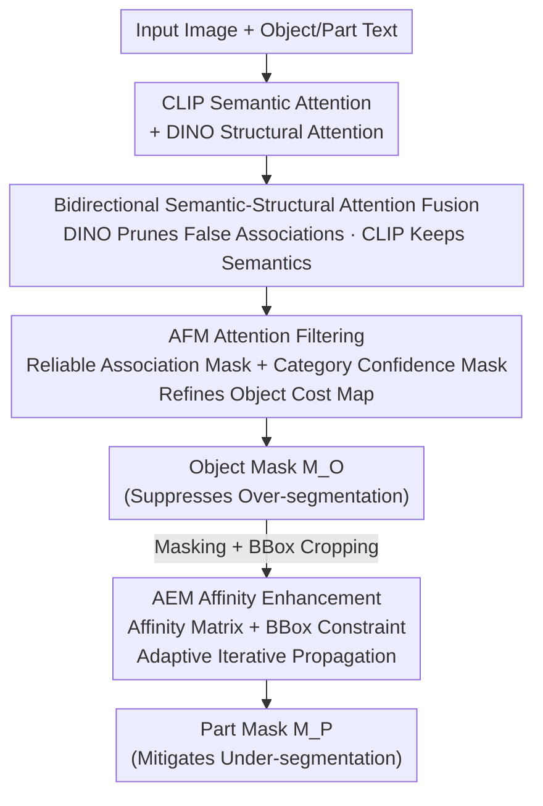

# HOPS: Hierarchical Open-vocabulary Part Segmentation with Attention-Aware Filtering and Affinity-Guided Enhancement

**Conference**: CVPR 2026  
**Paper**: [CVF Open Access](https://openaccess.thecvf.com/content/CVPR2026/html/Li_HOPS_Hierarchical_Open-vocabulary_Part_Segmentation_with_Attention-Aware_Filtering_and_Affinity-Guided_CVPR_2026_paper.html)  
**Code**: https://github.com/TJU-IDVLab/HOPS  
**Area**: Open-vocabulary Segmentation / Part Segmentation  
**Keywords**: Open-vocabulary Part Segmentation, CLIP-DINO Fusion, Attention Filtering, Affinity Propagation, Over-segmentation/Under-segmentation

## TL;DR
HOPS utilizes a bidirectional attention fusion mechanism of "CLIP Semantics $\otimes$ DINO Structure" within a two-stage framework to address Open-vocabulary Part Segmentation (OVPS). The first stage employs an Attention-Aware Filtering Module (AFM) to eliminate object-level over-segmentation, while the second stage uses an Affinity-Guided Enhancement Module (AEM) to iteratively expand weak activations for small parts. It achieves new SOTA performance on Pascal-Part-116, ADE20K-Part-234, and PartImageNet.

## Background & Motivation

**Background**: Open-vocabulary Part Segmentation (OVPS) requires models to segment not only parts seen during training but also generalize to unseen part categories (including new parts of known objects, e.g., "dog belly," and parts of entirely new objects, e.g., "panda head"). Current approaches typically adapt Open-vocabulary Semantic Segmentation (OVSS) models by leveraging cross-modal semantic alignment from Vision-Language Models (VLMs) like CLIP to locate parts, represented by works such as PartCLIPSeg (based on CLIPSeg) and PartCATSeg (based on CAT-Seg).

**Limitations of Prior Work**: The authors systematically categorize the failures of existing OVPS methods into two non-conflicting, frequently co-occurring issues:

- **Object over-segmentation**: Since CLIP's training objective is global image-text alignment rather than pixel-level correspondence, its cross-modal similarity maps have poor spatial precision, and activations often "bleed" beyond the target object. For instance, when segmenting a "cow," high responses may appear on grass due to their frequent co-occurrence in training data, causing irrelevant regions to be included in the mask.
- **Part under-segmentation**: CLIP exhibits weak perception of fine-grained parts. Similarity maps (Fig. 2) show that while CLIP activates well for a "cat" as a whole, it barely responds to small parts like "head." Even with joint prompts like "cat head," CLIP still focuses on the entire cat. Proper part activation only occurs when activations are **constrained within the object region**.

**Key Challenge**: CLIP is strong in "semantic alignment" but weak in "spatial structure." Conversely, relying solely on supervised training to compensate for structure (Tab. 1) may reduce over-segmentation on seen classes but **weakens CLIP's zero-shot generalization**, leading to worse over-segmentation on unseen classes. Thus, over-segmentation cannot be solved simply by increasing supervision.

**Key Insight**: The authors observe that the self-supervised DINO model complements CLIP's weaknesses. Lacking text supervision, DINO's attention naturally focuses on structural cues like shape, boundaries, and object topology. The core hypothesis is to **fuse CLIP's semantic attention and DINO's structural attention through bidirectional constraints**, allowing DINO to prune "semantically relevant but structurally irrelevant" false associations, while CLIP maintains semantic consistency.

**Core Idea**: The same "bidirectional semantic-structural attention fusion" is applied across two stages: in the object stage, it serves as an Attention-Aware Filtering Module (AFM) to suppress over-segmentation; in the part stage, it constructs an affinity matrix for response propagation via an Affinity-Guided Enhancement Module (AEM) to mitigate under-segmentation. These are integrated into the hierarchical HOPS framework.

## Method

### Overall Architecture

HOPS is a **two-stage hierarchical framework** built upon the cost aggregation of CAT-Seg. Both stages share the same CLIP, DINO, and decoder, but utilize different aggregation modules.

In the first stage, **object segmentation** is performed to provide spatial constraints for subsequent part segmentation. CLIP and DINO extract visual features separately. CLIP image features are compared with "object category" text features via cosine similarity to generate an initial object-level cost map $S_1 \in \mathbb{R}^{N \times C_1}$ ($N$ is the number of patches, $C_1$ is the number of object categories). The layer-wise self-attention matrices $A_{\text{CLIP}}, A_{\text{DINO}} \in \mathbb{R}^{L \times N \times N}$ are fed into the **AFM**, which filters out extraneous activations to produce a refined $S_1^{\text{ref}}$. This is further processed through cost embedding, DINO-guided structural enhancement, spatial-category aggregation, and multi-scale fusion to output the object mask $M_O$.

The second stage performs **part segmentation** within the predicted regions of each object category. $M_O$ is multiplied back into the input image to retain only the target object, followed by adaptive cropping based on the object's bounding box. This step removes background noise and enlarges the object area to enhance fine-grained perception. A part-level cost map $S_2$ is calculated and sent to the **AEM**, which uses the same bidirectional fusion to generate an affinity matrix. This matrix iteratively propagates strong responses to weak activation areas within the bounding box, outputting the final part mask $M_P$. The model is trained using weighted BCE loss for both object and part branches.

### Key Designs

**1. Bidirectional Semantic-Structural Attention Fusion: Mutual Error Correction**

This serves as the foundation for both AFM and AEM, directly addressing CLIP's poor spatial precision. CLIP's self-attention often captures semantically related but structurally unrelated patch pairs (e.g., cow $\leftrightarrow$ grass). DINO understands structure but lacks semantics. Fusion is performed in two directions: DINO constrains CLIP by element-wise multiplying normalized DINO attention to CLIP's to filter out structural mismatches:

$$A_{\text{CLIP}\leftarrow\text{DINO}}^{(l)} = A_{\text{CLIP}}^{(l)} \odot \text{Softmax}\!\left(A_{\text{DINO}}^{(l)}\right);$$

CLIP constrains DINO by using the mean of $A_{\text{CLIP}}^{(l)}$ as a threshold to retain only those DINO patch pairs that are both structurally consistent and semantically relevant:

$$A_{\text{DINO}\leftarrow\text{CLIP}}^{(l)} = A_{\text{DINO}}^{(l)} \odot \mathbb{I}\!\left(A_{\text{CLIP}}^{(l)} > \operatorname{Mean}(A_{\text{CLIP}}^{(l)})\right).$$

The final semantic-structural attention $A$ is a weighted sum using coefficient $\alpha$: $A = \alpha\, A_{\text{CLIP}\leftarrow\text{DINO}} + (1-\alpha)\, A_{\text{DINO}\leftarrow\text{CLIP}}$. The "bidirectional" nature is crucial; using either direction in isolation leads to biased results, whereas mutual masking preserves both semantic relevance and structural consistency.

**2. AFM Attention Filtering: Reliable Association + Category Confidence**

Refining the cost map requires more than just fused attention. AFM (inspired by TagCLIP) adds two filters. The first is a **cross-layer consistent reliable association mask** $M_A$: a patch pair $(i,j)$ is considered "significantly associated" if its attention exceeds the layer mean $\mu^{(l)}$. Only patch pairs significant across at least $y$ layers are marked as reliable ($M_A(i,j)=1$), filtering out transient false attentions. The second is a **category confidence mask** $M_{\text{conf}}(c)$: it marks 1 if a patch's score for category $c$ exceeds the global mean, suppressing interference from weak semantic regions. The initial cost map is refined under these constraints:

$$S_1^{\text{ref}}(c) = \frac{1}{|L|}\sum_{l\in L}\left(M_A \odot A^{(l)} \odot M_{\text{conf}}(c)\right)\cdot S_1(c).$$

This step significantly reduces mOSI (over-segmentation index) by enhancing activations in the target area and suppressing them elsewhere. Notably, AFM **introduces no additional trainable parameters**.

**3. AEM Affinity Enhancement: Iterative Propagation + Adaptive Stopping**

Under-segmentation occurs when initial part responses only light up sub-regions with weak intensity. AEM propagates strong responses through the part using an affinity matrix. It generates a semantic-structural attention $A'$ via the same fusion mechanism, averaging it across layers to form the affinity matrix $A_{\text{aff}} \in \mathbb{R}^{N\times N}$. Given an initial part cost map $S_2$, an initial mask is obtained: $\tilde{M}_P(c)=\mathbb{I}[S_2(c) > \gamma]$.

To prevent missing weak regions, AEM creates a **bounding-box mask** $B(c)$ from the minimum bounding rectangle of each connected component, expanding the propagation scope while preventing leakage. Iterative propagation is defined as:

$$S_2^{\text{enh},t}(c) = B^{t-1}(c) \odot A_{\text{aff}} \cdot S_2^{\text{enh},t-1}(c).$$

A key feature is **adaptive iterative stopping**: each round calculates an "iteration gain" (mask mean response change). If $\text{Gain}(t) \le 0$, propagation is typically stopped. However, to prevent "early stopping" for small parts, a **small part compensation** is added: if $\text{Gain}(t) \le 0$ but the relative area ratio $\text{Ratio}(t,c) \le \sigma$, one extra iteration is allowed. AEM also **adds zero trainable parameters**.

### Loss & Training
Both stages use BCE loss: Object path $\mathcal{L}_O=\sum_{c}\text{BCE}(M_O(c),G_O(c))$, Part path $\mathcal{L}_P=\sum_{c}\text{BCE}(M_P(c),G_P(c))$, Total loss $\mathcal{L}=\lambda_{\text{obj}}\mathcal{L}_O + \lambda_{\text{part}}\mathcal{L}_P$. HOPS is built on CAT-Seg and follows its strategy, fine-tuning both CLIP and DINO.

## Key Experimental Results

To quantify errors, the authors defined two metrics: **OSI (Over-Segmentation Index)** = ratio of predicted mask outside ground truth to prediction area; **USI (Under-Segmentation Index)** = ratio of ground truth not covered by prediction to ground truth area. mOSI/mUSI are means, h-IoU is the harmonic mean of seen/unseen mIoU.

### Main Results

Zero-shot part segmentation on Pascal-Part-116 (higher is better except mOSI/mUSI):

| Method | Seen | Unseen | h-IoU | mOSI ↓ | mUSI ↓ |
|------|------|--------|-------|--------|--------|
| CAT-Seg (baseline) | 36.80 | 23.39 | 28.60 | 31.38 | 60.58 |
| PartCLIPSeg | 43.91 | 23.56 | 30.67 | 31.51 | 53.75 |
| PBAPS | 45.32 | 42.72 | 43.98 | 33.10 | 42.18 |
| PartCATSeg (Prev. SOTA) | 52.62 | 40.51 | 45.77 | 29.57 | 37.79 |
| **HOPS (Ours)** | **54.77** | **44.81** | **49.29** | **23.46** | **31.62** |

Compared to PartCATSeg, HOPS improves seen/unseen mIoU by +2.15% / +4.30% and h-IoU to 49.29%, while reducing mOSI and mUSI by 6.11% / 6.17%, respectively. On ADE20K-Part-234, h-IoU increases by +3.23%. On PartImageNet, h-IoU reaches 59.08. In OOD settings on PartImageNet, the unseen mIoU of 45.08% far exceeds CAT-Seg (19.83%) and PartCATSeg (40.17%).

### Ablation Study

AFM Components (PartImageNet, Tab. 7):

| Semantic-Structural Attn | Reliable Assoc. Mask | Category Conf. Mask | h-IoU | mOSI ↓ | mUSI ↓ |
|:---:|:---:|:---:|------|--------|--------|
| | | | 56.37 | 24.92 | 32.76 |
| ✓ | | | 57.02 | 22.85 | 32.18 |
| ✓ | ✓ | | 57.86 | 21.74 | 31.52 |
| ✓ | | ✓ | 58.03 | 20.91 | 31.33 |
| ✓ | ✓ | ✓ | **59.08** | **19.08** | **30.90** |

AEM Components (PartImageNet, Tab. 8):

| Semantic-Structural Attn | BBox Constraint | Adaptive Iteration | h-IoU | mUSI ↓ |
|:---:|:---:|:---:|------|--------|
| | | | 56.61 | 34.24 |
| ✓ | | | 57.15 | 33.18 |
| ✓ | ✓ | | 57.78 | 31.76 |
| ✓ | | ✓ | 57.57 | 32.41 |
| ✓ | ✓ | ✓ | **59.08** | **30.90** |

### Key Findings
- **Over-segmentation persists under supervision**: Tab. 1 shows pure supervised training (CLIP-train) reduces seen mOSI by 19.55% but sacrifices zero-shot generalization, increasing unseen mOSI. AFM effectively reduces over-segmentation without this trade-off.
- **AFM mask roles**: Category confidence masks primarily reduce mOSI, while reliable association masks strengthen pixel associations to reduce mUSI.
- **AEM BBox constraint**: Propagation within the BBox is significantly more effective than propagating within the initial mask alone (+0.54 h-IoU vs much higher with BBox).
- **Zero extra parameters**: AFM and AEM improvements stem entirely from the attention filtering and propagation mechanisms.

## Highlights & Insights
- **Dual solution for dual problems**: Over-segmentation and under-segmentation are addressed through a unified "bidirectional CLIP$\otimes$DINO fusion" base, utilized via "filtering" (AFM) and "propagation" (AEM).
- **Bidirectional DINO$\otimes$CLIP masking**: The strategy of using DINO to prune CLIP's false associations and CLIP to anchor DINO's semantics is a robust way to use frozen models as regularizers for each other.
- **Adaptive Engineering**: Adaptive stopping prevents blurred propagation, and small part compensation addresses the inherent weakness of initial responses for tiny components.
- **Diagnostic Metrics**: Defining OSI/USI transforms "inaccurate segmentation" into measurable "over-grouping vs. under-grouping," allowing clear ablation of specific failure modes.

## Limitations & Future Work
- **Reliance on Stage 1 accuracy**: Part segmentation occurs within object masks; errors in the first stage propagate directly to the second.
- **Hyperparameter sensitivity**: Thresholds $\gamma$, $\sigma$, and parameters $\alpha$, $y$ require tuning.
- **Inference overhead**: Iterative propagation in AEM may increase computational costs for many part categories or high-resolution images.
- **VLM Ceiling**: The method is a "patch" for frozen CLIP's spatial weaknesses; its efficacy with stronger pixel-aligned VLMs remains to be verified.

## Related Work & Insights
- **vs. PartCATSeg**: PartCATSeg uses DINO features as queries/keys (unidirectional, feature-level); HOPS performs **bidirectional mask fusion at the attention level**, uniquely addressing both over- and under-segmentation.
- **vs. PartCLIPSeg**: PartCLIPSeg focuses on prompt engineering; HOPS addresses the root cause of CLIP's spatial imprecision via attention refinement.
- **vs. PBAPS / Hierarchical Paradigms**: HOPS fills the gap in hierarchical frameworks where weak initial part responses lead to incomplete coverage.
- **vs. CAT-Seg (baseline)**: HOPS improves Pascal-Part-116 h-IoU from 28.60 to 49.29 using two zero-parameter modules, proving the mechanism's effectiveness over simple architecture scaling.

## Rating
- Novelty: ⭐⭐⭐⭐ Bidirectional CLIP$\otimes$DINO fusion and dual-use filtering/propagation are innovative.
- Experimental Thoroughness: ⭐⭐⭐⭐ Solid results across three benchmarks with customized diagnostic metrics.
- Writing Quality: ⭐⭐⭐⭐ Clear progression from problem analysis to mechanism and experiments.
- Value: ⭐⭐⭐⭐ Sets a new OVPS SOTA without parameter overhead; fusion logic is highly transferable.

<!-- RELATED:START -->

## Related Papers

- [\[NeurIPS 2025\] LangHOPS: Language Grounded Hierarchical Open-Vocabulary Part Segmentation](../../NeurIPS2025/segmentation/langhops_language_grounded_hierarchical_open-vocabulary_part_segmentation.md)
- [\[CVPR 2026\] Frequency-Aware Affinity for Weakly Supervised Semantic Segmentation](frequency-aware_affinity_for_weakly_supervised_semantic_segmentation.md)
- [\[CVPR 2026\] GeoGuide: Hierarchical Geometric Guidance for Open-Vocabulary 3D Semantic Segmentation](geoguide_hierarchical_geometric_guidance_for_open-vocabulary_3d_semantic_segment.md)
- [\[CVPR 2026\] PCA-Seg: Revisiting Cost Aggregation for Open-Vocabulary Semantic and Part Segmentation](pca-seg_revisiting_cost_aggregation_for_openvocabulary_semantic_and_part_segmentat.md)
- [\[CVPR 2026\] ReAttnCLIP: Training-Free Open-Vocabulary Remote Sensing Image Segmentation via Re-defined Attention in CLIP](reattnclip_training-free_open-vocabulary_remote_sensing_image_segmentation_via_r.md)

<!-- RELATED:END -->
