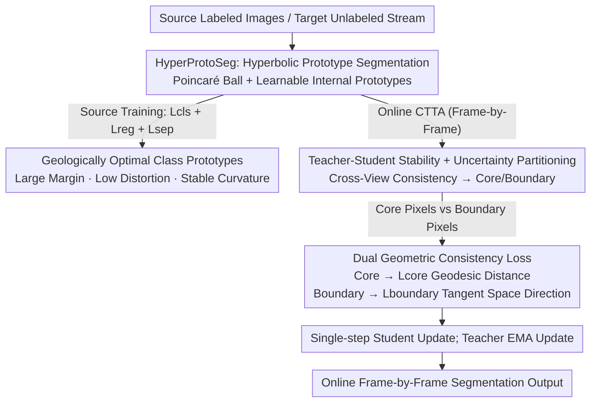

# Hyperbolic Prototype Learning with Uncertainty-Aware Consistency for Continual Test-Time Segmentation

**Conference**: CVPR 2026  
**Paper**: [CVF Open Access](https://openaccess.thecvf.com/content/CVPR2026/html/Gole_Hyperbolic_Prototype_Learning_with_Uncertainty-Aware_Consistency_for_Continual_Test-Time_Segmentation_CVPR_2026_paper.html)  
**Code**: To be confirmed  
**Area**: Semantic Segmentation / Continual Test-Time Adaptation  
**Keywords**: Hyperbolic Geometry, Prototype Learning, Continual Test-Time Adaptation, Uncertainty, Semantic Segmentation

## TL;DR
To address the issue of error accumulation from self-training pseudo-labels in continual test-time adaptation (CTTA) for semantic segmentation, this paper reformulates segmentation as metric learning within the Poincaré ball (hyperbolic space). Specifically, HyperProtoSeg learns class prototypes with large margins and low distortion, while HBCA divides pixels into "confident cores" and "uncertain boundaries" based on cross-view consistency. Geodesic distance loss and tangent space directional consistency loss are applied to these two groups respectively, achieving both rapid adaptation and stability under long-sequence domain shifts. It outperforms state-of-the-art (SOTA) methods on average across three synthetic-to-real benchmarks.

## Background & Motivation

**Background**: Continual Test-Time Adaptation (CTTA) allows a segmentation model trained on a labeled source domain (e.g., sunny California) to incrementally update its parameters online using its own predictions as pseudo-labels when deployed to continuously changing target domains (sunny $\rightarrow$ rainy $\rightarrow$ snowy $\rightarrow$ night), without retraining costs. Classic CTTA methods (such as TENT, CoTTA) rely on this self-training mechanism.

**Limitations of Prior Work**: Self-training possesses a fundamental flaw: **error accumulation**. Under severe domain shifts, the initial pseudo-labels are highly noisy. Adapting to these noisy labels propagates errors over time, creating a catastrophic feedback loop. Consequently, the adapted model may perform even worse than the unadapted source model in the long run. The paper quantifies this in Table 1: Euclidean ProtoSeg drops 1.46% in mIoU from step 1 to step 10, whereas the proposed hyperbolic version only declines by 0.62%.

**Key Challenge**: The authors attribute this vulnerability to two underlying problems. The first is **geometrical limitation**: the volume of Euclidean feature spaces grows polynomially ($V \propto r^n$), packing semantically related classes closely together with fragile, narrow margins. These narrow-margin regions become "instability hotspots" that collapse under minor distribution shifts. The second is the lack of an explicit mechanism to balance **plasticity** (fast adaptation to new distributions) and **stability** (preserving learned structures and preventing drift), reflecting the classic stability-plasticity dilemma. Existing methods rely on "reactive remedies" like stochastic weight restoration or EMA rollback, which address the symptoms rather than the root cause.

**Goal**: To simultaneously bridge both the "geometric gap" and the "supervisory gap". This requires establishing a non-distorted, large-margin representation space, combined with an online adaptation supervision mechanism that treats confident and uncertain regions differently.

**Key Insight**: The volume of hyperbolic space (with constant negative curvature) grows **exponentially** ($\mathrm{Vol}(r) \sim e^{(d-1)r}$). This property naturally creates large, uniform geodesic margins between class embeddings while maintaining compact, low-distortion representations. Transitioning segmentation into the Poincaré ball mitigates geometric fragility at its root.

**Core Idea**: Utilize Hyperbolic Prototype Learning (HyperProtoSeg) to provide curvature-stable, large-margin anchors, and introduce Hyperbolic Boundary Consistency Adaptation (HBCA) to perform strong adaptation on confident pixels and conservative directional alignment on uncertain pixels. This proactively (rather than reactively) resolves the stability-plasticity dilemma.

## Method

### Overall Architecture
The proposed method consists of two phases and two complementary components. In the **source-domain training phase**, HyperProtoSeg is used: features are extracted using a SegFormer-B5 backbone, and an exponential map projects Euclidean features of each pixel into a 128-dimensional Poincaré ball via a hyperbolic head. A **learnable internal prototype** is assigned to each class, and pixels are classified based on their "closest prototype" (measured by geodesic distance). An objective consisting of $L_{cls}+L_{reg}+L_{sep}$ is employed to learn curvature-consistent embeddings with large margins and high stability. In the **online adaptation phase**, HBCA (Hyperbolic Boundary Consistency Adaptation) is applied: a Teacher model (the EMA of the Student) is maintained. For each target frame, a clean view and a heavily augmented noisy view are generated. Based on the Teacher's high confidence and cross-view consistency, pixels are partitioned into two groups: "core" (confident) and "boundary" (uncertain). These groups are supervised by a **geodesic distance loss** $L_{core}$ and a **tangent space directional consistency loss** $L_{boundary}$ respectively. Parameters of the Student are updated via a single-step gradient update per frame, while the Teacher is updated iteratively via an EMA sliding window.

### Key Designs

**1. HyperProtoSeg: Reformulating Segmentation as Metric Learning in the Poincaré Ball to Trade Negative Curvature for Large Margins**

Addressing the geometric limitation of "narrow and fragile margins in Euclidean space," this paper re-conceptualizes semantic segmentation as metric learning instead of using parametric classification boundaries. It learns an **internal prototype** $\hat{z}_l$ for each class in the Poincaré ball $\mathbb{B}^d_c=\{z\in\mathbb{R}^d: c\|z\|^2<1\}$. The Euclidean feature $\hat{x}$ output by the backbone is first projected onto the manifold using the exponential map $z=\mathrm{Exp}^c_0(\hat{x})=\tanh(\sqrt{c}\|x\|)\frac{x}{\sqrt{c}\|x\|}$ (where $c=1$). Pixels are classified based on the geodesic distance to the closest prototype: $\hat{y}=\arg\min_l d_{\mathbb{B}}(z,\hat{z}_l)$, forming "geodesic Voronoi cells" on the manifold. The Poincaré ball is chosen (over Klein or Lorentz models) because it is **conformal**, meaning angles are preserved under the exponential map. This property is crucial for applying cosine similarity in the subsequent directional consistency loss. Unlike previous efforts that fix prototypes on the ideal boundary (e.g., using Busemann loss), this work learns **internal prototypes**, allowing the anchors to shift and track semantic drift during CTTA. The training objective is the sum of three terms:

$$L_{base}=L_{cls}+L_{reg}+\lambda_{sep}L_{sep},$$

where $L_{cls}$ is the softmax cross-entropy loss based on squared geodesic distance, which minimizes intra-class distance and maximizes inter-class distance; $L_{reg}=\beta\cdot\frac{1}{HW}\sum\|\hat{x}\|^2_2$ regularizes the pre-projection Euclidean norm, preventing embeddings from clustering near the manifold boundary where $\tanh$ saturates and gradients vanish; $L_{sep}=\frac{1}{N^2}\sum\max(0,m-d_{\mathbb{B}}(\hat{z}_i,\hat{z}_j))$ enforces a minimum geodesic margin $m$ between every pair of prototypes, separating class boundaries and preventing semantic entanglement. This combination allows exponential curvature to naturally expand margins uniformly, theoretically yielding a tighter Rademacher complexity bound (with hyperbolic compression radius $R_\mathbb{B}=O(1)$ and expanded margin $m$, outperforming Euclidean complexity $R_E=\Theta(\sqrt{d})$).

**2. Teacher-Student Stability + Uncertainty-Aware Partitioning: Leveraging Cross-View Consistency to Separate Core and Boundary Pixels**

To address the supervision limitation of "treating all pseudo-labels equally and amplifying noise," HBCA categorizes pixels dynamically. It maintains a Teacher network $f'_\theta$ (the EMA of the Student, with $\alpha=0.999$). For each target frame, it treats the image as a clean view $x_c$ and generates a noisy view $x_n=\mathcal{A}(x_c)$ using strong augmentation (random flipping, color jitter, Gaussian blur). Confidence is determined jointly by "high Teacher confidence" and "prediction consistency across clean and noisy views":

$$\text{Mask}_{cert}=\{\tilde{x}\mid \max(\mathrm{softmax}(f'_\theta(x_c)))>\tau \wedge f'_\theta(x_c)=f'_\theta(x_n)\},$$

while pixels failing to satisfy this condition are classified as $\text{Mask}_{uncert}$ (with $\tau=0.90$). Unlike other approaches (such as DAT) that use Teacher uncertainty to temper update weights, this paper uses it for **pixel-level, finer-grained** core vs. boundary partitioning, rather than merely adjusting the update magnitude. Intuitively (Figure 1), core pixels receive strong, plastic updates, whereas boundary pixels undergo stable, conservative updates, using different geometric losses for each group to preserve the model's geometric integrity. The Teacher's EMA also restricts parameter drift to a confined range, preventing collapse over long sequences. Ablation studies (Table 6) demonstrate that this consistency-driven uncertainty estimation is more robust than MC-Dropout and Hyperbolic Norm, both of which exhibit overconfidence or gradient dispersion under domain shift.

**3. Dual Geometric Consistency Loss: Geodesic Distance Alignment for Core Pixels and Directional Alignment for Boundary Pixels to Discard Spatial Noise**

To manage the two partitioned pixel groups, two complementary geometric losses are designed to balance plasticity and stability. For **core pixels**, a geodesic distance matching loss is applied: $L_{core}=\mathrm{mean}_{\tilde{x}\in\text{Mask}_{cert}} d^2_{\mathbb{B}}(f'_\theta(\tilde{x}),f_\theta(\tilde{x}))$. This distills and aligns the Student's target-domain features with the Teacher's reliable embeddings, enabling fast adaptation within the stable frame anchored by the slowly-changing Teacher prototypes. For **boundary pixels**, strict distance matching would propagate noise and distort the prototypes; hence, a **tangent space directional alignment loss** is used instead:

$$L_{boundary}=\mathrm{mean}_{\bar{x}\in\text{Mask}_{uncert}}\left(1-\frac{v'_{f_\theta(\bar{x})}\cdot v'_{f'_\theta(\bar{x})}}{\|v'_{f_\theta(\bar{x})}\|\|v'_{f'_\theta(\bar{x})}\|}\right),$$

where $v'=\log_{\hat{z}}(\cdot)$ is the logarithmic map vector relative to the "nearest prototype predicted by the Teacher, $\hat{z}_{f'_\theta(\bar{x})}$", defining directions originating from the same stable prototype. It **utilizes directional orientation while discarding noisy spatial coordinates**, preventing uncertain pixels from directly fitting noisy targets and thereby protecting the prototypes from corruption and mitigating catastrophic drift. The total adaptation loss is $L_{adapt}=\lambda_{core}L_{core}+\lambda_{boundary}L_{boundary}$ (with $\lambda_{core}=1.0$, $\lambda_{boundary}=0.5$). For each frame, the Student performs a single-step gradient update $\theta\leftarrow\theta-\eta\nabla_\theta L_{adapt}$, and the Teacher is updated via EMA. Ablation studies (Table 7) confirm that directional alignment for uncertain pixels (mIoU 57.12) significantly outperforms both no adaptation (56.24) and distance minimization via $L_{core}$ (56.01, which degrades performance because rigid alignment amplifies Teacher noise).

### Loss & Training
**Source Domain**: SegFormer-B5 (initialized via HuggingFace) + hyperbolic head, $1024\times1024$ input, effective batch size of 32 (via 16-step gradient accumulation), 200 epochs. Dual optimizers are utilized: Euclidean parameters are optimized via AdamW ($\text{lr}=1\times 10^{-5}$), and hyperbolic prototypes are optimized via RiemannianAdam ($\text{lr}=1\times 10^{-3}$) implemented through `geoopt`. Hyperparameters are configured as $\beta=0.1$, $\lambda_{sep}=1$, and $m=1$.  
**Adaptation Phase**: Mean-Teacher framework (EMA $\alpha=0.999$), $\tau=0.90$. Single-step RiemannianAdam ($\text{lr}=1\times 10^{-5}$) per frame with mixed-precision training.

## Key Experimental Results

### Main Results

Source domain training (HyperProtoSeg vs. Euclidean/Hyperbolic baselines, mIoU %, Table 2): Both the prototype framework and hyperbolic geometry yield individual gains, and their combination performs best. It adds only ~3% GFLOPs over the Euclidean baseline, indicating that the improvement stems from more effective geometric representations rather than compute overhead.

| Architecture | Hyperbolic | IDD | Cityscapes | GFLOPS |
|------|------|-----|-----------|--------|
| Euclidean SegFormer | ✗ | 73.57 | 76.74 | 799.74 |
| Euclidean ProtoSeg | ✗ | 73.87 | 78.07 | 810.71 |
| Hyperbolic MLR | ✓ | 73.91 | 78.14 | 818.52 |
| **HyperProtoSeg (Ours)** | ✓ | **74.34** | **79.96** | 823.60 |

CTTA comparison (IDD $\rightarrow$ IDD-AW, 10-step sequential domain shift, 10-step average mIoU %, Table 3): TENT remains mostly stationary; CoTTA, DePT, and SVDP yield limited improvements due to the constraints of Euclidean updates; TCA and Hybrid-TTA perform strongly but remain weak at object boundaries. HBCA achieves 57.12%, outperforming the source model by +11.3% and the runner-up Hybrid-TTA by approximately 2.2%.

| Method | Conference | Average mIoU | Gain (vs. Source) |
|------|------|----------|-----|
| Source | - | 51.31 | - |
| TENT | ICLR'21 | 51.45 | +0.2% |
| CoTTA | CVPR'22 | 52.59 | +2.4% |
| DePT | ICLR'23 | 53.33 | +3.9% |
| SVDP | AAAI'24 | 53.51 | +4.2% |
| DAT | ICRA'24 | 54.32 | +5.8% |
| Continual-MAE | CVPR'24 | 54.31 | +5.8% |
| TCA | CVPR'25 | 54.76 | +6.7% |
| Hybrid-TTA | ICCV'25 | 54.91 | +7.0% |
| **HBCA (Ours)** | - | **57.12** | **+11.3%** |

Cityscapes $\rightarrow$ ACDC (Average mIoU % per domain, Table 4): The proposed method achieves 57.67%, 57.55%, and 57.30% in steps 1, 5, and 10, respectively, averaging 57.47%. It remains highly stable with minimal degradation across steps (compared to the source model's constant 54.63%). The mean mIoU on the SHIFT benchmark is 69.36% (detailed in supplementary materials). The initial (step 1) improvement over SOTA across the three benchmarks is approximately (1.94%, 4.02%, 1.24%).

| Method | Step 1 | Step 5 | Step 10 | Average |
|------|-----|-----|------|------|
| Source | 54.63 | 54.63 | 54.63 | 54.63 |
| TCA | 56.35 | 56.45 | 56.37 | 56.38 |
| Hybrid-TTA | 56.18 | 55.98 | 55.72 | 55.95 |
| **Ours** | **57.67** | **57.55** | **57.30** | **57.47** |

### Ablation Study

Geometric regularization terms (Source domain training, mIoU %, Table 5):

| Configuration | IDD | Cityscapes | Description |
|------|-----|-----------|------|
| $L_{cls}$ only | 70.17 | 76.81 | Boundary collapse; embeddings cluster near boundary causing vanishing gradients |
| +$L_{reg}$ | 72.29 | 77.61 | Pulls features back to the interior to stabilize training, but remains overly cramped |
| +$L_{reg}$ + $L_{sep}$ | **74.34** | **79.96** | Repulsive force expands inter-class margins; optimal performance |

Uncertainty module comparison (10-step average mIoU %, Table 6) and uncertain pixel adaptation strategy (Table 7):

| Dimension | Configuration | IDD $\rightarrow$ IDD-AW | Cityscapes $\rightarrow$ ACDC |
|------|------|-----------|-----------------|
| Uncertainty Estimation | MC-Dropout | 52.78 | 53.62 |
| | Hyperbolic Norm | 53.27 | 54.76 |
| | HBCA (Ours) | **57.12** | **57.47** |
| Uncertain Pixel Adaptation | No adaptation | 56.24 | 56.34 |
| | Distance minimization $L_{core}$ | 56.01 | 55.82 |
| | Directional alignment $L_{boundary}$ | **57.12** | **57.47** |

### Key Findings
- **Geometric choices directly determine stability**: As shown in Table 1, the hyperbolic version degrades by only 0.62% over 10 steps, compared to a 1.46% degradation for the Euclidean version. This indicates that the root cause of error accumulation lies in the geometry rather than specific adaptation heuristics.
- **$L_{reg}$ and $L_{sep}$ must work together**: Using $L_{cls}$ alone leads to "boundary collapse" (embeddings saturate close to the Poincaré boundary, causing vanishing gradients). $L_{reg}$ ensures stability and $L_{sep}$ guarantees discriminability (mIoU on IDD increases from 70.17 $\rightarrow$ 72.29 $\rightarrow$ 74.34).
- **Uncertain pixels should not be rigidly aligned**: Forcing distance minimization via $L_{core}$ on boundary pixels degrades performance (from 56.24 $\rightarrow$ 56.01), confirming that rigid matching amplifies Teacher noise. Only directional alignment ($L_{boundary}$) maintains stability.
- **Negligible computational overhead**: The hyperbolic adaptation incurs only about 3% additional GFLOPs, showing that the improvement is primarily due to the expressive power of the geometric representation.

## Highlights & Insights
- **Attributing error accumulation to geometry with quantifiable evidence**: Table 1 conducts a controlled study by only varying back-end geometry (Euclidean vs. Hyperbolic) within the same prototype framework, pinning the vulnerability down to "Euclidean narrow margins" in a clean, convincing manner.
- **Genuine utilization of conformality**: The selection of the Poincaré ball is mathematically deliberate rather than arbitrary. Because it is conformal, angles are preserved under the exponential map—allowing tangent space directional losses to leverage cosine similarity directly. The geometric properties are deeply integrated with loss design.
- **A transferable paradigm**: The pipeline of "partitioning pixels based on confidence + applying strong supervision to confident zones and robust directional alignment to unconfident zones" offers a transferable strategy to suppress noise amplification in any self-training schemes (such as domain adaptation or semi-supervised segmentation).
- **Learning internal rather than boundary prototypes**: Providing physical room for prototypes to navigate during CTTA semantic drifts constitutes a crucial design divergence from prior works like Busemann-loss, which fix prototypes at the boundary.

## Limitations & Future Work
- The curvature $c$ is fixed to 1. The authors outline "adaptive curvature learning" as future work, as different domains/hierarchical levels may require distinct curvatures.
- Evaluations are restricted to urban-scene semantic segmentation and synthetic-to-real weather shifts; whether this extends to other dense prediction tasks (depth, panoptic segmentation) remains to be validated.
- The closed-set assumption: The target domain classes are assumed to be a subset of the source domain. The framework does not currently address open-set/novel-class adaptation.
- Due to the strong augmentations for generating noisy views, teacher-student dual forwards, and hyperbolic operations, the exact per-frame inference latency/memory footprint is not explicitly detailed. Feasibility for real-time autonomous driving deployment requires further assessment.

## Related Work & Insights
- **vs. Euclidean CTTA (TENT / CoTTA / DePT / SVDP)**: These methods perform self-training updates directly in Euclidean spaces where margins are narrow and prone to distortion, amplifying pseudo-label noise sequentially. This work operates in hyperbolic space to geometrically widen margins, exhibiting significantly lower degradation over 10 steps.
- **vs. DAT (Uncertainty-Guided Updates)**: DAT adjusts update magnitudes based on Teacher uncertainty. In contrast, this work utilizes it for **pixel-level core/boundary partitioning** and applies distinct geometric losses, offering far more granular supervision.
- **vs. TCA (Topological Consistency Adaptation)**: TCA preserves topology but operates in Euclidean space, leaving boundary areas fragile. The proposed method explicitly treats boundary pixels via directional alignment, showing superior robustness on boundary details (like thin poles in fog or streetlights at night in qualitative results).
- **vs. Static Hyperbolic Segmentation (e.g., Atigh et al.'s gyroplane / Busemann)**: These methods use hyperbolic encoders to represent hierarchies but keep prototypes static without online adaptation. This work bridges hyperbolic representations with uncertainty-aware CTTA, rendering the prototypes learnable and adaptive.

## Rating
- Novelty: ⭐⭐⭐⭐⭐ The first work to integrate hyperbolic prototype metric learning with uncertainty-aware CTTA. The geometric selection and loss designs are tightly coupled.
- Experimental Thoroughness: ⭐⭐⭐⭐ Solid evaluation across three benchmarks, long adaptation sequences, and comprehensive ablations (geometry, uncertainty, losses). However, some key results (Cityscapes$\rightarrow$ACDC, SHIFT) are relegated to supplementary materials, and single-frame inference latency is not reported separately.
- Writing Quality: ⭐⭐⭐⭐ Clear motivation, solid qualitative/quantitative control experiments, and sound theoretical complexity analysis. There are minor formatting issues (e.g., unresolved references: Table ??).
- Value: ⭐⭐⭐⭐ Holds practical value for robust segmentation in continuous domain shifts (e.g., autonomous driving). The "confidence-based partitioning + directional alignment" paradigm is highly transferable.

<!-- RELATED:START -->

## Related Papers

- [\[CVPR 2026\] The Golden Subspace: Where Efficiency Meets Generalization in Continual Test-Time Adaptation](the_golden_subspace_where_efficiency_meets_generalization_in_continual_test-time.md)
- [\[CVPR 2026\] Mixture of Prototypes for Test-time Adaptive Segmentation](mixture_of_prototypes_for_test-time_adaptive_segmentation.md)
- [\[CVPR 2026\] Bootstrap Your Own AV-Proxies: Adaptive Contrastive and Prototype Learning for Audio-Visual Segmentation](bootstrap_your_own_av-proxies_adaptive_contrastive_and_prototype_learning_for_au.md)
- [\[ICCV 2025\] Hybrid-TTA: Continual Test-time Adaptation via Dynamic Domain Shift Detection](../../ICCV2025/segmentation/hybrid-tta_continual_test-time_adaptation_via_dynamic_domain_shift_detection.md)
- [\[CVPR 2026\] Uncertainty-Aware Modality Fusion for Unaligned RGB-T Salient Object Detection](uncertainty-aware_modality_fusion_for_unaligned_rgb-t_salient_object_detection.md)

<!-- RELATED:END -->
