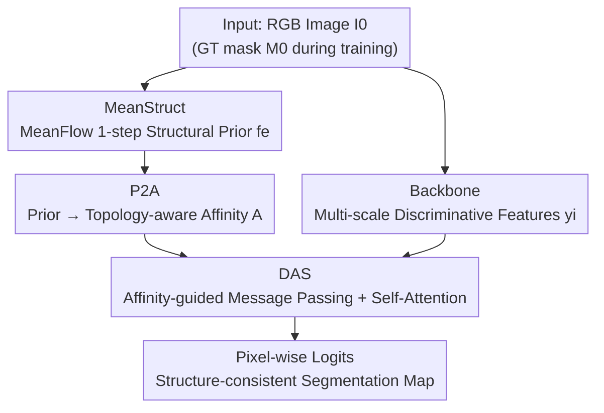

# HySeg: Learning Generative Priors for Structure-Aware Remote Sensing Segmentation

**Conference**: CVPR 2026  
**Paper**: [CVF Open Access](https://openaccess.thecvf.com/content/CVPR2026/html/Qiu_HySeg_Learning_Generative_Priors_for_Structure_Aware_Remote_Sensing_Segmentation_CVPR_2026_paper.html)  
**Code**: https://github.com/HeryJie/HySeg  
**Area**: Remote Sensing Semantic Segmentation / Generative Priors  
**Keywords**: Remote sensing segmentation, Generative priors, MeanFlow, Affinity propagation, Topological consistency

## TL;DR
HySeg reformulates remote sensing image semantic segmentation (RSISS) as "posterior inference constrained by generative structural priors." It first learns a structural prior encoding topological continuity and regional adjacency in label space using a MeanFlow-based MeanStruct module. This abstract prior is then projected into topology-aware pixel-wise affinities via P2A. Finally, a DAS head performs constrained message passing based on these affinities, achieving plug-and-play improvements in structural consistency and cross-dataset generalization across four remote sensing benchmarks.

## Background & Motivation

**Background**: Remote sensing image semantic segmentation (RSISS) is a core task in large-scale Earth observation, converting satellite/aerial imagery into pixel-wise land cover maps. Prevailing approaches are increasingly "discriminative"—CNN-based methods (DeepLab, HRNet, PSPNet) rely on dilated convolutions and pyramid pooling to capture multi-scale context, while Transformer-based methods (SegFormer, Swin-Unet) utilize global attention to model long-range dependencies, achieving high accuracy on various benchmarks.

**Limitations of Prior Work**: However, these methods are essentially "appearance-driven," estimating a strong posterior $p(\text{label}\mid\text{image})$ from data while lacking a generative prior capable of encoding structural dependencies. This results in fragmented boundaries, overfitting to textures, and poor cross-dataset generalization. Remote sensing scenarios are particularly vulnerable to these issues due to strong spatial heterogeneity, complex topological interconnections, and contextual semantics determined by geographic continuity and regional adjacency—structural relationships that pure discriminative models "recognize" but do not "understand."

**Key Challenge**: There is a structural imbalance between perception and reasoning. While models excel at outlining textures and boundaries, they fail to grasp the relational structures governing spatial organization (e.g., which land types are adjacent, how connectivity is maintained). No matter how sophisticated a discriminative architecture is, it focuses on maximizing "visual clarity" while neglecting "structural understanding."

**Goal**: To upgrade segmentation from "appearance-based perception" to "structural reasoning." This is decomposed into three sub-problems: (1) How to learn structural topological/adjacency knowledge as a usable prior; (2) How to translate this abstract probabilistic prior into an explicit mechanism for pixel-level inference; (3) How to inject this structural constraint into discriminative decoding without undermining the existing backbone.

**Key Insight**: The authors adopt a generative perspective—instead of directly discriminating "what category each pixel belongs to," they first learn "how the semantic topology evolves." They leverage MeanFlow (a mean-field extension of Flow Matching) to model structure as a continuous transport process in label space: a mean velocity field transports simple structural prototypes to the distribution of real segmentation masks. Modeling "how topology evolves" rather than "which labels appear" captures the intrinsic geometry of real-world layouts more reliably.

**Core Idea**: Replace "pure discriminative posterior" with "posterior inference constrained by generative structural priors." MeanStruct learns the prior, P2A translates the prior into affinity, and DAS uses affinity to guide message passing. These components form a hybrid generative-discriminative paradigm that is backbone-agnostic and plug-and-play.

## Method

### Overall Architecture

HySeg formulates RSISS as $\text{posterior inference constrained by generative structural priors}$. The pipeline consists of two stages. **Phase I (MeanStruct)**: Given an RGB image $I_0$ (and GT mask $M_0$ during training), a MeanFlow-based one-step (1-NFE) learner transports a Gaussian-noised embedding into a "structurally consistent dense prior" $f_e\in\mathbb{R}^{h\times w\times d}$, which explicitly encodes topological continuity and regional adjacency. **Phase II (P2A + DAS)**: P2A projects the abstract prior features into pixel-wise topology-aware affinities $A$. The DAS head then treats these affinities as structural constraints to modulate message passing between backbone features, finally decoding them into pixel-wise logits. This design is backbone-agnostic and compatible with various CNN and Transformer backbones.

### Key Designs

**1. MeanStruct: Learning Structural Priors as "Transport in Label Space" via MeanFlow**

The pain point is that discriminative features record "what category is where" but fail to capture "how the topology connects." MeanStruct shifts perspective: treating the structural prior as a generative task, the network learns "how semantic topology evolves." Specifically, an encoder extracts two embeddings—image conditional context $c_e=E(I_0)$ as a guidance signal, and target prior embedding $m_{e0}=E(M_0)$ (only during training). A linear path is defined in the prior space $x_t=(1-t)\,m_{e0}+t\,e$, where $e\sim\mathcal N(0,I)$. Along this path, the instantaneous velocity is constant $v(x_t,t)=e-m_{e0}$.

Instead of instantaneous velocity, it learns the **interval average velocity** of MeanFlow $u_\theta(x_t,\tau,t)$:

$$u(x_t,\tau,t)=\frac{1}{t-\tau}\int_\tau^t v(x_\eta,\eta)\,d\eta.$$

Training utilizes the MeanFlow identity connecting average and instantaneous velocities: $u=v-(t-\tau)\frac{d}{dt}u$, where $\frac{d}{dt}u=\partial_x u\cdot v+\partial_t u$ is computed via Auto-Diff (JVP). The target velocity is $u_{\text{tgt}}=v-(t-\tau)(\partial_x u_\theta\cdot v+\partial_t u_\theta)$, and the loss is $L_{\text{MeanStruct}}=\mathbb E_{t,\tau}\big[\lVert u_\theta-\mathrm{sg}(u_{\text{tgt}})\rVert_2^2\big]$ (where $\mathrm{sg}$ denotes stop-gradient). This is effective because the MeanFlow field induces a smooth, low-divergence transport on the semantic manifold. Under mild smoothness/Lipschitz assumptions, it tends to preserve adjacency and local connectivity, encoding spatial continuity more reliably than pure discriminative features—though the authors emphasize this is a "generative structural bias" rather than a strict topological guarantee.

**2. 1-NFE Inference + Multi-scale Alignment: Deploying Generative Priors with Minimal Overhead**

Stage I would be slow if using traditional multi-step sampling from generative models. MeanStruct exploits the definition of average velocity for a deterministic "rollback": since $x_\tau=x_t-(t-\tau)u(x_t,\tau,t)$, setting $(\tau,t)=(0,1)$ and $e\sim\mathcal N(0,I)$ allows the prior to be computed in a single step $f_e=e-u_\theta(e,0,1)$. This single function evaluation (1-NFE) is structurally coherent with almost zero additional computation. After obtaining the global prior $f_e$, a lightweight spatial decoder $D_s$ projects it into a hierarchical multi-scale structural pyramid $s_i=D_s^{(i)}(f_e)$, aligned with backbone features $y_i$ in resolution (using $1\times1$ projections for channel alignment if necessary). The learned topology is thus embedded into the feature hierarchy as a conditional structural field for subsequent inference.

**3. P2A: Translating Abstract Priors into Topology-aware Pixel-wise Affinities**

The prior provided by MeanStruct is implicit and cannot directly guide pixel-level reasoning. P2A acts as a "structural translator," unfolding the prior feature map $s_i\in\mathbb R^{C\times h\times w}$ into a local $K\times K$ neighborhood tensor $P\in\mathbb R^{C\times L\times K^2}$ (where $L=h\times w$). For each position $j$, let $p_j^{(c)}$ be the center feature and $x_j^{(c,k)}$ be the $k$-th neighbor. The per-channel difference is $D_j^{(c,k)}=(p_j^{(c)}-x_j^{(c,k)})^2$. Channel differences are then aggregated and converted into normalized affinities using a **Gaussian kernel with a learnable bandwidth**:

$$A_j^{(k)}=\mathrm{Softmax}_k\!\left(-\frac{\sum_{c=1}^{C}D_j^{(c,k)}}{2\sigma^2+\xi}\right),\quad \sum_{k=1}^{K^2}A_j^{(k)}=1,$$

where $\sigma$ is learnable and $\xi$ is a stability constant. The key difference from self-attention is that P2A affinities derive from the **learned structural prior** (differences in prior space) rather than pairwise similarity between segmentation features. Thus, it injects topological/adjacency constraints rather than appearance similarity, improving boundary accuracy and intra-region consistency.

**4. DAS: Affinity-guided Dual-Residual Message Passing for Constrained Posterior Inference**

DAS is the discriminative head for the posterior inference stage, but its message passing is constrained by P2A affinities. Given backbone features $y_i$ aligned with the prior scale, a $1\times1$ projection $\phi_{\text{feat}}$ yields hidden representations $M=\phi_{\text{feat}}(y_i)$. These are unfolded into $K\times K$ neighborhood local evidence $M_v$ and weighted-aggregated by affinity: $M'(d',j)=\sum_{k=1}^{K^2}A_j^{(k)}M_v(d',j,k)$. This step approximates one update of the posterior field, where each pixel refines its representation by marginalizing over "structurally relevant neighbors." A lightweight MLP $\phi_{\text{fuse}}$ fuses this to get $M_f$. To extend reasoning beyond the local neighborhood, DAS uses a dual-residual design combining prior-guided aggregation and self-attention refinement: $y_i'=y_i+D_p(M_f)$, $y_{\text{out}}=y_i'+D_p(\mathrm{SA}(y_i'))$, where $\mathrm{SA}$ is multi-head self-attention over spatial tokens and $D_p$ (DropPath) regularizes the residuals. Finally, $y_{\text{out}}$ is decoded into pixel-wise logits.

### Loss & Training
Two objectives: The MeanFlow regression loss $L_{\text{MeanStruct}}$ (Eq. 5, with stop-gradient) in Phase I is responsible for learning the structural prior. In Phase II, the standard RSISS segmentation loss of the respective backbone $L_s=L_{\text{RSISS}}$ supervises the final segmentation. Training follows the original settings of each backbone (UNetFormer, LSKNet, DCSwin, D2LS) for fair comparison on NVIDIA A800 GPUs using AdamW. Inference uses multi-scale testing and horizontal flipping. The GT mask $M_0$ is only used during training to construct the target prior embedding and is not required during inference.

## Key Experimental Results

### Main Results

HySeg was integrated into various backbones including UNetFormer (ResNet18/34/50), DCSwin (Swin T/S/B), LSKNet (T/S), and D2LS (ConvNext B) across LoveDA, UAVid, ISPRS Potsdam, and ISPRS Vaihingen benchmarks, consistently improving mIoU.

| Backbone | Dataset | Baseline mIoU | +HySeg mIoU | Gain |
|----------|---------|---------------|-------------|------|
| UNetFormer R18 | LoveDA | 52.4 | 54.5 | +2.1 |
| UNetFormer R50 | LoveDA | 52.5 | 54.7 | +2.2 |
| DCSwin Swin B | LoveDA | 52.9 | 54.5 | +1.6 (+5.0 for Barren) |
| LSKNet S | LoveDA | 54.0 | 55.4 | +1.4 (+3.2 for Agriculture) |
| Avg. across backbones | Vaihingen / Potsdam / UAVid | — | — | +2.2 / +1.7 / +1.6 |

The largest gains are concentrated in "structure-dominated" categories (Building, Barren, Forest), indicating that improvements stem from better boundary accuracy and intra-region consistency.

Structural fidelity was further evaluated using topological metrics (clDice, Betti error $\beta_0/\beta_1$) on Potsdam (Tab. 2):

| Method | Backbone | clDice↑ | β0-Error↓ | β1-Error↓ |
|--------|----------|---------|-----------|-----------|
| UNetFormer | ResNet18 | 0.917 | 1.645 | 4.681 |
| HySeg | ResNet18 | **0.924** | **1.237** | **3.841** |
| D2LS | ConvNeXt B | 0.911 | 2.522 | 4.512 |
| HySeg | ConvNeXt B | **0.935** | **1.003** | **2.464** |

Improvements in clDice and reductions in Betti error demonstrate superior preservation of connectivity and region-level topology.

### Ablation Study

Component-wise ablation (Tab. 3, LoveDA mIoU):

| Configuration | ResNet18 | Swin B | LSKNet S | ConvNeXt B |
|---------------|----------|--------|----------|------------|
| Baseline (Backbone+Std Head) | 52.42 | 52.03 | 54.01 | 52.77 |
| + DAS (no prior) | 52.76 | 52.87 | 54.12 | 53.26 |
| + Simple prior fusion | 53.42 | 53.41 | 54.17 | 54.04 |
| + MeanStruct+DAS (no P2A) | 52.01 | 52.20 | 52.00 | 52.41 |
| + MeanStruct+P2A+DAS (no affin/msg) | 53.53 | 53.67 | 54.71 | 54.57 |
| + MeanStruct+P2A+DAS (no self-attn) | 54.02 | 54.28 | 55.13 | 55.20 |
| HySeg (Full) | **54.48** | **54.46** | **55.37** | **55.63** |

Hyperparameter analysis (Tab. 5, LoveDA): Learnable Gaussian bandwidth $\sigma$ is optimal; neighborhood size $K=7$ is best; 8 attention heads is optimal.

### Key Findings
- **P2A is the critical threshold for prior utility**: MeanStruct+DAS **without P2A** actually performs worse than the baseline (dropping from 52.42 to 52.01 on ResNet18). Abstract priors can be counterproductive if not translated into explicit affinities. Once P2A converts the prior into topology-aware affinities, performance jumps.
- **Message passing is more vital than self-attention**: Removing "affinity-guided message passing" results in a significant drop, whereas removing self-attention caused only a slight decrease. This suggests prior-guided local propagation is the primary engine for structural reasoning.
- **Generative priors outperform discriminative ones**: Tab. 4 shows that using discriminative backbones as priors yield small gains or even performance drops (ResNet18 prior drops to 50.20 on ConvNeXt B). Only the MeanStruct generative prior provides significant gains across all backbones, validating the "generative structural bias" hypothesis.
- **Diminishing returns on stronger backbones**: On the already powerful D2LS ConvNeXt B, HySeg's gain narrows to approximately +0.3~0.5 mIoU, indicating its primary role is compensating for structural weaknesses in weaker models.

## Highlights & Insights
- **Structural prior as a generative task rather than a regularization term**: Unlike traditional CRF or topological loss constraints, HySeg learns a mean velocity field to transport structural prototypes. The geometric-preserving nature of MeanFlow naturally yields a continuous, low-divergence prior.
- **1-NFE efficiency**: A major concern for generative methods is speed. The authors use a deterministic rollback of average velocity to produce the prior in a single step ($f_e=e-u_\theta(e,0,1)$), making it a viable plug-and-play component.
- **P2A defines affinity by "prior difference" rather than "feature similarity"**: This is the fundamental distinction from self-attention. Attention learns appearance similarity, while P2A learns structural adjacency. Their complementary nature makes the dual-residual design effective. This "difference-based propagation" trick is transferable to other dense prediction tasks with strong topological requirements (e.g., medical vessels or road networks).
- **Honest topological validation**: The paper reports clDice and Betti errors in addition to mIoU, quantifying connectivity rather than just claiming "better boundaries" through mIoU alone.

## Limitations & Future Work
- **Dependency on GT masks during training**: Constructing the target prior $m_{e0}=E(M_0)$ requires GT. The degradation of prior learning in semi-supervised or weakly-supervised settings is not fully discussed.
- **"Structural bias, not guarantee"**: MeanFlow only "tends to" preserve adjacency under specific smoothness assumptions. In extremely complex topologies, this soft bias may be insufficient.
- **Marginal gains on strong models**: The +0.3 mIoU gain on ConvNeXt B suggests limited marginal utility for models already near the upper bound of performance.
- **Implementation details in Supplementary**: Neighborhood unfolding, spatial index mapping, and masked normalization are deferred to the supplementary material, making the main text slightly incomplete for immediate replication.

## Related Work & Insights
- **vs. Pure Discriminative RSISS (DeepLab / SegFormer)**: These focus on strong posteriors and multi-scale/global context. HySeg adds a generative structural prior to model topological continuity and regional adjacency, improving structural consistency and generalization at the cost of an additional branch.
- **vs. Diffusion-based Segmentation**: Diffusion methods are often slow due to multi-step stochastic sampling. HySeg uses MeanFlow's mean-field dynamics for deterministic 1-NFE inference, merging generative quality with discriminative efficiency.
- **vs. Self-Attention / Transformer Message Passing**: While self-attention weights depend on pairwise similarity (appearance), P2A weights depend on learned structural priors (topology). The ablation study confirms that prior-guided local propagation is the heavy lifter for structural reasoning.

## Rating
- Novelty: ⭐⭐⭐⭐⭐ Reformulating RSISS as constrained inference using generative MeanFlow priors is highly original.
- Experimental Thoroughness: ⭐⭐⭐⭐ Extensive testing across 4 benchmarks and various backbones, plus topological metrics. Some key details are in the supplement.
- Writing Quality: ⭐⭐⭐⭐ Clear logic and formulas. Ablations precisely support core claims. Terminology is dense.
- Value: ⭐⭐⭐⭐ Backbone-agnostic and plug-and-play. High transfer value for dense prediction tasks requiring structural constraints.

<!-- RELATED:START -->

## Related Papers

- [\[CVPR 2026\] Structure-Aware Representation Distillation for Tiny-Dense Object Segmentation](structure-aware_representation_distillation_for_tiny-dense_object_segmentation.md)
- [\[CVPR 2026\] SemLayer: Semantic-aware Generative Segmentation and Layer Construction for Abstract Icons](semlayer_semantic-aware_generative_segmentation_and_layer_construction_for_abstr.md)
- [\[CVPR 2026\] F2Net: A Frequency-Fused Network for Ultra-High Resolution Remote Sensing Segmentation](f2net_a_frequency-fused_network_for_ultra-high_resolution_remote_sensing_segment.md)
- [\[CVPR 2026\] Test-Time Multi-Prompt Adaptation for Open-Vocabulary Remote Sensing Image Segmentation](test-time_multi-prompt_adaptation_for_open-vocabulary_remote_sensing_image_segme.md)
- [\[CVPR 2026\] Task-Oriented Data Synthesis and Control-Rectify Sampling for Remote Sensing Semantic Segmentation](task-oriented_data_synthesis_and_control-rectify_sampling_for_remote_sensing_sem.md)

<!-- RELATED:END -->
