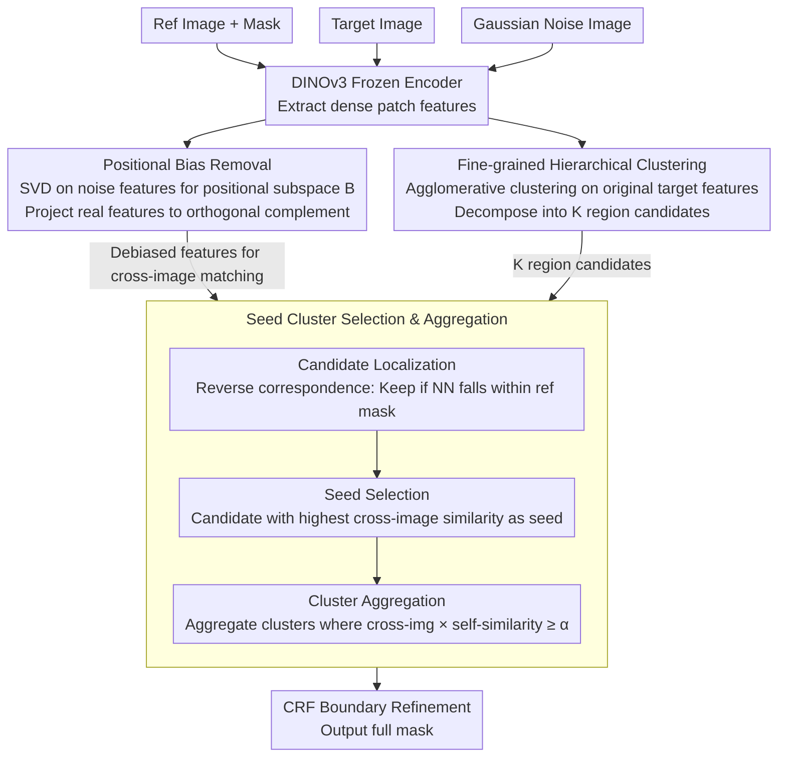

# INSID3: Training-Free In-Context Segmentation with DINOv3

**Conference**: CVPR 2026  
**arXiv**: [2603.28480](https://arxiv.org/abs/2603.28480)  
**Code**: [GitHub](https://visinf.github.io/INSID3)  
**Area**: Segmentation  
**Keywords**: In-context segmentation, DINOv3, training-free, self-supervised, positional bias correction

## TL;DR

This paper proposes INSID3, a training-free in-context segmentation method relying solely on frozen DINOv3 features. Through a three-stage pipeline consisting of positional bias elimination, fine-grained clustering, and seed cluster aggregation, it outperforms methods relying on SAM or fine-tuning across semantic, part, and personalized segmentation tasks using a single self-supervised backbone, achieving an average mIoU gain of +7.5%.

## Background & Motivation

In-context segmentation (ICS) aims to segment arbitrary concepts (objects, parts, or personalized instances) in a target image given a single labeled example. Existing methods generally follow two paradigms:

1.  **Fine-tuning approach** (e.g., SegIC, DiffewS): These train segmentation decoders on VFMs or fine-tune diffusion models. While effective in-domain, they exhibit poor generalization.
2.  **Training-free approach** (e.g., Matcher, GF-SAM): these combine DINOv2 with SAM. They offer strong generalization but involve complex architectures and high computational overhead.

**Key Challenge**: Prior methods depend on specific segmentation priors (SAM pre-training or downstream fine-tuning), preventing a truly "purely self-supervised" segmentation.

As the latest self-supervised VFM, DINOv3 produces dense local features with strong spatial structures due to massive data scaling and the Gram anchoring objective. **Core Idea**: DINOv3's dense self-supervised features inherently possess semantic matching and segmentation capabilities, requiring no additional decoders, fine-tuning, or model ensembling.

## Method

### Overall Architecture

INSID3 addresses a straightforward question: given a labeled reference image and a target image, can the same concept be extracted using only frozen DINOv3 features without training a decoder? The pipeline updates no parameters and follows three steps: first, removing "positional noise" from DINOv3 features to clarify cross-image matching; second, decomposing the target image into semantically coherent region candidates; finally, identifying target candidates using the reference labels and aggregating them into a complete mask. The process utilizes two sets of features: debiased features for cross-image matching and original features for internal image clustering.

### Key Designs

**1. Positional Bias Removal: Eliminating the "same position = same object" false signal**

The authors discovered a counter-intuitive phenomenon where unrelated images show strong DINOv3 feature matching at identical spatial locations. This indicates a signal tied solely to patch coordinates rather than content, causing false correspondences. To isolate this, Gaussian noise $\mathbf{I}^{noise} \sim \mathcal{N}(0,1)$ is fed into the encoder. Since it lacks semantic content, the extracted features mainly represent the positional signal. SVD is performed on these noise features to obtain the basis $\mathbf{B}$ for the "positional subspace," and real features are projected onto the orthogonal complement:

$$\tilde{\mathbf{F}} = \mathbf{F}(\mathbf{1}_D - \mathbf{B}\mathbf{B}^\top)$$

This debiasing is applied only to cross-image matching. Intra-image clustering retains original features as spatial information serves as a useful prior within a single image.

**2. Fine-grained Hierarchical Clustering: Region candidates**

To decompose the target image into "potential concepts," the authors use agglomerative (hierarchical) clustering on original target features $\mathbf{F}^t$. This merges adjacent similar patches from the bottom up into $K$ non-overlapping spatial regions $\{\mathcal{G}_1, ..., \mathcal{G}_K\}$. Unlike K-means, this does not require a pre-defined number of clusters, and it is more stable in high-dimensional space than DBSCAN.

**3. Seed Cluster Selection & Aggregation: Locking and growing the mask**

To identify target candidates among background or distractors, the reference labels are used. **Candidate Localization** uses reverse correspondence: a target patch is kept only if its nearest neighbor in the reference image falls inside the reference mask, yielding a candidate set $\mathcal{C}_{cand}$. **Seed Selection** picks the candidate with the highest cross-image similarity $s_k^{cross}$ between the candidate prototype and the reference prototype in the debiased feature space as the seed $\mathcal{G}^*$. **Cluster Aggregation** then incorporates any cluster where the product of cross-image similarity and intra-image self-similarity $s_k^{intra}$ exceeds a threshold: $S_k = s_k^{cross} \cdot s_k^{intra} \geq \alpha$.

### Loss & Training

Ours is entirely training-free and does not involve any loss functions or training procedures. During inference, CRF is used for mask refinement, and input images are resized to 1024×1024.

## Key Experimental Results

### Main Results

| Dataset | Metric | Ours | Prev. SOTA (GF-SAM) | Gain |
|--------|------|--------|-------------------|------|
| LVIS-92i (Semantic) | mIoU | 41.8% | 35.2% | +6.6 |
| COCO-20i (Semantic) | mIoU | 57.6% | 58.7% | -1.1 |
| ISIC (Skin Lesion) | mIoU | 54.4% | 48.7% | +5.7 |
| Chest X-Ray | mIoU | 78.8% | 51.0% | +27.8 |
| iSAID (Remote Sensing) | mIoU | 52.1% | 47.1% | +5.0 |
| PASCAL-Part (Part) | mIoU | 50.5% | 44.5% | +6.0 |
| PACO-Part (Part) | mIoU | 38.7% | 36.3% | +2.4 |
| PerMIS (Personalized) | mIoU | 67.0% | 54.1% | +12.9 |
| **Mean of 9 Datasets** | mIoU | **55.1%** | 47.6% | **+7.5** |

Parameter count: INSID3 uses 304M parameters vs. GF-SAM's 945M (3× reduction).

### Ablation Study

| Configuration | COCO mIoU | PASCAL-Part mIoU | Note |
|------|-----------|------------------|------|
| Thresholded similarity map | 44.2% | 35.4% | No clustering baseline |
| Coarse clustering (τ=0.5) w/o agg. | 50.6% | 31.1% | Better for object-level |
| Fine clustering (τ=0.6) w/o agg. | 42.8% | 36.2% | Better for part-level |
| Clus. + Cross-image aggregation | 54.6% | 48.5% | Cross similarity only |
| Clus. + Cross + Self-similarity agg. | **57.6%** | **50.5%** | Full method |

### Key Findings

- DINOv3 exhibits systematic positional bias where features at the same spatial coordinates produce false matches; this may stem from the Gram anchoring objective.
- Positional debiasing is generally effective for semantic correspondence, improving PCK by +1.4~6.6 on SPair-71k.
- Fine-tuning methods like SegIC achieve high in-domain mIoU (76.1% on COCO) but fail across domains (e.g., 46.1% on iSAID), whereas INSID3 remains stable across all domains.

## Highlights & Insights

- **Minimalist Philosophy**: A single frozen self-supervised backbone can perform in-context segmentation without decoders, fine-tuning, or model ensembling.
- **Positional Bias Correction**: The paper identifies the positional bias in DINOv3 and provides a simple SVD-based solution that generalizes to other tasks like semantic correspondence.
- **Reverse Correspondence**: This mechanism effectively treats unlabeled regions in the reference image as implicit negative samples, solving the issue of distractor instances in personalized segmentation.

## Limitations & Future Work

- Performance on COCO-20i is slightly lower than GF-SAM (57.6% vs 58.7%), suggesting self-supervised features may not yet match SAM's mask priors on in-domain data.
- Dependence on DINOv3-Large (1024×1024 input) entails high computational costs.
- Thresholds $\tau$ and $\alpha$ are fixed across tasks and may not be optimal for all scenarios.
- Extensions to few-shot (multi-example) scenarios were not explored.

## Related Work & Insights

- **vs GF-SAM**: GF-SAM uses DINOv2 matching points as prompts for SAM, discarding much dense feature information; INSID3 performs matching and segmentation in a unified space.
- **vs SegIC**: SegIC achieves strong in-domain performance through decoder training but suffers from poor generalization.
- **vs DINOv2**: DINOv2 has weaker positional bias than DINOv3, possibly because DINOv3's training objective unintentionally amplifies spatial correlation.

## Rating

- Novelty: ⭐⭐⭐⭐ 
- Experimental Thoroughness: ⭐⭐⭐⭐⭐ 
- Writing Quality: ⭐⭐⭐⭐ 
- Value: ⭐⭐⭐⭐ 

<!-- RELATED:START -->

## Related Papers

- [\[CVPR 2026\] The Power of Prior: Training-Free Open-Vocabulary Semantic Segmentation with LLaVA](the_power_of_prior_training-free_open-vocabulary_semantic_segmentation_with_llav.md)
- [\[CVPR 2026\] PEARL: Geometry Aligns Semantics for Training-Free Open-Vocabulary Semantic Segmentation](pearl_geometry_aligns_semantics_for_training-free_open-vocabulary_semantic_segme.md)
- [\[CVPR 2026\] Direct Segmentation without Logits Optimization for Training-Free Open-Vocabulary Semantic Segmentation](direct_segmentation_without_logits_optimization_for_training-free_open-vocabular.md)
- [\[CVPR 2026\] Looking Beyond the Window: Global-Local Aligned CLIP for Training-free Open-Vocabulary Semantic Segmentation](looking_beyond_the_window_global-local_aligned_clip_for_training-free_open-vocab.md)
- [\[CVPR 2026\] ReAttnCLIP: Training-Free Open-Vocabulary Remote Sensing Image Segmentation via Re-defined Attention in CLIP](reattnclip_training-free_open-vocabulary_remote_sensing_image_segmentation_via_r.md)

<!-- RELATED:END -->
