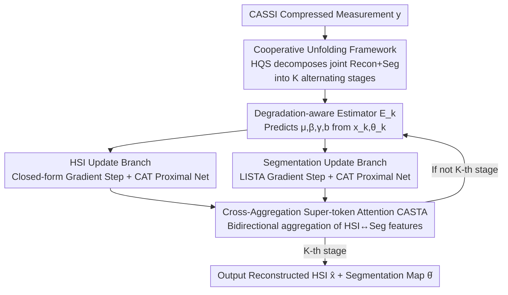

# Joint Spectral Image Reconstruction and Semantic Segmentation with Cooperative Unfolding

**Conference**: CVPR 2026  
**Paper**: [CVF Open Access](https://openaccess.thecvf.com/content/CVPR2026/html/He_Joint_Spectral_Image_Reconstruction_and_Semantic_Segmentation_with_Cooperative_Unfolding_CVPR_2026_paper.html)  
**Code**: https://github.com/zjhe02/CRSDUN  
**Area**: Semantic Segmentation / Hyperspectral Imaging / Deep Unfolding Networks  
**Keywords**: CASSI, Hyperspectral Reconstruction, Semantic Segmentation, Deep Unfolding, Super-token Attention

## TL;DR
To address error accumulation in the "reconstruction-then-segmentation" two-stage pipeline for Coded Aperture Snapshot Spectral Imaging (CASSI) and the loss of complementary clues between tasks, this paper proposes the first Cooperative Reconstruction-Segmentation Deep Unfolding Network (CRSDUN). It integrates HSI reconstruction and segmentation into a unified Half-Quadratic Splitting (HQS) optimization framework for alternating solutions. A Cross-Aggregation Super-token Attention (CASTA) module is introduced to bidirectionally transfer pixel-level and semantic-level representations between branches. It achieves SOTA performance in both reconstruction and segmentation on synthetic and real CASSI data with lower computational cost.

## Background & Motivation

**Background**: CASSI uses a coded mask and a dispersive prism to compress a 3D spectral data cube $X\in\mathbb{R}^{H\times W\times C}$ into a single 2D measurement $y$. This provides high temporal resolution with a single exposure, becoming a mainstream Hyperspectral Imaging (HSI) acquisition method in remote sensing, material analysis, and medical diagnosis. To perform semantic segmentation on CASSI, the conventional approach is a two-stage pipeline: first recovering the HSI from measurements using a pre-trained reconstruction network, followed by a pre-trained segmentation network.

**Limitations of Prior Work**: CASSI inversion is an ill-posed problem. Artifacts remaining from reconstruction **propagate and amplify stage-by-stage** (error accumulation) in the two-stage pipeline. The segmentation network receives noisy inputs, further magnifying errors. Fig. 6/7 shows that two-stage methods result in significant missegmentation on real/fake grapes and similarly colored lemons/bananas. More fundamentally, the pipeline treats reconstruction and segmentation as **isolated** tasks, discarding complementary clues between them.

**Key Challenge**: HSI reconstruction and semantic segmentation are strongly correlated, mutually beneficial dense pixel prediction tasks—both rely on the same spatial-spectral representation. The reconstruction network's role is to **decode** informative representations from compressed measurements, while the segmentation network **encodes** these representations into semantics. Structural semantics can, in turn, guide spatial-spectral recovery (focusing reconstruction on target areas), while recovered details enhance segmentation accuracy. Separating them in a pipeline forces two models that could assist each other to work in isolation.

**Goal**: Split into two sub-problems: (1) How to embed reconstruction and segmentation into the **same optimizable unfolding framework** for parallel alternating solutions rather than serial cascading; (2) How to enable **bidirectional representation exchange** between the two branches at each stage to achieve mutual gain.

**Key Insight**: The authors re-examine the learning paradigm of CASSI reconstruction and segmentation from a "cooperative perspective," observing their shared dependence on spatial-spectral representations, and introduce bidirectional representation interaction.

**Core Idea**: Utilizing a unified cooperative unfolding network (CRSDUN), the HSI reconstruction variable $x$ and segmentation map variable $\theta$ are formulated into a single optimization objective with an implicit joint regularization term. Solved via HQS, CASTA is used in each stage to aggregate pixel-level (HSI) and semantic-level (segmentation) features, achieving a "reconstruction helps segmentation, segmentation helps reconstruction" win-win.

## Method

### Overall Architecture
CRSDUN takes a single CASSI compressed measurement $y$ as input and outputs a reconstructed hyperspectral cube $\hat{x}$ and a pixel-wise semantic segmentation map $\hat{\theta}$. Its backbone is a $K$-stage (using 3 and 5 stages in the paper) deep unfolding network: the "joint reconstruction + segmentation" is first formulated as a unified optimization problem, then decomposed into iterative sub-problems using HQS, where each iteration corresponds to one stage of the unfolding network.

The key is that within each stage, variables are updated **alternately**: first HSI $x$, then segmentation map $\theta$. The HSI branch follows a "gradient descent step (closed-form solution) + proximal network," and the segmentation branch follows a "LISTA gradient descent step + proximal network." Both branches use a Cross-Aggregation Transformer (CAT) as the proximal network. The CASTA module inside CAT is responsible for **reciprocally feeding** HSI and segmentation features: the reconstruction branch uses semantic clues to focus on targets, while the segmentation branch uses pixel details to distinguish objects. Furthermore, optimization hyperparameters ($\mu,\beta,\gamma,b$) for each stage are dynamically predicted by a degradation-aware estimator $E_k$ based on the previous stage's $x_k,\theta_k$.

### Key Designs

**1. Cooperative Unfolding Framework: Unified Alternating Optimization**

The major flaw of two-stage pipelines is the independent operation and sequential error accumulation. This paper solves this by unifying both from an optimization perspective. At the $(k+1)$-th iteration, the joint optimization is:

$$\{x^{k+1},\theta^{k+1}\}=\arg\min_{x,\theta}\tfrac12\|y-Ax\|_2^2+\tfrac12\|x-\Phi\theta\|_2^2+\mu P(x,\theta),$$

where $A$ is the CASSI sensing matrix, $\Phi$ is a spectral dictionary shared across pixels, $\theta$ is the vectorized segmentation map, and $P(x,\theta)$ is the **implicit joint regularization term** that "welds" the two tasks together. The term $\|x-\Phi\theta\|_2^2$ comes from modeling segmentation (each pixel spectrum $\approx$ sparse combination $\Phi\theta$ of dictionary atoms), ensuring the reconstruction and segmentation semantics constrain each other.

Solving via HQS: **First update HSI** by introducing auxiliary variable $z$. The $z$-subproblem is quadratic with a closed-form solution $z^{k+1}=\tilde{x}^k+A^\top(y-A\tilde{x}^k)\oslash(1+\beta+\mathrm{Diag}(AA^\top))$ (where $\tilde{x}^k=\tfrac{\beta x^k+\Phi\theta^k}{1+\beta}$, showing $\theta^k$ directly enters the reconstruction gradient step), then solve the $x$-subproblem using proximal operator $x^{k+1}=\mathrm{prox}_{\mu/\beta\cdot P}(z^{k+1},\theta^k)$. **Then update segmentation map** $\theta$, similarly splitting into an $\ell_1$-regularized least squares subproblem and a proximal subproblem. Thus, within each stage, $x$ and $\theta$ serve as inputs for each other.

**2. LISTA-based Segmentation Update & Degradation-Aware Estimator**

Ideally, the segmentation map is one-hot; thus, an $\ell_1$ sparse regularization is applied to $\theta$ across channels, decomposing $P=\|\theta\|_1+Q(x,\theta)$. The $\ell_1$ subproblem for $\theta$ could be solved via ISTA soft-thresholding: $\xi^{k+1}=\mathrm{soft}_{t\mu}(\xi^k-t(\Phi^\top(\Phi\xi^k-x^{k+1})+\gamma(\xi^k-\theta^k)))$. However, a fixed dictionary $\Phi$ converges slowly. Following the LISTA concept, this is replaced with learnable layers: $\xi^{k+1}=\mathrm{soft}_b(S\xi^k+Wx^{k+1}+\gamma\theta^k)$, where $S\approx I-t(\Phi^\top\Phi+\gamma I)$, $W\approx t\Phi^\top$, and $b\approx t\mu$ are learned ($S,W$ use two bias-free $1\times1$ convolutions shared across stages, $b$ is a learnable parameter), making the solver faster and more data-adaptive.

Additionally, the penalty/regularization coefficients $\mu,\beta,\gamma,b$ are not hand-tuned but predicted by the **Degradation-Aware Estimator** $E_k$ at each stage: $\{\mu_k,\beta_k,\gamma_k,b_k\}=E_k(x_k,\theta_k)$. It allows optimization steps to adaptively change with the degree of degradation across stages.

**3. Cross-Aggregation Transformer (CAT) & CASTA: Bidirectional Representation Exchange**

CASTA is the core of the proximal network. CAT is an asymmetric U-Net: for encoding, the reconstruction branch uses SSRB (with window spectral self-attention WSSA), and the segmentation branch uses Swin-Transformer Blocks. In the decoding end, both branches use Cross-Aggregation Super-token Attention Blocks (CASTAB), centered on CASTA.

CASTA receives HSI features $X\in\mathbb{R}^{H\times W\times C}$ and segmentation features $\Theta\in\mathbb{R}^{H\times W\times C}$ in three steps. **(a) Cross-Aggregation Super-token Sampling**: Uses adaptive pooling of segmentation features to initialize super-tokens $S=\mathrm{AdaPooling2d}(\Theta)\in\mathbb{R}^{\frac Hh\times\frac Ww\times C}$ (injecting semantic priors), then computes a spatial correlation matrix $Q=\mathrm{Softmax}(SX^\top/\sqrt{C})$ between super-tokens and HSI pixel features. Pixel features are then aggregated into super-tokens via $S=\hat Q X$ (where $\hat Q$ is column-normalized). **(b) Multi-head Self-Attention (MHSA) within Super-tokens**: MHSA is performed on the small number of super-tokens to model long-range semantic relations at low cost. **(c) Upsampling back to the pixel domain**: $X\ \text{or}\ \Theta=\mathrm{reshape}(Q^\top\mathrm{Attn}(S))$, merging refined semantic information back into pixel features.

Mechanism: Attention visualization shows that introducing semantic information helps the reconstruction model focus on objects rather than background. Conversely, adding pixel-level information to segmentation produces more balanced attention across different objects. Removing Cross-Aggregation (CA) causes CASTA to degrade into standard super-token attention, resulting in performance drops for both tasks, proving the value of bidirectional interaction.

### Loss & Training
The total loss is the sum of reconstruction and segmentation losses with multi-stage supervision:

$$L=\sum_{k=1}^{K}\lambda_{\text{stage}}^{K-k}\big(\|\hat{x}^k-x\|_2^2+\lambda_{ce}L_{ce}(\hat{\theta}^k,\theta)\big),$$

using MSE for reconstruction and cross-entropy $L_{ce}$ for segmentation, with $\lambda_{\text{stage}}=0.7$ and $\lambda_{ce}=10^{-4}$. Adam optimizer with cosine annealing, initial learning rate 0.0004, trained for 500 epochs.

## Key Experimental Results

### Main Results
On the synthetic FVgNET dataset (317 HSIs, real/fake fruit/vegetables, 28 bands, 23 classes, 50 test images), compared with various two-stage methods ("+Seg" denotes a SwinTransformer for segmentation):

| Method | PSNR(dB) | mIoU(%) | Params(M) | FLOPs(G) |
|------|---------|---------|-----------|----------|
| MST++ +Seg (CVPRW'22) | 32.39 | 77.91 | 3.10 | 45.61 |
| RCUMP-9stg +Seg (TIP'24) | 38.35 | 85.66 | 14.3 | 152.1 |
| SSR-6stg +Seg (CVPR'24) | 38.20 | 87.27 | 6.91 | 108.1 |
| SSR-9stg +Seg (CVPR'24) | 39.50 | 85.74 | 10.3 | 161.0 |
| **CRSDUN-3stg (Ours)** | 39.35 | 90.11 | 4.02 | 59.49 |
| **CRSDUN-5stg (Ours)** | **39.88** | **92.33** | 6.73 | 99.07 |

CRSDUN-5stg outperforms SSR-9stg by 0.38 dB in PSNR and 6.59% in mIoU with significantly fewer parameters/FLOPs. On real-world CASSI data (real/fake grapes), CRSDUN-3stg correctly distinguishes between real and fake grapes and similarly colored fruits, while SSR-3stg+Seg fails.

### Ablation Study

Breakdown of the cooperative unfolding framework (baseline-1 is pure reconstruction unfolding + independent segmenter):

| Configuration | PSNR(dB) | mIoU(%) | Params(M) | FLOPs(G) | Description |
|------|---------|---------|-----------|----------|-------------|
| baseline-1 | 37.33 | 84.31 | 3.96 | 60.41 | No cooperation |
| +Eq.(13) | 37.90 | 86.08 | 3.96 | 60.68 | Seg map in recon gradient step |
| +LISTA | 38.03 | 86.55 | 3.96 | 60.91 | LISTA for seg gradient step |

Ablation of the Cross-Aggregation (CA) mechanism (CRSDUN-3stg):

| Configuration | PSNR(dB) | mIoU(%) | Description |
|------|---------|---------|-------------|
| CA only in Recon | 39.26 | 85.49 | Significant mIoU drop |
| CA only in Seg | 38.60 | 89.81 | PSNR drop |
| CA in both | **39.35** | **90.12** | Full CASTA |

### Key Findings
- **Cooperative framework gains at almost zero cost**: Introducing the segmentation map into the reconstruction gradient step (Eq. 13) alone adds +0.57 dB PSNR and +1.77% mIoU. Adding LISTA further adds +0.13 dB and +0.47% with negligible parameter increases.
- **Cross-Aggregation (CA) is bidirectional**: Removing CA from the reconstruction branch drops mIoU from 90.12 to 85.49; removing it from the segmentation branch drops PSNR from 39.35 to 38.60.
- **Reconstruction and segmentation prefer different depths**: PSNR increases monotonically with stages, but mIoU peaks at 5 stages and then declines, revealing a depth mismatch in joint optimization.

## Highlights & Insights
- **Converting two-stage pipelines into a single optimizable objective** is the core breakthrough. Using HQS unfolding with implicit joint regularization $P(x,\theta)$ eliminates sequential error accumulation.
- **CASTA using segmentation features to initialize super-tokens** is clever: it uses the super-token mechanism not just for efficiency but as a "cross-task bridge" to share information.
- **Degradation-aware estimation of HQS hyperparameters** makes unfolding data-driven and adaptive, a trick applicable to any unfolding network.

## Limitations & Future Work
- **Unexplored balance between reconstruction and segmentation losses**: Current weights like $\lambda_{ce}=10^{-4}$ are fixed; joint optimization might favor one task over the other. 
- **Impact of noise and mask errors in real data on segmentation**: How real-world calibration errors propagate to semantic maps remains to be studied.
- **Generalization across datasets**: Experiments were limited to FVgNET (fruit/vegetables); performance in remote sensing or medical scenarios is unknown.
- **Cold start in CASTA**: If segmentation is poor in early stages, the super-token initialization will be poor, potentially leading to bias.

## Related Work & Insights
- **vs Two-stage Reconstruction→Segmentation**: They cascaded independent models, leading to error accumulation and no representation sharing. Ours performs joint optimization with bidirectional exchange.
- **vs Direct Segmentation from Measurements**: Those methods skip reconstruction and lose pixel details. Ours maintains both for mutual benefit.
- **vs Dual-task Deep Unfolding**: Previous works often used auxiliary tasks to aid a primary task. Ours is the first to treat reconstruction and segmentation as **equally important and complementary** tasks in a joint unfolding framework for CASSI.

## Rating
- Novelty: ⭐⭐⭐⭐⭐ 
- Experimental Thoroughness: ⭐⭐⭐⭐ 
- Writing Quality: ⭐⭐⭐⭐ 
- Value: ⭐⭐⭐⭐ 

<!-- RELATED:START -->

## Related Papers

- [\[NeurIPS 2025\] HumanCrafter: Synergizing Generalizable Human Reconstruction and Semantic 3D Segmentation](../../NeurIPS2025/segmentation/humancrafter_synergizing_generalizable_human_reconstruction_and_semantic_3d_segm.md)
- [\[CVPR 2026\] Hilbert Curve-Based Attention Enabling Topology-Preserving Image Tensor Representation for Semantic Segmentation Network](hilbert_curve-based_attention_enabling_topology-preserving_image_tensor_represen.md)
- [\[CVPR 2025\] Robust 3D Shape Reconstruction in Zero-Shot from a Single Image in the Wild](../../CVPR2025/segmentation/robust_3d_shape_reconstruction_in_zero-shot_from_a_single_image_in_the_wild.md)
- [\[CVPR 2026\] From 2D Alignment to 3D Plausibility: Unifying Heterogeneous 2D Priors and Penetration-Free Diffusion for Occlusion-Robust Two-Hand Reconstruction](from_2d_alignment_to_3d_plausibility_unifying_heterogeneous_2d_priors_and_penetr.md)
- [\[CVPR 2026\] Heuristic Self-Paced Learning for Domain Adaptive Semantic Segmentation under Adverse Conditions](heuristic_self-paced_learning_for_domain_adaptive_semantic_segmentation_under_ad.md)

<!-- RELATED:END -->
