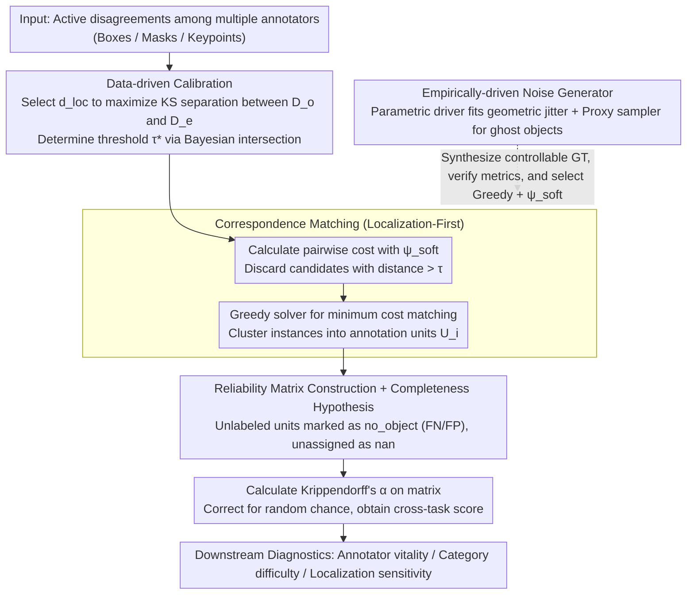

# Kαlos finds Consensus: A Meta-Algorithm for Evaluating Inter-Annotator Agreement in Complex Vision Tasks

**Conference**: CVPR 2026  
**arXiv**: [2603.27197](https://arxiv.org/abs/2603.27197)  
**Code**: [GitHub](https://github.com/Madave94/kalos)  
**Area**: Segmentation  
**Keywords**: Inter-Annotator Agreement (IAA), Data Quality Assessment, Krippendorff's Alpha, Object Detection, Benchmark Evaluation

## TL;DR

Ours proposes the KαLOS meta-algorithm, which converts complex spatial-category annotation consistency problems into standard nominal reliability matrices through "Localization-First" principles and data-driven parameter calibration. It provides a unified framework to evaluate Inter-Annotator Agreement (IAA) across diverse vision tasks such as object detection, instance segmentation, and pose estimation.

## Background & Motivation

The performance gains of vision benchmarks like object detection are stagnating. Existing evidence suggests that **the limiting factor is label noise rather than architecture**: current model performance has fallen into the confidence interval of "label convergence," equivalent to the consistency level of human annotators themselves.

Assessing annotation quality faces fundamental difficulties:
1.  **Instance Correspondence Problem**: Unlike text annotation, vision tasks require matching instances across different annotators (which box corresponds to which?) before standard IAA metrics can be applied.
2.  **Verification Dilemma**: No objective ground truth for annotation consistency exists, making it impossible to verify the correctness of the IAA metrics themselves.
3.  **Community Neglect**: The CV community rarely evaluates dataset quality; even when done, metrics like mAP/F1 are used, which do not correct for chance agreement.

Existing methods either treat object detection as pixel-level segmentation (losing instance discreteness) or use specific heuristics to solve correspondence without a unified framework.

## Method

### Overall Architecture

The core problem KαLOS solves is: when multiple annotators draw boxes/masks/keypoints on the same set of images, how can their "level of agreement" be calculated—while correcting for random chance and remaining universal across tasks? The difficulty lies in the fact that vision labels are not naturally aligned: which box from annotator A corresponds to which from annotator B is a problem that must be solved first.

KαLOS structures this process into a pipeline. First, it uses "active disagreements" between annotators as input signals to calibrate distance functions and thresholds using the data itself. Then, it uses "Localization-First" principles to perform spatial matching of instances, grouping matched instances into "annotation units." Next, the categories assigned by each annotator for each unit are filled into a reliability matrix. Finally, Krippendorff's $\alpha$ is calculated on this matrix to obtain a consistency score, driving downstream diagnostics such as annotator vitality and category difficulty. The key lies in collapsing "complex spatial + categorical joint consistency" into a standard nominal reliability matrix.

### Key Designs

**1. Data-driven Distance Function and Threshold Calibration: Letting the data determine parameters**

The biggest obstacle to cross-task universality is that detection uses IoU while pose uses keypoint distance, and different tasks require different scales for "closeness." KαLOS decomposes disagreements into two distributions: "Observed Disagreement" $D_o$ (differences between annotators on the same image) and "Expected Disagreement" $D_e$ (differences between annotators across different images, acting as a random noise baseline). It selects the distance function that maximizes the KS statistic between these distributions and finds the intersection $\tau^* = \{\delta \in \mathbb{R} \mid f_{D_o}(\delta) = f_{D_e}(\delta)\}$ as the calibration anchor.

**2. Localization-First Correspondence Matching: Collapsing spatial problems into a nominal matrix**

This is the core of the meta-algorithm. KαLOS adopts the "Localization-First" principle—matching instances via spatial correspondence before assessing category consistency. It uses a semantics-sensitive cost function $\psi_{soft}$ (adding a category-sensitive term to localization distance) and finds the minimum cost matching set $M^*$ under cycle-consistency constraints using a solver $\mathcal{S}$. This step collapses complex joint consistency into a reliability matrix, allowing K-α to be applied directly.

**3. Completeness Hypothesis and Existence Disagreement: Treating FN/FP as explicit opinions**

Missed labels (FN) and false positives (FP) are tricky for consistency metrics. KαLOS introduces a completeness hypothesis: if an annotator does not provide a label for a unit identified by others, it is recorded as an explicit `no_object` label. This ensures FN/FP are treated as real categorical disagreements in the matrix and are strictly penalized by $\alpha$.

**4. Empirically-driven Noise Generator Verification: Validating metrics with modeled human noise**

To bypass the lack of "consistency ground truth," KαLOS fits an error distribution from real multi-annotator datasets. It uses a parametric driver for geometric variation (heavy-tailed jitter) and a validation agent to sample "ghost" objects (semantically ambiguous targets) using foundation models. This non-isotropic noise reliably tests if $\alpha$ behaves correctly under realistic conditions.

### Loss & Training

KαLOS does not involve training. The final metric is Krippendorff's $\alpha$, calculated on the reliability matrix:

$$\alpha = 1 - \frac{D_o}{D_e} = \frac{(n-1)\sum_c o_{cc} - \sum_c n_c(n_c - 1)}{n(n-1) - \sum_c n_c(n_c - 1)}$$

The range of $\alpha$ is $[-1, 1]$, where 0 indicates agreement no better than chance, and $\ge 0.8$ is considered near-perfect agreement.

## Key Experimental Results

### Main Results — Correspondence Solver Comparison

| Solver | 3-Annotator Rand Index | 5-Annotator Rand Index | Stability (NuCLS ARI) |
| :--- | :--- | :--- | :--- |
| Greedy | Best | Best | 0.99998 |
| SHM | Second | Second | 0.9327 |
| MGM | Conservative | Medium | 0.9606 |
| AHC | Worst | Worst | — |

### Ablation Study — Cost Function

| Configuration | RI Performance | F1 Performance | Description |
| :--- | :--- | :--- | :--- |
| $\psi_{soft}$ | Best | Best | Semantics-sensitive cost function |
| $\psi_{neg}$ | Second | Second | Simple negative cost function |

### Key Findings

- The Greedy solver performs best and is fully deterministic—simple local optimization strategies handle structured human noise better than global optimization (MGM).
- All solvers show high precision (~0.97-1.0); differences primarily lie in recall—conservative strategies (MGM) miss many valid but low-IoU matches.
- Increasing annotators follows a law of diminishing returns: gains are significant from 2 to 6 but diminish after 6-8.
- Conflicts between annotation "schools" impact consistency more than the number of annotators.

## Highlights & Insights

- Standardizes IAA assessment for CV into a unified framework, making downstream diagnostics (annotator vitality, category difficulty) directly available.
- The noise generator design is valuable: modeling human error distributions empirically rather than using simple uniform noise.
- Proposed a significant thesis: the bottleneck of object detection benchmarks is label quality, not model architecture.
- Data-driven calibration makes the framework naturally extensible to instance segmentation, 3D volume segmentation, and pose estimation.

## Limitations & Future Work

- Requires multi-annotator metadata, precluding post-hoc quality assessment of traditional single-annotator datasets.
- Decoupled architecture requires narrow threshold calibration in spatially constrained tasks (e.g., lab-based pose estimation).
- Empirical verification is limited to object detection (due to data availability); conclusions for pose/segmentation are extrapolated.
- The synthetic noise generator does not yet incorporate visual uncertainty from image content.

## Related Work & Insights

- **vs. Nassar et al.**: Pixel-level K-α fails to capture the instance-discrete nature of object detection.
- **vs. Amgad (AHC) and Tschirschwitz (SHM)**: These methods are specific configurations of KαLOS; Ours unifies them and identifies the optimal configuration (Greedy + $\psi_{soft}$) via empirical validation.
- **vs. Braylan et al.**: They suggest abandoning K-α for distribution statistics; Ours argues that K-α's statistical rigor should be kept, using distribution analysis for calibration instead.

## Rating

- Novelty: ⭐⭐⭐⭐ Systematically addresses the long-neglected IAA problem in CV.
- Experimental Thoroughness: ⭐⭐⭐⭐ Comprehensive synthetic and real-world analysis.
- Writing Quality: ⭐⭐⭐⭐ Rigorous logic and clear problem definition.
- Value: ⭐⭐⭐⭐ Long-term value for CV benchmark construction and data quality assessment.

<!-- RELATED:START -->

## Related Papers

- [\[ICLR 2026\] How Well Does GPT-4o Understand Vision? Evaluating Multimodal Foundation Models on Standard Computer Vision Tasks](../../ICLR2026/segmentation/how_well_does_gpt-4o_understand_vision_evaluating_multimodal_foundation_models_o.md)
- [\[NeurIPS 2025\] Mars-Bench: A Benchmark for Evaluating Foundation Models for Mars Science Tasks](../../NeurIPS2025/segmentation/mars-bench_a_benchmark_for_evaluating_foundation_models_for_mars_science_tasks.md)
- [\[CVPR 2026\] The Missing Point in Vision Transformers for Universal Image Segmentation](the_missing_point_in_vision_transformers_for_universal_image_segmentation.md)
- [\[CVPR 2026\] GKD: Generalizable Knowledge Distillation from Vision Foundation Models for Semantic Segmentation](gkd_generalizable_knowledge_distillation_vfm.md)
- [\[ICLR 2026\] Advancing Complex Video Object Segmentation via Progressive Concept Construction](../../ICLR2026/segmentation/advancing_complex_video_object_segmentation_via_progressive_concept_construction.md)

<!-- RELATED:END -->
