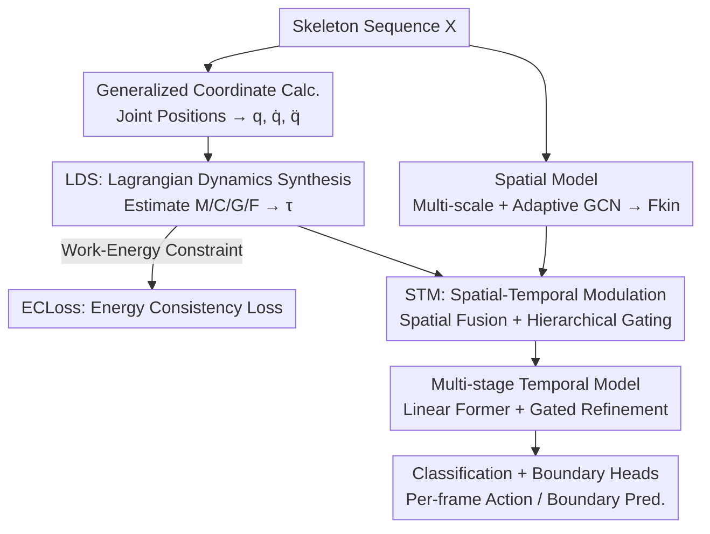

# LaDy: Lagrangian-Dynamic Informed Network for Skeleton-based Action Segmentation via Spatial-Temporal Modulation

**Conference**: CVPR 2026  
**Paper**: [CVF Open Access](https://openaccess.thecvf.com/content/CVPR2026/html/Ji_LaDy_Lagrangian_Dynamic_Informed_Network_for_Skeleton-based_Action_Segmentation_via_Spatial-Temporal_CVPR_2026_paper.html)  
**Code**: https://github.com/HaoyuJi/LaDy (Available)  
**Area**: Video Understanding / Skeleton Action Segmentation  
**Keywords**: Skeleton Action Segmentation, Lagrangian Dynamics, Physics Priors, Generalized Forces, Temporal Boundary Localization

## TL;DR
LaDy introduces an overlooked "Physical Dynamics" dimension to Skeleton-based Temporal Action Segmentation (STAS). It utilizes a Lagrangian dynamics branch to explicitly synthesize generalized joint forces (torques) from joint coordinates, ensures these forces adhere to the work-energy theorem via an energy consistency loss, and injects force information into spatial features (fusion) and temporal features (hierarchical gating). It achieves new SOTA results across six datasets, notably improving F1@50 by up to 5.2% on PKU-MMD v2 with only 1.83M parameters.

## Background & Motivation
**Background**: Skeleton-based Temporal Action Segmentation (STAS) requires frame-wise labeling of action categories in untrimmed skeleton sequences. Prevailing methods (since MS-GCN) employ "GCNs for spatial topology + TCNs/Transformers for long-range temporal modeling." Subsequent refinements in decoupled architectures, motion enhancement, contrastive learning, and multi-scale pyramids focus essentially on learning **kinematics** patterns—i.e., "how" the body moves.

**Limitations of Prior Work**: These methods operate almost exclusively in kinematic space, ignoring the **dynamics** driving the motion. Human motion is a physical result of "forces" acting within a classical mechanical system. Neglecting this physical foundation discards intent and causal information, leading to: (1) **Poor inter-class separability**—motions with similar kinematics but different dynamic intents are hard to distinguish (e.g., "walking" vs. "pushing a cart"); (2) **Imprecise boundary localization**—action transitions fundamentally involve abrupt changes in force profiles, which kinematic models often smooth out, resulting in blurred boundaries.

**Key Challenge**: Kinematics answers "what/how" but cannot answer "why." Identical trajectories can be driven by entirely different force profiles, making pose-only information ambiguous. Furthermore, force-spike events marking action boundaries are often smoothed within kinematic features.

**Goal**: Explicitly incorporate "why the motion occurs" into the segmentation pipeline by: ① Inferring generalized forces from joint kinematics; ② Ensuring synthesized forces are physically consistent; ③ Utilizing force information to enhance spatial discrimination and temporal boundary detection.

**Key Insight**: Leveraging Lagrangian mechanics, the generalized forces of a rigid-body open-chain system consist of "inertia + Coriolis/centrifugal + gravity + non-conservative forces" ($\tau = M\ddot{q} + C\dot{q} + G + F$). Rather than treating force regression as a black box, the **structure** of this physical equation is embedded into the network. The network estimates individual physical operators, and the work-energy theorem serves as supervision to ensure synthesized forces comply with energy conservation.

**Core Idea**: Use "explicitly synthesized generalized joint forces" instead of "kinematics-only features" for spatial-temporal modulation. Dynamics reveal where effort is applied and when force transitions occur, addressing inter-class disambiguation and boundary localization.

## Method

### Overall Architecture
LaDy adopts a dual-stream parallel architecture. The input is a skeleton sequence $X \in \mathbb{R}^{C_0 \times T \times V}$ ($T$ frames, $V$ joints), and the output is frame-wise action labels. The **Main Stream** is a standard spatial-temporal model: multi-scale + adaptive GCNs extract kinematic features $F_{kin}$, followed by an $L$-stage temporal model (Linear Transformer + adaptive fusion). The **Auxiliary Stream** (Core Innovation) is the Lagrangian Dynamics model: it computes generalized coordinates, velocities, and accelerations $(q, \dot{q}, \ddot{q}) \in \mathbb{R}^{T \times D}$ from joint positions, feeds them into a physically-constrained LDS module to synthesize generalized forces $\tau \in \mathbb{R}^{D \times T}$, and ensures physical consistency via ECLoss.

The streams interact through **Spatial-Temporal Modulation (STM)**: Spatially, force is projected and expanded into dynamic features $F_{dyn}$ to be concatenated with $F_{kin}$ for an enhanced representation $F_{sp}$. Temporally, three salient dynamic signals (power, torque norm, torque change) are distilled from the forces for hierarchical gating at each stage of the temporal model. Final representations enter classification and boundary heads for multi-stage refinement.

### Key Designs

**1. Lagrangian Dynamics Synthesis (LDS): Structuring the Network after Physical Equations**

The drawback of kinematics is the absence of "force" information, while direct MLP regression lacks physical guarantees. LDS addresses this by filling each term of the Lagrangian equation $\tau = M(q)\ddot{q} + C(q,\dot{q})\dot{q} + G(q) + F(q,\dot{q})$ with "learnable operators under physical constraints." The skeleton is modeled as an open kinematic chain: the root node uses neighboring joints to construct a time-varying local coordinate system via Gram-Schmidt orthogonalization for axis-angle representation $q_{root}$. Other joints use axis-angle alignment between parent and child bones for $q_{local}$. These form the generalized coordinates $q$, from which $\dot{q}$ and $\ddot{q}$ are derived via finite differences.

Crucially, each operator has **embedded constraints**: The inertia matrix $M(q)$ must be symmetric positive-definite (SPD); hence, the network outputs a lower-triangular matrix $L(q)$ with positive diagonal elements via $\mathrm{softplus}(L^{low}_{ii}(q)) + \epsilon$, ensuring $M(q) = L(q)L(q)^T$ is naturally SPD. The Coriolis matrix $C(q,\dot{q})$ must satisfy passivity ($\dot{M} - 2C$ is skew-symmetric). The network constructs $N = N^{up} - (N^{up})^T$ to be strictly skew-symmetric and solves $C = 0.5(\dot{M} - N)$. Gravity $G(q)$ and non-conservative forces $F(q,\dot{q})$ are estimated via MLPs. This ensures synthesized $\tau$ is a "quasi-physical quantity" rather than an arbitrary feature.

**2. Energy Consistency Loss (ECLoss): Physical Regularization via the Work-Energy Theorem**

While LDS provides structure, operators are still learned. ECLoss adds physical rigor: work done by net torque must equal the change in kinetic energy. In the rotating skeleton system, net torque is $\tau_{net} = \tau - G - F$. Over a discrete interval $[t-1, t]$, $E_K(t) - E_K(t-1) = \int_{t-1}^{t} P(s)\,ds$, where instantaneous power $P = \tau_{net} \cdot \dot{q}$. Kinetic energy is $E_K(t) = 0.5\,\dot{q}(t)^T M(t)\dot{q}(t)$, and work $W(t) = 0.5(P(t) + P(t-1))$ is approximated by the trapezoidal rule.

To prevent large motion magnitudes from dominating the loss, a **scale-invariant relative energy residual** is designed:

$$r_E(t) = \frac{\Delta E_K(t) - W(t)}{|\Delta E_K(t)| + |W(t)| + \delta} \cdot \mathcal{M}(t)$$

The denominator provides normalization, while the mask $\mathcal{M}(t)$ zeroes out residuals during static or micro-motion phases where noise is high. Huber loss is applied to $r_E$ to handle outliers.

**3. Spatial-Temporal Modulation (STM): Directing Force into Discrimination and Boundaries**

**Spatial Modulation**: Targets inter-class separability. Generalized force $\tau \in \mathbb{R}^{D \times T}$ is linearly projected to $F'_{dyn}$ and expanded across joint dimension $V$ to match $F_{kin}$, then concatenated along the channel dimension to form $F_{sp} \in \mathbb{R}^{2C \times T \times V}$. This encodes both "geometric pose" and "causal dynamics," enabling the model to distinguish kinematically similar actions by their different force requirements.

**Temporal Modulation**: Targets boundary localization. Three 1D dynamic signals are distilled: instantaneous power $g_P(t) = \|\tau(t) \cdot \dot{q}(t)\|_1$ (total energy consumption), torque norm $g_\tau(t) = \|\tau(t)\|_2$ (driving magnitude), and torque change $g_{\dot\tau}(t) = \|\tau(t) - \tau(t-1)\|_2$ (dynamic transition). **Hierarchical Gating** is applied at each stage $l$ of the temporal model: each signal is refined via independent 1D convolutions and sigmoid activations $g_k^{(l)} = \sigma(\mathcal{G}_k^{(l)}(g_k^{(l-1)}))$. The temporal features $H^{(l)}_T$ are modulated per signal via Hadamard product $H^{(l)}_k = H^{(l)}_T \odot g_k^{(l)}$, and the results are fused. Visualization shows these signals (especially "torque change") exhibit sharp valleys at true action boundaries.

### Loss & Training
The network is trained end-to-end minimizing $\mathcal{L}_{total} = \mathcal{L}_{as} + \lambda_1 \mathcal{L}_{br} + \lambda_2 \mathcal{L}_{atc} + \lambda_3 \mathcal{L}_{EC}$. $\mathcal{L}_{as}$ is the standard segmentation loss, $\mathcal{L}_{br}$ is binary cross-entropy for boundary prediction, $\mathcal{L}_{atc}$ is the action-text contrastive loss from LaSA, and $\lambda_1=1.0, \lambda_2=0.8, \lambda_3=0.1$. Adam optimizer is used with a learning rate of $10^{-3}$ and 300 epochs.

## Key Experimental Results

### Main Results
Evaluated on six datasets: PKU-MMD v2, MCFS-22, MCFS-130, LARa, and TCG-15.

| Dataset | Metric | LaDy | Prev. SOTA | Gain |
|--------|------|------|--------|------|
| PKU-MMD v2 (X-view) | Acc / Edit / F1@50 | 77.0 / 74.7 / 67.6 | ME-ST 74.1 / 70.5 / 62.4 | +2.9 / +4.2 / +5.2 |
| PKU-MMD v2 (X-sub) | Acc / Edit / F1@50 | 76.2 / 75.1 / 67.0 | LaSA 73.5 / 73.4 / 63.6 | +1.5 / +1.7 / +3.4 |
| LARa | Acc / Edit / F1@50 | 75.6 / 65.9 / 59.7 | LaSA 75.3 / 65.7 / 57.9 | +0.3 / +0.2 / +1.8 |

LaDy achieves SOTA with high efficiency: on LARa, it requires only **13.67G FLOPs and 1.83M parameters**, significantly lower than competing models like ME-ST (97.07G / 3.16M).

### Ablation Study
On PKU-MMD v2 (X-sub):

| Configuration | Acc | Edit | F1@50 | Note |
|------|-----|------|-------|------|
| Baseline | 73.6 | 73.0 | 64.3 | Pure Kinematics |
| +LDS+SM | 74.8 | 74.0 | 65.7 | Spatial Modulation only |
| +LDS+TM | 74.9 | 73.5 | 65.8 | Temporal Modulation only |
| +LDS+STM | 75.9 | 74.6 | 66.3 | Spatial + Temporal |
| +LDS+STM+ECLoss (LaDy) | 76.2 | 75.1 | 67.0 | Full Model |

### Key Findings
- **Complementarity**: Spatial (SM) and Temporal (TM) modulations are complementary. SM addresses inter-class ambiguity while TM refines boundary localization.
- **Physical Interpretation**: Visualization of joint force norms shows they correctly highlight relevant limbs (e.g., throwing activates the upper body, hopping points to legs), proving synthesized forces are physically plausible and discriminative.
- **Boundary Precision**: The "torque change" signal aligns closely with true boundaries, explaining the performance gains in temporal localization.

## Highlights & Insights
- **Physics Structure vs. Numerical Regression**: Using Lagrangian equations as a network "skeleton" and employing Cholesky/passivity constraints is a clean implementation of Physics-Informed Neural Networks (PINNs) in skeleton tasks.
- **Scale-Invariant Residuals**: The relative energy residual ensures stable supervision across varying motion magnitudes, a useful trick for any cross-scale physical quantity supervision.
- **Causal Reasoning**: Action boundaries are physically defined by abrupt changes in force profiles. Leveraging this intuition enables boundary detection via the valleys of torque-change signals.

## Limitations & Future Work
- **Topology Dependency**: Generalized coordinate calculation requires explicit parent-child bone relationships and a defined root coordinate system, which might limit robustness to different skeleton formats or missing joints.
- **Noise Sensitivity**: Finite difference approximations for $\dot{q}, \ddot{q}$ are sensitive to noise and jitter, especially in low-frame-rate data.
- **"Quasi-physics"**: In the absence of ground-truth force plates/IMU data, synthesized forces are regularized features rather than absolute physical values.
- Future work: Integration of real IMU data for weak supervision, expansion to RGB-based TAS, or replacing finite differences with differentiable filtering.

## Related Work & Insights
- **vs. Kinematic STAS**: Previous models only modeled spatial topology and temporal dependencies. LaDy demonstrates that physical priors (dynamics) allow smaller models (1.83M) to outperform much larger ones (3.16M+).
- **Insight**: When an observation (pose) and a latent driver (force) share a causal relationship, using a physically-constrained structure to infer the latent driver is more explainable and parameter-efficient than black-box fitting.

## Rating
- Novelty: ⭐⭐⭐⭐⭐ Systematic introduction of Lagrangian dynamics + work-energy conservation to STAS with solid motivation.
- Experimental Thoroughness: ⭐⭐⭐⭐⭐ SOTA results across six datasets, complete ablation studies, and insightful visualizations.
- Writing Quality: ⭐⭐⭐⭐ Rigorous methodology and clear figures, though the density of physics constraints may be challenging for some readers.
- Value: ⭐⭐⭐⭐ High accuracy with low parameter count; well-structured physical approach applicable to various human motion tasks.

<!-- RELATED:START -->

## Related Papers

- [\[ICCV 2025\] Skeleton Motion Words for Unsupervised Skeleton-Based Temporal Action Segmentation](../../ICCV2025/segmentation/skeleton_motion_words_for_unsupervised_skeleton-based_temporal_action_segmentati.md)
- [\[CVPR 2026\] Hierarchical Action Learning for Weakly-Supervised Action Segmentation](hierarchical_action_learning_for_weakly-supervised_action_segmentation.md)
- [\[CVPR 2026\] Generalizable Co-Salient Object Detection via Mixed Content-Style Modulation](generalizable_co-salient_object_detection_via_mixed_content-style_modulation.md)
- [\[CVPR 2026\] Spatial Matters: Position-Guided 3D Referring Expression Segmentation](spatial_matters_position-guided_3d_referring_expression_segmentation.md)
- [\[CVPR 2026\] CaptionFormer: Unified Segmentation, Tracking, and Captioning for Spatio-Temporal Objects](captionformer_unified_segmentation_tracking_and_captioning_for_spatio-temporal_o.md)

<!-- RELATED:END -->
