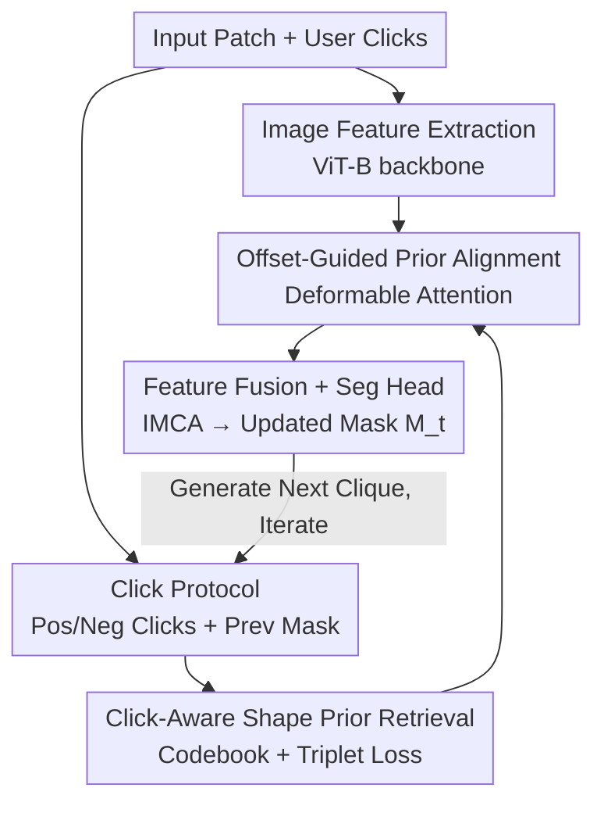

# Learning and Aligning Click-Aware Shape Prior for Interactive Amodal Instance Segmentation

**Conference**: CVPR 2026  
**Paper**: [CVF Open Access](https://openaccess.thecvf.com/content/CVPR2026/html/Chen_Learning_and_Aligning_Click-Aware_Shape_Prior_for_Interactive_Amodal_Instance_CVPR_2026_paper.html)  
**Code**: https://github.com/chenbys/ClickPriorNet (Yes)  
**Area**: Image Segmentation / Interactive Segmentation  
**Keywords**: Amodal Segmentation, Interactive Segmentation, Shape Prior, triplet loss, Deformable Attention

## TL;DR
ClickPriorNet reformulates amodal instance segmentation (segmenting both visible and occluded regions) as an interactive task. Based on user clicks, the model retrieves complementary shape priors from a codebook using the "previous mask + current clicks" as a query and aligns these priors to the target instance via deformable attention. This approach achieves more complete amodal masks with fewer clicks across KINS, D2SA, and COCOA datasets.

## Background & Motivation

**Background**: Amodal instance segmentation requires models to segment not only the visible pixels of an object but also the parts occluded by other objects. This is critical for image editing, scene de-occlusion, and AR object placement. Since occluded regions lack direct visual evidence, prevailing methods introduce "reasoning support," such as modeling depth order (Zhang et al.), using category-specific shape prior codebooks (VRSP), or learning priors in a vector-quantized latent space (C2F-Seg).

**Limitations of Prior Work**: Existing methods treat shape priors as "fully automatic, one-off" support. However, **target instances during testing are often incompatible with the priors stored in the codebook**. Since codebooks are built from training instances, retrieved priors may be inappropriate for novel instances with unique shapes or severe occlusion, leading to misleading completions. Furthermore, the problems of how to retrieve priors precisely and how to align retrieved priors to the current instance remain inadequately addressed.

**Key Challenge**: Amodal completion is inherently ill-posed due to the lack of information in occluded areas. Purely relying on image features and fixed codebooks cannot eliminate ambiguity. Current retrieval methods use Euclidean distance in feature space to find the "most similar prior to the query," but **the most similar prior often provides redundant rather than complementary information**. The actual need is for a prior that can complete the specifically missing regions.

**Goal**: (1) Transform amodal segmentation into an interactive task where users specify the approximate range of occluded areas with a few clicks. (2) Design a framework capable of retrieving "complementary priors based on clicks" and "aligning priors to the instance."

**Key Insight**: User clicks possess dual value—they directly define the scope of occluded regions (positive clicks for foreground, negative for background) and serve as query signals to help retrieve more compatible shape priors. Consequently, clicks are fed into both the "retrieval" and "segmentation" pathways.

**Core Idea**: Use "previous mask + user clicks" for joint querying of the shape codebook, supervised by a triplet loss to ensure high IoU between retrieval results and the ground truth. Subsequently, use deformable attention to align the prior to the target instance—summarized as "click-aware retrieval + offset-guided alignment of shape priors."

## Method

### Overall Architecture

The model is named **ClickPriorNet**. The task follows the C2F-Seg setting: given a cropped image patch $x \in \mathbb{R}^{H_i \times W_i \times 3}$ containing a single instance, it predicts the amodal mask $M^a$ (visible + occluded). The interaction protocol follows MFP: up to $T \le 24$ rounds. In each round, a click $C^t$ is generated at the center of the largest connected mis-segmented region between the "previous mask $M^{t-1}$" and "ground truth $M^{gt}$." A positive click is generated if the false negative area is larger; otherwise, a negative click is generated. The first round starts with a zero mask and a positive click at the center.

The pipeline executes four steps in each interactive round: (a) A ViT-B backbone extracts image features $F^i \in \mathbb{R}^{H \times W \times C}$. (b) A pre-trained query encoder codes the "previous mask + clicks" into MC features $F^{mc}$, then retrieves $K$ shape priors $P \in \mathbb{R}^{d \times K}$ from the codebook. (c) Prior features $F^p$ and $F^{imc}$ ($F^i$ concatenated with $F^{mc}$) are processed by an alignment module using deformable attention to extract aligned features $F^a$. (d) $F^{imc}$ and $F^a$ are concatenated into IMCA features $F^{imca}$, which are fed into a segmentation head to obtain the updated mask $M^t$.

### Key Designs

**1. Interactive Amodal Segmentation and Click Protocol: Introducing user supervision to ill-posed completion**

Amodal completion is naturally ill-posed; with no pixel evidence in occluded areas, models must guess. This work suggests that rather than letting the model guess alone, users can provide the scope of occluded regions via clicks. The protocol follows standard interactive segmentation settings (consistent with MFP/RITM). Clicks $C^t \in \mathbb{R}^{H_i \times W_i \times 2}$ encode spatial hints that not only delineate occlusion boundaries but also serve as query signals for shape priors. Changing the task from "fully automatic" to "interactive" is the first contribution.

**2. Click-Aware Shape Prior Retrieval: Using triplet loss to pull "high-IoU complementary priors" near the query**

Methods like VRSP use Euclidean distance to find the "most similar" prior, which often provides redundant information. This work shifts the supervision objective: instead of seeking "similarity," it seeks "high IoU between retrieved priors and the ground truth."

A codebook is constructed by collecting ground truth (GT) masks of training instances. Each category has $K_s=1024$ slots. To retrieve, the **"previous mask $M^q$ + user clicks $C^q$" are jointly encoded** into a query vector:

$$v_q = E_q([M^q; C^q])$$

Supervision is provided via triplet loss: the top-$N$ slots with the highest IoU relative to the target $M^{gt}$ form the positive set $S^+$. Slots with $IoU < 0.8$ that are not in $S^+$ form the negative set $S^-$.

$$L_{triplet} = \sigma\!\left(\max_{i\in S^+}\lVert v_q - v_k^i\rVert - \min_{i\in S^-}\lVert v_q - v_k^i\rVert + \alpha\right)$$

This pulls priors with high GT IoU closer to the query, providing the model with priors that actually "fill in the blanks." This step contributed +9.69% to mIoUocc in ablation studies.

**3. Offset-Guided Shape Prior Alignment: Eliminating mismatch using deformable attention**

Retrieved priors often exhibit slight spatial mismatches (scale, pose, position) with the target instance. Deformable attention is used to adaptively align them. By predicting sampling offsets $\Phi$ and attention weights $A$:

$$[\Phi; A] = F_{deformatt}[F^{imc}; F^p]$$

Derived aligned features $F^a$ are calculated via:

$$F^a = \sum_{z=1}^{Z} W_z \left[\sum_{k=1}^{K} A_{z,k}\cdot W'_z\, F^p(P_{ref}+\Phi_{z,k})\right]$$

This allows the shape prior to be "corrected" based on image features and clicks before being used for segmentation, bridging the gap between retrieved priors and the specific instance.

### Loss & Training

The process involves two stages. **Pre-training stage**: Construct the codebook and train the query/key encoders using triplet loss. **Formal training stage**: Optimize the average segmentation loss over $T$ interaction rounds:

$$L_{full} = \frac{1}{T}\sum_t^{T} L_{seg}(M^t, M^{gt})$$

Normalized focal loss is used for $L_{seg}$. The backbone is ViT-B, and inputs are resized to $448 \times 448$.

## Key Experimental Results

Experiments used KINS, D2SA, and COCOA cls datasets, focusing on **occluded samples** (occlusion rate > 10%). Metrics include NoC (Number of Clicks to reach target mIoU) and mIoU (full/occ).

### Main Results

Comparison of NoC against interactive segmentation baselines (lower is better):

| Method | Backbone | KINS NoC80 | KINS NoC85 | KINS NoC90 | D2SA NoC90 | COCOA NoC90 |
|------|----------|-----------|-----------|-----------|-----------|-----------|
| MFP | ViT-B | 1.93 | 2.88 | 4.76 | 3.22 | 6.69 |
| MFP+C2F | ViT-B | 1.81 | 2.62 | 4.65 | 3.02 | 6.12 |
| **Ours** | ViT-B | **1.66** | **2.40** | **4.31** | **2.51** | **5.62** |

Comparison of mIoU under fixed clicks:

| Method | Clicks | KINS mIoUfull | KINS mIoUocc | D2SA mIoUocc | COCOA mIoUocc |
|------|------|--------------|-------------|-------------|--------------|
| MFP+C2F | 1 | 82.64 | 55.11 | 45.80 | 30.14 |
| **Ours** | 1 | **83.13** | **56.32** | **47.12** | **38.50** |
| MFP+C2F | 5 | 89.82 | 73.35 | 55.25 | 52.22 |
| **Ours** | 5 | **91.97** | **77.72** | **62.67** | **58.30** |

At 5 clicks, the advantage in mIoUocc reaches +4.37% (KINS), showing that the model leverages shape priors more effectively as clicks increase.

### Ablation Study

Evaluated on KINS at 3 clicks (mIoUocc):

| Row | Standard Prior | Click-Aware Prior | Prior Alignment | NoC85 ↓ | mIoUocc ↑ |
|-----|:---:|:---:|:---:|:---:|:---:|
| #1 | | | | 2.85 | 54.02 |
| #2 | √ | | | 2.73 | 58.17 |
| #3 | | √ | | 2.51 | 67.86 |
| #4 | | √ | √ | **2.40** | **73.16** |

### Key Findings
- **Click-aware retrieval is the primary driver**: Moving from standard priors (#2) to click-aware priors (#3) yields a +9.69% jump in mIoUocc, proving that "complementary retrieval" is more valuable than "similarity retrieval."
- **Alignment module provides refinement**: The alignment module adds another 5.3% mIoUocc, confirming that deformable attention effectively resolves spatial mismatches.
- **Superior performance with more clicks**: The gap between Ours and MFP+C2F widens as more clicks are provided.

## Highlights & Insights
- **Heuristic Switch**: Shifting the retrieval target from feature similarity to IoU using triplet loss directly addresses the "redundant information" problem in shape priors.
- **Dual-Purpose Clicks**: Clicks act as both segmentation boundaries and retrieval queries, integrating two traditionally separate mechanisms.
- **Prior Alignment**: Using deformable attention to "straighten" retrieved priors is more elegant and effective than simple concatenation.

## Limitations & Future Work
- **Computational Overhead**: Pre-training requires pre-storing masks and clicks for every training instance.
- **Semantic Ambiguity**: The model still struggles with cases where multiple identical instances are overlapping.
- **Category Dependence**: The codebook is category-specific, which might limit generalization to open-vocabulary or out-of-distribution classes.
- **Single-Instance Focus**: The current crops-only setup is one step away from end-to-end, multi-instance scene processing.

## Related Work & Insights
- **vs VRSP**: While both use codebooks, ClickPriorNet uses triplet loss for IoU-based retrieval and includes clicks in the query, whereas VRSP relies on Euclidean similarity.
- **vs C2F-Seg**: ClickPriorNet transforms the automatic C2F-Seg task into an interactive one, significantly outperforming it with even 1 click.
- **vs MFP/RITM**: While these handle interactive segmentation of visible parts, ClickPriorNet adapts their protocol to complete occluded regions using priors.

## Rating
- Novelty: ⭐⭐⭐⭐
- Experimental Thoroughness: ⭐⭐⭐⭐
- Writing Quality: ⭐⭐⭐⭐
- Value: ⭐⭐⭐⭐

<!-- RELATED:START -->

- **C2F-Seg**: Coarse-to-fine Amodal Segmentation with Global and Local Shape Priors (CVPR 2024)
- **VRSP**: Visual Reasoning with Shape Priors for Amodal Segmentation (ICCV 2023)
- **MFP**: Multi-round Fixed-Protocol for Interactive Segmentation Evaluation (ECCV 2022)

<!-- RELATED:END -->

## Related Papers

- [\[CVPR 2026\] Live Interactive Training for Video Segmentation](live_interactive_training_for_video_segmentation.md)
- [\[CVPR 2026\] The Power of Prior: Training-Free Open-Vocabulary Semantic Segmentation with LLaVA](the_power_of_prior_training-free_open-vocabulary_semantic_segmentation_with_llav.md)
- [\[CVPR 2025\] Using Diffusion Priors for Video Amodal Segmentation](../../CVPR2025/segmentation/using_diffusion_priors_for_video_amodal_segmentation.md)
- [\[CVPR 2026\] VideoMaMa: Mask-Guided Video Matting via Generative Prior](videomama_mask-guided_video_matting_via_generative_prior.md)
- [\[CVPR 2026\] Universal 3D Shape Matching via Coarse-to-Fine Language Guidance](universal_3d_shape_matching_via_coarse-to-fine_language_guidance.md)

<!-- RELATED:END -->
