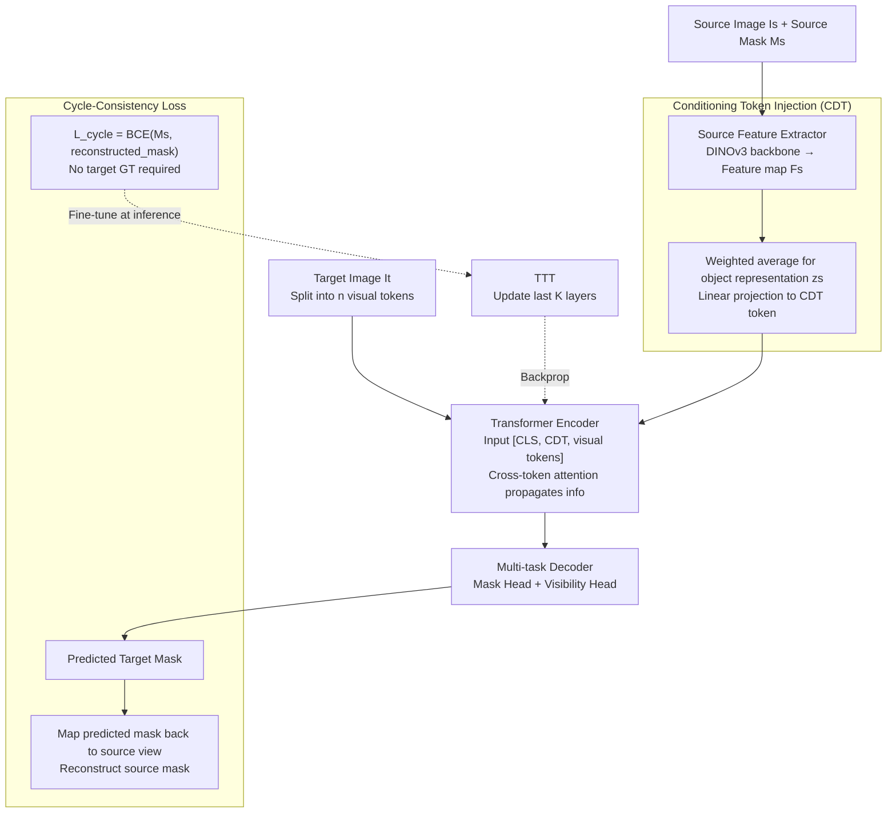

# Learning Cross-View Object Correspondence via Cycle-Consistent Mask Prediction

**Conference**: CVPR 2026  
**arXiv**: [2602.18996](https://arxiv.org/abs/2602.18996)  
**Code**: [GitHub](https://github.com/shannany0606/CCMP)  
**Area**: Segmentation / Cross-view Correspondence  
**Keywords**: Cross-view correspondence, Cycle consistency, Conditional segmentation, Test-time training, Egocentric vision

## TL;DR

Ours proposes CCMP, a cross-view object correspondence framework based on conditional binary segmentation. It utilizes cycle-consistency constraints to provide self-supervised signals and supports Test-Time Training (TTT), achieving SOTA performance of 44.57% mIoU on Ego-Exo4D.

## Background & Motivation

Cross-view visual correspondence, particularly between egocentric and exocentric views, is a core capability for Embodied AI. For instance, a service robot must locate objects in a third-person view based on first-person instructions from a wearer. This task faces three major challenges:

**Drastic appearance changes**: Egocentric views suffer from jitter, clutter, and motion blur, while exocentric views are stable but may lack detail.

**Significant spatial context differences**: The surroundings of an object vary completely across views, rendering background-based matching unreliable.

**Different temporal dynamics**: Object motion and deformation vary significantly across different camera viewpoints.

Prior methods either depend on auxiliary modules (ObjectRelator) or require pre-generated candidate masks (O-MaMa), leading to complex architectures and limited generalization.

## Method

### Overall Architecture

The framework is an end-to-end conditional binary segmentation model. Given a source image $I_s$, target image $I_t$, and source mask $M_s$, it predicts the mask $M_t$ for the corresponding object in the target view. The forward path consists of three parts: a Source Feature Extractor (ConvNeXt-based DINOv3-L) that extracts object features from the masked source image and projects them into a Conditioning Token (CDT); a Transformer Encoder (ViT-based DINOv3-L) that applies cross-token attention between the CDT and the visual tokens of the target image; and a Multi-task Decoder that outputs the target mask and predicts object visibility. A self-supervised cycle is added atop this path: the predicted mask is mapped back to the source view to reconstruct the source mask. The cycle-consistency loss ensures bidirectional consistency, serving as a supervision signal during training and driving Test-Time Training (TTT) during inference, which is the key to unifying training and inference.

### Key Designs

1.  **Conditioning Token (CDT)**: This addresses how to inject source object information into the target image encoding without significantly altering the pre-trained backbone. After features are extracted from the source image, a normalized mask $\tilde{M}_s$ is used for weighted averaging to obtain a compact object representation $z_s = \sum_{i,j} \tilde{M}_s[i,j] \cdot F_s[:,i,j]$. This is linearly projected into a single CDT token and concatenated with target visual tokens and the CLS token as $[\text{CLS}, \text{CDT}, x_1, \dots, x_n]$ for the Transformer encoder.

2.  **Cycle-Consistency Loss**: This is the core self-supervised signal. It constrains the round-trip from $M_s$ to predicted $\hat{M}_t$ and back to reconstructed $\hat{M}_s$. Crucially, this constraint does not require target-view GT masks, allowing the model to learn view-invariant representations based on consistency alone. Since it is label-independent, it can be utilized directly during the inference stage for TTT.

3.  **Test-Time Training (TTT)**: To address the distribution shift between training pairs and test pairs, the cycle-consistency loss is applied during inference. For each test pair, a few steps of fine-tuning are performed using $\mathcal{L}_{cycle}$. Ours updates only the last $K$ layers of the Transformer encoder for $T$ steps with a learning rate of $5 \times 10^{-6}$.

### Loss & Training

-   **Mask Loss**: $\mathcal{L}_{mask} = \mathcal{L}_{bce} + \lambda_{dice}\mathcal{L}_{dice}$, where $\lambda_{dice}=5$.
-   **Auxiliary Loss**: $\mathcal{L}_{aux}$ applies the same mask loss to the second-to-last Transformer output (deep supervision).
-   **Total Loss**: $\mathcal{L}_{total} = \mathcal{L}_{mask} + \lambda_{aux}\mathcal{L}_{aux} + \lambda_{cycle}\mathcal{L}_{cycle}$, where $\lambda_{aux}=1, \lambda_{cycle}=10$.
-   Training Strategy: Stage 1 freezes the backbone for 64K iterations; Stage 2 performs full fine-tuning for 640K iterations.

## Key Experimental Results

### Main Results

| Dataset | Metric | Ours | Prev. SOTA | Gain |
| :--- | :--- | :--- | :--- | :--- |
| Ego-Exo4D (Exo Query) | IoU | **47.18** | 44.08 (O-MaMa) | +3.10 |
| Ego-Exo4D (Ego Query) | IoU | 41.95 | 42.57 (O-MaMa) | -0.62 |
| Ego-Exo4D | mIoU | **44.57** | 43.32 (O-MaMa) | +1.25 |
| HANDAL-X (Zero-shot) | IoU | **78.8** | 42.8 (ObjectRelator) | +36.0 |

### Ablation Study

| Configuration | Ego-IoU | Exo-IoU | mIoU | Note |
| :--- | :--- | :--- | :--- | :--- |
| Full Model | 41.95 | 47.18 | **44.57** | All components |
| w/o $\mathcal{L}_{cycle}$ | 40.28 | 45.82 | 43.05 | Cycle consistency is critical |
| w/o TTT | 41.79 | 44.18 | 42.99 | TTT Gain: +1.58 |

### Key Findings

-   **Ego Query** is generally more difficult than Exo Query because the target object in the exocentric view is often smaller and the environment is more cluttered.
-   Generalist segmentation models like SEEM and PSALM perform poorly (IoU < 10%), highlighting the necessity of cross-view specific training.
-   Zero-shot performance on HANDAL-X (78.8%) far exceeds all baselines, demonstrating strong cross-domain generalization after training on Ego-Exo4D.

## Highlights & Insights

-   **Minimalist Design**: Superior performance is achieved by introducing only one CDT token and a cycle-consistency loss, requiring minimal architectural changes.
-   **Unified Training and Inference**: The cycle-consistency loss serves as supervision during training and drives adaptation during TTT.
-   **First Application of TTT**: This is the first successful application of the TTT strategy to cross-view correspondence, providing consistent improvements.

## Limitations & Future Work

-   Ego Query performance slightly trails O-MaMa; segmentation of small objects in exocentric views still has room for improvement.
-   TTT requires extra gradient update steps during inference, increasing latency.
-   Visibility prediction (CLS Head) uses a post-training strategy separate from the main model, which may limit joint optimization effects.

## Related Work & Insights

-   **O-MaMa**: A mask-matching method that relies on FastSAM for candidates; ours is a more concise end-to-end approach.
-   **ObjectRelator**: Uses vision and language cues with a complex architecture; our vision-only solution generalizes better.
-   **TTT Family**: Following Sun et al. (2020, 2024), this work extends TTT from classification to cross-view tasks.

## Rating

-   Novelty: ⭐⭐⭐⭐
-   Experimental Thoroughness: ⭐⭐⭐⭐
-   Writing Quality: ⭐⭐⭐⭐
-   Value: ⭐⭐⭐⭐

<!-- RELATED:START -->

## Related Papers

- [\[CVPR 2026\] V²-SAM: Marrying SAM2 with Multi-Prompt Experts for Cross-View Object Correspondence](v2-sam_marrying_sam2_with_multi-prompt_experts_for_cross-view_object_corresponde.md)
- [\[CVPR 2026\] VGGT-Segmentor: Geometry-Enhanced Cross-View Segmentation](vggt-segmentor_geometry-enhanced_cross-view_segmentation.md)
- [\[CVPR 2026\] Cross-Domain Few-Shot Segmentation via Multi-view Progressive Adaptation](cross-domain_few-shot_segmentation_via_multi-view_progressive_adaptation.md)
- [\[CVPR 2026\] FoV-Net: Rotation-Invariant CAD B-rep Learning via Field-of-View Ray Casting](fov-net_rotation-invariant_cad_b-rep_learning_via_field-of-view_ray_casting.md)
- [\[CVPR 2025\] V-CLR: View-Consistent Learning for Open-World Instance Segmentation](../../CVPR2025/segmentation/v-clr_view-consistent_learning_for_open-world_instance_segmentation.md)

<!-- RELATED:END -->
