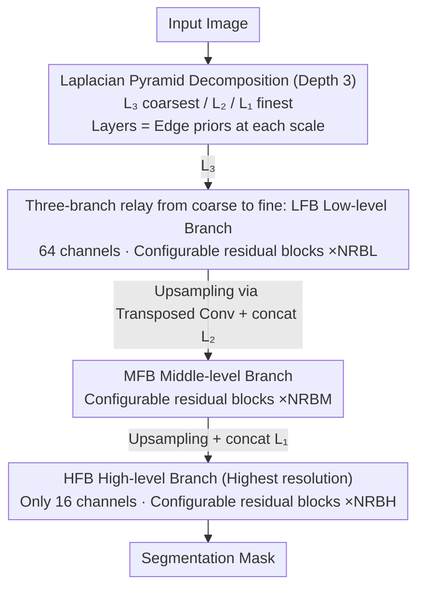

# LEMMA: Laplacian Pyramids for Efficient Marine Semantic Segmentation

**Conference**: CVPR 2026  
**arXiv**: [2603.25689](https://arxiv.org/abs/2603.25689)  
**Code**: None  
**Area**: Semantic Segmentation  
**Keywords**: Lightweight Semantic Segmentation, Laplacian Pyramid, Marine Semantic Segmentation, Edge Detection, Unmanned Surface Vehicle (USV)

## TL;DR

LEMMA is proposed as a lightweight marine semantic segmentation model based on Laplacian pyramids. By extracting edge information through pyramid decomposition to replace deep feature calculations, it achieves SOTA-level segmentation accuracy (98.97% mIoU on MaSTr1325) while reducing the parameter count by 71x.

## Background & Motivation

Semantic segmentation in marine environments is crucial for the autonomous navigation of Unmanned Surface Vehicles (USVs) and coastal Earth observation (e.g., oil spill detection). However, existing methods (such as WaSR-T, DeepLabv3, etc.) typically rely on deep CNN or Transformer architectures, which entail tens or hundreds of millions of parameters and high computational overhead, making them difficult to run in real-time on resource-constrained edge devices like UAVs and USVs.

The **Key Challenge** lies in the fact that marine scenarios require high-precision segmentation (for low-contrast areas like water surface reflections and thin oil films), yet the deployment platforms (UAVs/USVs) have extremely limited computing power. Existing methods fail to balance accuracy and efficiency—while WaSR-T achieves 99.80% mIoU, it requires 71.4M parameters and 133.8 GFLOPs.

The **Key Insight** of this work is to utilize the edge information naturally provided by Laplacian pyramid decomposition. Layers of the pyramid contain edge details at different resolutions, which can be injected at the early stages of feature extraction. this avoids expensive feature map calculations in deep networks. **Core Idea**: Replace deep feature extraction with Laplacian pyramid edge priors to achieve both lightweight design and high precision.

## Method

### Overall Architecture

The goal of LEMMA is to handle marine segmentation challenges, where low-contrast edges like water reflections and oil spills must be identified on power-constrained UAV/USV platforms. The **Mechanism** involves moving "edge extraction" from the depths of the network to the input stage—first decomposing the image into high-frequency details at various resolutions using a Laplacian pyramid, and then letting the network focus on refining and fusing these existing edges rather than learning them from scratch.

Specifically, the input image is decomposed into a Laplacian pyramid of depth 3: $L_1, L_2, L_3$ (where $L_3$ has the lowest resolution and $L_1$ the highest). Three branches process these in a relay fashion: the Low-level Feature Branch (LFB) first takes the coarsest $L_3$; the Middle-level Feature Branch (MFB) concatenates $L_2$ with the output of LFB for further refinement; the High-level Feature Branch (HFB) merges $L_1$ with features from the previous two branches to generate the segmentation mask at the highest resolution. Branches use concatenation to align coarse-scale semantics with fine-scale edges, and transposed convolutions to upsample low-resolution features. The entire network lacks a deep backbone, compressing the parameter count to the 1M range.

### Key Designs

**1. Laplacian Pyramid Decomposition: Injecting edge priors directly to eliminate deep learning overhead**

In marine scenes, distinguishing water, obstacles, and oil spills depends almost entirely on edges and high-frequency textures. Conventional approaches stack backbones with tens of millions of parameters to slowly learn these edges in deep layers, incurring massive computational costs. Conversely, LEMMA uses Laplacian pyramids to extract multi-scale edges at the input stage. Each layer is a residual of "the original image minus the upsampled Gaussian blur," naturally storing high-frequency details. This acts as a free edge prior. The network receives multi-scale edge maps instead of raw RGB, removing the need for depth to achieve edge representation, which is why it maintains accuracy at 1M parameters. An additional benefit is that the pyramid extracts high frequencies, implicitly suppressing low-frequency illumination drifts like sun glint and water reflections.

**2. Coarse-to-Fine Three-branch Relay (LFB/MFB/HFB): Optimizing the channel budget**

Pyramids alone are insufficient; the challenge is fusing three edge layers into a clean mask without exploding the computation at high resolutions. LEMMA lets branches relay from low to high resolution: LFB uses a wider 64-channel setup on the coarsest $L_3$ (where computation is cheap due to low resolution), MFB handles the intermediate scale, and for HFB—the most computationally expensive stage—channels are slashed to 16. Since GFLOPs correlate with channel counts on high-resolution maps, keeping width for small images and using narrow channels for large images avoids the costliest overhead. Experiments confirm 16 channels are sufficient for mask reconstruction at the highest resolution. Concatenation is used instead of addition to preserve edge information without dilution.

**3. Configurable Residual Block Chains: Adjusting the accuracy/parameter balance per dataset**

Different marine perspectives (ground-level USV vs. aerial UAV) present different challenges. LEMMA uses a configurable number of residual blocks ($NRBL / NRBM / NRBH$) in each branch rather than a fixed depth. Each block follows a standard conv–LeakyReLU–conv structure with a residual connection. Optimal configurations are tuned per dataset via ablation: 7/7/1 for MaSTr1325 and 6/7/4 for Oil Spill. Notably, using only 1 block for HFB on MaSTr1325 suggests that "light processing" is sufficient at high resolutions; depth gains are primarily realized in low-to-medium resolution branches.

### Loss & Training

- Focal Loss is used as the loss function, outperforming Dice Loss and CE+Dice combinations on both datasets.
- Adam optimizer is employed with a batch size of 8 for 300 epochs.
- Training was conducted on an NVIDIA TESLA P100; inference was tested on an NVIDIA 2080 and an Intel 4-core XEON CPU.

## Key Experimental Results

### Main Results

| Dataset | Metric | Ours (LEMMA) | Prev. SOTA | Gain |
|--------|------|------|----------|------|
| MaSTr1325 | mIoU | 98.97% | 99.91% (BEMRF-Net) | -0.94% (but 71x fewer params) |
| MaSTr1325 | Parameters | 1.07M | 71.4M (WaSR-T) | 66.7x Reduction |
| MaSTr1325 | GFLOPs | 17.83 | 156.0 (BEMRF-Net) | 88.5% Reduction |
| MaSTr1325 | Inference Time | 7.3ms | 47.55ms (DeepLabv3) | 84.65% Reduction |
| Oil Spill | mIoU | 93.42% | 92.66% (R-GSSNet) | +0.76% |
| Oil Spill | Parameters | 1.01M | 62.6M (R-Segformer) | 62x Reduction |

### Ablation Study

| Configuration | Key Metric | Description |
|------|---------|------|
| Residual blocks 7/7/1 (MaSTr1325) | mIoU 98.96% | Optimal config; increasing HFB blocks reduces performance |
| Residual blocks 6/7/4 (Oil Spill) | mIoU 93.42% | Optimal config |
| Focal Loss vs Dice Loss | 98.97% vs 98.72% | Focal Loss performed best on both datasets |
| Focal Loss vs CE+Dice | 98.97% vs 98.86% | Verified the advantage of Focal Loss |

### Key Findings

- LEMMA performs comparably to models with tens of millions of parameters (e.g., WaSR-T's 71.4M) while using only ~1M parameters.
- The model excels across distinct viewpoints: ground-level USV (MaSTr1325) and aerial UAV (Oil Spill), demonstrating cross-platform robustness.
- 16 channels in the HFB are sufficient for high-resolution mask reconstruction, a key design for minimizing computation.
- Laplacian pyramids implicitly suppress low-frequency illumination drifts like sun glint and water surface reflections.

## Highlights & Insights

- Combines traditional image processing (Laplacian pyramids) with deep residual networks, using physical priors to reduce the learning burden.
- Extreme lightweighting: 1M parameters achieve near-SOTA accuracy, suitable for real-time deployment on resource-constrained UAV/USV devices.
- High versatility: A single architecture is applicable to both USV obstacle detection and aerial oil spill segmentation.
- No ImageNet pre-training required; high performance is achieved training from scratch.

## Limitations & Future Work

- Environmental factors like reflections, waves, and glare can degrade the quality of the Laplacian pyramid, leading to failures (the paper includes cases of reflection-induced failure).
- Current implementation uses a fixed number of pyramid levels and static residual block configurations; future work could explore adaptive pyramid depth allocation.
- Dataset scales are limited (MaSTr1325 has 1325 images, Oil Spill has 847), making it difficult to verify generalization in large-scale scenarios.
- A ~1% accuracy gap remains compared to the most powerful models like WaSR-T.

## Related Work & Insights

- **vs WaSR-T**: WaSR-T uses Transformers to reach 99.80% mIoU but needs 71.4M parameters; LEMMA reaches 98.97% with 1.07M, increasing efficiency by orders of magnitude.
- **vs DeepLabv3**: DeepLabv3 requires 48M parameters and 123 GFLOPs for 97.67% mIoU; LEMMA outperforms it with 1/45th of the parameters.
- **vs LETNet**: As a fellow lightweight model, LETNet achieves 83.18% mIoU; LEMMA improves this by nearly 16 percentage points with similar parameter counts (1.07M vs. 0.94M).
- **Insight**: Integrating traditional CV techniques (pyramids, edge detection) with deep learning can achieve extreme lightweighting in specific domains.

## Rating

- Novelty: ⭐⭐⭐ While Laplacian pyramids for segmentation are not entirely new, the application to marine scenes and the three-branch design are innovative.
- Experimental Thoroughness: ⭐⭐⭐⭐ Covering two datasets, numerous baselines, and detailed ablation studies.
- Writing Quality: ⭐⭐⭐⭐ Clear structure, well-defined motivation, and robust experimental analysis.
- Value: ⭐⭐⭐⭐ High practical value for marine segmentation deployment on edge devices.

<!-- RELATED:START -->

## Related Papers

- [\[CVPR 2026\] Differentiable Laplacian Matrix Guided Superpixel Segmentation](differentiable_laplacian_matrix_guided_superpixel_segmentation.md)
- [\[CVPR 2026\] MARIS: Marine Open-Vocabulary Instance Segmentation](maris_marine_open-vocabulary_instance_segmentation.md)
- [\[CVPR 2025\] HFP-SAM: Hierarchical Frequency Prompted SAM for Efficient Marine Animal Segmentation](../../CVPR2025/segmentation/hfp-sam_hierarchical_frequency_prompted_sam_for_efficient_marine_animal_segmenta.md)
- [\[CVPR 2026\] Annotation-Efficient Coreset Selection for Context-dependent Segmentation](annotation-efficient_coreset_selection_for_context-dependent_segmentation.md)
- [\[CVPR 2026\] Efficient Video Object Segmentation and Tracking with Recurrent Dynamic Submodel](efficient_video_object_segmentation_and_tracking_with_recurrent_dynamic_submodel.md)

<!-- RELATED:END -->
