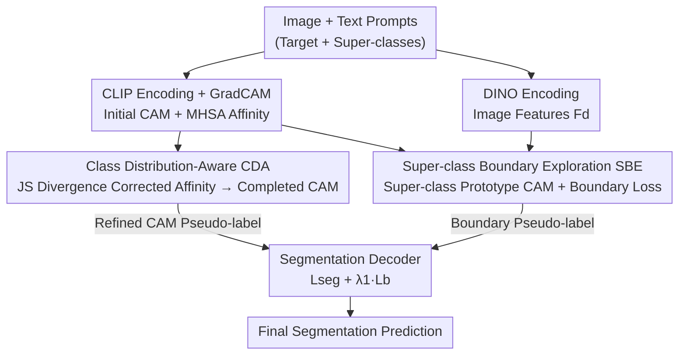

# Leveraging Class Distributions in CLIP for Weakly Supervised Semantic Segmentation

**Conference**: CVPR 2026  
**Paper**: [CVF Open Access](https://openaccess.thecvf.com/content/CVPR2026/html/Yang_Leveraging_Class_Distributions_in_CLIP_for_Weakly_Supervised_Semantic_Segmentation_CVPR_2026_paper.html)  
**Code**: Available (The paper states "Code is available here", but no specific URL is provided)  
**Area**: Semantic Segmentation / Weakly Supervised / CLIP  
**Keywords**: Weakly Supervised Semantic Segmentation, CLIP, CAM, Class Distribution, JS Divergence

## TL;DR
Addressing the "under-activation" issue in CLIP-generated CAMs caused by inaccurate MHSA affinity, CD-CLIP identifies that "patches of the same class exhibit highly similar probability distributions across all classes." It constructs Class Distribution-Aware (CDA) affinity using JS divergence to complete the foreground. Furthermore, it introduces Super-class Boundary Exploration (SBE) using DINO-based super-class prototype CAMs to suppress over-activation through boundary supervision. This single-stage approach achieves 82.5% mIoU on PASCAL VOC and 54.1% mIoU on MS COCO.

## Background & Motivation
**Background**: Image-level Weakly Supervised Semantic Segmentation (WSSS) utilizes low-cost annotations indicating only which classes are present. The core pipeline involves generating Class Activation Maps (CAMs) via a classification network as pseudo-labels to train a segmentation decoder. Recent trends leverage CLIP, pre-trained on 400 million image-text pairs, to generate CAMs and use Multi-Head Self-Attention (MHSA) weights from the ViT encoder to construct semantic affinity between patches. This affinity refinement expands activations from "most discriminative regions" to the entire object.

**Limitations of Prior Work**: The authors observe that MHSA-derived affinity often fails to establish reliable "intra-class" relationships. Two patches belonging to the same object class might be judged as weakly correlated by the affinity, leading to **under-activation** of the target class in the CAM (e.g., the head region of a "person" remaining unactivated). Since affinity diffusion assumes "similar patches are strongly connected," inaccurate similarity measures amplify errors during refinement.

**Key Challenge**: Previous methods focus solely on the "activation value of the target class channel" to determine if two patches belong to the same category. However, patches within the same class can have vastly different responses for that target class (one high, one low), making the target class activation alone insufficient for intra-class relationship determination.

**Key Insight**: The authors made a crucial observation (Fig. 1b): while two foreground patches may differ in their response to the target class, their **entire probability distribution across all classes** is highly similar. That is, the full distribution (e.g., "this patch looks like a person, slightly like a motorbike, not like a boat...") characterizes semantic identity more reliably than a single score. Measuring the similarity of these distributions via Jensen-Shannon (JS) divergence identifies intra-class relationships more effectively.

**Core Idea**: Use "distribution similarity across all classes" instead of "target class activation or MHSA affinity" to determine patch relationships, thereby correcting the affinity and completing the CAM. Simultaneously, introduce DINO super-class prototypes to provide boundary supervision to suppress over-activation resulting from the completion process.

## Method

### Overall Architecture
CD-CLIP is a **single-stage** framework: images are fed simultaneously into a frozen CLIP image encoder and a DINOv2 encoder. On the text side, prompts for "target classes + designed super-classes (e.g., vehicle, animal)" are fed into the CLIP text encoder. An initial CAM $M_{init}^c$ and MHSA affinity $A_{init}$ are generated based on image-text similarity. Two sequential modules follow: the **CDA module** corrects $A_{init}$ into a more accurate CDA affinity $A_d$ using class distribution similarity, which then refines the CAM. To address boundary over-activation at the intersection of different target classes, the **SBE module** generates "super-class prototype CAMs" using DINO features, providing precise boundary supervision via a boundary enhancement loss only for predictions involving multiple super-classes. The final decoder output is supervised by both refined CAM pseudo-labels and super-class boundary pseudo-labels.

### Key Designs

**1. Class Distribution-Aware (CDA) Affinity: Correcting MHSA Errors with Full Distribution Similarity**

This design directly addresses the under-activation caused by unreliable intra-class relationships in MHSA affinity. Instead of using point activations, it estimates a **full class distribution** for each patch. Specifically, an attention map $S_a = \mathrm{Min\text{-}max}(\mathrm{CosSim}(F, T_{all}))$ is calculated between image features $F$ and all text features $T_{all} \in \mathbb{R}^{|C+N| \times d}$ (target + super-classes). Super-classes are included to enrich the distribution representation. JS divergence then measures the distribution similarity between any two patches:

$$S_d = \frac{1 - D_{JS}\big(\mathrm{Softmax}(S_a) \,\|\, \mathrm{Softmax}(S_a)^{\mathrm{T}}\big)}{\tau}$$

Where Softmax converts attention to probabilities and $D_{JS}$ is the symmetric JS divergence (lower values imply higher similarity). $S_d$ is used to correct the initial affinity: $A_d = \mathrm{Softmax}(S_d) \cdot A_{init}$. The CAM is then refined: $M_{re}^c = M_{init}^c \cdot (A_d)^t$. This is effective because distribution similarity is robust to varying response levels within the same class—as long as patches "look similar" across all categories, they are strongly connected, activating weak regions like heads or limbs.

**2. Super-class Boundary Exploration (SBE): Precise Boundary Supervision via DINO Super-class Prototypes**

While CDA establishes intra-class relationships, it may cause **over-activation at boundaries** between different target classes. SBE mitigates this using DINO features, which excel at "super-class level region segmentation" but lack class labels. SBE uses the super-class CAMs $M_s^n$ from CLIP as masks to perform Class-Aware Pooling (CAP) on DINO features $F_d$, obtaining super-class prototypes $f_s^n = \mathrm{CAP}(M_s^n \odot F_d)$. Similarity between these prototypes and DINO patches yields prototype CAMs $M_p^n = \mathrm{ReLU}(\mathrm{CosSim}(f_s^n, F_d))$, which provide more accurate boundaries. These are converted into boundary pseudo-labels $Y_s$ to supervise intersections.

**3. Selective Boundary Supervision by Super-class Count**

Enforcing boundary loss on all images introduces noise, especially when no "cross-super-class boundaries" exist. SBE determines which super-classes are present in a prediction (e.g., 'cat' → 'animal'). Given the set of predicted super-classes $C_p$, the Dice loss is applied only when $|C_p| \ge 2$:

$$\mathcal{L}_b = \begin{cases} \mathrm{Dice}(P, Y_s), & |C_p| \ge 2 \\ 0, & \text{otherwise} \end{cases}$$

Ablations (Table 4) show that applying $L_b$ to single-super-class images ($|C_p|=1$) yields only a 0.2% gain, whereas applying it to multi-super-class images ($|C_p| \ge 2$) reaches 81.6% mIoU.

### Loss & Training
The total objective is $\mathcal{L} = \mathcal{L}_{seg} + \lambda_1 \mathcal{L}_b$ with $\lambda_1 = 0.6$. Frozen ViT-Base-16 and DINOv2-ViT-Base-14 are used as backbones. The decoder follows the lightweight transformer structure of WeCLIP. Optimization uses AdamW (LR 2e-5, WD 0.01). PASCAL VOC images are cropped to 320×320 (308×308 for DINO) with batch size 4 for 30k steps; MS COCO uses batch size 8 for 80k steps. Inference includes DenseCRF and {1.0, 1.5} multi-scale testing.

## Key Experimental Results

### Main Results
On PASCAL VOC 2012, the single-stage framework achieves 82.5% / 82.4% mIoU (val/test), outperforming the WeCLIP baseline by 6.1% / 5.2% and significantly surpassing multi-stage methods.

| Dataset | Method | Type | Val | Test |
| :--- | :--- | :--- | :--- | :--- |
| VOC 2012 | WeCLIP (Baseline, CVPR'24) | Single-stage | 76.4 | 77.2 |
| VOC 2012 | ExCEL (CVPR'25) | Single-stage | 78.4 | 78.5 |
| VOC 2012 | S2C (CVPR'24, SAM) | Multi-stage | 78.2 | 77.5 |
| VOC 2012 | **CD-CLIP (Ours)** | Single-stage | **82.5** | **82.4** |
| COCO 2014 | WeCLIP (CVPR'24) | Single-stage | 47.1 | — |
| COCO 2014 | ExCEL (CVPR'25) | Single-stage | 50.3 | — |
| COCO 2014 | **CD-CLIP (Ours)** | Single-stage | **54.1** | — |

On MS COCO 2014, it reaches 54.1% mIoU, outperforming ExCEL by 3.8% and SeCo by 7.4%.

### Ablation Study
Module-level ablation (Table 3, 'M' = CAM mIoU, 'Seg.' = Segmentation mIoU):

| Configuration | CAM (M) | Seg. | Description |
| :--- | :--- | :--- | :--- |
| No CAM refinement (#0) | 70.1 | 68.8 | Baseline |
| CAA (#1) | 73.2 | 72.8 | Affinity with region constraint masks |
| RFM (#2) | 77.4 | 76.1 | Refinement module from WeCLIP |
| CDA (#3) | 80.3 | 80.2 | CDA alone shows largest CAM improvement |
| CDA + CAA (#4) | 76.8 | 76.4 | Conflict between CAA masks and CDA |
| CDA + RFM (#5) | 80.1 | 80.2 | Synergy with RFM |
| CDA + SBE (#6 Full) | 80.8 | 81.6 | Further gain in segmentation with SBE |

Boundary supervision selection (Table 4): No $L_b$ yields 80.2; $|C_p|=1$ only yields 80.4 (+0.2); $|C_p| \ge 2$ only yields 81.6; both together drop to 81.4.

### Key Findings
- **CDA is the primary contributor**: It raises CAM mIoU from 70.1 to 80.3, proving that "full class distribution similarity" completes the foreground better than target activations.
- **SBE primarily boosts segmentation quality**: From #3 to #6, CAM mIoU changes slightly (80.3 to 80.8), but segmentation mIoU rises from 80.2 to 81.6, confirming its role in boundary refinement rather than activation expansion.
- **Boundary supervision must be selective**: Applying $L_b$ only to images with cross-super-class boundaries ($|C_p| \ge 2$) is critical.
- **Super-class granularity matters**: 5 categories ($D_s$) work best (81.6); 4 are too coarse (81.1), and 7 introduce misaligned classes (81.0).

## Highlights & Insights
- **"Looking at the distribution" vs. "point activation"**: This core insight is powerful. By switching the criterion from a single scalar to a full distribution using JS divergence, the method bypasses unreliable MHSA affinity. This "marginal distribution similarity" logic is transferable to other WSSS tasks.
- **Complementary Contrast (CDA vs. SBE)**: CDA expands activations (potentially over-activating), while SBE uses DINO knowledge to retract boundaries. Using the structural strength of DINO to patch the boundary weakness of CLIP is a practical cross-model paradigm.
- **Dual-use of Super-classes**: Super-classes enrich the distribution for CDA and guide prototype generation for SBE, providing a dual-purpose design.

## Limitations & Future Work
- **Reliance on manual super-class sets**: $D_s$ must be defined manually per dataset. Automating this for open-vocabulary scenarios remains a challenge.
- **Multi-backbone overhead**: Running frozen CLIP and DINOv2 backbones plus multi-scale inference and DenseCRF increases computational and memory costs.
- **Selective Supervision limit**: In scenes dominated by single objects, SBE's contribution is naturally limited since $|C_p| \ge 2$ is rarely satisfied.

## Related Work & Insights
- **vs. WeCLIP**: WeCLIP uses frozen CLIP + RFM. This work replaces the refinement core with CDA and adds DINO-based SBE, improving VOC results from 76.4 to 82.5 (+6.1).
- **vs. ExCEL (CVPR'25)**: While ExCEL uses LLMs to aid WSSS, this method achieves higher performance (VOC +4.1, COCO +3.8) using purely geometric and distributional priors.
- **vs. Multi-stage methods**: CD-CLIP's single-stage approach surpasses complex multi-stage methods (e.g., +8.0% over CPAL), proving structural simplicity can coexist with SOTA results.

## Rating
- Novelty: ⭐⭐⭐⭐ Distribution similarity for relationship modeling is a fresh insight with strong evidence.
- Experimental Thoroughness: ⭐⭐⭐⭐ Strong SOTA results across datasets and comprehensive ablations.
- Writing Quality: ⭐⭐⭐⭐ Clear motivation supported by illustrative examples.
- Value: ⭐⭐⭐⭐ Strong results and a reusable logic for refining CLIP-based affinity.

<!-- RELATED:START -->

## Related Papers

- [\[CVPR 2026\] Beyond Text: Visual Description Assembly by Probabilistic Model for CLIP-based Weakly Supervised Semantic Segmentation](beyond_text_visual_description_assembly_by_probabilistic_model_for_clip-based_we.md)
- [\[CVPR 2026\] Frequency-Aware Affinity for Weakly Supervised Semantic Segmentation](frequency-aware_affinity_for_weakly_supervised_semantic_segmentation.md)
- [\[AAAI 2026\] SSR: Semantic and Spatial Rectification for CLIP-based Weakly Supervised Segmentation](../../AAAI2026/segmentation/ssr_semantic_and_spatial_rectification_for_clip-based_weakly_supervised_segmenta.md)
- [\[CVPR 2025\] Exploring CLIP's Dense Knowledge for Weakly Supervised Semantic Segmentation](../../CVPR2025/segmentation/exploring_clips_dense_knowledge_for_weakly_supervised_semantic_segmentation.md)
- [\[CVPR 2026\] DeBias-CLIP: CLIP Is Shortsighted — Paying Attention Beyond the First Sentence](clip_shortsighted_beyond_first_sentence.md)

<!-- RELATED:END -->
## Related Papers

- [\[CVPR 2026\] Beyond Text: Visual Description Assembly by Probabilistic Model for CLIP-based Weakly Supervised Semantic Segmentation](beyond_text_visual_description_assembly_by_probabilistic_model_for_clip-based_we.md)
- [\[CVPR 2026\] Frequency-Aware Affinity for Weakly Supervised Semantic Segmentation](frequency-aware_affinity_for_weakly_supervised_semantic_segmentation.md)
- [\[AAAI 2026\] SSR: Semantic and Spatial Rectification for CLIP-based Weakly Supervised Segmentation](../../AAAI2026/segmentation/ssr_semantic_and_spatial_rectification_for_clip-based_weakly_supervised_segmenta.md)
- [\[CVPR 2025\] Exploring CLIP's Dense Knowledge for Weakly Supervised Semantic Segmentation](../../CVPR2025/segmentation/exploring_clips_dense_knowledge_for_weakly_supervised_semantic_segmentation.md)
- [\[CVPR 2026\] Hierarchical Action Learning for Weakly-Supervised Action Segmentation](hierarchical_action_learning_for_weakly-supervised_action_segmentation.md)

<!-- RELATED:END -->
