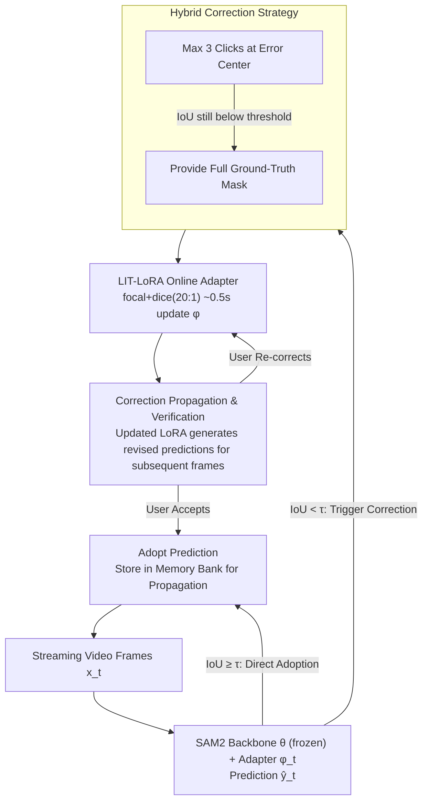

# Live Interactive Training for Video Segmentation

**Conference**: CVPR 2026  
**arXiv**: [2603.26929](https://arxiv.org/abs/2603.26929)  
**Code**: [Project Page](https://youngxinyu1802.github.io/projects/LIT/)  
**Area**: Segmentation / Video Object Segmentation  
**Keywords**: Interactive Video Segmentation, Online Learning, LoRA Adaptation, SAM2, User-Feedback Driven

## TL;DR

LIT (Live Interactive Training) proposes a framework that enables interactive vision systems (e.g., SAM2) to learn online from user corrections during inference. Its lightweight implementation, LIT-LoRA, generalizes user feedback to subsequent frames by updating LoRA modules in real-time. It reduces user corrections by 18-34% on challenging VOS benchmarks with a training overhead of only approximately 0.5 seconds.

## Background & Motivation

Interactive video segmentation models, represented by SAM2, still require substantial user intervention in complex scenarios (occlusions, object separation, camouflage, etc.). The **Core Problem** is that SAM2 treats user corrections only as immediate patches or stores them in a memory bank, while the model parameters remain frozen, preventing the model from truly learning and generalizing from these interactions. This leads to an inefficient cycle where users repeatedly correct the same type of errors—for example, cards separating might require 14 corrections.

Ideally, the system should learn from initial corrections to autonomously handle subsequent similar challenges. The **Key Challenge** is that correction signals provided by users contain rich domain adaptation information, but existing models use them only for instant prediction rather than model improvement.

The **Core Idea** of this work is to combine Parameter-Efficient Fine-Tuning (PEFT) with online learning to train lightweight LoRA modules in real-time during inference to internalize user feedback. This allows correction patterns to generalize to subsequent frames of the same video. This is a **user-feedback driven online learning paradigm**—conducted at inference time using human corrections (rather than pseudo-labels) as supervision signals.

## Method

### Overall Architecture

LIT addresses a specific goal: when annotating a video, an interactive segmentation model like SAM2 should not treat every user correction as a "disposable" fix. Instead, it should learn these corrections into a set of lightweight parameters while performing inference, so it can autonomously correct similar errors later. To achieve this, it treats the entire video as a streaming input $\{x_t\}_{t=1}^T$: the backbone parameters $\theta$ remain frozen, while a set of trainable lightweight adapters $\phi_t$ is attached. The model prediction is formulated as $\hat{y}_t = f_{\theta, \phi_t}(x_t)$. Once a user provides a correction $y_t^*$ for frame $t$, the adapter performs a gradient descent step on-site: $\phi_{t+1} \leftarrow \phi_t - \eta \nabla_{\phi_t} \mathcal{L}(f_{\theta,\phi_t}(x_t), y_t^*)$. The updated $\phi_{t+1}$ is immediately applied to subsequent frames. Adapters accumulate corrections within the same video and are re-initialized for new videos, preserving domain adaptation for the current target without carrying over biases from previous videos.

### Key Designs

**1. Hybrid Correction Strategy: Clicks first, followed by full mask if necessary**

The online learning loop starts with an error trigger—when the IoU of a frame falls below the threshold $\tau_{\text{IoU}}$, the system requests user correction. It follows a lightweight path first: up to 3 clicks at the error center for local repair. If the IoU remains below the threshold after clicking, a full ground-truth mask is provided. Clicks are suitable for minor errors at low cost, while full masks handle complex errors. This two-stage progression avoids the waste of providing a full mask initially while ensuring difficult frames are corrected, aligning with human habits in real annotation. This step determines the supervision signal for the adapter.

**2. LIT-LoRA Online Adapter: Transforming "Instant Fixes" into "Online Learning" with 35K parameters**

After obtaining a correction, the key is making the model remember it. SAM2 stores corrections in a memory bank but keeps parameters fixed, leading to repetitive clicks for similar errors. LIT injects a low-rank residual into every layer of the SAM2 mask decoder—changing the original projection $W_0$ to $W = W_0 + \Delta W$, where $\Delta W = BA$, $A \in \mathbb{R}^{r \times d}$, $B \in \mathbb{R}^{d \times r}$, and $rank=4$, adding only about 35K trainable parameters. For each correction, it trains on the frame for approximately 0.5 seconds using focal loss + dice loss (20:1 ratio) to embed the correction signal into $A$ and $B$. The updated adapter is applied to subsequent frames. Only the mask decoder is modified using low-rank residuals because the general features of the vision encoder must not be destroyed, and LoRA's minimal parameter count allows convergence within 0.5 seconds without significant latency or overfitting (direct fine-tuning of the decoder degrades performance, as seen in the ablation study).

**3. Correction Propagation & Verification: Automated propagation of corrections**

Learning alone is insufficient; the learned knowledge must reduce user effort. When a subsequent frame $F_{t'}$ fails, the system first generates a revised prediction $M_{t'}^{\mathcal{A}}$ using the updated LoRA for user review. If the user does not correct it (implicit acceptance), the prediction is adopted and stored in the memory bank to enhance further propagation. If the user identifies new errors and provides a correction, the LoRA performs an incremental update on that frame. This forms a closed loop of "Correction → Learning → User Verification → Acceptance/Re-correction," where each round either saves a manual correction or improves model capability, gradually eliminating repetitive errors.

### Loss & Training

Online training loss: $$\mathcal{L} = \lambda_{\text{focal}} \mathcal{L}_{\text{focal}} + \lambda_{\text{dice}} \mathcal{L}_{\text{dice}}$$

LoRA Configuration: rank=4, $\alpha=4$, dropout=0.1, learning rate $1 \times 10^{-4}$, 40 epochs per correction (with early stopping).

## Key Experimental Results

### Main Results

**Reduction in User Corrections ($\tau_{\text{IoU}}=0.5$):**

| Dataset | Original | LIT | Reduction Ratio |
|---------|----------|-----|-----------------|
| VOST | 27.43 | 18.24 | ↓33.51% |
| LVOSv2 | 33.59 | 14.83 | ↓23.35% |
| MOSEv2 | 31.48 | 22.49 | ↓18.22% |
| SA-V Val | 20.66 | 12.90 | ↓18.16% |
| SA-V Test | 20.90 | 13.09 | ↓22.35% |

**Reduction in Annotation Time ($\tau_{\text{IoU}}=0.5$):**

| Dataset | Original (min) | LIT (min) | Reduction Ratio |
|---------|----------------|-----------|-----------------|
| VOST | 18.42 | 12.91 | ↓29.94% |
| LVOSv2 | 14.83 | 11.86 | ↓20.03% |

**Generalization Across Models (VOST):**

| Model | Original | LIT | Reduction |
|-------|----------|-----|-----------|
| DAM4SAM | 34.60 | 22.46 | ↓35.09% |
| SAMURAI | 26.96 | 21.23 | ↓21.25% |

**Generalization Across Tasks (CLIP Image Classification):**

| Dataset | Original | LIT | Reduction |
|---------|----------|-----|-----------|
| CUB-200-2011 | 13.04 | 8.53 | ↓34.55% |
| Stanford Cars | 13.38 | 7.57 | ↓43.40% |
| SUN397 | 13.92 | 8.95 | ↓35.70% |

### Ablation Study

| Configuration | Corrections | Parameters | Description |
|---------------|-------------|------------|-------------|
| Original (No Adaptation) | 27.43 | — | Baseline |
| Replace original decoder | 32.47 | 35K | Direct fine-tuning degrades performance |
| LoRA (No continuous learning) | 21.43 | 35K | Training only on first correction is insufficient |
| LIT-FT (Full decoder) | 17.46 | 3.3M | Better but 100x parameters |
| LIT-LoRA (3 LoRAs) | 17.87 | 105K | Slightly better but increases cognitive load |
| **LIT-LoRA (Ours)** | **18.24** | **35K** | Best efficiency-effectiveness balance |

### Key Findings

- Correction counts follow a long-tail distribution: a few challenging videos consume most of the interaction budget, which is exactly where LIT-LoRA provides the highest gain.
- Direct fine-tuning of the original decoder causes overfitting and destroys stable representations (32.47 > 27.43), confirming the necessity of LoRA.
- Continuous learning (updating on every correction) is significantly better than training only on the first correction (18.24 vs 21.43).
- User studies (6 users × 7 videos) confirm a 41.92% reduction in corrections and a 23.04% reduction in time in real scenarios.

## Highlights & Insights

- The core insight is highly practical: existing interactive systems waste the generalization potential of user feedback by using it only as an instant fix.
- The framework is highly versatile—model-agnostic (SAM2/DAM4SAM/SAMURAI) and task-agnostic (VOS/Image Classification), demonstrating the universality of online adaptation.
- The extremely low overhead of 35K parameters and 0.5s training makes it truly deployable in actual annotation workflows.
- In-depth analysis of SAM2 predicted IoU reveals its unreliability as an automatic quality estimator, providing a valuable finding.

## Limitations & Future Work

- It relies on user monitoring to detect errors, as SAM2 lacks a reliable internal quality estimator (predicted IoU does not align with ground truth IoU).
- Experiments primarily use synthetic user corrections; real users may exhibit different correction strategies and behaviors.
- It requires the foundation model to have strong base generalization for the LoRA adapter to converge quickly.
- LoRA adapter capacity may be insufficient in adversarial scenarios (e.g., severe camouflage, tiny targets, extreme deformation).

## Related Work & Insights

- **vs. Native SAM2 Interaction**: SAM2 stores corrections in a memory bank without updating parameters; LIT-LoRA enables true learning through parameter updates.
- **vs. SAM2Long/SAMURAI**: These methods improve memory design or introduce motion cues but do not utilize user feedback for adaptation; LIT-LoRA can be used as an orthogonal solution.
- **vs. OSVOS/OnAVOS**: OSVOS fine-tunes on the first frame (TTT paradigm), while OnAVOS adapts continuously using pseudo-labels (CTTA paradigm). LIT-LoRA is more reliable by using real user feedback for continuous adaptation.
- **Insight**: The "learning from user feedback at inference time" paradigm can be extended to all interactive AI systems, such as interactive image editing and conversational AI.

## Rating

- Novelty: ⭐⭐⭐⭐ The idea of combining online learning with user interaction is clear and compelling, though the core techniques (LoRA + online fine-tuning) are not entirely new.
- Experimental Thoroughness: ⭐⭐⭐⭐⭐ Comprehensive evaluation across five VOS datasets, three classification datasets, three models, user studies, and detailed ablations.
- Writing Quality: ⭐⭐⭐⭐⭐ Precise problem definition, clear motivation, rigorous experimental design, and detailed supplementary materials.
- Value: ⭐⭐⭐⭐ Direct practical value for annotation workflows (18-34% reduction means hours saved), with strong framework universality.

## Related Papers

- [\[CVPR 2026\] Learning and Aligning Click-Aware Shape Prior for Interactive Amodal Instance Segmentation](learning_and_aligning_click-aware_shape_prior_for_interactive_amodal_instance_se.md)
- [\[CVPR 2026\] INSID3: Training-Free In-Context Segmentation with DINOv3](insid3_training-free_in-context_segmentation_with_dinov3.md)
- [\[ICLR 2026\] VIRTUE: Visual-Interactive Text-Image Universal Embedder](../../ICLR2026/segmentation/virtue_visual-interactive_text-image_universal_embedder.md)
- [\[CVPR 2026\] Exploring the Underwater World Segmentation without Extra Training](exploring_the_underwater_world_segmentation_without_extra_training.md)
- [\[CVPR 2026\] SAM2Text: Towards Prompt-Free and Multi-Resolution Video Scene Text Segmentation](sam2text_towards_prompt-free_and_multi-resolution_video_scene_text_segmentation.md)

<!-- RELATED:END -->

<!-- RELATED:START -->

## Related Papers

- [\[ICLR 2026\] Decomposed Attention Fusion in MLLMs for Training-free Video Reasoning Segmentation](../../ICLR2026/segmentation/decomposed_attention_fusion_in_mllms_for_training-free_video_reasoning_segmentat.md)
- [\[CVPR 2026\] Learning and Aligning Click-Aware Shape Prior for Interactive Amodal Instance Segmentation](learning_and_aligning_click-aware_shape_prior_for_interactive_amodal_instance_se.md)
- [\[CVPR 2026\] INSID3: Training-Free In-Context Segmentation with DINOv3](insid3_training-free_in-context_segmentation_with_dinov3.md)
- [\[ICLR 2026\] VIRTUE: Visual-Interactive Text-Image Universal Embedder](../../ICLR2026/segmentation/virtue_visual-interactive_text-image_universal_embedder.md)
- [\[CVPR 2026\] Exploring the Underwater World Segmentation without Extra Training](exploring_the_underwater_world_segmentation_without_extra_training.md)

<!-- RELATED:END -->
