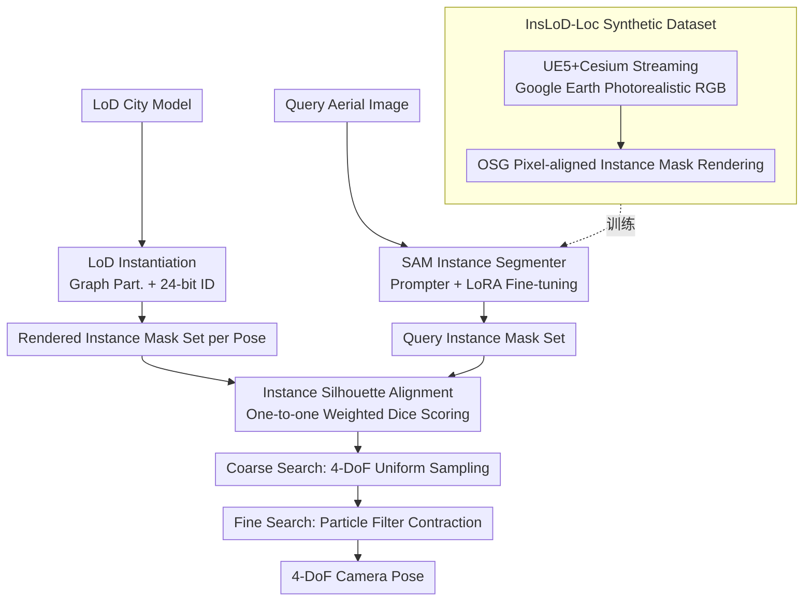

# LoD-Loc v3: Generalized Aerial Localization in Dense Cities using Instance Silhouette Alignment

**Conference**: CVPR 2026  
**arXiv**: [2603.19609](https://arxiv.org/abs/2603.19609)  
**Code**: [Project Page](https://nudt-sawlab.github.io/LoD-Locv3/)  
**Area**: Segmentation / UAV Localization  
**Keywords**: UAV localization, LoD city models, instance segmentation, synthetic data, silhouette alignment

## TL;DR
This paper proposes LoD-Loc v3, which addresses poor cross-scene generalization and pose ambiguity in dense cities for LoD-based UAV localization. By constructing a large-scale synthetic instance segmentation dataset (InsLoD-Loc) containing 100,000 images and upgrading the localization paradigm from semantic to instance silhouette alignment, it achieves a 2000% precision improvement (2m, 2°) on the dense Tokyo-LoDv3 scene compared to the previous SOTA.

## Background & Motivation
1. **Background**: Mainstream UAV visual localization methods depend on high-precision 3D reconstruction (SfM/photogrammetry). While accurate, these models are expensive to build and maintain, involve massive data volumes, and pose privacy/security risks. Localization based on Level-of-Detail (LoD) city models offers a lightweight alternative—LoD models retain only building geometry, follow CityGML standards, and have been widely developed in countries like the USA, China, Japan, and Germany.
2. **Limitations of Prior Work**: LoD-Loc v2 localizes by aligning building semantic segmentation silhouettes from images with silhouettes rendered from LoD models. However, it suffers from two key issues: (1) **Poor generalization**—performance drops significantly when a model trained in one city is deployed in another; (2) **Ambiguity in dense scenes**—in dense cities, semantic silhouettes of multiple buildings merge into a single mass, making semantic masks rendered from different poses highly similar and indistinguishable.
3. **Key Challenge**: Semantic segmentation only distinguishes "building" from "background," losing discriminative information in dense areas. Conversely, the instance-level arrangement of buildings under different poses is unique.
4. **Goal**: (1) Solve cross-scene generalization via large-scale synthetic data; (2) Resolve pose ambiguity in dense scenes via instance-level alignment.
5. **Key Insight**: Localization in cities is essentially an instance alignment process—it requires matching each visible building in the image to its corresponding building instance in the LoD model.
6. **Core Idea**: Use instance segmentation instead of semantic segmentation to extract building contours, and evaluate pose hypotheses through one-to-one instance matching using the Dice coefficient.

## Method

### Overall Architecture
LoD-Loc v3 aims to estimate the 4-DoF camera pose (longitude, latitude, altitude, and heading, assuming gravity direction is known) of a UAV aerial image within a geometry-only LoD city model. The pipeline consists of three steps: first, "instantiating" the LoD model by assigning a unique color ID to each building, so any pose rendering yields a color mask with instance distinction; second, using a SAM-adapted segmenter to extract individual building masks from the query image; finally, performing one-to-one silhouette alignment between rendered and image instances across the 4-DoF search space, with the highest score indicating the result. Pose search uses a coarse-to-fine approach—coarse search via uniform sampling and fine search via iterative contraction using particle filtering.

The core contribution is replacing "semantic silhouette alignment" with "instance silhouette alignment." Semantic alignment only separates "building/background," leading to indistinguishable masks in dense areas. Instance alignment treats each building as an individual entity whose relative arrangement is unique for each pose, thereby eliminating ambiguity.

### Key Designs

**1. InsLoD-Loc Synthetic Dataset: Achieving Zero-shot Cross-city Generalization with 100k Images**

LoD-Loc v2 failed when deployed across cities because real-world labeled data is expensive and narrow in coverage. This work bypasses real data with a two-stage synthetic pipeline: first, using the Cesium plugin in UE5 to stream Google Earth Photorealistic 3D Tilesets and AirSim to render realistic RGB aerial images; second, using the OSG engine to render instance masks from LoD models of the same area, ensuring strict alignment. Diversity across 6 countries, 40 flight areas, and various camera configurations ensures the model generalizes to unseen cities zero-shot.

**2. LoD Model Instantiation: Providing Unique Identities for Native Instance Rendering**

Since semantic segmentation outputs binary masks, one-to-one matching is impossible. The LoD model is first parsed into a graph $G=(V,E,F)$, where each independent building $B_i$ corresponds to a connected component $G_i$. Graph partitioning separates the model into $M$ disjoint building instances. Each is assigned a unique 24-bit RGB color ID. During rendering, colors serve as IDs, directly outputting instance masks without additional segmentation steps.

**3. SAM-based Building Instance Segmentation: Teaching SAM to Recognize Every Building**

Query images require individual masks for matching. While SAM has strong zero-shot capabilities, it requires prompts and does not automatically output "one instance per building." A learnable Prompter Module is added: the SAM encoder extracts features $F_{embed}$, from which the Prompter Module predicts prompt embeddings for the SAM decoder, yielding an instance mask set $\mathcal{S}_q = \{M_q^j\}_{j=1}^N$. During training, the SAM encoder is frozen and fine-tuned with LoRA, while the Prompter and decoder are updated to create an automatic building segmenter.

**4. Instance Silhouette Alignment Evaluation: Scoring Pose Hypotheses via One-to-one Dice Matching**

For each predicted instance $M_q^j$ in the query image, the cost function finds the best-fitting counterpart in the rendered set $\mathcal{S}_{hyp}$ and records the maximum Dice $d_j^*$. The total cost is a weighted sum of matching scores. Weights follow two strategies—segmentation confidence or bounding box area:

$$c_{ins}^{(conf)} = \sum_j \frac{s_j}{\sum_i s_i}\, d_j^* \qquad c_{ins}^{(area)} = \sum_j \frac{A_j}{\sum_i A_i}\, d_j^*$$

Because scoring relies on individual building alignment, even if total contours overlap between poses, differing relative arrangements will result in distinct scores, enabling v3 to outperform v2 in dense cities.

### Loss & Training
The instance segmenter is trained with a multi-task loss $L = L_{rpn} + L_{roi}$. RPN loss supervises proposal generation, and RoI loss supervises final classification, regression, and mask prediction. Optimizer: AdamW, learning rate $2 \times 10^{-4}$, weight decay 0.05, cosine annealing, 20 epochs. The SAM encoder uses ViT-Huge pretrained weights fine-tuned with LoRA.

## Key Experimental Results

### Main Results (UAVD4L-LoDv2 Dataset, Success Rate %)

| Method | Training Data | in-Traj 2m-2° | out-Traj 2m-2° | in-Traj 5m-5° | out-Traj 5m-5° |
|------|---------|--------------|---------------|--------------|---------------|
| MC-Loc(DINOv2) | - | 1.20 | 2.40 | 17.40 | 26.10 |
| LoD-Loc | In-dist† | 49.56 | 54.20 | 89.09 | 89.51 |
| LoD-Loc v2 | In-dist† | 93.70 | 97.90 | 99.50 | 100.00 |
| **LoD-Loc v3** | InsLoD-Loc | **97.60** | **97.40** | **99.70** | **99.40** |

### Tokyo-LoDv3 Dense Scene Testing

| Method | Grid 2m-2° | Grid 5m-5° | Seq 2m-2° | Seq 5m-5° |
|------|-----------|-----------|----------|----------|
| LoD-Loc v2† | 22.70 | 74.70 | 35.60 | 92.00 |
| **LoD-Loc v3** | **39.30** | **89.90** | **50.30** | **97.30** |

### Ablation Study (Semantic vs. Instance Alignment, trained on InsLoD-Loc)

| Alignment | Grid 2m-2°/3m-3°/5m-5° | Seq 2m-2°/3m-3°/5m-5° |
|---------|----------------------|---------------------|
| LoD-Loc v2 (Semantic) | 19.60/39.40/72.10 | 21.50/47.80/89.00 |
| **LoD-Loc v3 (Instance)** | **38.10/65.40/86.40** | **49.80/79.90/95.80** |

### Key Findings
- **Zero-shot Superiority**: LoD-Loc v3, trained only on synthetic InsLoD-Loc, outperforms in-distribution trained LoD-Loc v2 on UAVD4L-LoDv2, proving diverse synthetic data can replace real data.
- **Instance Alignment is the Key**: Ablation shows the semantic version (19.60%) is far inferior to the instance version (38.10%) on same data, confirming performance gains come from the paradigm shift.
- **Massive Improvement in Dense Scenes**: In Tokyo-LoDv3, where v2 fails significantly, v3 achieves substantial gains, verifying instance alignment's role in disambiguation.
- **Feature Matching Failure**: Methods like CAD-Loc (SIFT/SuperPoint/LoFT) achieve 0% success as LoD models lack texture.

## Highlights & Insights
- **Paradigm shift from semantic to instance** is simple yet powerful: using the same framework but refining alignment granularity doubles performance in dense scenes.
- **UE5+Google Earth+OSG data pipeline** offers significant engineering value, enabling precisely aligned RGB and instance mask generation for any city with LoD models.
- **Potential of LoD models as localization maps**: Compared to SfM point clouds, LoD models are extremely lightweight and globally available.

## Limitations & Future Work
- Instance segmentation may fail in extreme weather conditions.
- LoD models themselves have finite precision and alignment errors in certain regions.
- Coarse-fine search efficiency is limited in extremely large search spaces.
- Currently limited to urban scenes with buildings; cannot handle forests or farmland.
- Relies on 4-DoF simplification; 6-DoF localization remains unexplored.

## Related Work & Insights
- **vs. LoD-Loc v2**: Direct predecessor; v3 upgrades semantics to instances and solves generalization via synthetic data.
- **vs. CAD-Loc/MC-Loc**: Feature-based methods fail on textureless LoD geometry.
- **vs. SAM**: Demonstrates a domain-specific adaptation method for SAM using a Prompter Module and LoRA.

## Rating
- Novelty: ⭐⭐⭐⭐ The paradigm shift is insightful; synthetic pipeline is well-designed.
- Experimental Thoroughness: ⭐⭐⭐⭐⭐ 3 datasets, 7+ baselines, multiple ablations.
- Writing Quality: ⭐⭐⭐⭐ Clear problem definition and technical description.
- Value: ⭐⭐⭐⭐ High practical potential for global UAV navigation.

<!-- RELATED:START -->

## Related Papers

- [\[CVPR 2026\] Phrase-Instance Alignment for Generalized Referring Segmentation](phrase-instance_alignment_for_generalized_referring_segmentation.md)
- [\[CVPR 2026\] GeoSURGE: Geo-localization using Semantic Fusion with Hierarchy of Geographic Embeddings](geosurge_geo-localization_using_semantic_fusion_with_hierarchy_of_geographic_emb.md)
- [\[CVPR 2026\] GeCo: Geometry-Consistent Regularization for Domain Generalized Semantic Segmentation](geco_geometry-consistent_regularization_for_domain_generalized_semantic_segmenta.md)
- [\[CVPR 2026\] SouPLe: Enhancing Audio-Visual Localization and Segmentation with Learnable Prompt Contexts](souple_enhancing_audio-visual_localization_and_segmentation_with_learnable_promp.md)
- [\[CVPR 2026\] Structure-Aware Representation Distillation for Tiny-Dense Object Segmentation](structure-aware_representation_distillation_for_tiny-dense_object_segmentation.md)

<!-- RELATED:END -->
