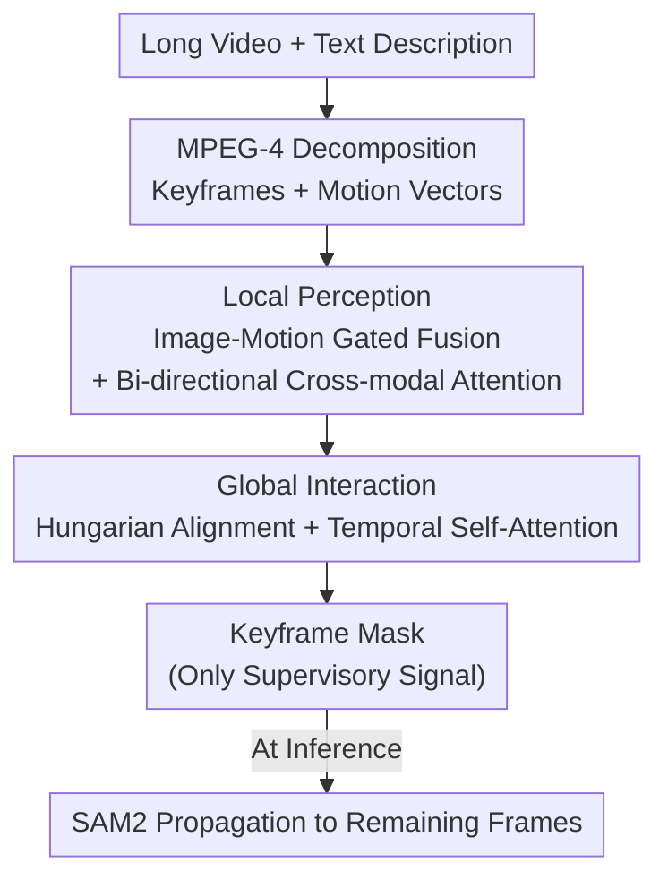

# Long-RVOS: A Comprehensive Benchmark for Long-term Referring Video Object Segmentation

**Conference**: CVPR 2026  
**Paper**: [CVF Open Access](https://openaccess.thecvf.com/content/CVPR2026/html/Liang_Long-RVOS_A_Comprehensive_Benchmark_for_Long-term_Referring_Video_Object_Segmentation_CVPR_2026_paper.html)  
**Code**: https://isee-laboratory.github.io/Long-RVOS (Available)  
**Area**: Video Understanding / Semantic Segmentation  
**Keywords**: Referring Video Object Segmentation, Long-term Video Benchmark, Temporal Consistency, Motion Information, SAM2

## TL;DR
To address the issues in existing Referring Video Object Segmentation (RVOS) datasets, which contain only short clips of a few seconds and where targets are visible throughout, the authors construct Long-RVOS. This is the first minute-level long video benchmark, featuring 2,193 videos with an average duration of 60 seconds, frequent occlusions, target disappearance/reappearance, and scene cuts. It includes three types of descriptions (Static, Dynamic, and Mixed) and two new metrics ($tIoU$ and $vIoU$). The authors also propose a motion-enhanced baseline, ReferMo, which utilizes MPEG-4 keyframes and motion vectors for a "local perception to global interaction" workflow. ReferMo is supervised only on keyframes and uses SAM2 for propagation during inference, significantly outperforming seven SOTA methods in long-video scenarios.

## Background & Motivation
**Background**: RVOS aims to identify, track, and segment a target object in a video based on a natural language description (e.g., "the cat jumping down"). Unlike semi-supervised VOS that requires a first-frame mask prompt, RVOS relies solely on text for target localization, making it highly attractive for applications like video editing. Recent progress has been rapid due to multimodal large models and SAM/SAM2.

**Limitations of Prior Work**: Existing mainstream datasets (A2D-Sentences, Ref-DAVIS17, Refer-YouTube-VOS, MeViS) are limited to short segments of a few seconds where the target is clearly visible in most frames. Short clips mask two major challenges of real scenes: first, as video length increases, distractors multiply, while descriptions often correspond to very short segments (e.g., the moment "the cat jumps"), making it difficult to retrieve key segments from massive spatio-temporal information. Second, due to GPU memory constraints, existing methods sample only 4–8 frames during training but process all frames during inference, expanding the training-inference gap as videos lengthen. The lack of a long-video benchmark has left these difficulties unquantified.

**Key Challenge**: Evaluation metrics are also flawed. Existing benchmarks simply average frame-level spatial segmentation metrics ($\mathcal{J}\&\mathcal{F}$). However, in real videos, targets may not be present in every frame due to occlusion or camera movement. A robust RVOS model must not only segment correctly when the target is present but also output an empty mask when it is absent. This "temporal consistency" is obscured by frame-averaging metrics.

**Goal**: The authors decompose the problem into two tasks: (1) creating a truly long and challenging dataset with fine-grained evaluation, and (2) providing a feasible baseline that performs efficiently on long videos.

**Key Insight**: Redundancy in long videos stems from the high similarity between adjacent frames within a shot, which can be efficiently characterized by "motion information." Instead of feeding high-resolution frames frame-by-frame, videos can be decomposed into snippets of "keyframes + cheap motion vectors," using motion to expand the local temporal window before performing global interaction across segments.

**Core Idea**: A local-to-global architecture where "keyframes carry static appearance + motion vectors carry short-term dynamics + cross-segment interaction carries long-term dependencies" expands the temporal receptive field from "multiple frames" to "multiple segments" with minimal additional training cost.

## Method

### Overall Architecture
The paper follows two tracks: the **Long-RVOS Benchmark** and the **ReferMo Baseline**. The benchmark addresses "what and how to measure"—it sidesteps existing VOS datasets to curate and re-annotate from TAO, VidOR, and Ego-Exo4D. It provides static, dynamic, and mixed text descriptions for each target and introduces two temporal metrics, $tIoU$ and $vIoU$. The ReferMo baseline addresses "how to compute efficiently"—it uses MPEG-4 to decompose videos into snippets containing "high-resolution keyframes + low-resolution motion vectors." It performs local vision-language-motion fusion to extract targets from each snippet, then aligns target features across segments for global temporal interaction. Crucially, it **predicts and supervises masks only on keyframes**, delegating mask propagation for other frames to a pre-trained SAM2 during inference.

### Key Designs

**1. Long-RVOS Dataset Construction: Re-annotation and Loop Correction with SAM2**

Existing RVOS datasets are built on short VOS datasets. The only long-video VOS dataset, LVOS, has only 720 clips and mostly single targets, which cannot support large-scale diverse referring tasks. The authors directly used three long-video sources: TAO, VidOR, and Ego-Exo4D. They filtered videos based on length (>20s), removed ambiguous categories, and ensured each segment contained at least two valid targets with at least one target being intermittently visible. After manually quality checking 3K+ videos, the final set contains 2,193 videos and 6,703 targets. **Mask annotation** used SAM2 with sparse bounding boxes from source datasets as prompts to generate initial masks, followed by a "Check-Correct" iterative loop where annotators used SAM2-based tools to fix errors via point/box prompts and deleted masks for frames where targets were absent. The final dataset averages 60.3s in duration, totaling 36.7 hours, 2.1M masks, and 163 object categories.

**2. Three Description Types: Static, Dynamic, and Mixed**

To prevent models from relying solely on specific cues (like color or position), 20 annotators wrote three types of descriptions for each target: **Static** (appearance, relative position, context), **Dynamic** (motion, state changes, interactions), and **Mixed** (a combination of both). Each description must uniquely identify the target. The final 24,689 descriptions are balanced across types (Static 35.0% / Dynamic 32.5% / Mixed 32.5%), enabling a diagnostic evaluation of temporal understanding shortfalls.

**3. tIoU and vIoU: Quantifying Temporal Consistency**

Frame-averaged $\mathcal{J}\&\mathcal{F}$ ignores whether the model correctly outputs empty masks when the target is absent. Borrowing from spatio-temporal video grounding, the authors introduced two metrics. Let $\hat{M}_t, M_t \in \{0,1\}^{H\times W}$ be the predicted and ground truth masks at frame $t$. Define $\hat{\mathcal{T}}=\{t \mid \|\hat{M}_t\|_0>0\}$ and $\mathcal{T}=\{t \mid \|M_t\|_0>0\}$. **Temporal tIoU** measures the overlap of "presence intervals":

$$\text{tIoU}=\frac{|\mathcal{T}_i|}{\Delta \mathcal{T}_u},\quad \mathcal{T}_i=\hat{\mathcal{T}}\cap\mathcal{T},\ \mathcal{T}_u=\hat{\mathcal{T}}\cup\mathcal{T}.$$

**Spatio-temporal vIoU** accumulates frame-level spatial IoU over the temporal intersection:

$$\text{vIoU}=\frac{1}{|\mathcal{T}_u|}\sum_{t\in\mathcal{T}_i} \mathcal{J}_t,\quad \mathcal{J}_t=\frac{|\hat{M}_t\cap M_t|}{|\hat{M}_t\cup M_t|}.$$

Combining $\mathcal{J}\&\mathcal{F}$, tIoU, and vIoU allows the evaluation to decouple segmentation accuracy from temporal consistency.

**4. ReferMo Mechanism: Expanding Windows with Motion Vectors**

ReferMo uses **snippet-level** fusion. Each video is decoded via MPEG-4 into clips containing one keyframe $I\in\mathbb{R}^{H\times W\times 3}$ and motion vectors $M\in\mathbb{R}^{T\times\frac{H}{16}\times\frac{W}{16}\times 2}$ for the subsequent $T$ frames. In **Local Perception**, motion vectors are projected and processed via self-attention (using deformable attention for the spatial dimension). **Image-Motion Gated Fusion** then aggregates motion features $\widetilde{M}_i$ using keyframe multi-scale features $I_i$ as queries, suppressing noise via spatial and channel gates:

$$M^*_i=\big(\sigma(I_i W^I_{down})\odot(\widetilde{M}_i W^M_{down})\big)W_{up},\qquad F_i=I_i+\gamma_i\odot \max(M^*_i,0)^2,$$

where $\sigma$ is Sigmoid, $\odot$ is the Hadamard product, and $\gamma$ is a learnable channel weight. **Vision-Language Fusion** uses bi-directional cross-attention for mutual enhancement. **Global Interaction** aligns target features across clips using the Hungarian algorithm and models long-term dependencies via temporal self-attention.

### Loss & Training
ReferMo follows ReferDINO hyper-parameters with a Swin-Tiny backbone and SAM2.1-Hiera-Large. Each MPEG-4 clip contains 1 keyframe + up to 11 motion vectors. During training, 6 clips are randomly sampled, each using 3 motion vectors, and **supervision is applied only to keyframe ground truths**. Following MeViS, no image segmentation datasets (e.g., RefCOCO) are used for pre-training.

## Key Experimental Results

### Dataset Comparison

| Dataset | Year | Videos | Avg Duration | Total Duration | Mask Count | Object Classes | Descriptions |
|---------|------|--------|--------------|----------------|------------|----------------|--------------|
| A2D-Sentences | 2018 | 3,782 | 4.9s | 5.2h | 58k | 6 | 6,656 |
| Ref-DAVIS17 | 2018 | 90 | 2.9s | 0.1h | 14k | 78 | 1,544 |
| Refer-YouTube-VOS | 2020 | 3,978 | 4.5s | 5.0h | 131k | 94 | 15,009 |
| MeViS | 2023 | 2,006 | 13.2s | 7.3h | 443k | 36 | 28,570 |
| **Long-RVOS (Ours)** | 2026 | 2,193 | **60.3s** | **36.7h** | **2.1M** | **163** | 24,689 |

### Main Results (Long-RVOS test, Overall)

| Method | Use SAM2 | $\mathcal{J}\&\mathcal{F}$ | tIoU | vIoU | FPS |
|--------|----------|------|------|------|-----|
| SOC (NeurIPS'23) | No | 38.6 | 72.3 | 33.5 | 53.8 |
| MUTR (AAAI'24) | No | 42.2 | 72.8 | 38.2 | 20.4 |
| ReferDINO (ICCV'25) | No | 48.4 | 73.5 | 43.9 | 46.4 |
| GLUS (CVPR'25) | Yes | 25.7 | 61.6 | 22.0 | 3.6 |
| SAMWISE (CVPR'25) | Yes | 40.9 | 66.6 | 31.1 | 7.0 |
| RGA3 (ICCV'25) | Yes | 22.5 | 60.0 | 17.5 | 8.7 |
| **ReferMo (Ours)** | Yes | **52.9** | **73.6** | **45.2** | 52.5 |

ReferMo leads across all metrics while maintaining high FPS (52.5). Notably, SAM2-based methods that excel on short fragments (GLUS/RGA3) collapse on long videos, suggesting their strength lies in tracking/segmentation rather than language-object grounding.

### Ablation Study

| Configuration | $\mathcal{J}$ | $\mathcal{F}$ | $\mathcal{J}\&\mathcal{F}$ | Gain |
|---------------|------|------|------|------|
| Baseline (ReferDINO) | 48.1 | 49.7 | 48.9 | - |
| + Keyframe decomposition | 49.5 | 50.6 | 50.0 | +1.1 |
| + Keyframes & Motion | 50.3 | 51.8 | 51.1 | +1.1 |

### Key Findings
- **Motion information is a critical contributor**: Simply adopting keyframe decomposition yields a +0.2 gain in $\mathcal{J}\&\mathcal{F}$ over baseline. Injecting motion features to expand local windows results in a significant +1.1 gain, verifying the core motivation.
- **Strong bias toward static cues**: Most models perform best on static descriptions and worst on dynamic ones, highlighting a universal weakness in temporal understanding.
- **Oracle analysis**: Feeding SAM2 the ground truth first-frame prompt yields an upper bound of only 54.3–56.6 $\mathcal{J}\&\mathcal{F}$ on Long-RVOS, far lower than MeViS (77.3–80.6). This indicates the long-term challenge primarily stems from tracking robustness.

## Highlights & Insights
- **MPEG-4 Motion Vectors for Efficiency**: Utilizing motion vectors obtained "for free" during decoding provides short-term dynamics with zero extra overhead, a paradigm transferable to other long-video tasks like Video QA.
- **Decoupling Supervision from Video Length**: Supervising only on keyframes and outsourcing frame-by-frame segmentation to propagation models makes training costs agnostic to video length.
- **Decoupling Accuracy from Consistency**: The stability of tIoU despite fluctuations in $\mathcal{J}\&\mathcal{F}$ proves that old metrics mask temporal flaws.
- **Diagnostic Value of Description Types**: Explicitly differentiating static/dynamic/mixed types prevents models from bypassing temporal logic by relying on simple appearance cues.

## Limitations & Future Work
- **Keyframe Dependency**: ReferMo relies heavily on targets being present in selected keyframes; performance drops under extreme occlusion.
- **Gap to Oracle**: The overall performance (52.9 $\mathcal{J}\&\mathcal{F}$) remains far from solved.
- **SAM2 Reliance**: Final quality is bound by the propagation model's capability (switching to Xmem++ drops 2.5 points).
- **Annotation Cost**: High-quality dense masks require significant manual checking despite SAM2 acceleration.

## Related Work & Insights
- **vs MeViS / Refer-YouTube-VOS**: These are limited to short intervals and constant visibility. Long-RVOS introduces the first minute-level benchmark with occlusion and scene cuts.
- **vs LVOS**: LVOS lacks text annotations and focuses on single targets.
- **vs ReferDINO**: ReferMo adapts the grounding and alignment framework but introduces snippet-level local fusion and sparse supervision.
- **vs SAM2-based models (GLUS / SAMWISE)**: Current SAM2-based methods fall short in long-video language grounding despite strong segmentation backends.

## Rating
- Novelty: ⭐⭐⭐⭐ first minute-level benchmark + temporal metrics.
- Experimental Thoroughness: ⭐⭐⭐⭐⭐ 7 SOTAs compared with oracle and occlusion analysis.
- Writing Quality: ⭐⭐⭐⭐ Clear motivation and metric derivations.
- Value: ⭐⭐⭐⭐⭐ Vital for pushing RVOS toward real-world long-form video applications.

<!-- RELATED:START -->

## Related Papers

- [\[CVPR 2026\] InterRVOS: Interaction-Aware Referring Video Object Segmentation](interrvos_interaction-aware_referring_video_object_segmentation.md)
- [\[NeurIPS 2025\] Robust Ego-Exo Correspondence with Long-Term Memory](../../NeurIPS2025/segmentation/robust_ego-exo_correspondence_with_long-term_memory.md)
- [\[CVPR 2026\] DeRVOS: Decoupling Consistent Trajectory Generation and Multimodal Understanding for Referring Video Object Segmentation](dervos_decoupling_consistent_trajectory_generation_and_multimodal_understanding_.md)
- [\[CVPR 2026\] Towards Streaming Referring Video Segmentation via Large Language Model](towards_streaming_referring_video_segmentation_via_large_language_model.md)
- [\[CVPR 2025\] Fractal Calibration for Long-Tailed Object Detection](../../CVPR2025/segmentation/fractal_calibration_for_long-tailed_object_detection.md)

<!-- RELATED:END -->
