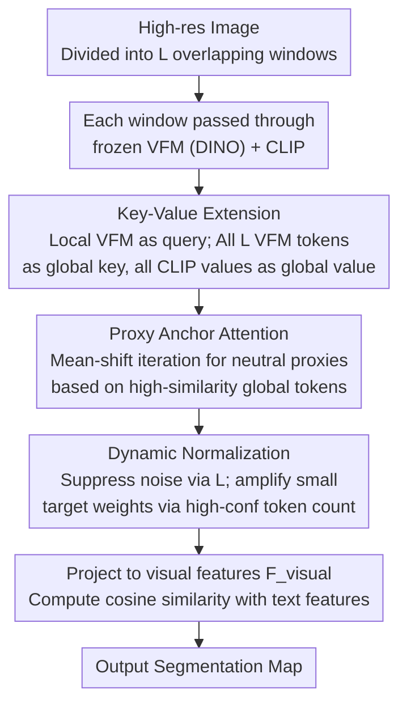

# Looking Beyond the Window: Global-Local Aligned CLIP for Training-free Open-Vocabulary Semantic Segmentation

**Conference**: CVPR 2026  
**arXiv**: [2603.23030](https://arxiv.org/abs/2603.23030)  
**Code**: [https://github.com/2btlFe/GLA-CLIP](https://github.com/2btlFe/GLA-CLIP)  
**Area**: Segmentation / Multi-modal VLM  
**Keywords**: Open-vocabulary semantic segmentation, CLIP, Sliding window, Training-free, Global-local alignment

## TL;DR

To address cross-window semantic inconsistency caused by sliding window inference in training-free open-vocabulary semantic segmentation, this paper proposes the GLA-CLIP framework. By integrating global key-value extension, proxy anchor attention, and dynamic normalization, the method achieves global context integration and attains SOTA performance with an average 44.0% mIoU across 8 benchmarks.

## Background & Motivation

**Background**: Open-vocabulary semantic segmentation (OVSS) leverages the vision-language alignment space of CLIP to achieve pixel-level labeling without fixed category constraints. Training-free methods have gained attention for requiring no additional training, with common approaches involving modifying CLIP attention mechanisms (e.g., MaskCLIP, SCLIP, ClearCLIP) or introducing features from vision foundation models (e.g., ProxyCLIP using DINO).

**Limitations of Prior Work**: CLIP's pre-training resolution is only 224×224, necessitating sliding window strategies for high-resolution images. However, processing each window independently leads to semantic inconsistency—pixels at the boundaries of adjacent windows often receive different predictions, resulting in visible grid-like artifacts. The authors define the Boundary Error Rate (BER) to quantify this and find that ProxyCLIP exhibits high inconsistency rates near window boundaries.

**Key Challenge**: Sliding windows preserve the resolution advantages of CLIP pre-training but sacrifice global context. This is particularly problematic when large or continuous semantic regions are split across multiple windows, as individual windows lack full scene information for consistent judgment.

**Goal**: How to enable each window to obtain global context while maintaining local spatial precision without training, thereby eliminating cross-window semantic inconsistency?

**Key Insight**: Extend the attention scope of each window from local to global—allowing query tokens to attend to key-value tokens across all windows, while eliminating local bias via proxy anchors and adapting to targets of different scales through dynamic normalization.

**Core Idea**: Achieve global-local semantic alignment for training-free CLIP via cross-window key-value extension + proxy anchors + dynamic normalization.

## Method

### Overall Architecture

GLA-CLIP addresses a side effect ignored by previous training-free OVSS methods: to maintain CLIP's 224×224 pre-training resolution, high-resolution images must be processed as sliding windows, leading to inconsistent class assignments for the same object across windows and grid artifacts.

The workflow is as follows: the input image is divided into $L$ overlapping windows, each passed through frozen VFM (DINO) and CLIP. For the current window, its own VFM features serve as the query, but the keys and values are no longer restricted to the local window. VFM features from all windows are concatenated as global keys, and CLIP values from the final transformer layer of all windows are concatenated as global values. Cross-attention aggregates global information into each query token, which is then passed through a projection layer to obtain visual features $\mathbf{F}_{visual}$. Final pixel classification is performed by computing cosine similarity with text features. Three designs sequentially solve the problems of "lack of global access," "local window bias," and "small target drowning."

### Key Designs

**1. Key-Value Extension (KVE): Expanding Attention to the Full Image**

The root cause of window artifacts is that each window is blind to external semantics. KVE addresses this by keeping the query unchanged while expanding keys/values: it collects VFM features from all $L$ windows to form a global key $\mathbf{K}_{global} \in \mathbb{R}^{(LN)\times D}$, and simultaneously collects global values $\mathbf{V}_{global}$ from CLIP. The current window query $\mathbf{Q}$ computes attention $\mathbf{A}_{ext} = \mathbf{Q}\cdot\mathbf{K}_{global}^\top \in \mathbb{R}^{N\times(LN)}$ to aggregate global values. This allows local queries to utilize semantically relevant tokens from distant windows, ensuring consistency for large objects.

**2. Proxy Anchor Attention: Eliminating Local Bias**

Expansion alone is insufficient: query tokens generated from local features naturally favor internal tokens, causing distant relevant tokens to receive less attention. Proxy Anchor Attention finds a neutral representative for each query. For query token $i$, a set of high-confidence tokens $\mathcal{P}_i^{(0)}$ with cosine similarity exceeding threshold $\rho$ is selected from the global keys. A proxy $\mathbf{Q}_i^{(T)}$ is then iteratively aggregated via mean-shift. Since the proxy represents the center of semantic similarity rather than spatial proximity, tokens across all windows receive fair attention allocation.

**3. Dynamic Normalization: Scale-Aware Attention Modulation**

Global expansion introduces noise from irrelevant tokens, which can drown out small targets (which have fewer positive samples). Dynamic normalization replaces fixed hyperparameters with two adaptive variables: an offset variable $\mathbf{u} = 1 + \lambda_1\log(1+L)$ that suppresses noise as $L$ increases, and a scaling variable $\mathbf{w}_i = 1 + \lambda_2 / |\mathcal{P}_i|$ inversely proportional to the number of high-confidence tokens. Small targets have smaller $|\mathcal{P}_i|$, resulting in larger $\mathbf{w}_i$ to amplify their few relevant tokens. This per-query modulation avoids manual dataset-specific tuning.

### Loss & Training

The method is entirely training-free and involves no loss functions or training processes. All CLIP and DINO parameters are frozen. Improvements are achieved solely by modifying the attention calculation during inference. Hyperparameters $\rho=0.6$, proxy iterations $T=2$, $\lambda_1=0.3$, and $\lambda_2=30$ are shared across all datasets.

## Key Experimental Results

### Main Results

| Dataset | Metric (mIoU) | ProxyCLIP | GLA-CLIP (Ours) | Gain |
|--------|-----------|-----------|----------------|------|
| Pascal VOC21 | mIoU | 61.3 | 66.3 | +5.0 |
| Pascal Context60 | mIoU | 35.3 | 36.1 | +0.8 |
| COCO-Object | mIoU | 37.5 | 37.7 | +0.2 |
| ADE20K | mIoU | 20.2 | 20.0 | -0.2 |
| Cityscapes | mIoU | 38.1 | 40.8 | +2.7 |
| **8-Dataset Avg** | mIoU | 42.3 | 44.0 | +1.7 |

Note: GLA-CLIP does not use dataset-specific hyperparameters, yet outperforms CASS (44.4 with ds-hyp), which requires manual tuning.

### Ablation Study

| Configuration | Avg mIoU | Description |
|------|----------|------|
| Baseline (Local DINO attention only) | 30.8 | No normalization, no extension |
| + KVE + Dynamic Normalization | 43.1 | Global extension provides significant gain |
| + Proxy + Dynamic Normalization (No KVE) | 43.0 | Proxy anchors are effective independently |
| + KVE + Proxy + Dynamic Normalization | 44.0 | Full method is optimal |
| + KVE + Proxy + Dataset-specific hyp | 44.3 | Manual tuning provides only marginal gain |

### Key Findings

- Dynamic normalization adaptively handles different datasets, eliminating the need for per-dataset hyperparameter tuning.
- The number of high-confidence tokens is highly correlated with target scale: in Cityscapes, the "Road" class has ~135 positive samples, while "Person" has only ~5.
- GLA-CLIP serves as a plug-and-play module that improves various baselines: ClearCLIP +1.2%, SCLIP +1.6%, and ProxyCLIP +0.6%.

## Highlights & Insights

- First to identify and systematically solve the cross-window semantic inconsistency problem in sliding window inference.
- The three components (KVE, Proxy, Dynamic Normalization) work hierarchically: KVE provides global info $\rightarrow$ Proxy eliminates local bias $\rightarrow$ Dynamic Normalization handles scale variance.
- Entirely training-free with no extra parameters; can be plugged into existing methods to expand the receptive field.
- Uses the high-confidence token count as a free proxy signal for target scale, cleverly avoiding explicit scale estimation.

## Limitations & Future Work

- Computational complexity for global KV extension is $O(N \cdot LN)$, increasing attention overhead as the number of windows grows.
- Iterative construction of proxy anchors increases inference latency (though only 2 steps are required).
- $\lambda_1, \lambda_2$ in dynamic normalization remain globally fixed; more refined adaptive strategies could yield further improvements.
- Limited gains on datasets with extreme category counts like ADE20K, possibly requiring more granular category-aware mechanisms.

## Related Work & Insights

- The proxy attention mechanism of ProxyCLIP serves as the direct foundation; GLA-CLIP extends it from single-window to global scope.
- Mean-shift clustering concepts are applied to build proxy anchors, applicable to other scenarios requiring cross-regional semantic consistency.
- Training-free OVSS is becoming a vibrant direction, avoiding the need for training data and risks of overfitting.

## Rating

- Novelty: ⭐⭐⭐⭐ Systematically addresses the overlooked window inconsistency problem.
- Experimental Thoroughness: ⭐⭐⭐⭐⭐ 8 datasets, multiple baseline integrations, and detailed ablation/visual analysis.
- Writing Quality: ⭐⭐⭐⭐⭐ Clear motivation, precise problem definition (BER metric), and rigorous method derivation.
- Value: ⭐⭐⭐⭐ A generic plug-and-play solution that advances the training-free OVSS field.

<!-- RELATED:START -->

## Related Papers

- [\[CVPR 2026\] PEARL: Geometry Aligns Semantics for Training-Free Open-Vocabulary Semantic Segmentation](pearl_geometry_aligns_semantics_for_training-free_open-vocabulary_semantic_segme.md)
- [\[CVPR 2026\] The Power of Prior: Training-Free Open-Vocabulary Semantic Segmentation with LLaVA](the_power_of_prior_training-free_open-vocabulary_semantic_segmentation_with_llav.md)
- [\[CVPR 2026\] ReAttnCLIP: Training-Free Open-Vocabulary Remote Sensing Image Segmentation via Re-defined Attention in CLIP](reattnclip_training-free_open-vocabulary_remote_sensing_image_segmentation_via_r.md)
- [\[CVPR 2026\] Direct Segmentation without Logits Optimization for Training-Free Open-Vocabulary Semantic Segmentation](direct_segmentation_without_logits_optimization_for_training-free_open-vocabular.md)
- [\[ICCV 2025\] Training-Free Class Purification for Open-Vocabulary Semantic Segmentation](../../ICCV2025/segmentation/training-free_class_purification_for_open-vocabulary_semantic_segmentation.md)

<!-- RELATED:END -->
