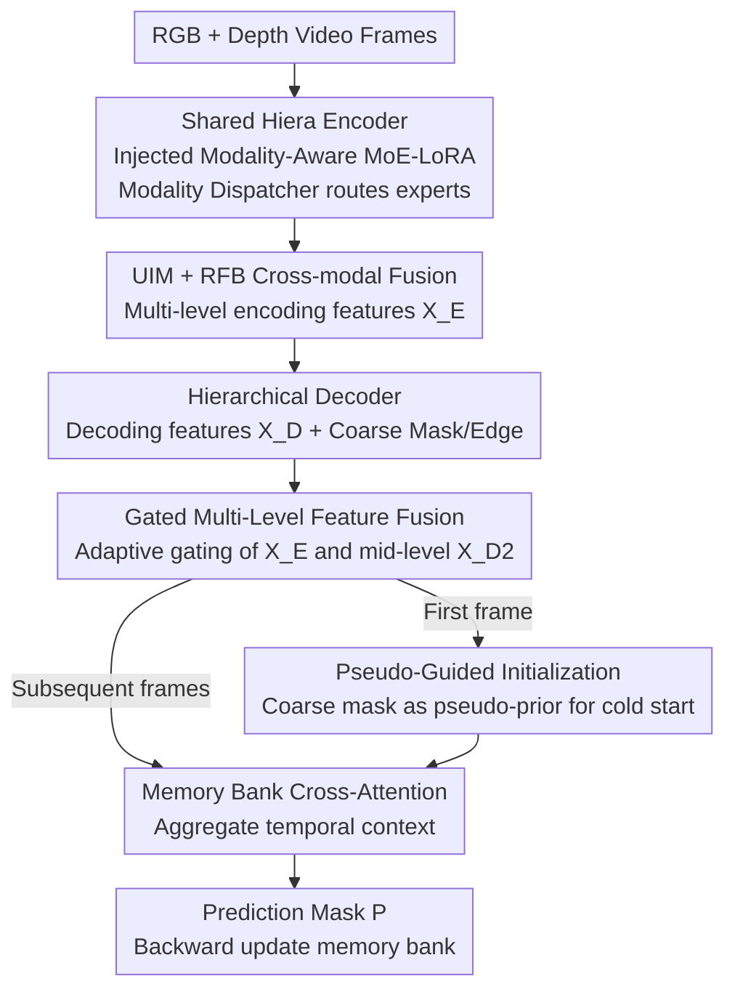

# M4-SAM: Multi-Modal Mixture-of-Experts with Memory-Augmented SAM for RGB-D Video Salient Object Detection

**Conference**: CVPR 2026  
**Paper**: [CVF Open Access](https://openaccess.thecvf.com/content/CVPR2026/html/Liu_M4-SAM_Multi-Modal_Mixture-of-Experts_with_Memory-Augmented_SAM_for_RGB-D_Video_Salient_CVPR_2026_paper.html)  
**Code**: https://github.com/HankLiu2020/M4-SAM  
**Area**: Video Understanding / Segmentation  
**Keywords**: RGB-D Video Salient Object Detection, SAM2, MoE-LoRA, Parameter-Efficient Fine-Tuning, Temporal Memory

## TL;DR
To efficiently adapt SAM2 for RGB-D Video Salient Object Detection (RGB-D VSOD), M4-SAM injects "Modality-Aware MoE-LoRA" into the frozen SAM2 encoder for parameter-efficient fine-tuning, utilizes "Gated Multi-Level Feature Fusion + Memory Bank" to aggregate multi-scale temporal information, and employs "Pseudo-Guided Initialization" to eliminate dependence on manual prompts. It achieves SOTA across all metrics on three RGB-D VSOD datasets, with the entire training process taking approximately 5 hours on two 4090 GPUs.

## Background & Motivation

**Background**: Salient Object Detection (SOD) aims to segment the most attention-grabbing objects in a scene. RGB-D VSOD is one of the most challenging settings as it simultaneously introduces depth (providing geometric cues) and video temporality (ensuring cross-frame consistency). Recently, SAM/SAM2 swept the segmentation field with large-scale pre-trained representations and strong zero-shot generalization. SAM2, with its native memory bank mechanism for video, is an attractive foundation for RGB-D VSOD.

**Limitations of Prior Work**: The authors identify three obstacles to directly applying SAM2 to RGB-D VSOD. First, full-parameter fine-tuning is impractical due to SAM2's size and small VSOD datasets; common PEFT methods—specifically LoRA—use linear low-rank projections that lack spatial priors and modality-specific designs, failing to capture local structures or exploit RGB-depth complementarity. Second, existing methods do not fully utilize the multi-scale features of the SAM encoder, making it difficult to balance spatial details with semantic context. Third, SAM2's memory bank requires explicit prompts from the first frame (user clicks/boxes or GT masks) for initialization, whereas VSOD requires zero-shot, prompt-free dense prediction.

**Key Challenge**: The fundamental issue is that SAM2 is designed for a "Linear PEFT + Single Modality + Prompt-driven" paradigm, while RGB-D VSOD requires "Efficient Fine-tuning with Spatial Priors + Bi-modal Adaptive Fusion + Automated Initialization." This mismatch prevents simple "plug-and-play" application.

**Goal**: To dismantle these three obstacles—making PEFT lightweight yet spatial- and modality-aware, fully utilizing multi-scale features temporally, and enabling prompt-free cold starts for the memory bank.

**Core Idea**: Replace linear LoRA with "MoE-LoRA composed of convolutional experts + Modality Dispatcher," use "Gated Multi-Level Fusion + Memory Bank" for temporal aggregation, and substitute explicit prompts with "Pseudo-Mask Guided Initialization."

## Method

### Overall Architecture
M4-SAM inputs frame-by-frame RGB and depth maps (depth normalized to [0,1] and replicated to three channels) and outputs high-quality saliency masks. The pipeline's core is a "single encoder for two modalities": RGB and depth share one Hiera encoder (SAM-L from SAM2.1, frozen), which is injected with Modality-Aware MoE-LoRA. Modality-specific expert groups extract four-level features for both modalities. These are fused via a Universal Interaction Module (UIM) and Receptive Field Block (RFB) to obtain unified multi-level encoding features $\{X_E^i\}_{i=1}^4$.

Encoding features are reconstructed via a decoder to obtain decoding features $\{X_D^i\}_{i=1}^4$. The temporal component, Pseudo-Guided Temporal Memory, fuses $\{X_E^i\}$ and mid-level $X_D^2$ via Gated Multi-Level Feature Fusion into a rich representation. Cross-attention between the current frame and historical frames in the memory bank yields temporal aggregated features and the final mask $P$. The memory bank is updated with the latest predictions. For the first frame, Pseudo-Guided Initialization uses a coarse mask as a pseudo-prior for cold-starting.

### Key Designs

**1. Modality-Aware MoE-LoRA: Replacing linear LoRA with Convolutional Experts + Modality Dispatcher**

To address the lack of spatial priors and modality-specific design in linear LoRA, each LoRA branch is redesigned as a set of convolutional experts. Three types of experts are used: two standard convolutional experts (kernels $3\times3$ and $5\times5$) for different receptive fields, and one depthwise-separable + pointwise convolutional expert for efficient inference. A lightweight MoE Gating dynamically selects the top-K experts based on input representations. The forward pass is: $h = W_0 x + \Delta W x = W_0 x + BAx + B\,\mathcal{D}(Ax)$, where $W_0$ is the frozen backbone, $BA$ is the low-rank term, and $\mathcal{D}(\cdot)$ is the Modality Dispatcher.

The Modality Dispatcher $\mathcal{D}(\cdot)$ categorizes experts into RGB, depth, and fusion groups. RGB/depth groups enhance intra-modal representations, while the fusion group handles cross-modal interactions and is shared. The dispatcher routes based on input: the RGB stream activates RGB+fusion units, and the depth stream activates depth+fusion units. This allows a single encoder to handle both modalities, unlike Adapter/LoRA which require separate encoder branches (Table 3: Adapter 14.66GB, LoRA 14.25GB, Ours 11.62GB).

**2. Gated Multi-Level Feature Fusion: Adaptive Balance of Spatial Details and Semantics**

Gated-MLF concatenates four-level encoding features $\{X_E^i\}$, compresses them into context representation $X_c$ via FFN, and applies dual spatial-channel attention: $X_e = \mathrm{Conv}_{sp}(\mathrm{Mean}(X_c)) \cdot [\mathrm{Conv}_{ch}(P_{avg}(X_c)) \cdot X_c]$. A gating weight $G$ adaptively balances shallow and enhanced features:

$$G = \mathrm{Conv}_{gate}(\mathrm{Concat}(X_E^1, X_e)),\quad \tilde{X}_E = \mathrm{FFN}(G\cdot X_e + (1-G)\cdot X_E^1)$$

The final representation is $X_F = \mathrm{Concat}(\tilde{X}_E, X_D^2)$. Notably, the authors use **mid-level** decoding features $X_D^2$ because foundation models often suppress local spatial information in the final layer; mid-level features offer a better balance (Table 6).

**3. Pseudo-Guided Initialization: Cold-starting Memory via Coarse Masks**

To remove reliance on manual prompts, M4-SAM uses its own coarse mask from the first frame as a pseudo-prior. In standard updates, the memory bank uses query $Q_t$, fusion features $X_{F,t}$, and prediction $P_t$ to generate keys $k_{m,t}$ and values $v_{m,t}$. For the first frame, the coarse mask $P_{c,0}^1$ generated from $X_D^1$ is projected into initial keys/values:

$$\tilde{k}_{m,0} = \mathrm{Linear}_k(X_{F,0}),\quad \tilde{v}_{m,0} = \mathrm{Linear}_v(X_{F,0}\cdot P_{c,0}^1)$$

The value projection shares parameters with the subsequent value encoder to ensure feature space consistency. Attention naturally handles noise: if the pseudo-mask is noisy, the corresponding keys receive low affinity scores, preventing error propagation.

### Loss & Training
The total loss is $L_{total} = L_{pred} + L_{aux} + L_{moe}$. $L_{pred}$ is the structure loss for final prediction; $L_{aux} = \sum_{i=1}^{3}(L_{predc}^i + L_{edge}^i)$ provides intermediate supervision for coarse masks and edges (via Sobel filter); $L_{moe} = \lambda[(\sigma(I)/\mu(I))^2 + (\sigma(L)/\mu(L))^2]$ is the load balancing loss. Optimizer: AdamW. Learning rates: $1\times10^{-4}$ for MoE-LoRA, $1\times10^{-3}$ for others. Hardware: 2x RTX 4090, ~5 hours.

## Key Experimental Results

### Main Results
On DViSal, RDVS, and ViDSOD-100 datasets, M4-SAM outperforms 13 SOTA methods across E-measure ($E_\xi$↑), S-measure ($S_\alpha$↑), F-measure ($F_\beta$↑), and MAE ($M$↓).

| Dataset | Metric | M4-SAM | Prev. SOTA | Gain |
|--------|------|--------|----------|------|
| DViSal | $E_\xi$ ↑ / $F_\beta$ ↑ | 0.925 / 0.828 | KAN-SAM | +4.5% / +5.7% |
| RDVS | $E_\xi$ ↑ | 0.927 | DCTNet+ | +2.0% |
| ViDSOD-100 | $E_\xi$ ↑ / $M$ ↓ | 0.936 / 0.016 | KAN-SAM | +2.6% / −0.009 |

Compared to SAM-based baselines (MDSAM, SAM2-UNet, KAN-SAM), M4-SAM leads by an average of 6.9%, 7.6%, and 2.9% in E-measure.

### Ablation Study (on RDVS)

| Configuration | $E_\xi$↑ | $S_\alpha$↑ | $F_\beta$↑ | $M$↓ | Description |
|------|------|------|------|------|------|
| Full Model | 0.927 | 0.878 | 0.802 | 0.027 | Best performance |
| Pseudo(Copy) Depth | 0.858 | 0.740 | 0.623 | 0.047 | Using RGB as depth (drops 6.9) |
| PEFT=LoRA | 0.904 | 0.864 | 0.764 | 0.031 | Needs dual encoders, 14.25GB |
| Baseline | 0.908 | 0.874 | 0.775 | 0.030 | No temporal memory |
| +Memory+Gated-MLF | 0.927 | 0.878 | 0.802 | 0.027 | Full multi-level temporal fusion |

### Key Findings
- **Depth contributes significantly**: Using RGB as depth (Pseudo Copy) causes $E_\xi$ to drop from 0.927 to 0.858, proving the value of geometric cues.
- **MoE-LoRA is a win-win for VRAM and performance**: Compared to dual-encoder LoRA (14+GB), the single-branch Modality-Aware MoE-LoRA uses only 11.62GB and yields higher accuracy.
- **Gated-MLF is the main gain for temporal components**: Adding the memory bank alone only improves $E_\xi$ from 0.908 to 0.910; adding multi-level fusion reaches 0.927.
- **Mid-level features $X_D^2$ are best for memory**: Using $X_D^2$ (0.927) outperforms $X_D^1$ (0.918) or both (0.909).

## Highlights & Insights
- **Integrating MoE into LoRA with a Modality Dispatcher**: This retains LoRA's lightness while adding spatial priors via convolutional experts and handling bi-modal inputs with a single shared encoder. This "Modality Routing + Shared Fusion" strategy is transferable to tasks like RGB-T or RGB-event.
- **Robustness in Pseudo-Guided Initialization**: Leveraging the attention mechanism to suppress noise in pseudo-masks allows for prompt-free cold starts.
- **Mid-layer Feature Selection**: Utilizing $X_D^2$ instead of the final layer aligns with recent observations that foundation model late-layers suppress local spatial information.

## Limitations & Future Work
- The model is currently specialized for VSOD and needs evaluation on broader multi-modal video understanding tasks.
- Strong dependency on the SAM2 Hiera encoder and memory mechanism limits generalizability to other backbones.
- Ablations focused on "missing" depth rather than "noisy" depth; robustness against sensor errors in real-world scenarios remains to be tested.

## Related Work & Insights
- **Vs. standard LoRA/Adapter**: Standard methods require dual encoders for bi-modal data, inflating VRAM (14+GB). Ours uses MoE-LoRA to process both in one branch (11.62GB).
- **Vs. SAM2/XMem initialization**: These rely on manual prompts or GT. Ours uses a self-generated coarse mask for truly zero-shot VSOD.

## Rating
- Novelty: ⭐⭐⭐⭐ Targeted design for SAM2 adaptation.
- Experimental Thoroughness: ⭐⭐⭐⭐ Strong comparison and ablation; missing extreme noise testing.
- Writing Quality: ⭐⭐⭐⭐ Clear logical progression.
- Value: ⭐⭐⭐⭐ Practical, open-source solution for prompt-free SAM2 adaptation.

<!-- RELATED:START -->

## Related Papers

- [\[CVPR 2026\] V²-SAM: Marrying SAM2 with Multi-Prompt Experts for Cross-View Object Correspondence](v2-sam_marrying_sam2_with_multi-prompt_experts_for_cross-view_object_corresponde.md)
- [\[AAAI 2026\] SAM-DAQ: Segment Anything Model with Depth-guided Adaptive Queries for RGB-D Video Salient Object Detection](../../AAAI2026/segmentation/sam-daq_segment_anything_model_with_depth-guided_adaptive_queries_for_rgb-d_vide.md)
- [\[CVPR 2026\] Uncertainty-Aware Modality Fusion for Unaligned RGB-T Salient Object Detection](uncertainty-aware_modality_fusion_for_unaligned_rgb-t_salient_object_detection.md)
- [\[CVPR 2026\] Spatial-SAM: Spatially Consistent 3D Electron Microscopy Segmentation with SDF Memory and Semi-Supervised Learning](spatial-sam_spatially_consistent_3d_electron_microscopy_segmentation_with_sdf_me.md)
- [\[CVPR 2026\] PromptMoE: A Segmentation Refinement Framework Leveraging Mixture of Experts for Improved Prompting](promptmoe_a_segmentation_refinement_framework_leveraging_mixture_of_experts_for_.md)

<!-- RELATED:END -->
