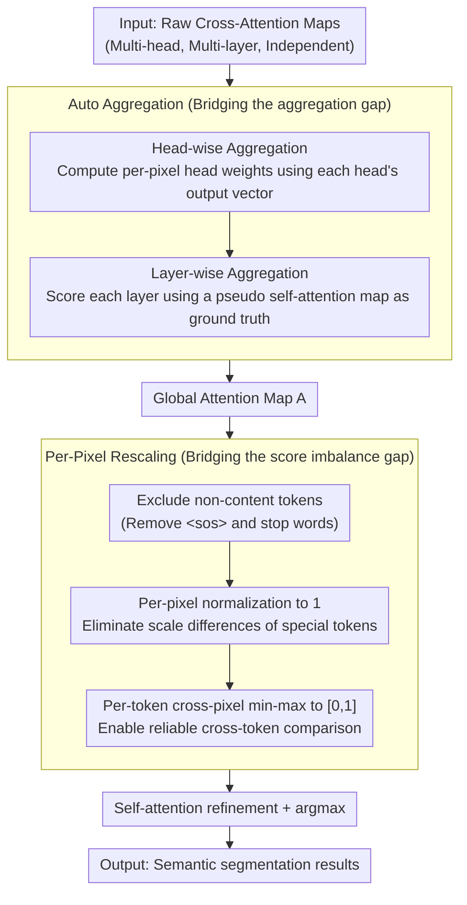

# Making Training-Free Diffusion Segmentors Scale with the Generative Power

**Conference**: CVPR 2026  
**arXiv**: [2603.06178](https://arxiv.org/abs/2603.06178)  
**Code**: [Available](https://github.com/MengBenyuan/GoCA)  
**Area**: Semantic Segmentation  
**Keywords**: Diffusion Models, Training-Free Segmentation, Cross-Attention, Auto Aggregation, Per-pixel Rescaling, Generative Scaling

## TL;DR

This work reveals the fundamental reason why existing training-free diffusion segmentation methods fail to scale with the increasing power of generative models: the existence of two gaps (the aggregation gap and the score imbalance gap) between cross-attention maps and semantic correlation. The authors propose the GoCA framework, consisting of auto aggregation and per-pixel rescaling, enabling stronger diffusion models (SDXL, PixArt-Sigma, Flux) to significantly outperform older models in training-free semantic segmentation for the first time.

## Background & Motivation

**Background**: Text-to-image diffusion models (Stable Diffusion, Flux, etc.) have been explored for discriminative tasks due to their powerful image generation capabilities. One research line focuses on "training-free diffusion segmentation"—directly utilizing cross-attention maps from pre-trained diffusion models for semantic segmentation without additional training.

**Goal**: Training-free diffusion segmentation methods are based on the generative capabilities of diffusion models. Theoretically, stronger generative models should produce better segmentation results—meaning segmentation performance should "scale" with generative power.

**Key Challenge**: The authors observed a counter-intuitive phenomenon: existing methods (DiffSegmentor, FTTM, etc.) are almost exclusively validated on Stable Diffusion v1.5/v2.1. When switching to more powerful models like SDXL, PixArt-Sigma, or Flux, segmentation performance fails to improve or even declines. This contradicts the intuition that "stronger generation $\leftrightarrow$ better segmentation."

**Gap I—Aggregation Gap**: Diffusion models contain multi-head and multi-layer cross-attention, where each head/layer produces an independent attention map. Previous methods relied on manually set weights for aggregation, but the increased complexity of newer architectures (UNet $\rightarrow$ DiT $\rightarrow$ MMDiT) makes manual parameter tuning infeasible.

**Gap II—Score Imbalance Gap**: Even with a global attention map, scores do not directly equate to semantic correlation. Two types of imbalance exist: (a) foreground tokens (e.g., "cat") have much higher scores than background tokens (e.g., "grass"), making direct comparison unreliable; (b) semantically special tokens (e.g., "$<sos>$") have inconsistent score scales, interfering with per-token normalization.

**Core Idea**: Design an automated aggregation weight scheme (based on correlations between model activations) to replace manual tuning, and eliminate interference from semantically special tokens through per-pixel rescaling. This bridges the two gaps and allows training-free segmentation capability to truly scale with generative power.

## Method

### Overall Architecture

GoCA (Generative scaling of Cross-Attention) addresses the counter-intuitive failure where training-free diffusion segmentation fails to improve with models like SDXL, PixArt-Sigma, and Flux. The methodology focuses on translating "raw cross-attention maps" into "reliable semantic correlation maps." It first uses **auto aggregation** to synthesize independent multi-head and multi-layer attention maps into a global map (bridging the aggregation gap). Then, **per-pixel rescaling** is applied to remove score imbalances caused by semantically special tokens (bridging the score imbalance gap). Finally, standard self-attention refinement and argmax are used to obtain segmentation results. The entire pipeline introduces no learnable parameters, maintaining the purity of the training-free paradigm.

### Key Designs

**1. Head-wise Aggregation: Measuring weight by each head's own output**

Previous multi-head attention methods relied on manual weights to aggregate heads, but this fails as head/layer counts explode in new architectures (UNet $\rightarrow$ DiT $\rightarrow$ MMDiT). GoCA rewrites multi-head output as a vector sum $Output = \sum_n A_n V_n W_n^O$. Thus, the contribution of each head can be naturally quantified by the alignment between "the output vector of that head" and the "total output": for head $n$ in layer $m$, the weight is $w_{mn} = (A_n V_n W_n^O)_m^\top \cdot Output_m$. After normalization, per-pixel head weights $w_{mn}'$ are obtained. Crucially, this weight is **per-pixel** rather than a single scalar for the whole image—the contribution of the same head varies across spatial locations. Per-pixel weighting extracts attention from each head in its "expert" spatial regions, providing higher precision than a single global weight.

**2. Layer-wise Aggregation: Scoring layers using dense diffusion features as "ground truth"**

Weights must also be determined across layers, but cross-attention layers lack a built-in reliable reference. GoCA employs a proxy: it uses dense diffusion features to calculate a pseudo self-attention map $A_p$ as the "ground truth" for global attention. It then evaluates how similar each layer's actual self-attention map $A_{self}^m$ is to this proxy, assigning higher credibility to more similar layers. Formally, $w_m = (A_p')^\top (A_{self}^m)'$, and after normalization, the layers are aggregated as $A = \sum_m w_m' A_m$. This step rests on the assumption that the contribution patterns of cross-attention layers are similar to those of self-attention layers.

**3. Per-Pixel Rescaling: Removing interference of semantically special tokens from scores**

Even with a synthesized global map, scores do not equal semantic correlation due to two imbalances: foreground tokens ("cat") have much higher scales than background tokens ("grass"), and semantically special tokens (e.g., $<sos>$) dominate scores with varying scales across pixels. GoCA corrects this in three steps: first, it **excludes non-content tokens**, keeping only content words and discarding special/stopword tokens. Second, it **normalizes content word scores to 1** for each pixel $i$, $A'(i,q) = \frac{A(i,q)}{\sum_j A(i,q(j))}$, to eliminate scale differences from special tokens. Finally, it performs **min-max normalization to $[0,1]$** for each token across all pixels, ensuring cross-token comparisons are reliable. Background classes benefit most because special tokens naturally have higher scores in background regions (where foreground is already dominated by content tokens); removing this adversarial interference significantly improves the quality of attention maps for classes like "grass" and "wall."

## Key Experimental Results

### Main Results

**mIoU comparison across five standard semantic segmentation benchmarks**:

| Method | Model | VOC | Context | COCO-Obj | Cityscapes | ADE20K |
|------|------|-----|---------|----------|------------|--------|
| DiffSegmentor | SD v1.5 | 60.1 | 27.5 | 37.9 | - | - |
| FTTM | SD v1.5 | 48.9 | 30.0 | 34.6 | 12.3 | 20.3 |
| Vanilla | SD v1.5 | 44.3 | 32.3 | 32.3 | 11.8 | 18.0 |
| Vanilla | Flux | 55.7 | 48.4 | 43.3 | 25.6 | 24.5 |
| **GoCA** | SD v1.5 | **60.7** | **40.4** | **39.2** | 16.1 | **22.0** |
| **GoCA** | SD XL | 65.6 | 42.3 | 44.3 | 21.2 | 23.2 |
| **GoCA** | PixArt-Σ | 63.6 | 43.2 | 39.8 | 22.6 | 23.8 |
| **GoCA** | **Flux** | **70.7** | **51.1** | **48.1** | **27.1** | **29.3** |

GoCA+Flux achieves 70.7% mIoU on Pascal VOC, which is 26.4 points higher than Vanilla SD v1.5 and 10.6 points higher than the strong SOTA DiffSegmentor.

### Ablation Study

**Contribution of components on Pascal VOC 2012 (mIoU)**:

| Head Agg. | Layer Agg. | Rescaling | SD v1.5 | SD XL |
|--------|--------|--------|---------|-------|
| Vanilla | Vanilla | Vanilla | 44.3 | 51.1 |
| Vanilla | Manual | Vanilla | 51.1 | - |
| Ours | Vanilla | Vanilla | 44.8 | 56.1 |
| Vanilla | Ours | Vanilla | 52.1 | 51.3 |
| Vanilla | Vanilla | Ours | 52.6 | 51.4 |
| **Ours** | **Ours** | **Ours** | **60.7** | **65.6** |

Each of the three components contributes approximately 5-8 points, and their combination yields even greater improvements (SD v1.5: +16.4, SD XL: +14.5).

### Generation Integration Results

**S-CFG Integration (COCO-30k, CFG=5.0)**:

| Method | FID↓ | CLIP↑ |
|------|------|-------|
| CFG | 19.27 | 31.34 |
| S-CFG | 19.15 | 31.35 |
| **GoCA+S-CFG** | **18.82** | **31.42** |

Replacing the internal segmentor of S-CFG with GoCA consistently improves generation quality, validating the practical value of training-free segmentation in generative pipelines.

### Key Findings

1.  **First realization of generation $\rightarrow$ segmentation scaling**: Manual baselines using SD v1.5 sometimes outperformed Vanilla versions of SD XL/PixArt-Sigma; GoCA eliminates this counter-intuitive phenomenon.
2.  **Significant improvement in background regions**: Per-pixel rescaling removes adversarial effects of semantically special tokens, significantly enhancing attention map quality for background classes like "grass" and "wall."
3.  **Strong architectural generalization**: GoCA is effective across UNet-based (SD v1.5/XL), DiT-based (PixArt-Sigma), and MMDiT-based (Flux) architectures, whereas manual tuning methods fail to generalize.
4.  **Auto layer aggregation matches manual tuning**: The proposed auto layer aggregation (52.1) performs comparably to or better than manual tuning (51.1) without human intervention.
5.  **Clear value for generative integration**: As an internal component of S-CFG, GoCA brings consistent improvements in FID and CLIP scores.

## Highlights & Insights

-   **Novel and Important Problem Definition**: The work is the first to systematically identify and address the "scaling failure of training-free diffusion segmentation," providing a clear direction for the field.
-   **Precise Analysis of the Two Gaps**: Decomposing the problem into an aggregation gap and a score imbalance gap allows for targeted and formal solutions.
-   **Completely Training-Free**: The method involves no learnable parameters and relies solely on the intrinsic structural information of model activations.
-   **Insightful Observation on Special Tokens**: The finding that $<sos>$ scores are higher in background regions (because foreground is dominated by content tokens) provides theoretical value for understanding diffusion internals.
-   **High Practicality**: GoCA can be directly integrated into generative techniques like S-CFG to improve text-to-image quality.

## Limitations & Future Work

1.  **Limited to Semantic Segmentation**: The method relies on the semantic correlation hypothesis of cross-attention maps and has not yet been extended to instance segmentation, panoptic segmentation, or depth estimation.
2.  **Dependency on External Object Detectors**: Constructing prompts containing all categories requires GPT-4o, introducing dependency on external modules.
3.  **Impact of Prompt Design**: Different prompt strategies significantly affect results, and fair cross-method comparisons are hindered by prompt variations.
4.  **Future Directions**: Extending GoCA to instance segmentation and depth estimation; exploring automatic prompt generation without external detectors; and studying temporal extensions for video diffusion models.

## Related Work & Insights

-   **vs. DiffSegmentor / FTTM**: These methods manually tune aggregation weights on SD v1.5 and fail to generalize to new architectures like SD XL or Flux. GoCA solves the architecture dependency via auto aggregation and outperforms DiffSegmentor even on SD v1.5 (60.7 vs. 60.1).
-   **vs. DiffCut**: DiffCut uses dense diffusion features for Normalized Cut segmentation. GoCA also utilizes dense features but as a proxy for calculating layer-wise aggregation weights—complementary ways of using dense features.
-   **vs. Trained Diffusion Discriminators** (ODISE, VPD, etc.): Trained methods achieve higher performance via fine-tuning but require extra data and computation. GoCA proves that training-free methods can significantly close the gap when correctly scaled.

## Rating

-   Novelty: ⭐⭐⭐⭐ First to systematically solve the scaling failure in training-free diffusion segmentation.
-   Experimental Thoroughness: ⭐⭐⭐⭐ Four diffusion models across five benchmarks + ablations + generation integration + qualitative analysis.
-   Writing Quality: ⭐⭐⭐⭐ Clear motivation, logical progression in gap analysis, and intuitive illustrations.
-   Value: ⭐⭐⭐⭐ Opens the door for scaling in the training-free diffusion segmentation field with both practical and theoretical merits.

<!-- RELATED:START -->

## Related Papers

- [\[CVPR 2026\] The Power of Prior: Training-Free Open-Vocabulary Semantic Segmentation with LLaVA](the_power_of_prior_training-free_open-vocabulary_semantic_segmentation_with_llav.md)
- [\[CVPR 2026\] Unsupervised Multi-Scale Segmentation of 3D Subcellular World with Stable Diffusion Foundation Model](unsupervised_multi-scale_segmentation_of_3d_subcellular_world_with_stable_diffus.md)
- [\[CVPR 2026\] INSID3: Training-Free In-Context Segmentation with DINOv3](insid3_training-free_in-context_segmentation_with_dinov3.md)
- [\[CVPR 2026\] From 2D Alignment to 3D Plausibility: Unifying Heterogeneous 2D Priors and Penetration-Free Diffusion for Occlusion-Robust Two-Hand Reconstruction](from_2d_alignment_to_3d_plausibility_unifying_heterogeneous_2d_priors_and_penetr.md)
- [\[CVPR 2026\] B³-Seg: Camera-Free, Training-Free 3DGS Segmentation via Analytic EIG and Beta-Bernoulli Bayesian Updates](b3-seg_camera-free_training-free_3dgs_segmentation_via_analytic_eig_and_beta-ber.md)

<!-- RELATED:END -->
