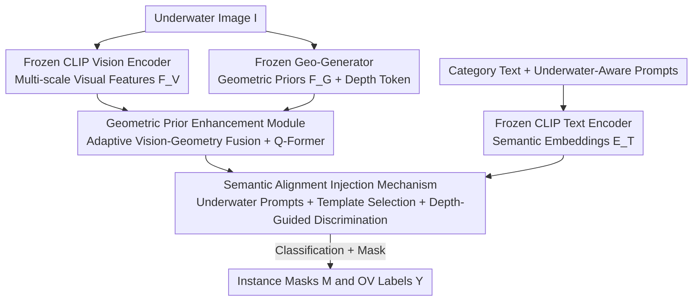

# MARIS: Marine Open-Vocabulary Instance Segmentation

**Conference**: CVPR 2026  
**Paper**: [CVF Open Access](https://openaccess.thecvf.com/content/CVPR2026/html/Li_MARIS_Marine_Open-Vocabulary_Instance_Segmentation_CVPR_2026_paper.html)  
**Code**: https://github.com/LiBingyu01/MARIS  
**Area**: Semantic Segmentation / Open-Vocabulary / Underwater Vision  
**Keywords**: Underwater Instance Segmentation, Open-Vocabulary, Geometric Priors, Semantic Alignment, CLIP

## TL;DR
This paper introduces MARIS, the first fine-grained underwater open-vocabulary instance segmentation benchmark (16K images, 158 fine-grained categories), and proposes a unified framework consisting of a Geometric Prior Enhancement Module (GPEM) and a Semantic Alignment Injection Mechanism (SAIM). By leveraging geometric priors from depth maps to counter underwater visual degradation and employing underwater-aware text prompts to address semantic misalignment, the framework significantly outperforms existing OV segmentation baselines in both in-domain and cross-domain settings.

## Background & Motivation
**Background**: Open-vocabulary (OV) instance segmentation is relatively mature for natural images. The mainstream approach leverages vision-language models like CLIP to align pixel features with category text embeddings, enabling the recognition of classes not seen during training. Underwater scenarios (coral monitoring, underwater robotics, ecological protection) urgently require this capability, as pixel-level annotation is extremely expensive and marine species are inherently long-tailed and diverse.

**Limitations of Prior Work**: The authors point out that directly applying natural-image OV methods to underwater scenes faces two major issues. First, at the **data level**, existing underwater segmentation datasets (UIIS, USIS10K) contain fewer than 20 categories and crudely group numerous species into superclasses like "fish" or "plants," failing to evaluate model generalization to fine-grained, unseen categories. Second, at the **method level**, underwater imaging suffers from severe color attenuation, low contrast, and light scattering, which destroy object appearance. Simultaneously, generic language prompts ("a photo of {class}") default to natural scene semantics and lack underwater-specific definitions, leading to semantic misalignment between visual features and text embeddings (often resulting in VLM "uncertainty").

**Key Challenge**: Visual degradation makes appearance cues like texture unreliable, yet OV recognition relies precisely on the alignment of appearance features and text. The heavier the degradation, the more cross-domain OV fails. Furthermore, generic text embeddings cannot describe "a species under turbid, low-light conditions," making unseen categories particularly difficult to identify.

**Goal**: (1) Provide a truly fine-grained benchmark to strictly evaluate underwater OV instance segmentation (UOVIS); (2) Design a unified framework that is both resilient to visual degradation and capable of compensating for underwater semantics.

**Key Insight**: The authors observe that while textures degrade underwater, **geometric structures remain stable cues**. For instance, even if surface texture is destroyed, corals maintain characteristic geometric growth patterns, and fish part-level structures are more robust than color. Therefore, geometric priors estimated from monocular depth can act as anchors when appearance fails. On the semantic side, prompts explicitly describing the underwater environment can "translate" generic text embeddings.

**Core Idea**: Compensating for degraded visuals with stable geometric priors and fixing misaligned semantics with underwater-aware text prompts to transfer OV segmentation to the underwater domain.

## Method

### Overall Architecture
Given an underwater image $\mathbf{I}$ and a set of category text descriptions $\mathcal{C}=\{c_1,\dots,c_n\}$, the model outputs a set of instance masks $\mathbf{M}$ and corresponding labels $\mathbf{Y}$ (which may include classes unseen during training). The pipeline consists of two main branches: a frozen CLIP vision encoder and a frozen depth generator (Geo-Generator) extract visual features $\mathbf{F}_V$ and geometric priors $\mathbf{F}_G$, respectively. GPEM fuses these into a geometry-enhanced visual representation $\mathbf{F}_{VG}$. SAIM then uses semantic embeddings $\mathbf{E}_T$ (enhanced by underwater prompts via a CLIP text encoder) to align with $\mathbf{F}_{VG}$, resulting in classification predictions $\mathbf{Y}_{\text{cls}}$ and masks $\mathbf{M}$. These are jointly supervised by a classification loss $\mathcal{L}_{\text{cls}}$ and a mask loss $\mathcal{L}_{\text{mask}}$. Formally:

$$\mathbf{F}_G = \mathcal{E}_G(\mathbf{I}),\quad \mathbf{F}_V = \mathcal{E}_V(\mathbf{I})$$

$$\mathbf{F}_{VG} = \mathcal{F}_{VG}\big(\mathcal{D}_V(\mathbf{F}_V),\,\mathbf{F}_G\big),\qquad (\mathbf{Y}_{\text{cls}},\mathbf{M}) = \text{SAIM}(\mathbf{F}_{VG},\mathbf{E}_T)$$

The CLIP encoders and depth generator remain frozen, with only the fusion and alignment components being trained. This allows the framework to inherit CLIP's open-vocabulary capabilities while focusing adaptation on underwater-specific degradation and semantic issues.

### Key Designs

**1. MARIS Benchmark: Upgrading Coarse Underwater Data to Fine-grained OV Evaluation**

Existing underwater benchmarks suffer from low category counts and group hundreds of species into broad superclasses like "fish." This prevents rigorous OV evaluation. The authors systematically re-annotated and expanded several public datasets (UIIS, USIS10K, etc.) to construct MARIS—comprising over 16K images, 9 superclasses, and 158 fine-grained subcategories (e.g., the "fish" superclass is split into 76 species), all with pixel-accurate instance masks. The dataset is split into 5,712 training and 10,439 validation images. With a class ratio of roughly 1:2 and multiple instances per image, the resulting set has 43 training-only classes and 74 testing-only classes, naturally forming "unseen categories." Two settings are defined: **In-domain** (train and eval on MARIS) and **Cross-domain** (train on COCO, eval on MARIS with zero category overlap).

**2. GPEM: Using Depth Geometric Priors as "Structural Anchors" for Degraded Visuals**

To address the failure of appearance cues due to color attenuation and low contrast, GPEM introduces a geometric information stream independent of texture. It refines multi-scale CLIP features $\{\mathbf{F}_V^{(l)}\}_{l=1}^L$ using multi-scale deformable attention (MS-DeformAttn) to produce enhanced features and a global visual representation $\mathbf{F}_m$. Simultaneously, it extracts multi-scale geometric features $\{\mathbf{F}_G^{(l)}\}$ and a global depth token $\mathbf{g}_{\text{cls}}$. Fusion is performed via **adaptive weighting** in a shared latent space:

$$\mathbf{F}_{VG}^{(l)} = \mathrm{MLP}\Big(\hat{\mathbf{F}}_V^{(l)} + \alpha^{(l)}\odot\hat{\mathbf{F}}_G^{(l)}\Big)$$

where $\alpha^{(l)}=\sigma\!\big(W_\alpha^{(l)}[\hat{\mathbf{F}}_V^{(l)}\,\|\,\hat{\mathbf{F}}_G^{(l)}]\big)$ is a gating weight. This allow the model to decide how much geometric information to inject based on scale and location—trusting appearance when reliable and relying on geometry when degradation is severe.

**3. SAIM: Bridging Semantic Misalignment with Underwater-Aware Prompts**

Generic VLM prompts fail to match underwater visuals. SAIM addresses this through two strategies. First, **Underwater-Aware Text Prompts + Adaptive Template Selection**: Prompts describing five underwater elements (context, water visibility, lighting, depth cues, scene interaction) are used to inject environmental priors. To avoid noise from irrelevant templates, the model calculates similarity between visual features and templates, performing **top-N most reliable template selection**. Second, **Geometry-Guided Classification**: The global depth token $\mathbf{g}_{\text{cls}}$ is fused with mask features to yield a refined representation $\mathbf{F}_c$, which is then aligned with adapted text embeddings $\hat{\mathbf{E}}$:

$$\mathbf{Y}_{\text{cls}} = \mathbf{F}_c \odot \hat{\mathbf{E}} \in \mathbb{R}^{Q\times C}$$

This ensures that semantic alignment benefits from both underwater-specific text priors and depth geometric information.

### Loss & Training
The model is trained with a joint supervision of classification and mask losses. Classification uses binary cross-entropy:
$$\mathcal{L}_{\text{cls}} = \text{CrossEntropy}(\mathbf{Y}_{\text{cls}}, \mathbf{Y}_{\text{gt}})$$
Mask loss follows MaskFormer, combining Dice and BCE:
$$\mathcal{L}_{\text{mask}} = \text{DiceLoss}(\mathbf{M}, \mathbf{M}_{\text{gt}}) + \text{BCE}(\mathbf{M}, \mathbf{M}_{\text{gt}})$$

## Key Experimental Results

### Main Results
**In-domain** (MARIS Train/Val, mAP, ConvNeXt-L backbone):

| Method | Backbone | Seen mAP | OV mAP | All mAP |
|------|----------|-----------|-----------|----------|
| FC-CLIP | ConvNeXt-L | 54.29 | 50.99 | 52.17 |
| MAFT+ | ConvNeXt-L | 55.32 | 51.54 | 53.41 |
| **Ours** | ConvNeXt-L | **61.55** | **54.02** | **56.71** |
| Gain | — | ↑6.23 | ↑2.48 | ↑3.30 |

**Cross-domain** (COCO Train, MARIS Val, All mAP):

| Method | ConvNeXt-B | ConvNeXt-L |
|------|-----------|-----------|
| FC-CLIP | 29.79 | 39.46 |
| **Ours** | **32.62** | **46.18** |

In the rigorous cross-domain setting, the proposed method maintains a significant lead, improving mAP from 40.27 to 46.18 (↑5.91) on ConvNeXt-L.

### Ablation Study
Ablation of GPEM and SAIM components (ConvNeXt-L):

| GPEM | SAIM | Seen mAP | OV mAP | All mAP |
|------|------|-----------|-----------|----------|
| ✗ | ✗ | 54.29 | 50.99 | 52.17 |
| ✓ | ✓ | **61.55** | **54.02** | **56.71** |

Adding either module improves performance, but their combination is essential for significant gains in the OV (unseen) category (50.99 → 54.02).

### Key Findings
- **Complementarity**: GPEM and SAIM solve the problem from visual and semantic perspectives, respectively. Their synergy is crucial for robustness in unseen categories.
- **Template Selection**: Averaging all templates dilutes performance with noise; top-N selection based on similarity provides consistent gains.
- **polarized Performance**: Classes with distinct structures (turtles, nautilluses) show high AP, while objects like plastic bags or nearly identical fish species remain extremely challenging.

## Highlights & Insights
- **Geometric Stability**: The observation that "textures degrade but geometry remains" is effectively utilized through depth priors and adaptive gating.
- **Selective Prompting**: Moving beyond simple template averaging to top-N selection based on visual-text similarity is a low-cost, effective trick for degraded scenes.
- **Infrastructure Contribution**: The MARIS benchmark transforms underwater OV segmentation into a quantifiable, fine-grained problem.

## Limitations & Future Work
- **Dependency on Depth Prior Quality**: GPEM relies on a frozen depth generator whose reliability might decrease in extremely turbid scenes.
- **Fine-grained Ambiguity**: Detecting plastic bags or distinguishing highly similar sibling species remains an open problem when both geometry and appearance are compromised.
- **Prompt Engineering**: The underwater prompt design involves manual heuristics; automated prompt construction for other degraded domains is an area for future work.

## Related Work & Insights
- **Comparison with General OV Baselines**: Methods like FC-CLIP and MAFT+ show that general purpose OV frameworks require domain-specific reinforcement (geometry and semantic adaptation) to function effectively underwater.
- **Data Gap**: Unlike UIIS or USIS10K, MARIS offers the necessary granularity and category splits to evaluate true open-vocabulary generalization.

## Rating
- Novelty: ⭐⭐⭐⭐ 
- Experimental Thoroughness: ⭐⭐⭐⭐ 
- Writing Quality: ⭐⭐⭐ 
- Value: ⭐⭐⭐⭐ 

<!-- RELATED:START -->

## Related Papers

- [\[CVPR 2026\] Seeing Both Sides: Towards Bidirectional Semantic Alignment for Open-Vocabulary Camouflaged Object Segmentation](seeing_both_sides_towards_bidirectional_semantic_alignment_for_open-vocabulary_c.md)
- [\[CVPR 2026\] S2C2Seg: Semantic-Spatial Consistency and Category Optimization for Open-Vocabulary Segmentation](s2c2seg_semantic-spatial_consistency_and_category_optimization_for_open-vocabula.md)
- [\[CVPR 2026\] GeoGuide: Hierarchical Geometric Guidance for Open-Vocabulary 3D Semantic Segmentation](geoguide_hierarchical_geometric_guidance_for_open-vocabulary_3d_semantic_segment.md)
- [\[CVPR 2026\] Mitigating Objectness Bias and Region-to-Text Misalignment for Open-Vocabulary Panoptic Segmentation](mitigating_objectness_bias_and_region-to-text_misalignment_for_open-vocabulary_p.md)
- [\[CVPR 2026\] PEARL: Geometry Aligns Semantics for Training-Free Open-Vocabulary Semantic Segmentation](pearl_geometry_aligns_semantics_for_training-free_open-vocabulary_semantic_segme.md)

<!-- RELATED:END -->
