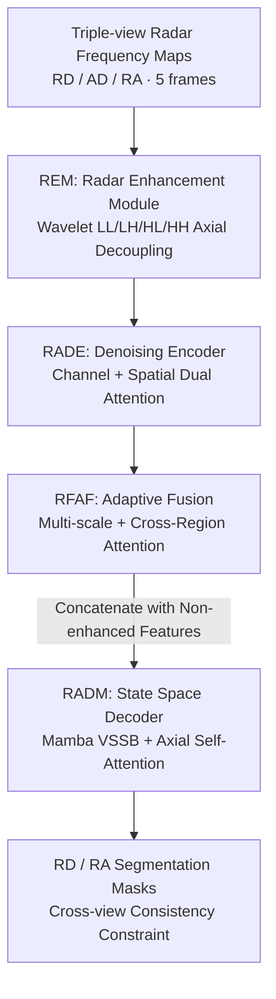

# MARSS: Radar Semantic Segmentation via Modular Attention and State Space Models

**Conference**: CVPR 2026  
**Paper**: [CVF Open Access](https://openaccess.thecvf.com/content/CVPR2026/html/Chen_MARSS_Radar_Semantic_Segmentation_via_Modular_Attention_and_State_Space_CVPR_2026_paper.html)  
**Area**: Semantic Segmentation  
**Keywords**: Radar Semantic Segmentation, Anisotropy, State Space Models (Mamba), Axial Attention, Multi-view Fusion

## TL;DR
Addressing the three major characteristics of radar frequency maps—"anisotropy, multi-scale, and sparse noise"—MARSS replaces general CNN/Transformer operators with three modules tailored for radar: the denoising encoder RADE, adaptive multi-scale fusion RFAF, and a State Space Decoder RADM combining Mamba and axial attention. On the CARRADA dataset, it improves RA view mIoU from 44.3% to 46.97% with 9.3M parameters, demonstrating particular robustness for small, fast-moving targets.

## Background & Motivation

**Background**: The input for Radar Semantic Segmentation (RSS) consists of frequency domain maps (Range-Doppler, Range-Angle, Angle-Doppler views) obtained via FFT from FMCW millimeter-wave radar. RSS is more robust than cameras in adverse weather and low visibility, making it increasingly important for autonomous driving and robotic perception. Common approaches involve migrating camera-based segmentation pipelines (U-Net, DeepLab, Transformers) or projecting radar echoes into point clouds for sparse 3D CNN processing.

**Limitations of Prior Work**: Architectures designed for natural images perform poorly on radar data. Radar frequency maps possess three characteristics absent in natural images: 
1. **Anisotropy**: Horizontal and vertical axes represent different physical quantities (Range vs. Velocity). The texture of the same target differs completely along the range and Doppler directions, whereas natural image textures are isotropic. Standard square kernels fail to handle this directional imbalance.
2. **Multi-scale**: Large, slow targets are wide in range but narrow in Doppler (wide low-frequency blocks), while small, fast targets are sharp in range and elongated in Doppler (high-frequency streaks). Fixed receptive fields struggle to capture both.
3. **Sparsity + Strong Noise**: Most pixels in FFT maps are black background, with only scattered peaks representing real reflections, overlaid with speckle noise and multi-path artifacts. The SNR is extremely low, and small targets are often barely distinguishable from the noise floor.

**Key Challenge**: The inductive biases of general vision backbones (isotropic textures, dense semantics, fixed receptive fields) fundamentally mismatch the physical properties of radar data (directionality, sparse peaks, high dynamic range), leading to significant performance degradation in the difficult RA view and on small, fast targets.

**Goal**: Instead of building a larger general-purpose network, the objective is to embed radar-specific priors—"anisotropic decoupling, noise suppression, multi-scale region selection, and long-range dependency modeling"—into the encoding, feature fusion, and decoding stages.

**Core Idea**: General operators are replaced with a set of "radar-specific operators": Wavelet transforms for axial frequency band decoupling, CBAM-style dual attention for denoising, cross-shaped region attention for multi-scale directional selection, and Mamba State Space Models with axial self-attention for anisotropic long-range decoding. This ensures each stage carries the inductive biases of radar perception.

## Method

### Overall Architecture
MARSS adopts an encoder-decoder architecture with radar-specific modules integrated at each stage. The input consists of **three perspective views** of radar frequency maps (Range-Doppler, Angle-Doppler, Range-Angle) across 5 consecutive frames. Each branch undergoes axial decoupling via REM, denoising encoding via RADE, and multi-scale region fusion via RFAF. Finally, the RADM decoder reconstructs masks using State Space Models.

### Key Designs

**1. REM: Decoupling Anisotropy via Wavelet Transform**

Radar map anisotropy implies that frequency content differs across the horizontal (Doppler) and vertical (Range) axes. REM (Radar Enhancement Module) utilizes 2D Discrete Wavelet Transform (DWT) to decompose signals into LL (low-frequency), LH, HL (horizontal/vertical high-frequency), and HH (diagonal high-frequency) sub-bands. Specifically, the LH branch applies a vertical $1\times3$ axial convolution followed by a horizontal $3\times1$ convolution, while the HL branch uses the reverse order. This "axially separable convolution + sub-band splitting" decouples directional information during the encoding phase.

**2. RADE: Channel + Spatial Dual Attention for "Denoise before Encode"**

Radar spectra exhibit low SNR and anisotropic clutter. RADE (Radar-Aware Denoising Encoder) applies dual attention for purification. Channel calibration uses squeeze-and-excitation to suppress noise-dominated channels:

$$X_c = \sigma_{sig}\big(f_{MLP}(\text{GAP}(X))\big) \odot X$$

Spatial attention calculates a mask to highlight geometrically meaningful regions in the Range-Doppler grid:

$$X_s = \sigma_{sig}\big(\text{Conv}_{7\times7}([\text{AvgPool}; \text{MaxPool}](X_c))\big) \odot X_c$$

This reinforces target boundaries and micro-motion streaks, ensuring the 3D CNN encoder receives low-noise, structure-preserved features.

**3. RFAF: Multi-scale Fusion + Cross-shaped Region Attention**

RFAF (Radar Feature Adaptive Fusion) addresses the coexistence of "large/slow and small/fast" targets. It aggregates features across multiple resolutions and processes them in two parallel stages. The **Multi-scale Fusion Stage** uses channel and spatial attention for modulation. The **Region Attention Stage** employs a cross-shaped receptive field to process horizontal and vertical neighborhoods separately:

$$Y = g\big([\,\text{RegAtt}(X_{c+s}) \,\|\, \text{MS-Dilated}(X_{c+s})\,]\big)$$

This explicitly captures directional patterns common in radar spectra, such as horizontal Doppler trailing or elongated vertical range responses.

**4. RADM: Mamba State Space + Axial Self-Attention for Anisotropic Decoding**

RADM (Radar State Space Decoder) handles long-range dependencies while maintaining axial structure. It splits the input $(B, C, H, W)$ into branches: the **Spatial Branch** $(B\times W, H, C)$ uses a Mamba-based Visual State Space Block (VSSB) for local interaction and Axial Self-Attention (ASA) for long-range dependency along the remaining axis; the **Doppler Branch** $(B\times H, W, C)$ follows a similar logic. This separate modeling of Range and Doppler axes avoids the quadratic cost and structural disruption of global attention.

### Loss & Training
The total loss combines weighted Cross-Entropy, Soft-Dice loss, and cross-view consistency loss for RD and RA views:

$$L = \lambda_{wCE}\big(L^{RD}_{wCE} + L^{RA}_{wCE}\big) + \lambda_{SDice}\big(L^{RD}_{SDice} + L^{RA}_{SDice}\big) + \lambda_{CoL}L_{CoL}$$

The category weights $w_k$ are inversely proportional to frequency. The cross-view consistency loss $L_{CoL}$ constrains the consistency between RD and RA predictions after aggregating shared dimensions using the Frobenius norm:

$$L_{CoL}(p_{RD}, p_{RA}) = \|\hat{p}_{RD} - \hat{p}_{RA}\|^2_F$$

## Key Experimental Results

### Main Results
On the CARRADA dataset (FMCW radar, 4 classes, $256\times256\times64$ RAD tensor):

| Dataset | View/Metric | MARSS | Prev. SOTA (AdaPKCξ-NetFiT) | Gain |
|--------|-----------|-------|--------------------------|------|
| CARRADA | RD mIoU | 63.26% | 62.10% | +1.16% |
| CARRADA | RD mDice | 75.18% | 74.00% | +1.18% |
| CARRADA | RA mIoU | 46.97% | 44.30% | +2.67% |
| CARRADA | RA mDice | 58.78% | 55.50% | +3.28% |

The largest gain occurs in the difficult RA view (+2.67% mIoU). MARSS uses only 9.3M parameters, significantly fewer than T-RODNet (162.0M).

### Ablation Study
Table 3 results on CARRADA (Baseline uses none of the modules):

| Configuration (RADE/RFAF/RADM) | RD mIoU | RA mIoU | Note |
|------------------------|---------|---------|------|
| Baseline | 61.16% | 41.04% | General Enc-Dec |
| RADE Only | 62.35% | 41.57% | RD +1.19% |
| RFAF Only | 62.45% | 44.70% | RA +3.66% |
| RADM Only | 62.52% | 45.33% | RA +4.29% (Strongest single module) |
| Full MARSS | 63.26% | 46.97% | Best overall |

### Key Findings
- **RADM contributes most**: Using RADM alone increases RA mIoU by +4.29%, validating that Mamba + Axial Attention is critical for modeling anisotropic long-range dependencies.
- **Complementarity**: The full MARSS outperforms any two-module combination, indicating that noise suppression (RADE), multi-scale selection (RFAF), and directional modeling (RADM) address distinct radar challenges.
- **Efficiency**: The 9.3M parameter count is achieved through the linear complexity of the Mamba mechanism, avoiding the quadratic overhead of global attention.

## Highlights & Insights
- **Physics-driven Operator Design**: Instead of treating radar maps as images, MARSS acknowledges that Range, Doppler, and Angle are distinct physical quantities, using axial decoupling to treat anisotropy as a first-class citizen.
- **Strategic Use of Mamba**: The linear complexity of State Space Models matches the "long sequence + sparse peak" nature of radar data, enabling efficient modeling without losing directional structure.
- **Effective Consistency Supervision**: The cross-view consistency loss serves as a "free" supervision signal by forcing the network to exploit the multi-dimensional structure of radar frequency maps.

## Limitations & Future Work
- **Experimental Diversity**: Evaluation is limited to CARRADA and CARRADA-RAC. Generalization to more sensors or denser target environments remains to be verified.
- **Modular Composition**: Many components (Wavelet, CBAM, Mamba) are adaptations of existing ideas; the novelty lies in the systematic integration rather than a singular new operator.
- **Inference Latency**: While the parameter count is low, the actual latency of triple-view parallel processing with temporal inputs on edge devices is not detailed.

## Related Work & Insights
- **vs. AdaPKC / PeakConv**: These emphasize peak response; MARSS outperforms them by explicitly decoupling directional components.
- **vs. Transformers (TransRSS)**: MARSS replaces global attention with Mamba, achieving better RA performance with fewer parameters (9.3M) and linear complexity.
- **vs. CNN-based (RAMP-CNN)**: Whereas standard CNNs use fixed receptive fields, MARSS's RFAF uses cross-shaped attention to handle multi-scale directional content, leading to a substantial +3.66% gain in the RA view.

## Rating
- Novelty: ⭐⭐⭐⭐
- Experimental Thoroughness: ⭐⭐⭐
- Writing Quality: ⭐⭐⭐⭐
- Value: ⭐⭐⭐⭐

## Related Papers

- [\[CVPR 2026\] RS-SSM: Refining Forgotten Specifics in State Space Model for Video Semantic Segmentation](rs-ssm_refining_forgotten_specifics_in_state_space_model_for_video_semantic_segm.md)
- [\[CVPR 2026\] Semantic Alignment in Hyperbolic Space for Open-Vocabulary Semantic Segmentation](semantic_alignment_in_hyperbolic_space_for_open-vocabulary_semantic_segmentation.md)
- [\[CVPR 2025\] Exploiting Temporal State Space Sharing for Video Semantic Segmentation](../../CVPR2025/segmentation/exploiting_temporal_state_space_sharing_for_video_semantic_segmentation.md)
- [\[CVPR 2026\] RAVEN: Radar Adaptive Vision Encoders for Efficient Chirp-wise Object Detection and Segmentation](raven_radar_adaptive_vision_encoders_for_efficient_chirp-wise_object_detection_a.md)
- [\[CVPR 2026\] SAMosaic3D: Modular Scene Assembly for Real-Time 3D Segment Anything](samosaic3d_modular_scene_assembly_for_real-time_3d_segment_anything.md)

<!-- RELATED:END -->

<!-- RELATED:START -->

## Related Papers

- [\[CVPR 2026\] RS-SSM: Refining Forgotten Specifics in State Space Model for Video Semantic Segmentation](rs-ssm_refining_forgotten_specifics_in_state_space_model_for_video_semantic_segm.md)
- [\[ICLR 2026\] Enabling True Global Perception in State Space Models for Visual Tasks](../../ICLR2026/segmentation/enabling_true_global_perception_in_state_space_models_for_visual_tasks.md)
- [\[CVPR 2025\] Exploiting Temporal State Space Sharing for Video Semantic Segmentation](../../CVPR2025/segmentation/exploiting_temporal_state_space_sharing_for_video_semantic_segmentation.md)
- [\[CVPR 2026\] RAVEN: Radar Adaptive Vision Encoders for Efficient Chirp-wise Object Detection and Segmentation](raven_radar_adaptive_vision_encoders_for_efficient_chirp-wise_object_detection_a.md)
- [\[CVPR 2026\] GKD: Generalizable Knowledge Distillation from Vision Foundation Models for Semantic Segmentation](gkd_generalizable_knowledge_distillation_vfm.md)

<!-- RELATED:END -->
