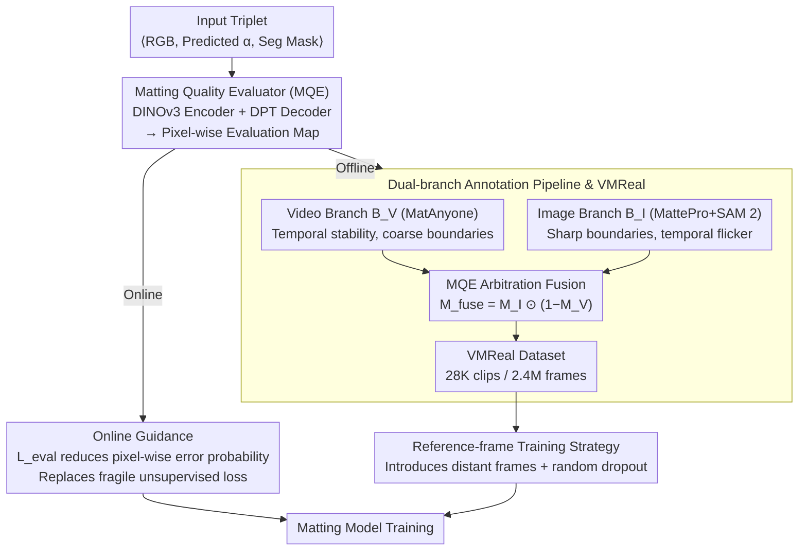

# MatAnyone 2: Scaling Video Matting via a Learned Quality Evaluator

**Conference**: CVPR2026  
**arXiv**: [2512.11782](https://arxiv.org/abs/2512.11782)  
**Code**: [Project Homepage](https://pq-yang.github.io/projects/MatAnyone2/)  
**Area**: Semantic Segmentation / Video Matting  
**Keywords**: video matting, quality evaluator, alpha matte, dataset curation, reference-frame strategy

## TL;DR

Ours proposes a learned Matting Quality Evaluator (MQE) to evaluate alpha quality pixel-wise without ground truth. MQE serves as both online training guidance and an offline data filter. This enabled the construction of VMReal, a real-world video matting dataset with 28K clips and 2.4 million frames. Combined with a reference-frame training strategy, the method significantly outperforms all existing state-of-the-art approaches.

## Background & Motivation

1.  **Scarcity of Video Matting Data**: The largest video matting dataset, VM800, contains only 826 sequences, which is approximately 1/60th of the VOS dataset used by SAM 2, severely limiting model training.
2.  **Domain Gap in Synthetic Data**: Traditional RGBA composition blends foregrounds onto random backgrounds, leading to lighting inconsistencies and unnatural boundaries, which causes performance degradation in real-world scenes.
3.  **Matting Degradation After Segmentation Pre-training**: When fine-tuning on matting data after pre-training on segmentation models/data, the segmentation capability often degrades due to the insufficient volume of high-quality matting data.
4.  **Weak Boundary Supervision in Joint Training**: Methods like MatAnyone use segmentation labels for non-boundary areas and unsupervised losses for boundary areas. The latter relies on overly strong assumptions, causing the predicted alpha to degrade into a binary segmentation mask.
5.  **Conflict Between Boundary Details and Semantic Accuracy**: Existing methods often trade off between matting precision and segmentation accuracy, failing to improve both simultaneously.
6.  **Drastic Appearance Changes in Long Videos**: Propagation-based methods fail to model large appearance changes (e.g., newly appearing clothing or body parts) when the training window is limited.

## Method

### Overall Architecture

The fundamental problem MatAnyone 2 aims to solve is the lack of video matting data and the inability to judge prediction quality without alpha ground truth. Its core is a learned Matting Quality Evaluator (MQE): it takes a triplet of $\langle I_{rgb}, \hat{\alpha}, M^{seg} \rangle$ (RGB frame, predicted alpha, and segmentation mask) as input and outputs a pixel-wise binary evaluation map $M^{eval} \in \{0,1\}^{H \times W}$ (1=reliable, 0=error). Centered around MQE, the paper establishes two paths: online, it provides real-time boundary supervision for matting training; offline, it acts as a quality arbitrator to combine the complementary strengths of video and image matting models to curate VMReal, a 28K-clip / 2.4M-frame real-world dataset. A reference-frame training strategy is also introduced to model drastic appearance variations in long videos.

### Key Designs

**1. Matting Quality Evaluator (MQE): Pixel-wise Quality Judgment Without Ground Truth**

The biggest bottleneck in matting annotation is the extreme scarcity of high-quality alpha ground truth (GT), making it impossible to evaluate predictions. MQE bypasses GT dependency by using a pre-trained DINOv3 as the feature encoder and a DPT decoder to output the evaluation map. Training labels are based on the P3M-10k image matting dataset, where differences $\mathcal{D}(\cdot)$ between predicted $\hat{\alpha}$ and $\alpha_{gt}$ are calculated using MAD and Grad metrics within local patches. These are thresholded to obtain binary supervision. Since reliable regions far outnumber erroneous ones, Focal Loss is used to address class imbalance. Once trained, MQE can label reliable and erroneous pixels during inference using only RGB, predicted alpha, and a segmentation mask—providing the foundation for both online guidance and offline curation.

**2. Online Guidance: Replacing Unsupervised Loss with More Reliable Signals**

Methods like MatAnyone use unsupervised loss in boundary areas, which relies on strong assumptions and leads to alpha degradation into masks. In online mode, MQE is integrated into the training loop: the pixel-wise error probability map $P^{(0)}_{eval}$ output by MQE is used to construct a guidance loss:

$$\mathcal{L}_{eval} = \|P^{(0)}_{eval}\|_1$$

This encourages the network to minimize the error probability for each pixel. Compared to the original unsupervised loss, it provides more dynamic and stable signals for both boundary and core regions, suppressing the degradation of alpha into segmentation masks at the source.

**3. Dual-branch Annotation Pipeline and VMReal: Using MQE as an Arbitrator**

To bridge the domain gap of synthetic data and the scarcity of real data, MQE acts as an offline quality arbitrator to fuse two complementary branches:

| Branch | Model | Advantage | Disadvantage |
|------|------|------|------|
| $B_V$ (Video) | MatAnyone | Temporal stability, semantic consistency | Insufficient boundary details |
| $B_I$ (Image) | MattePro + SAM 2 | Sharp boundaries, rich details | Temporal instability |

MQE evaluates the alpha from both branches to obtain $M_V^{eval}$ and $M_I^{eval}$. A fusion mask is constructed as $M^{fuse} = M_I^{eval} \odot (1 - M_V^{eval})$—targeting pixels where the "image branch is reliable but the video branch is not." After Gaussian smoothing, the results are blended:

$$\alpha = \alpha_V \odot (1 - M^{fuse}) + \alpha_I \odot M^{fuse}$$

This trusts the video branch for temporal stability and the image branch for fine boundaries. This process automatically curated the VMReal dataset, containing ~28K clips and 2.4M frames. This includes 4.5K high-quality 1080p clips (with rich hair details), while the rest come from the SA-V human subset (720p). VMReal is approximately 35x larger than the previously largest VM800.

**4. Reference-frame Training Strategy: Modeling Appearance Changes Without Increased VRAM**

Propagation-based methods have limited training windows (8 frames here), failing to cover large appearance changes like newly appearing body parts in long videos. The strategy introduces an additional distant reference frame into the memory bank from outside the training window to simulate long-term changes. Combined with random dropout augmentation (randomly masking local patches of RGB and alpha), it reduces over-reliance on historical memory. This models long-term variations by "introducing distant frames" rather than "lengthening sequences," adding almost no VRAM overhead.

## Key Experimental Results

### Main Results

#### Synthetic Benchmark: VideoMatte (1920×1080)

| Method | MAD↓ | MSE↓ | Grad↓ | dtSSD↓ |
|------|------|------|-------|--------|
| MatAnyone | 4.24 | 0.33 | 4.00 | 1.19 |
| GVM (Diffusion Prior) | 6.33 | 2.08 | 8.04 | 1.59 |
| MaGGIe (Per-frame mask) | 4.42 | 0.40 | 4.03 | 1.31 |
| **Ours** | **4.10** | **0.28** | **3.45** | **1.15** |

#### Real-world Benchmark: CRGNN (Hand-annotated)

| Method | MAD↓ | MSE↓ | Grad↓ | dtSSD↓ |
|------|------|------|-------|--------|
| MatAnyone | 5.76 | 3.04 | 15.55 | 5.44 |
| GVM | 5.03 | 2.15 | 14.28 | 4.86 |
| **Ours** | **4.24** | **2.00** | **11.74** | **4.54** |

### Ablation Study (YoutubeMatte 1920×1080)

| Configuration | MAD↓ | MSE↓ | Grad↓ | dtSSD↓ |
|------|------|------|-------|--------|
| (a) Baseline MatAnyone | 1.99 | 0.71 | 8.91 | 1.65 |
| (b) + Online Guidance $\mathcal{L}_{eval}$ | 1.90 | 0.62 | 8.20 | 1.63 |
| (c) + VMReal | 1.76 | 0.61 | 7.65 | 1.54 |
| (d) + Ref-frame Strategy | **1.61** | **0.50** | **7.13** | **1.53** |

Each component provides consistent improvements. Compared to the baseline, MAD reduced by 19.1% and Grad reduced by 20.0%.

## Highlights & Insights

- **MQE Two-birds-with-one-stone**: Elegantly uses the same evaluator for both online training signals and offline data filtering.
- **Quality Evaluation Without GT**: MQE identifies alpha quality pixel-wise using only segmentation masks, breaking the bottleneck of matting annotation.
- **First Large-scale Real-world Video Matting Dataset**: VMReal offers 28K clips / 2.4M frames, 35x larger than VM800.
- **Pure CNN Outperforms Diffusion**: Surpasses diffusion-based methods like GVM without relying on video diffusion priors, using only the first-frame mask.
- **Reference-frame Strategy with Zero Extra VRAM**: Models long-term changes by sampling distant frames rather than increasing training sequence length.

## Limitations & Future Work

- MQE training relies on the static image matting dataset P3M-10k and may face generalization issues in extreme scenarios (e.g., transparent materials, smoke).
- The quality ceiling of the dual-branch pipeline is limited by MatAnyone and MattePro; if both base models fail, MQE cannot recover the truth.
- VMReal focuses solely on human matting and does not cover non-human scenes like animals or objects.
- The paper does not discuss inference speed or real-time performance; the efficiency advantage of a pure CNN is not quantified.
- Sensitivity of performance to hyperparameters in the reference-frame strategy (e.g., dropout ratio) is not fully analyzed.

## Related Work & Insights

| Dimension | MatAnyone | GVM | MaGGIe | MatAnyone 2 |
|------|-----------|-----|--------|-------------|
| Backbone | CNN (SAM 2 base) | Video Diffusion | CNN | CNN (SAM 2 base) |
| Input Guidance | First-frame mask | None | Per-frame mask | First-frame mask |
| Boundary Supervision | Unsupervised loss | Diffusion prior | Seg label | MQE Online Guidance |
| Training Data | VM800 + Seg data | VM800 + 4K Render | VM800 | VMReal (28K clips) |
| Long Video Handling | Local window memory | None | None | Ref-frame strategy |

## Rating

- Novelty: ⭐⭐⭐⭐ — The dual-mode (online/offline) use of MQE and the automated annotation pipeline are novel.
- Experimental Thoroughness: ⭐⭐⭐⭐⭐ — Extensive coverage across synthetic and real benchmarks with clear component-wise ablations.
- Writing Quality: ⭐⭐⭐⭐ — Clear structure, intuitive diagrams, and well-articulated motivation.
- Value: ⭐⭐⭐⭐⭐ — Both the VMReal dataset and the MQE methodology provide significant contributions to the video matting field.

<!-- RELATED:START -->

## Related Papers

- [\[CVPR 2025\] MatAnyone: Stable Video Matting with Consistent Memory Propagation](../../CVPR2025/segmentation/matanyone_stable_video_matting_with_consistent_memory_propagation.md)
- [\[ICLR 2026\] Matting Anything 2: Towards Video Matting for Anything](../../ICLR2026/segmentation/matting_anything_2_towards_video_matting_for_anything.md)
- [\[CVPR 2026\] Towards High-Quality Image Segmentation: Improving Topology Accuracy by Penalizing Neighbor Pixels](towards_high-quality_image_segmentation_improving_topology_accuracy_by_penalizin.md)
- [\[CVPR 2026\] VidEoMT: Your ViT is Secretly Also a Video Segmentation Model](videomt_your_vit_is_secretly_also_a_video_segmentation_model.md)
- [\[CVPR 2026\] 3M-TI: High-Quality Mobile Thermal Imaging via Calibration-free Multi-Camera Cross-Modal Diffusion](3m-ti_high-quality_mobile_thermal_imaging_via_calibration-free_multi-camera_cros.md)

<!-- RELATED:END -->
