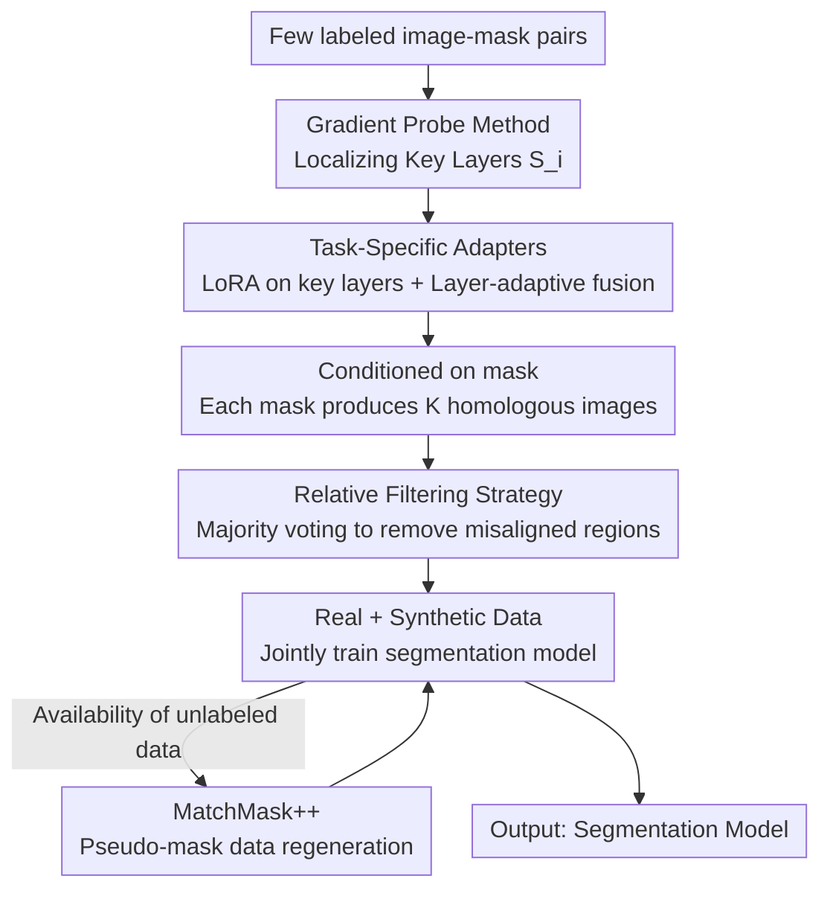

# MatchMask: Mask-Centric Generative Data Augmentation for Label-Scarce Semantic Segmentation

**Conference**: CVPR 2026  
**Paper**: [CVF Open Access](https://openaccess.thecvf.com/content/CVPR2026/html/Lin_MatchMask_Mask-Centric_Generative_Data_Augmentation_for_Label-Scarce_Semantic_Segmentation_CVPR_2026_paper.html)  
**Code**: Available (The paper claims it has been open-sourced; see the original text for the link)  
**Area**: Semantic Segmentation / Semi-supervised  
**Keywords**: Generative Data Augmentation, mask-to-image, label scarcity, Diffusion Models, LoRA

## TL;DR
MatchMask utilizes only a tiny amount of labeled masks by first identifying a few key layers in the diffusion model responsible for spatial control via a "gradient probe." It then attaches a 0.7M parameter LoRA adapter to these layers for mask-to-image synthesis and employs "relative filtering" to eliminate misaligned noisy regions in the synthesized images. This significantly enhances semantic segmentation performance in label-scarce scenarios (e.g., +6.8% mIoU under VOC 1/8 labels).

## Background & Motivation
**Background**: Semantic segmentation relies heavily on pixel-wise manual annotations, the cost of which is prohibitively high for many scenarios. Generative Data Augmentation (GDA) aims to expand training sets by using generative models to produce "image-mask pairs." Current GDA is predominantly **text-centric** (e.g., DiffuMask, Dataset Diffusion, DatasetDM), relying on meticulously designed text prompts coupled with the cross-attention of diffusion models to generate both images and masks.

**Limitations of Prior Work**: The text-centric paradigm suffers from two major flaws. First, textual descriptions cannot precisely convey complex spatial layouts, often resulting in missing objects or disordered relations where the synthesized distribution is inconsistent with real data. Second, the generated image-mask pairs are frequently misaligned (e.g., the *table* class in Fig. 1), providing incorrect supervision to the segmentation model. An alternative is the **mask-centric** route, which uses dense maps (e.g., masks) for direct control, yielding much better alignment. However, methods like FreeMask (fine-tuning the entire U-Net, ~850M parameters) or SegGen (ControlNet with task branches, ~360M parameters) are designed for **full supervision** and require massive amounts of labels to sustain such large trainable parameter counts.

**Key Challenge**: The mask-centric paradigm offers superior alignment but possesses high parameter counts, leading to severe overfitting when labels are scarce (Fig. 2 shows FreestyleNet losing pre-training priors and suffering from diversity collapse in few-shot settings). Essentially, a direct conflict exists between "high alignment from mask control" and "preventing overfitting under low-data regimes."

**Key Insight**: The authors observe that **not all parameters are equally important for the mask-to-image task**. If only a small subset of layers is responsible for injecting mask spatial information, adapting only those layers can compress trainable parameters significantly, naturally avoiding overfitting. The paper further discovers that these key layers are **dataset-agnostic**, suggesting this sparse structure is an intrinsic property of the task and can be utilized as a prior.

**Core Idea**: To bring mask-centric GDA to label-scarce scenarios, the authors use a "gradient probe to localize key layers + lightweight LoRA on key layers," combined with "relative filtering" to mask out misaligned regions in synthetic data, thereby preventing noisy supervision.

## Method

### Overall Architecture
MatchMask is a four-stage pipeline: "Train a lightweight mask-to-image generator → Batch generate data → Train segmentation model with augmented data." The goal is to produce diverse, realistic, and aligned image-mask pairs using only a minimal set of labeled masks.

In Stage 1, a semantic image synthesis model is trained in a few-shot setting: a gradient probe identifies the layers most critical for spatial control, and LoRA adapters are attached only to these layers (integrated with layer-adaptive cross-attention fusion) while freezing all other parameters. In Stage 2, the trained generator produces $K$ homologous images per given mask. These are passed through a relative filtering strategy to remove noisy regions, resulting in clean pairs. Stage 3 involves joint training of the segmentation model with real and synthetic data. Stage 4 (MatchMask++), an optional semi-supervised extension, uses the trained segmentation model to generate pseudo-masks for unlabeled images, which are fed back into the generator to create more data.

### Key Designs

**1. Gradient Probe Method: Localizing "Spatial Control" Layers with Minimal Samples**

The pain point is that fine-tuning the entire U-Net (FreestyleNet) or a large control branch (ControlNet) leads to overfitting in few-shot settings. Drawing from model pruning conclusions that "not all parameters are necessary for downstream tasks," the authors proposed scoring layers based on **gradient magnitudes during training**. To avoid instability, they aggregate parameter changes per epoch to define a layer importance score:

$$S_i = \frac{\|\theta_i - \theta_i'\|}{\|\theta_i'\|},$$

where $\theta_i'$ are the original parameters of the $i$-th layer and $\theta_i$ are the fine-tuned parameters. A high score suggests the layer was "pulled" significantly to complete the mask-to-image task. Experiments (Fig. 3/5/6) reveal that only a few layers have high scores and these layers are **consistent across ADE and VOC datasets**. Specifically, time-dependent and cross-attention layers have high priority, and **high-resolution** blocks at the beginning and end of the U-Net are far more important than low-resolution middle blocks. This step shifts the selection of layers from heuristics to data-driven filtering, enabling the reduction to 0.7M parameters.

**2. Task-Specific Adapters + Layer-Adaptive Cross-Attention Fusion**

Instead of fine-tuning the localized key layers, **LoRA** style low-rank adapters are used because: (1) they are more parameter-efficient (final count 0.7M), and (2) LoRA possesses an inherent regularization effect that inhibits overfitting while promoting generalization. This resolves the conflict between mask control alignment and few-shot overfitting.

For the mechanism: FreestyleNet uses masks to "rectify" cross-attention. Let $A=\frac{QK^T}{\sqrt d}$ be the attention scores. Rectified attention is:

$$\hat{A}^k_{i,j} = \begin{cases} A^k_{i,j}, & M^k_{i,j}=1 \\ -\infty, & M^k_{i,j}=0 \end{cases}$$

Positions outside the mask are set to $-\infty$, thus zeroed after softmax. However, Fig. 5 shows that the influence of spatial control varies across blocks. Applying a uniform rectified attention might lose global context. Thus, **layer-adaptive fusion** is introduced: a linear layer predicts a fusion coefficient $\alpha$ for each block to mix the original $\text{Attn}_{ori}$ and rectified $\text{Attn}_{rec}$:

$$\text{Attention} = \alpha\,\text{Attn}_{ori} + (1-\alpha)\,\text{Attn}_{rec}.$$

This allows each token to align with local regions while retaining global context, applying strong constraints only where necessary.

**3. Relative Filtering: Eliminating Misaligned Dirty Regions via "Homologous Voting"**

Even with the optimized generator, synthetic images may contain artifacts (e.g., random objects in the background). Standard practice uses softmax confidence from a segmentation model to filter pixels, but this **relies on a well-trained segmentation model**, which is unreliable in data-scarce scenarios and prone to confirmation bias. The insight here is $K$ **homologous images** generated from the same mask should yield consistent predictions. "Relative difference" is used instead of absolute confidence. Given a mask $SM$ and its $K$ images, pseudo-masks $PM_k$ are predicted. A per-pixel **majority vote** creates a prototype:

$$\hat{PM}(i,j) = \arg\max_{c} \sum_{k=1}^{K} \mathbb{1}\{PM_k(i,j)=c\},$$

Pixels in the $k$-th image that disagree with the prototype are labeled as 255 (ignored):

$$SM^{filtered}_k(i,j) = \begin{cases} SM(i,j), & PM_k(i,j)=\hat{PM}(i,j) \\ 255, & \text{else} \end{cases}$$

This is more robust to confirmation bias as it identifies outliers like "halucinated limbs" or "phantom objects."

**4. MatchMask++: Semi-supervised Extension via Pseudo-mask Re-generation**

When additional unlabeled data is available, the generator is not retrained. Instead, the segmentation model (trained on MatchMask-augmented data) generates **pseudo-masks** for unlabeled images. These masks are fed back into the adapter-equipped generator. Crucially, the adapter is reused without retraining, and even if pseudo-masks are noisy, the mask-to-image model can align generated images to these masks (Fig. 7b), maintaining valid supervision.

### Loss & Training
The mask-to-image model uses Stable Diffusion V1-4. Only the Adapter is fine-tuned with a batch size of 4 for 100k iterations (base lr 4e-5). Generation uses 50-step PLMS with a CFG scale of 2. For segmentation: DeepLabV3+ (ResNet101) for VOC/COCO, Mask2Former (Swin-B) for ADE20K. $K=5$ synthetic images are generated per mask by default.

## Key Experimental Results

### Main Results
Evaluation under label-scarce settings on VOC, COCO, and ADE20K. Selected results (mIoU):

| Dataset | Setting (Labels) | Baseline (Real Only) | Synthetic Only | MatchMask (Real+Synthetic) | Gain |
| :--- | :--- | :--- | :--- | :--- | :--- |
| VOC (79.9) | 1/16 (92) | 51.7 | 52.5 | 57.1 | +5.4 |
| VOC | 1/8 (183) | 58.6 | 58.0 | 65.4 | +6.8 |
| VOC | 1/4 (366) | 67.5 | 66.6 | 72.1 | +4.6 |
| COCO (57.3) | 1/128 (925) | 36.0 | 35.8 | 39.7 | +3.7 |
| ADE (52.4) | 1% (200) | 18.6 | 19.6 | 21.4 | +2.8 |

Notably, in extreme settings like VOC 1/16, **Synthetic Only** (52.5) outperforms **Real Only** (51.7).

Comparison with full-supervision mask-to-image methods (VOC mIoU):

| Method | 1/16 | 1/8 | 1/4 | 1/2 | Trainable Params |
| :--- | :--- | :--- | :--- | :--- | :--- |
| FreeMask | 54.1 | 62.8 | 71.1 | 75.0 | 850M |
| SegGen | 52.5 | 61.9 | 70.2 | 74.2 | 360M |
| MatchMask | **57.1** | **65.4** | **72.1** | **75.9** | **0.7M** |

MatchMask leads across all ratios with ~3 orders of magnitude fewer parameters, proving that "adapting only key layers" prevents overfitting. Compared to text-centric methods (VOC 366 labels), MatchMask exceeds DatasetDM's 40k image result using only 1.8k images (72.1 vs 68.2).

### Ablation Study

| Configuration | Metric (mIoU) | Note |
| :--- | :--- | :--- |
| Original (No Filter) | 64.7 | Noisy synthetic data unfiltered |
| Confidence Filter | 64.9 | Only +0.2 due to confirmation bias |
| Relative Filter (Ours) | 66.6 | +1.9, voting is more robust |
| Original | 57.2/47.2 (Train/Val) | No layer-adaptive fusion (ADE, DINO similarity) |
| + Layer-Adaptive Fusion | 58.0/47.5 | Improved synthesis quality |
| Semi-supervised Self-Training | 72.6 / 22.7 (VOC/ADE) | Self-training baseline |
| + MatchMask | 73.5 / 22.9 | Augmentation added |
| + MatchMask++ | **74.3 / 24.6** | Gain from pseudo-mask feedback |

### Key Findings
- **Relative Filtering is the most critical filtering component**: Confidence filtering provides negligible gains (64.7 → 64.9), while Relative Filtering reaches 66.6, proving "homologous voting" is superior when the base segmentation model is unreliable.
- **Key layers are sparse and dataset-agnostic**: High-resolution cross-attention blocks are the primary spatial controllers across both ADE and VOC.
- **Diminishing returns for K**: Increasing $K$ saturates performance; $K=5$ is the chosen trade-off.
- **Stackable with Semi-Supervised SOTA**: Combined with Unimatch, MatchMask/MatchMask++ improves VOC from 78.3 to 79.6, nearing the full supervision limit of 79.9.

## Highlights & Insights
- **Heuristics to Measurement**: The gradient probe quantifies layer importance, revealing dataset-agnostic sparsity. This conclusion is transferable to other few-shot adaptation tasks for diffusion models.
- **Relative Filtering Perspective**: Switching from "is this pixel correct?" (absolute confidence) to "are these homologous pixels consistent?" (relative consistency) bypasses the need for a highly reliable model.
- **Layer-Adaptive Fusion**: Using a scalar $\alpha$ to balance mask constraints and global context per layer prevents the "one-size-fits-all" information loss of standard rectified attention.
- **0.7M vs 850M Parameters**: The significant margin over heavy methods confirms that in low-data regimes, "less is more."

## Limitations & Future Work
- **Dependency on Pre-trained Priors**: The sparsity and dataset-agnostic nature might be specific to Stable Diffusion V1-4; results may vary with different architectures.
- **Computational Overhead**: Generating $K$ images and running $K$ inferences for filtering significantly increases computation in stages 2 and 3.
- **Lower Bound of Pseudo-mask Quality**: MatchMask++ assumes generator alignment compensates for noisy pseudo-masks, but the impact of systematic errors in out-of-distribution scenarios is not fully explored.
- **Domain Generalization**: Evaluation is limited to standard datasets; validation on long-tail, medical, or remote sensing domains is required.

## Related Work & Insights
- **vs FreeMask / SegGen (Mask-centric, Full Supervision)**: These fine-tune 360M-850M parameters, leading to severe overfitting in few-shot settings. MatchMask uses 0.7M parameters to outperform them in sparse label scenarios.
- **vs DatasetDM / Dataset-Diffusion (Text-centric)**: These fail to precisely control layout and require ~40k images. MatchMask achieves better results with ~2k images due to higher information density in mask-centric guidance.
- **vs Confidence Filtering**: Standard pseudo-label filtering accumulates errors; MatchMask's Relative Filtering avoids this by using consistency across homologous images.

## Rating
- Novelty: ⭐⭐⭐⭐ (Combination of gradient-based localization and relative voting is novel and effective for low-label GDA).
- Experimental Thoroughness: ⭐⭐⭐⭐ (Extensive benchmarks and ablations, though specialized domain testing is missing).
- Writing Quality: ⭐⭐⭐⭐ (Clear logical flow, though some table formatting is dense).
- Value: ⭐⭐⭐⭐ (Extremely parameter-efficient and practically useful; the insights on layer sparsity are transferable).

<!-- RELATED:START -->

## Related Papers

- [\[CVPR 2026\] SemLayer: Semantic-aware Generative Segmentation and Layer Construction for Abstract Icons](semlayer_semantic-aware_generative_segmentation_and_layer_construction_for_abstr.md)
- [\[CVPR 2026\] Task-Oriented Data Synthesis and Control-Rectify Sampling for Remote Sensing Semantic Segmentation](task-oriented_data_synthesis_and_control-rectify_sampling_for_remote_sensing_sem.md)
- [\[AAAI 2026\] A²LC: Active and Automated Label Correction for Semantic Segmentation](../../AAAI2026/segmentation/a2lc_active_and_automated_label_correction_for_semantic_segm.md)
- [\[CVPR 2026\] Making Training-Free Diffusion Segmentors Scale with the Generative Power](making_training-free_diffusion_segmentors_scale_with_the_generative_power.md)
- [\[CVPR 2026\] GenMask: Adapting DiT for Segmentation via Direct Mask Generation](genmask_adapting_dit_for_segmentation_via_direct_mask_generation.md)

<!-- RELATED:END -->
