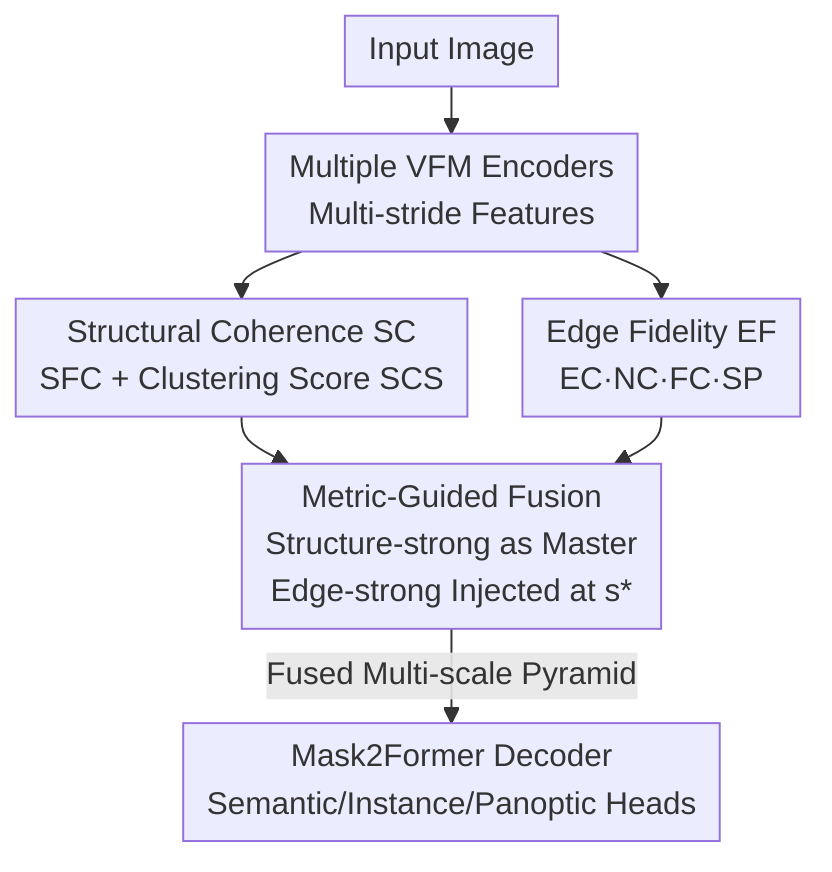

# Metric-Guided Feature Fusion of Visual Foundation Models for Segmentation Tasks

**Conference**: CVPR 2026  
**arXiv**: [2605.16864](https://arxiv.org/abs/2605.16864)  
**Code**: https://github.com/gyc-code/metric-guided-fusion (Yes)  
**Area**: Semantic/Instance Segmentation · Visual Foundation Models · Feature Fusion  
**Keywords**: VFM Fusion, Label-free Feature Evaluation, Structure-Edge Bias, master-auxiliary, Dense Prediction  

## TL;DR
Observing that different Visual Foundation Models (VFMs) exhibit distinct representational preferences (SAM2 favors boundaries, DINOv3 favors object structure), this paper designs a set of **label-free** feature evaluation metrics (Structural Coherence SC + Edge Fidelity EF). These scores automatically identify complementary encoder pairs and determine which features to inject at specific strides. A minimalist master–auxiliary fusion is then employed in a single-stage training to combine complementary features, achieving consistent performance gains across multiple segmentation tasks like COCO and Cityscapes.

## Background & Motivation
**Background**: VFMs (CLIP, DINO series, SAM series) have become the default starting points for downstream vision tasks, offering strong transferability through large-scale pre-training. Intuitively, they should perform excellently on dense prediction tasks like instance segmentation, which require both precise boundaries and instance-level semantic differentiation.

**Limitations of Prior Work**: Preliminary experiments yielded counter-intuitive results—connecting frozen DINO or SAM encoders to a standard Mask2Former decoder for instance segmentation **significantly underperformed** compared to ImageNet-pre-trained Swin Transformers. Specific failure modes included category confusion for SAM in complex scenes and over-segmentation of single objects for DINO.

**Key Challenge**: Different VFMs possess **systematic representational biases** due to different pre-training objectives—SAM uses mask supervision, making features edge-strong; DINO uses self-supervised self-distillation, making features structure-strong (consistent internal object structure). A single encoder always compromises between "boundary precision" and "structural semantics." While fusing multiple VFMs is a natural idea, **naive multi-encoder fusion often fails to yield gains**, and there is a lack of interpretable principles explaining "why this pair works" or "where to fuse."

**Goal**: The problem is decomposed into two sub-problems: (i) How to determine if a VFM encoder is edge-biased or structure-biased in a **label-free and low-cost** manner? (ii) Once determined, how to use this judgment to guide fusion for consistent improvements in downstream dense prediction?

**Key Insight**: Since biases can be directly observed from frozen features (SAM2 activations concentrate on boundaries, DINOv3 activations cover object interiors), they can be **quantified into computable scores**. These scores drive the decision of "which two encoders to select" and "at which stride to inject," rather than relying on trial-and-error with complex modules and multi-stage training.

**Core Idea**: Explicitly score VFM biases using a set of label-free structural/edge feature metrics, then perform a master–auxiliary single-stage fusion where the structure-strong encoder serves as the master and the edge-strong encoder is injected at the optimal stride.

## Method

### Overall Architecture
The method consists of two parts: **(a) Structure/Edge-aware Feature Evaluation**—extracting features from each VFM encoder across multiple output strides (OS $\in \{4, 8, 16, 32\}$) and scoring them with label-free SC and EF metrics. This creates a profile of structural vs. edge bias per encoder/stride, used to select a complementary pair (one structure-strong, one edge-strong) and locate the optimal injection stride $s^*$. **(b) Metric-Guided Feature Fusion**—setting the high-SC encoder (DINOv3-B) as the trainable master to provide the main feature pyramid, while the high-EF encoder (SAM2-B) is frozen as the auxiliary. The auxiliary features replace the master features only at stride $s^*$ (where the EF score is highest). The fused multi-scale pyramid is then fed into a task-specific Mask2Former decoder. The entire method **requires no architectural changes and uses single-stage training**, with the only modification being the encoder design.

### Key Designs

**1. Structural Coherence (SC): Label-free quantification of "internal consistency and inter-cluster separability"**

To judge if an encoder is structure-strong without ground-truth labels, two complementary label-free scores are constructed. First is **Structured Feature Contrast (SFC)**: the multi-channel feature map is compressed into a single-channel intensity map and divided into a $K \times K$ grid. It compares "inter-block variance" against "intra-block noise"—$\mathrm{SFC} = \frac{\mathrm{Var}(\{\mu_p\})}{\mathrm{Var}(\{\mu_p\}) + \mathrm{Mean}(\{\sigma_p^2\})} \in [0,1]$. A high SFC indicates regions are coherent yet distinct. Second is the **Structural Clustering Score (SCS)**: spatial dimensions are flattened and reduced via PCA, then k-means is run for several $k$ values. The Silhouette coefficient measures cluster compactness, using the median for robustness—$\mathrm{SCS} = (\mathrm{median}(\{\mathcal{S}_k\}) + 1) / 2$. Finally, $\mathrm{SC} = \sqrt{\mathrm{SFC} \cdot \mathrm{SCS}}$ uses the geometric mean. This score identifies structural preferences before downstream training; the authors validated its ranking consistency with a supervised version $\mathrm{SC}_{\text{GT}}$ (Spearman $\rho=0.726$).

**2. Edge Fidelity (EF): Four complementary sub-metrics characterizing "sharpness and localization"**

Structural coherence alone is insufficient for dense prediction. EF measures the ability of features to restore image edges using four sub-metrics based on Sobel edge centerlines. **Spatial Concentration** involves two: Edge Concentration (EC) measures gradient energy within the core edge zone $A_{\text{in}}$, while Near-edge Concentration (NC) looks at the narrow band $A_{\text{near}}$ outside the core to penalize spillover. **Frequency Characteristics (FC)** applies a Hann window to the L2-norm map followed by a 2D power spectrum to quantify energy above a low-frequency threshold $\rho_{\text{low}}$. **Spatial Precision (SP)** measures sharpness via "translation sensitivity": feature maps are shifted in 8 directions, and the smallest shift $r_\tau$ where the average NCC drops below $\tau$ is found—$\mathrm{SP} = 1/(1 + \gamma \cdot r_\tau)$. Sharp edges decorrelate quickly. The final metric is **multiplicative**: $\mathrm{EF} = \alpha \cdot \mathrm{EC} \cdot \mathrm{NC} \cdot \mathrm{FC} \cdot \mathrm{SP}$, ensuring any weak dimension significantly lowers the total score. SAM2's EF peaks at OS=16 (17.13), predicting the optimal injection point.

**3. Metric-Guided Master–Auxiliary Fusion: Scores dictate "who is master and where to inject"**

With SC/EF profiles, fusion transitions from heuristic stacking to principled selection: "The master matches the primary task requirement, while the auxiliary compensates for its weaknesses." Since segmentation is semantic-heavy, the high-SC DINOv3-B is chosen as the **trainable master**, while the high-EF SAM2-B is the **frozen auxiliary**. The injection occurs at the auxiliary's EF peak stride $s^* = \arg\max_s \mathrm{EF}_{\text{aux}}(s)$. Fusion involves replacing master features only at that stride: $F^{(s)} = F_{\text{aux}}^{(s)}$ if $s=s^*$, else $F_{\text{master}}^{(s)}$. This maintains single-stage training and minimal architecture changes while rebalancing edge-strong features into a structure-strong backbone. **Freezing the auxiliary is critical**: RQ5 shows that fine-tuning the auxiliary flattens SAM2's EF peak and increases its SC, destroying complementarity. The framework also generalizes—edge-centric tasks can use an EF-heavy master + SC injection (Ours-S2D3), which primarily improves large rigid objects.

## Key Experimental Results

Backbones use Base-scale ViTs (DINO series ViT-B, SAM2 Hiera-B+), all connected to the same Mask2Former decoder with heads initialized from scratch. FT/FZ denotes trainable/frozen encoders; Hybrid denotes "fine-tuned master + frozen auxiliary."

### Main Results

COCO Instance Segmentation (Table 1): Ours-D3S2 (DINOv3 master + SAM2 aux) outperforms single encoder baselines across all metrics, particularly for small objects (APs).

| Method | Backbone | Mode | AP | AP50 | AP75 | APs |
| :--- | :--- | :--- | :--- | :--- | :--- | :--- |
| Mask2Former | Swin-B | FT | 44.1 | 66.8 | 47.1 | 22.8 |
| SAM2 | Hiera-B+ | FZ | 35.8 | 57.0 | 37.6 | 19.2 |
| DINOv3 | ViT-B | FT | 46.0 | 69.9 | 49.3 | 24.2 |
| **Ours-D3S2** | ViT-B | Hybrid | **47.3** | **70.8** | **51.4** | **27.3** |

Generalization across datasets/tasks (Table 3, D3=DINOv3, S2=SAM2):

| Dataset | Task (Metric) | D3 | S2 | Ours-D3S2 |
| :--- | :--- | :--- | :--- | :--- |
| ADE20K | Semantic (mIoU) | 56.1 | 46.9 | **57.5** |
| KITTI-360 | Instance (AP) | 19.9 | 14.3 | **21.9** |
| COCO | Panoptic (PQ) | 55.6 | 43.7 | **56.9** |
| Urbansyn→CS (ViT-L) | Instance (AP) | 30.0 | 27.8 | **32.5** |
| Synscapes→CS (ViT-L) | Instance (AP) | 30.4 | 22.5 | **33.4** |

On Cityscapes, Ours-D3S2 achieved Instance AP=39.5 and Semantic mIoU=82.8, exceeding both DINOv3 (35.6/81.2) and SAM2 (35.8/79.7), even surpassing much larger backbones like ViT-g at the ViT-Base scale.

### Ablation Study

Injection Stride Ablation (Table 6, Cityscapes Instance AP, Underline = EF predicted stride, Bold = row-wise oracle optimum): The metric-predicted stride hit the empirical optimum in 3 out of 4 settings. "Fine-tuned master + frozen aux" (Setting A) performed best overall.

| Setting | Master | Aux | OS=4 | OS=8 | OS=16 | OS=32 |
| :--- | :--- | :--- | :--- | :--- | :--- | :--- |
| A (D3 master, S2 aux) | FT | FZ | 37.0 | 34.2 | **39.1** ($s^*$) | 35.3 |
| B (D3 master, S2 aux) | FZ | FZ | 27.1 | 32.0 | 35.4 ($s^*$) | 29.2 |
| C (S2 master, D3 aux) | FT | FZ | 29.4 | 31.2 | 34.1 | 32.2 |
| D (S2 master, D3 aux) | FZ | FZ | 33.9 | 34.7 | 35.8 | 37.2 |

Correlation of SC/EF with GT/Performance (Table 7): Label-free SC aligns with supervised $\mathrm{SC}_{\text{GT}}$ rankings (Spearman $\rho=0.726$). Stride-wise EF follows the trend of "$\Delta$AP after SAM2 injection" ($\rho=0.80$), both peaking at OS=16 (EF=17.89, $\Delta$AP=+11.1).

### Key Findings
- **Directional complementarity is empirically proven** (RQ1): Ours-D3S2 (edge injection into structure backbone) gains most in edge-sensitive classes (person/rider), with avg AP increasing 30.1→39.1. The reverse Ours-S2D3 primarily improves large rigid objects—proving fusion "selectively compensates for weaknesses."
- **Freezing the auxiliary is mandatory** (RQ5): Fine-tuning flattens SAM2's EF peak at OS=16 (17.13→9.30) and increases its SC (0.11→0.46), erasing the complementarity that the metric-guided selection relies on.
- **SC/EF predicts optimal configurations before training**: Instead of exhaustive stride searches, the auxiliary's EF peak directly locates the injection point, saving expensive grid searches.

## Highlights & Insights
- **Transforming heuristic fusion into interpretable decisions**: Unlike prior multi-encoder fusions that stack modules blindly, this work uses label-free scores to determine "whom to select and where to fuse," validated by both GT and downstream $\Delta$AP. This "quantify bias then design" paradigm is transferable.
- **Multiplicative synthesis of EF is effective**: Multiplying EC·NC·FC·SP means if any dimension (concentration/frequency/sharpness) fails, the total score collapses. This naturally eliminates "pseudo-edge" features that might be strong in one area but lack overall sharpness.
- **NC's exclusion of EC core zone**: By specifically penalizing spillover rather than rewarding the edge center twice, the design ensures clean boundaries—a valuable insight for custom evaluation systems.
- **Decoder-agnostic + Single-stage**: With almost zero architectural changes, the method is easily integrated into existing Mask2Former pipelines.

## Limitations & Future Work
- **Single auxiliary injection at a single stride**: The fusion is relatively conservative (replacement-based). Whether multi-stride or multi-auxiliary collaboration could yield further gains without conflict remains unexplored.
- **Manual master/auxiliary role assignment**: The choice (e.g., Segmentation uses SC as master) relies on task priors. Assigning roles automatically via metrics remains an open loop.
- **Hyperparameter sensitivity**: EF/SC metrics involve several hyperparameters ($K$, PCA dims, radii, thresholds). While sensitivity analysis suggests robustness, stability across various datasets/resolutions needs broader validation.
- **Task scope**: Evaluation is restricted to segmentation; extension to detection or depth estimation is yet to be verified.

## Related Work & Insights
- **vs. Single encoder PEFT (ViT-Adapter, etc.)**: These tune one VFM backbone, constrained by its inherent structure-edge bias. This work compensates with a second complementary encoder, retaining its edge priors by freezing it.
- **vs. Existing multi-encoder fusion (CLIP+SAM, etc.)**: Conventional methods often require multi-stage training and complex integration modules without explaining the choice of pairs. This work provides interpretable pair and stride selection via SC/EF.
- **vs. Prior VFM feature evaluation**: Previous evaluations are often object-centric and rely on labels. This work provides label-free evaluation tools based on classical vision principles (clustering/gradients/frequency) to characterize internal model bias rather than task difficulty.

## Rating
- Novelty: ⭐⭐⭐⭐ Quantifying VFM bias via label-free SC/EF to drive fusion is a novel and interpretable perspective.
- Experimental Thoroughness: ⭐⭐⭐⭐ Solid coverage across COCO/Cityscapes/ADE20K/KITTI-360 with detailed RQ analysis.
- Writing Quality: ⭐⭐⭐⭐ Clear structure, well-defined metrics, and effective use of RQs.
- Value: ⭐⭐⭐⭐ Provides a reusable metric paradigm for selecting/pairing pre-trained encoders with low engineering overhead.

<!-- RELATED:START -->

## Related Papers

- [\[CVPR 2026\] AG-VAS: Anchor-Guided Zero-Shot Visual Anomaly Segmentation with Large Multimodal Models](ag-vas_anchor-guided_zero-shot_visual_anomaly_segmentation_with_large_multimodal.md)
- [\[CVPR 2026\] GKD: Generalizable Knowledge Distillation from Vision Foundation Models for Semantic Segmentation](gkd_generalizable_knowledge_distillation_vfm.md)
- [\[NeurIPS 2025\] Mars-Bench: A Benchmark for Evaluating Foundation Models for Mars Science Tasks](../../NeurIPS2025/segmentation/mars-bench_a_benchmark_for_evaluating_foundation_models_for_mars_science_tasks.md)
- [\[CVPR 2026\] Selective, Regularized, and Calibrated: Harnessing Vision Foundation Models for Cross-Domain Few-Shot Semantic Segmentation](selective_regularized_and_calibrated_harnessing_vision_foundation_models_for_cro.md)
- [\[ICCV 2025\] TAViS: Text-bridged Audio-Visual Segmentation with Foundation Models](../../ICCV2025/segmentation/tavis_text-bridged_audio-visual_segmentation_with_foundation_models.md)

<!-- RELATED:END -->
