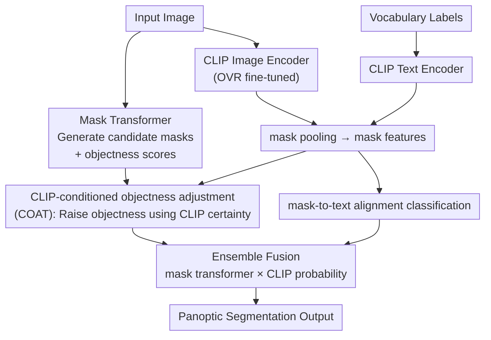

# Mitigating Objectness Bias and Region-to-Text Misalignment for Open-Vocabulary Panoptic Segmentation

**Conference**: CVPR 2026  
**Paper**: [CVF Open Access](https://openaccess.thecvf.com/content/CVPR2026/html/Kormushev_Mitigating_Objectness_Bias_and_Region-to-Text_Misalignment_for_Open-Vocabulary_Panoptic_Segmentation_CVPR_2026_paper.html)  
**Code**: Available (The paper claims it is open-sourced; repository address not provided in original text, ⚠️ refer to original paper)  
**Area**: Open-Vocabulary Panoptic Segmentation / Vision-Language Models  
**Keywords**: Open-vocabulary panoptic segmentation, objectness bias, CLIP, mask-to-text alignment, FC-CLIP

## TL;DR
OVRCOAT addresses the issues in open-vocabulary panoptic segmentation where "unseen objects are discarded as background" and "CLIP regional features misalign with categories." It introduces a lightweight "CLIP-conditioned objectness adjustment via COAT" and "mask-level image-text alignment fine-tuning (OVR)." This approach pushes Panoptic Quality (PQ) to a new SOTA on ADE20K (relative +5.5%) while being more memory-efficient than previous full fine-tuning schemes.

## Background & Motivation

**Background**: The mainstream paradigm for open-vocabulary panoptic segmentation involves using a mask transformer to propose candidate masks, filtering them with an objectness score, and classifying the remaining masks using a Vision-Language Model (VLM) like CLIP or ALIGN. Representative works include FC-CLIP, which uses a frozen convolutional CLIP backbone for both feature extraction and classification, and MAFT+, which further fine-tunes the backbone to enhance mask classification.

**Limitations of Prior Work**: The authors identify two coupled issues hindering this paradigm. First is **mask selection bias**: the objectness head is trained on closed-vocabulary data (e.g., COCO), leading it to assign very low objectness scores to categories not labeled during training. Consequently, these masks are discarded as background before classification. An example in Figure 1 shows that FC-CLIP / MAFT+ discard a painting on a wall as background when "painting" is not in the training set. Second is **CLIP's weak regional understanding**: CLIP is optimized for global image-text retrieval, and its contrastive loss only enforces global alignment. At the local mask or pixel level, features fail to align precisely with boundaries, resulting in poor mask-level classification.

**Key Challenge**: The objectness score is essentially a normalized similarity between a global mask feature and a pre-trained **void token**, which is naturally biased toward the training vocabulary. If a test category appears in an "unlabeled region" of the training images, the void token is more likely to classify it as background. Furthermore, while VLM fine-tuning aims to fix regional alignment, it often leads to overfitting due to limited panoptic training data and narrow vocabularies, ultimately weakening CLIP’s inherent open-vocabulary generalization. In other words, attempts to **fix objectness bias** and **fix regional alignment** have previously been either ignored or resulted in a loss of generalization.

**Goal**: Alleviate objectness bias (retaining OOV masks) and region-text misalignment (improving mask classification) without compromising the openness provided by CLIP's large-scale pre-training, while maintaining lower memory overhead and plug-and-play capability compared to existing fine-tuning methods.

**Core Idea**: Utilize CLIP's own classification certainty to "unshackle" the objectness score from the training vocabulary bias. Additionally, design a lightweight fine-tuning protocol that performs image-text alignment specifically at the mask level with a two-stage freezing strategy, enabling CLIP to focus on local regions without losing global generalization.

## Method

### Overall Architecture
OVRCOAT follows the standard panoptic segmentation framework (Mask2Former + Frozen/Fine-tuned CLIP; backbone: OpenCLIP ConvNeXt-Large). It inserts two modules: **COAT** adjusts the objectness scores generated by the mask transformer using CLIP's classification certainty to prevent OOV masks from being discarded; **OVR** improves classification by utilizing a mask-to-text alignment objective. CLIP image encoder features (fine-tuned via OVR) are pooled per mask and compared with CLIP text embeddings. Finally, mask transformer and CLIP classification probabilities are ensembled for the panoptic output. Both modules are "add-on" components, complementary yet decoupled.

### Key Designs

**1. COAT: Unshackling Objectness Scores with CLIP Certainty**

This addresses the issue where the objectness head, tied to the training vocabulary, discards OOV masks. The authors note that the classification probability density is defined as $\mathbf{p}_\mathrm{cls} = [\mathbf{p}_\mathrm{ens}\cdot p_\mathrm{obj},\, 1 - p_\mathrm{obj}]$, where $p_\mathrm{obj}$ acts as a gate. If $p_\mathrm{obj}$ is low, the mask is rejected as void. COAT introduces a "bias-free" second opinion from CLIP. For a candidate mask $\mathbf{M}_i$, global mask pooling yields feature $\mathbf{F}_{\mathrm{seg},i} = \frac{\sum_{u,v}\mathbf{M}_i(u,v)\cdot\mathbf{F}_\mathrm{img}(u,v)}{\sum_{u,v}\mathbf{M}_i(u,v)}$. The CLIP classification certainty is defined as $p_\mathrm{cer}=\max_i p_{\mathrm{CLIP},i}$, where $p_{\mathrm{CLIP},i}=\mathrm{softmax}(\mathbf{F}_{\mathrm{seg},i}\mathbf{F}_\mathrm{txt}^\top)$. The objectness is then adjusted:

$$p_\mathrm{obj}' = 1 - (1 - \gamma\, p_\mathrm{cer})(1 - p_\mathrm{obj})$$

Here $\gamma$ is the "CLIP trust factor." The formulation ensures that if CLIP is certain (high $p_\mathrm{cer}$), it raises the objectness of an OOV mask underestimated by the mask transformer. Since CLIP regional features contain localization noise, the authors set $\gamma=0.5$ (conservative). This correction is applied at **test time** with zero additional training.

**2. OVR: Mask-level Image-Text Alignment Fine-tuning**

This addresses CLIP's regional misalignment. OVR is a fine-tuning protocol: during training, for each candidate mask, mask embedding is derived via **local pooling** and matched with text embeddings. The objective is supervised using cross-entropy $\mathcal{L}_\mathrm{cls}$ (labels obtained via Hungarian matching). Total loss:

$$\mathcal{L} = \alpha\,\mathcal{L}_\mathrm{cls} + \mathcal{L}_\mathrm{M2F}$$

where $\alpha=0.1$. Unlike ODISE, which repeatedly runs the CLIP backbone on cropped masks, OVR extracts features once and reuses them via mask pooling, making it significantly more memory-efficient.

**3. Two-stage Freezing: Preserving CLIP Generalization under Small Data Fine-tuning**

Directly fine-tuning the CLIP image encoder on small panoptic datasets risks overfitting. The authors use a two-stage strategy: Stage 1 **freezes the CLIP image encoder** to pre-train mask generation without disturbing the CLIP embedding space. Stage 2 **unfreezes the CLIP image encoder** for joint fine-tuning of embedding-mask alignment, while keeping final projection MLPs and normalization layers frozen (constrained training). This helps the model learn local alignment without destroying pre-trained knowledge.

### Loss & Training
Total loss: $\mathcal{L}=\alpha\mathcal{L}_\mathrm{cls}+\mathcal{L}_\mathrm{M2F}$ ($\alpha=0.1$). Optimizer: AdamW, weight decay 0.05. Learning rate: $1\times10^{-4}$ (Stage 1), $5\times10^{-5}$ (Stage 2). Trust factor $\gamma=0.5$. Trained on COCO closed-set panoptic data only, using 3x A100 (40GB) with batch size 9. Evaluation is zero-shot on ADE20K, Cityscapes, and Mapillary Vistas.

## Key Experimental Results

### Main Results
Trained on COCO and evaluated zero-shot. OVRCOAT consistently outperforms previous SOTAs on OOV datasets. Average PQ is approximately 16% higher than MAFT+. PQ on COCO (seen) is slightly lower than ODISE (-1.4%), a trade-off for using CLIP to replace the specialized COCO objectness evaluation.

| Dataset | Metric | Ours (OVRCOAT) | FC-CLIP | MAFT+pan |
|--------|------|------|----------|----------|
| ADE20K | PQ | **28.6** | 26.8 | 27.1 |
| ADE20K | SQ | 77.3 | 71.2 | 73.5 |
| Mapillary Vistas | PQ | **19.6** | 18.3 | 15.7 |
| Mapillary Vistas | SQ | **65.7** | 56.0 | 55.5 |
| Cityscapes | PQ | **45.3** | 44.0 | 38.3 |
| COCO (seen) | PQ | 54.6 | 54.4 | 50.3 |

### Ablation Study
Incremental impact of COAT and OVR (Baseline: FC-CLIP):

| COAT | OVR | ADE20K | Mapillary | Cityscapes | COCO |
|------|-----|--------|-----------|------------|------|
| ✗ | ✗ | 26.8 | 18.3 | 44.0 | 54.4 |
| ✓ | ✗ | 27.6 | 18.8 | 44.6 | 53.7 |
| ✗ | ✓ | 27.6 | 19.2 | 44.5 | **55.5** |
| ✓ | ✓ | **28.6** | **19.6** | **45.3** | 54.6 |

COAT consistently improves PQ on OOV datasets (rel. +1.4%–3%), and OVR improves results by 1%–5%. The combination yields the best performance on OOV data, though COAT causes a slight drop on COCO seen vocabulary (54.4 → 53.7).

### Key Findings
- **Unseen classes benefit most**: On ADE20K, unseen classes show an average +3.9pp (+25% relative) improvement. Classes like "painting" show a 192% relative increase, while seen classes remain stable (-0.05pp).
- **Training frequency dictants seen class trends**: Within seen classes, those with fewer samples (e.g., apparel, boat) improved, while highly frequent classes showed minor decreases.
- **COAT is specialized for panoptic tasks**: In semantic segmentation, OVR still improves performance, but adding COAT leads to a slight decrease. This is because semantic segmentation does not discard masks, making objectness adjustment redundant and prone to CLIP's localization noise.

## Highlights & Insights
- **Attributing mask bias to the void token's bias** is a precise diagnosis, leading to a clean, zero-training, plug-and-play solution using CLIP's certainty.
- **The adjustment formula $p_\mathrm{obj}'$** naturally provides an "upper bound" semantic—it allows CLIP to "lift" scores without arbitrary suppression, which is more elegant than hard thresholding.
- **Mask pooling for feature reuse** avoids the heavy overhead of cropping-based CLIP calls, making the method memory-friendly and easily integrable with other mask-transformer models.
- **The honest analysis of negative results** in semantic segmentation explains the boundaries of the method's effectiveness, reinforcing its validity for panoptic-specific scenarios.

## Limitations & Future Work
- **Trade-off on seen classes (COCO)**: Replacing specialized objectness leads to a minor PQ drop on COCO compared to ODISE.
- **Reliance on CLIP regional feature quality**: The trust factor $\gamma=0.5$ is a compromise due to CLIP's inherent localization noise.
- **Task Specificity**: The method is explicitly designed for tasks that involve "discarding masks" (panoptic) and does not generalize to semantic segmentation.
- **Future Directions**: Exploring adaptive trust factors $\gamma$ or replacing CLIP with stronger region-aware pre-trained VLMs could potentially recover seen-class performance.

## Related Work & Insights
- **vs FC-CLIP**: OVRCOAT adds COAT and OVR without altering the core architecture, consistently outperforming FC-CLIP on all OOV datasets.
- **vs MAFT+**: MAFT+ involves heavy backbone fine-tuning that degrades on certain OOV datasets. OVRCOAT uses a more stable, memory-efficient two-stage constrained fine-tuning.
- **vs ODISE**: While ODISE is stronger on COCO, its mask-cropping inference is expensive. OVRCOAT significantly leads on other datasets (e.g., Cityscapes rel. +90% improvement) with lower computational cost.

## Rating
- Novelty: ⭐⭐⭐⭐ Accurate diagnosis of void token bias and test-time CLIP correction is novel, though it acts as a module enhancement for existing paradigms.
- Experimental Thoroughness: ⭐⭐⭐⭐ Extensive testing on three OOV datasets + semantic segmentation + per-class analysis.
- Writing Quality: ⭐⭐⭐⭐ Clear logical chain from diagnosis to solution, with insightful negative result analysis.
- Value: ⭐⭐⭐⭐ Highly practical due to plug-and-play nature and memory efficiency; refreshes ADE20K SOTA.

<!-- RELATED:START -->

## Related Papers

- [\[CVPR 2026\] MARIS: Marine Open-Vocabulary Instance Segmentation](maris_marine_open-vocabulary_instance_segmentation.md)
- [\[CVPR 2026\] S2C2Seg: Semantic-Spatial Consistency and Category Optimization for Open-Vocabulary Segmentation](s2c2seg_semantic-spatial_consistency_and_category_optimization_for_open-vocabula.md)
- [\[CVPR 2026\] PEARL: Geometry Aligns Semantics for Training-Free Open-Vocabulary Semantic Segmentation](pearl_geometry_aligns_semantics_for_training-free_open-vocabulary_semantic_segme.md)
- [\[CVPR 2026\] Seeing Both Sides: Towards Bidirectional Semantic Alignment for Open-Vocabulary Camouflaged Object Segmentation](seeing_both_sides_towards_bidirectional_semantic_alignment_for_open-vocabulary_c.md)
- [\[CVPR 2026\] Test-Time Multi-Prompt Adaptation for Open-Vocabulary Remote Sensing Image Segmentation](test-time_multi-prompt_adaptation_for_open-vocabulary_remote_sensing_image_segme.md)

<!-- RELATED:END -->
