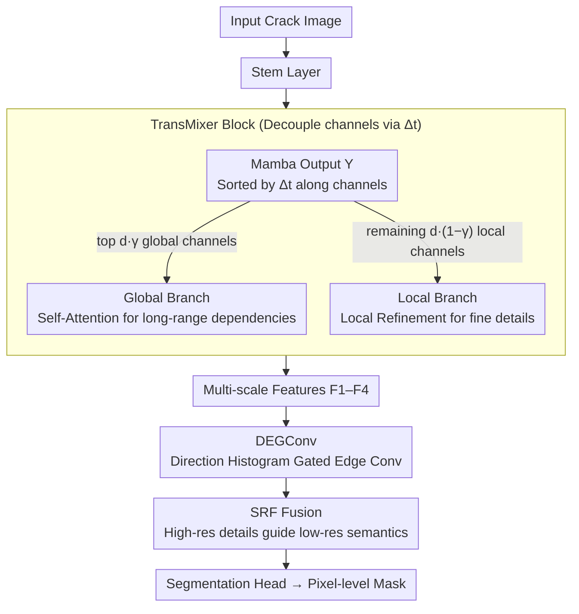

# MixerCSeg: An Efficient Mixer Architecture for Crack Segmentation via Decoupled Mamba Attention

**Conference**: CVPR 2026  
**arXiv**: [2603.01361](https://arxiv.org/abs/2603.01361)  
**Code**: [GitHub](https://github.com/spiderforest/MixerCSeg)  
**Area**: Segmentation / Crack Segmentation  
**Keywords**: Crack segmentation, Hybrid architecture, Mamba attention decoupling, Direction-guided edge convolution, Lightweight and efficient

## TL;DR

Ours proposes MixerCSeg, which decouples channels into global/local branches by analyzing the implicit attention mechanism of Mamba. These branches are respectively enhanced with Self-Attention and CNN, combined with direction-guided edge gated convolutions. It achieves SOTA performance in crack segmentation with 2.05 GFLOPs and 2.54M parameters.

## Background & Motivation

Crack segmentation is a critical technology for infrastructure health monitoring, yet it faces challenges such as diverse crack morphologies, uneven texture distribution, and low contrast against backgrounds. Existing architectures have specific shortcomings:

- **CNN**: Strong local feature extraction but insufficient global modeling, making it difficult to handle complex morphologies.
- **Transformer**: Strong global dependency modeling but high computational overhead.
- **Mamba**: Global focus with linear complexity, but its sequential processing mechanism limits global context utilization within a single forward pass.

Existing hybrid models (MambaVision, RestorMixer) involve simple stacking of different architectures without deep analysis of their internal interaction logic. The **Key Insight** of this paper: **Mamba's implicit attention naturally differentiates into global and local channels** (identified through $\Delta_t$ analysis), allowing targeted allocation for CNN, Transformer, and Mamba modules.

## Method

### Overall Architecture

MixerCSeg aims to resolve the **Key Challenge** of crack segmentation: "diverse morphology, low contrast, and the need for lightweight deployment." The structure is an encoder-decoder: the input passes through a Stem layer, followed by multiple TransMixer Blocks to extract multi-scale features $\{F_1, F_2, F_3, F_4\}$; these features are injected with direction and edge priors via DEGConv, then fused by the SRF module where high-resolution details guide low-resolution semantics, finally reaching the segmentation head for pixel-level crack masks. The **Mechanism** is "to let CNN, Transformer, and Mamba handle the channels they specialize in" rather than simply stacking them.

### Key Designs

**1. TransMixer Block: Channel Decoupling via Mamba $\Delta_t$**

The **Design Motivation** stems from the "mindless stacking" issues in previous hybrid architectures. Ours first processes a standard Mamba (Eq.1-2) to obtain output $Y$, then uses $\Delta_t$ (the factor controlling the influence of historical tokens on the current token) as a criterion for global/local differentiation. Channels are sorted: those with high $\Delta_t$ value (fast decay, concentrating more on current tokens/global structure) are selected as the top $d_g = d \cdot \gamma$ **global tokens**, while the rest $d_l = d \cdot (1-\gamma)$ serve as **local tokens** (default $\gamma = 0.5$).

The global branch uses Self-Attention to supplement long-range dependencies, while the local branch utilizes a Local Refinement Module (Norm → Reshape → MaxPool2d → Conv $1\times 1$ → Sigmoid gating → multiply with original features) for fine-grained details.

**2. Direction-guided Edge Gated Convolution (DEGConv)**

Cracks are slender structures with explicit orientations, which isotropic convolutions fail to perceive. DEGConv injects direction priors in three steps: (a) **Rearrange**—Split feature maps into $N$ non-overlapping local views $F_i^j \in \mathbb{R}^{C_i \times h_i \times w_i}$ for independent processing; (b) **Direction Embedding Generation**—Calculate horizontal/vertical gradients using Sobel operators, obtain arc direction $\theta = \arctan(d_y/d_x)$, construct direction histograms by cell and bin, and compress into a direction embedding vector $\epsilon \in \mathbb{R}^{C_i}$ via Conv + ReLU + AvgPool; (c) **Gated Edge Convolution**—$g = \sigma_2(\text{EdgeConv}(F_i^j + \epsilon))$, ${F_i^j}' = g \odot \text{EdgeConv}(F_i^j)$, where EdgeConv uses $1 \times k$ and $k \times 1$ strip convolutions followed by concatenation and depthwise convolution.

**3. Spatial Refinement Multi-Level Fusion (SRF)**

In direct multi-scale feature concatenation, high-resolution edge details are easily overwhelmed by low-resolution semantics. SRF uses high-resolution features $F_1'$ to generate a spatial attention map $\alpha = \sigma_2(\text{Conv}_{1\times1}(F_1'))$, point-wise weighting the upsampled low-resolution features $F_i'' = \alpha \odot F_i^{up}$.

### Loss & Training

- BCE + Dice Loss, ratio 1:5.
- Single NVIDIA A100, 50 epochs, batch size=1.
- AdamW optimizer, initial lr=5e-4.
- Input size 512×512.
- Hyperparameters: $\gamma=0.5$, cell size=(8,8), bin number $n=180$ (36 for Crack500 due to smoother curvature and larger width).

## Key Experimental Results

### Main Results

| Dataset | Metric (mIoU) | MixerCSeg (Ours) | Prev. SOTA | Gain |
|--------|------|------|----------|------|
| DeepCrack | mIoU | **0.9151** | 0.9022 (SCSegamba) | +1.43% |
| CamCrack789 | mIoU | **0.8409** | 0.8372 (U-Net) | +0.44% |
| CrackMap | mIoU | **0.8123** | 0.8094 (SCSegamba) | +0.36% |
| Crack500 | mIoU | **0.7824** | 0.7778 (SCSegamba) | +0.59% |
| DeepCrack | F1 | **0.9205** | 0.9110 (SCSegamba) | +1.04% |

| Model | FLOPs (G) | Params (M) | Memory (MiB) |
|------|-----------|------------|-------------|
| **MixerCSeg (Ours)** | **2.05** | **2.54** | **1190** |
| SCSegamba | 18.16 | 2.80 | 2206 |
| RestorMixer | 98.71 | 3.19 | 10384 |
| MambaVision | 642.86 | 13.57 | 5222 |

### Ablation Study

| Config | DeepCrack mIoU | CamCrack mIoU | Description |
|------|---------|---------|------|
| Baseline (VMamba+Segformer) | 0.8826 | 0.8283 | No extra modules |
| + TransMixer | 0.9016 | 0.8359 | Significant encoder enhancement |
| + DEGConv | 0.9097 | 0.8381 | Direction/edge modeling |
| + SRF | **0.9151** | **0.8409** | Multi-level fusion refined |

### Key Findings

- MixerCSeg reduces **FLOPs by 88.7%** compared to SCSegamba while achieving higher mIoU—the efficiency advantage is extremely significant.
- TransMixer is more effective than simple stacking methods (MambaVision, RestorMixer), validating that decoupling based on attention characteristics is superior.
- $\gamma = 0.5$ (equal global/local split) is the optimal channel allocation ratio.
- Memory usage is only 1190 MiB, making it suitable for edge deployment.

## Highlights & Insights

- **Architecture Design from Mechanism Analysis**: Instead of intuitive mixing, it identifies channel-level global/local differentiation by analyzing Mamba's $\Delta_t$ weights.
- Direction embeddings introduce crack-specific prior knowledge (Sobel → Direction Histogram → Embedding), enhancing perception of irregular geometries.
- **Extreme Efficiency**: 2.05 GFLOPs + 2.54M parameters, one to two orders of magnitude smaller than most methods with better performance.
- SRF fuses features via high-resolution guidance rather than simple concatenation without adding computational cost.

## Limitations & Future Work

- Validated only on crack segmentation; generalizability to general semantic segmentation (e.g., Cityscapes) needs verification.
- Spatial block partitioning in DEGConv might cause discontinuities at boundaries, though mitigated by a subsequent EdgeConv layer.
- Bin counts in direction histograms require manual tuning and lack an adaptive mechanism.

## Related Work & Insights

- **SCSegamba**: Pioneer in using Mamba for crack segmentation, designing structure-aware scanning strategies.
- **MambaVision**: First Mamba-Transformer hybrid vision backbone, but relies on simple stacking.
- **Insight**: Designing architectures from internal model attention mechanisms (rather than intuitive concatenation) is a more principled hybrid strategy.

## Rating

- Novelty: ⭐⭐⭐⭐ (Channel decoupling based on Mamba implicit attention is novel and theoretically grounded)
- Experimental Thoroughness: ⭐⭐⭐⭐ (4 datasets, 7 SOTA comparisons, complete ablation and efficiency analysis)
- Writing Quality: ⭐⭐⭐⭐ (Clear diagrams, logical derivation from theory to architecture)
- Value: ⭐⭐⭐⭐ (Excellent trade-off between efficiency and accuracy for practical applications)

<!-- RELATED:START -->

## Related Papers

- [\[CVPR 2026\] CrackSSM: Reviving SSMs for Crack Segmentation via Dynamic Scanning](crackssm_reviving_ssms_for_crack_segmentation_via_dynamic_scanning.md)
- [\[CVPR 2026\] Annotation-Efficient Coreset Selection for Context-dependent Segmentation](annotation-efficient_coreset_selection_for_context-dependent_segmentation.md)
- [\[CVPR 2026\] LEMMA: Laplacian Pyramids for Efficient Marine Semantic Segmentation](lemma_laplacian_pyramids_for_efficient_marine_semantic_segmentation.md)
- [\[ICCV 2025\] Inter2Former: Dynamic Hybrid Attention for Efficient High-Precision Interactive Segmentation](../../ICCV2025/segmentation/inter2former_dynamic_hybrid_attention_for_efficient_high-precision_interactive_s.md)
- [\[CVPR 2026\] Efficient Video Object Segmentation and Tracking with Recurrent Dynamic Submodel](efficient_video_object_segmentation_and_tracking_with_recurrent_dynamic_submodel.md)

<!-- RELATED:END -->
