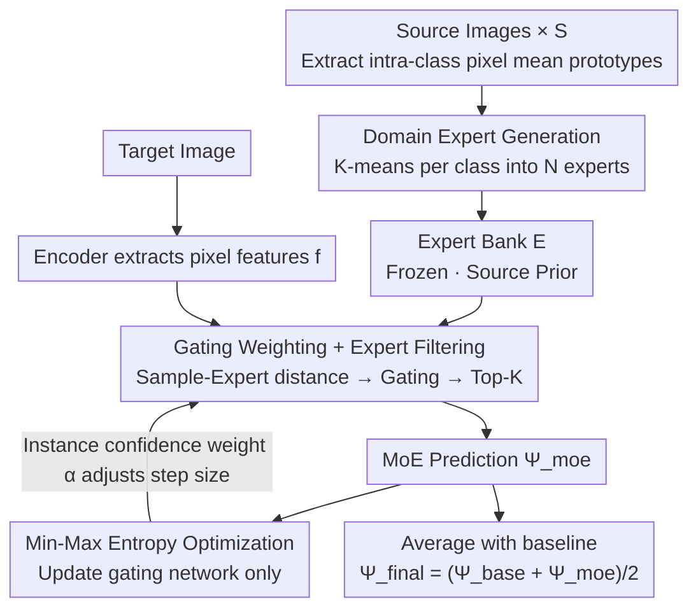

# Mixture of Prototypes for Test-time Adaptive Segmentation

**Conference**: CVPR 2026  
**Paper**: [CVF Open Access](https://openaccess.thecvf.com/content/CVPR2026/html/Li_Mixture_of_Prototypes_for_Test-time_Adaptive_Segmentation_CVPR_2026_paper.html)  
**Area**: Semantic Segmentation / Test-time Adaptation  
**Keywords**: Test-time Adaptation, Semantic Segmentation, Mixture-of-Experts (MoE), Prototypical Clustering, Entropy Optimization

## TL;DR
The conventional "one prototype per class" approach in TTA-Seg is upgraded to a "cluster of experts per class." By using K-means to cluster intra-class prototypes from the source domain into multiple experts, employing a gating network for dynamic instance-wise weighted fusion, and applying min-max entropy optimization to update only the gating module, this method achieves new SOTA results on benchmarks such as Cityscapes→ACDC and GTA5→Real.

## Background & Motivation
**Background**: Test-time Adaptive Segmentation (TTA-Seg) aims to adapt a model pre-trained on a source domain to unsupervised test data experiencing distribution shifts (e.g., adverse weather like fog, night, rain, and snow) during deployment. Due to privacy and storage constraints, source data is unavailable during testing. The mainstream approach involves averaging pixel features for each class during source training to store as **class-wise prototypes**, which serve as proxies for source knowledge to guide adaptation.

**Limitations of Prior Work**: Two critical flaws in the "one prototype per class" pipeline are identified. First, on the source side, compressing an entire class into a single average vector assumes a unimodal intra-class distribution, thereby **erasing the diversity of source samples** (e.g., "road" features differ significantly between day/night or different cities). Second, on the test side, prototypes are applied in an "instance-agnostic" manner to all test samples, **ignoring the varying degrees of distribution shift across different test instances**. Treating a thick fog image the same as a light rain image via the same prototype is suboptimal. Furthermore, updating prototypes (via momentum or backpropagation) risks accumulating errors from noisy pseudo-labels, while fixed prototypes fail to bridge the domain gap.

**Key Challenge**: A single prototype lacks both "representativeness" and "adaptability"—it cannot characterize intra-class diversity nor dynamically adjust the utilization of source knowledge based on the test instance.

**Goal**: To enable source knowledge to represent intra-class diversity and be dynamically invoked per instance during testing. This is decomposed into two sub-problems: (1) represent a class more richness on the source side; (2) fuse knowledge dynamically at test time based on sample-knowledge correlation.

**Key Insight**: The Mixture-of-Experts (MoE) paradigm is introduced into TTA-Seg. Since one prototype is insufficient, **multiple experts** are prepared for each class (each corresponding to a sub-distribution). A gating network then dynamically assigns weights based on the correlation between the current sample and each expert.

**Core Idea**: Replace "single prototype per class + static application" with "multi-experts per class + dynamic gating fusion + min-max entropy optimization." This achieves plug-and-play test-time adaptation without modifying the backbone parameters.

## Method

### Overall Architecture
The method consists of two stages. **Source Training Stage**: Pixel feature means are calculated per class for each source image to generate local prototypes. K-means clustering is then performed on the prototype set of each class to condense them into $N$ **domain experts**, which are saved as source distribution priors (the source data is no longer needed). **Test Adaptation Stage**: For a target image, the encoder extracts pixel features. The distance between each pixel and various experts is calculated and passed through a gating network to obtain weights. After Top-K filtering, weighted aggregation yields the MoE prediction $\Psi_{moe}$. Finally, min-max entropy loss (combined with instance-level confidence weights $\alpha$) is used to **backpropagate and update only the gating network**, while the backbone and experts remain frozen. The final prediction is the average of the MoE and the original baseline predictions.

### Key Designs

**1. Domain Expert Generation: Retaining intra-class diversity via clustering**

To address the loss of source diversity caused by compressing a class into a single vector, the authors treat each class as a composite of sub-distributions. During source training, local prototypes $p_c^s$ are obtained by averaging pixel features of class $c$ in source sample $s$. After processing $S$ source images, each class $c$ has a set $P_c=\{p_c^s\}_{s=1}^{S}$. K-means is applied to this set to generate $N$ representative experts: $E_c=\text{K-means}(P_c, N)$, where $N\ll S$. Each class is thus represented by $N$ experts characterizing different sub-distributions (e.g., "road" under different lighting). Compared to direct storage, clustering compresses computation while maintaining the multi-modal structure better than a global mean.

**2. Dynamic Gating Fusion + Expert Filtering: Instance-specific weighting and filtering**

To address instance-agnostic prototype application, a gating network is introduced. For a test pixel feature $f$, the average Euclidean distance matrix to each expert of class $c$ is calculated: $x_c^n=\frac{1}{hw}\sum_{(i,j)}\lVert F_{(i,j)}-e_n\rVert_2$. These are fed into the gating network to obtain values $G=\mathcal{G}(X)$. The aggregated distance for class $c$ is the gating-weighted sum of individual expert distances: $D(f,E_c)=\sum_{n=1}^{N} g_n\cdot\lVert f-e_n\rVert_2$. To prevent experts with source-specific patterns from interfering, **Top-K filtering** is applied: $G_c=\text{Softmax}(\text{TopK}(G_c, K))$. Final class scores are given by the negative softmax of aggregated distances: $\Psi_{moe}=\text{Softmax}([-D(f,E_1),\dots,-D(f,E_C)]^\top)$.

**3. Min-Max Entropy Optimization: Balancing confidence and expert utilization**

Updating the gating network solely with entropy minimization can lead to **gating collapse**, where only a few experts are ever selected. A min-max objective is designed: **entropy minimization** on the MoE prediction to reduce uncertainty and promote adaptation:

$$\mathcal{L}_{min}=-\frac{1}{hw}\sum_{(i,j)}\sum_{c=1}^{C}\Psi_{moe}^c(i,j)\log\Psi_{moe}^c(i,j).$$

Simultaneously, **entropy maximization** is applied to the gating values to force the network to utilize all experts uniformly and avoid over-reliance:

$$\mathcal{L}_{max}=\frac{1}{C}\sum_{c=1}^{C}\Big(\frac{1}{N}\sum_{n=1}^{N} g_n\log g_n\Big).$$

This combination ensures the model remains confident in its predictions while fully utilizing the expert library.

**4. Instance Confidence Weighting: Self-adaptive step size adjustment**

To handle varying levels of agreement between target samples and experts, a confidence-guided weight $\alpha$ is used to quantify domain drift:

$$\alpha=\frac{1}{hw}\sum_{(i,j)}\delta\big(\max_c\Psi(i,j)>Q\big),$$

where $\alpha$ represents the proportion of high-confidence pixels in the baseline prediction. A high $\alpha$ suggests low domain drift, allowing for **faster updates**, while a low $\alpha$ triggers **cautious updates**. The total loss is $\mathcal{L}_{total}=\alpha\cdot(\mathcal{L}_{min}+\beta\cdot\mathcal{L}_{max})$.

### Loss & Training
The source stage only involves prototype extraction and K-means. During testing, the only learnable parameter is the gating network (a $C\times C$ linear layer). Key hyperparameters (Cityscapes→ACDC): $N=14$, $K=7$, $\beta=0.01$, $Q=0.69$, batch size=1. The module is plug-and-play and backbone-agnostic.

## Key Experimental Results

### Main Results

TTA task for Cityscapes→ACDC (mIoU, mean across four weather types):

| Method | Fog | Night | Rain | Snow | Mean-mIoU↑ |
|------|-----|-------|------|------|-----------|
| Source | 69.1 | 40.3 | 59.7 | 57.8 | 56.7 |
| TENT | 69.0 | 40.3 | 59.9 | 57.7 | 56.7 |
| CoTTA | 70.9 | 41.2 | 62.6 | 59.8 | 58.6 |
| BECoTTA (MoE) | 71.5 | 42.5 | 63.3 | 59.6 | 59.2 |
| SVDP | 71.6 | 42.7 | 64.2 | 60.2 | 59.7 |
| **Ours** | **72.9** | **43.1** | 63.5 | **62.8** | **60.6** |

GTA5→Real (Sim-to-Real TTA, mIoU):

| Method | Cityscapes | BDD100K | Mapillary | Avg↑ |
|------|-----------|---------|-----------|------|
| Source | 35.87 | 29.89 | 38.67 | 34.81 |
| SITA | 40.64 | 32.94 | 37.80 | 37.13 |
| MedBN | 39.06 | 33.03 | 39.64 | 37.24 |
| **Ours** | **42.26** | **33.97** | **40.90** | **39.04** |

In continual TTA (CTTA), the proposed method achieves a mean mIoU of **62.5**, outperforming SVDP (61.3) and BECoTTA (by **3.4%**) with a negligible FLOPs overhead of +2.33%.

### Ablation Study

CTTA (Cityscapes→ACDC sub-domains, Avg mIoU):

| Config | $\mathcal{L}_{min}$ | EF | $\mathcal{L}_{max}$ | IW | Avg |
|------|:---:|:---:|:---:|:---:|:---:|
| #0 | | | | | 61.1 |
| #1 | ✓ | | | | 57.9 |
| #2 | ✓ | ✓ | | | 61.7 |
| #3 | ✓ | ✓ | ✓ | | 62.0 |
| #4 | ✓ | ✓ | | ✓ | 62.0 |
| #5 | ✓ | ✓ | ✓ | ✓ | **62.4** |

(EF=Expert Filtering/Top-K, IW=Instance Weighting)

### Key Findings
- **Expert filtering is a stabilizer**: Entropy minimization alone (#1) leads to a performance drop of 3.2% compared to no optimization (#0). Adding Top-K filtering (#2) restores it to 61.7%, highlighting the need to filter out disruptive source-specific experts.
- **$\mathcal{L}_{max}$ prevents collapse**: Maximizing gating entropy ensures a more balanced utilization of experts across the library.
- **K-means vs. others**: Clustering-based experts consistently outperform Farthest Point Sampling (FPS) and Autoencoders (AE) as source domain priors.

## Highlights & Insights
- **Transition from "Single Prototype" to "Expert Clusters"**: Upgrading class prototypes to an MoE framework is a natural and effective way to preserve intra-class diversity.
- **Min-max entropy logic**: Balancing prediction confidence and selection diversity provides a robust mechanism to prevent routing collapse in sparse models.
- **True Plug-and-Play**: By freezing the backbone and updating only a small gating linear layer, the method avoids catastrophic forgetting, which is crucial for CTTA.
- **Instance confidence as an adaptive learning rate**: Using the high-confidence pixel ratio $\alpha$ to modulate update steps is an intuitive signal for managing domain drift.

## Limitations & Future Work
- **Static expert count $N$**: K-means clusters $N$ is fixed for all classes, ignoring that different classes have varying levels of intra-class complexity.
- **Source accessibility**: Experts must be generated during a controlled source training phase, making the method inapplicable to strictly black-box source models.
- **Domain scope**: Evaluations are focused on autonomous driving; applicability to medical or remote sensing domains remains to be verified.

## Related Work & Insights
- **vs. BECoTTA**: While both use MoE for CTTA, BECoTTA focuses on domain-specific experts and domain-expert alignment. This work utilizes domain-shared experts and encourages diverse selection via choice-entropy maximization, leading to a 3.4% performance gain.
- **vs. TENT / SURGEON**: These methods update BN or backbone weights, which can lead to forgetting. This work updates only the gating parameters, ensuring stability.
- **vs. DIGA / SITA**: Non-parametric methods are efficient but limited in learning capacity. This method offers a better trade-off by involving backpropagation on a tiny module.

## Rating
- Novelty: ⭐⭐⭐⭐ 
- Experimental Thoroughness: ⭐⭐⭐⭐ 
- Writing Quality: ⭐⭐⭐⭐ 
- Value: ⭐⭐⭐⭐ 

<!-- RELATED:START -->

## Related Papers

- [\[CVPR 2026\] Test-Time Multi-Prompt Adaptation for Open-Vocabulary Remote Sensing Image Segmentation](test-time_multi-prompt_adaptation_for_open-vocabulary_remote_sensing_image_segme.md)
- [\[CVPR 2026\] The Golden Subspace: Where Efficiency Meets Generalization in Continual Test-Time Adaptation](the_golden_subspace_where_efficiency_meets_generalization_in_continual_test-time.md)
- [\[ICCV 2025\] Correspondence as Video: Test-Time Adaption on SAM2 for Reference Segmentation in the Wild](../../ICCV2025/segmentation/correspondence_as_video_test-time_adaption_on_sam2_for_reference_segmentation_in.md)
- [\[ICML 2025\] IT³: Idempotent Test-Time Training](../../ICML2025/segmentation/it3_idempotent_test-time_training.md)
- [\[CVPR 2026\] PromptMoE: A Segmentation Refinement Framework Leveraging Mixture of Experts for Improved Prompting](promptmoe_a_segmentation_refinement_framework_leveraging_mixture_of_experts_for_.md)

<!-- RELATED:END -->
