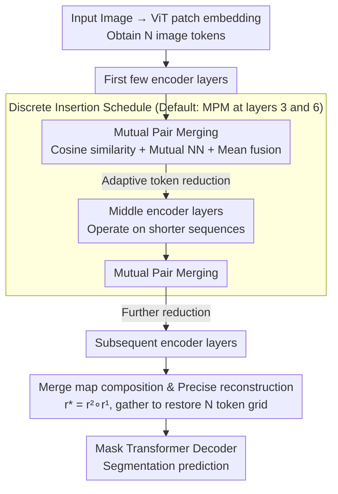

# MPM: Mutual Pair Merging for Efficient Vision Transformers

**Conference**: CVPR 2026 Findings  
**arXiv**: [2604.05718](https://arxiv.org/abs/2604.05718)  
**Code**: None  
**Area**: Segmentation  
**Keywords**: Token merging, Semantic segmentation, Vision Transformer, Inference acceleration, Training-free method

## TL;DR

This paper proposes Mutual Pair Merging (MPM), a parameter-free and training-free ViT token merging module. By utilizing mutual nearest neighbor pairing and mean fusion to reduce sequence length, MPM reduces ViT-Tiny latency by 60% on Raspberry Pi 5 for ADE20K and increases throughput by 20% on H100 with FlashAttention-2, while maintaining mIoU degradation within 3%.

## Background & Motivation

1. **Background**: Vision Transformers perform excellently in semantic segmentation, but the $O(N^2)$ complexity of self-attention causes inference costs to rise rapidly as resolution increases. Reducing sequence length (token reduction) is a natural approach for acceleration. Existing methods include token pruning/selection (DynamicViT, EViT) and token aggregation/merging (ToMe, ALGM).

2. **Limitations of Prior Work**: (a) Most token reduction works target classification tasks, whereas segmentation requires reconstructing pixel-aligned dense features, imposing stricter constraints on reduction; (b) Existing methods often report FLOPs or theoretical acceleration ratios, but on modern accelerators (e.g., GPUs with FlashAttention), the overhead of merging operations may offset or even reverse expected gains; (c) Many methods require fine-tuning or extra training parameters, hindering plug-and-play deployment.

3. **Key Challenge**: Token reduction theoretically reduces computation, but (a) segmentation requires reconstructing the full token sequence for the decoder, (b) additional overhead from merging operations can negate acceleration gains on optimized GPU kernels, and (c) variable-length sequences require padding, which affects batch throughput.

4. **Goal**: To design a training-free token merging method specifically for segmentation that achieves true end-to-end wall-clock speedup and honestly quantifies actual latency including merging overhead.

5. **Key Insight**: Use the simplest possible design—mutual nearest neighbor pairing and mean fusion—to minimize overhead. Control the speed-accuracy trade-off through discrete insertion position selection (rather than continuous thresholds or keep-rates) and save merge maps for precise reconstruction.

6. **Core Idea**: Use cosine similarity in feature space to find mutual nearest neighbor token pairs and merge them via averaging. Use integer merge maps to achieve gather-style precise reconstruction, requiring no modifications to the segmentation decoder.

## Method

### Overall Architecture

The input image passes through ViT patch embedding to obtain $N$ image tokens. MPM modules are inserted before specific layers of the ViT encoder (defaulting to the 3rd and 6th layers, 0-based index 2 and 5). Each insertion reduces the number of tokens (up to half, depending on the data), and subsequent layers operate on shorter sequences. After encoding, the saved merge maps are used via a gather operation to restore the original sequence of $N$ tokens, which is then fed into a standard Mask Transformer decoder for segmentation prediction.

### Key Designs

**1. Mutual Pair Merging: Eliminating Conflicts with Symmetric Conditions**

The most difficult problem in token merging is "who should merge with whom." If each token only unidirectionally searches for its most similar neighbor, a "popular" token might be targeted for merging by multiple tokens simultaneously, creating conflicts. ToMe addresses this with bipartite matching, which is computationally heavy. MPM employs a cleaner criterion: first, L2-normalize all image tokens and compute the dense cosine similarity matrix $S = \tilde{X}\tilde{X}^\top$. For each token $i$, find its most similar neighbor $b(i) = \arg\max_{j \neq i} S_{ij}$. A merging pair is formed **only if two tokens mutually identify each other as their nearest neighbor** ($b(i)=j$ and $b(j)=i$). The feature is the mean of the pair, taking the smaller index as the representative, while solitary tokens (those without a mutual nearest neighbor) are kept as is.

This symmetric condition naturally ensures uniqueness and determinism: a token can appear in at most one mutual nearest neighbor pair, eliminating conflicts and the need for matching arbitration. The process has no learnable parameters, does not rely on randomness, and requires no threshold tuning. Another benefit is **adaptive** compression—while theoretically up to 50% of tokens can be eliminated per round, in reality, the reduction fluctuates with image content; more homogeneous content leads to more merging, while complex textures lead to less.

**2. Multi-stage Merge Map Composition and Precise Reconstruction: Decoder Invariance**

Segmentation decoders (such as Mask Transformers) expect a full grid of $\frac{H}{P} \times \frac{W}{P}$ features. Once tokens are merged and sequences shortened in the encoder, the decoder loses alignment. MPM solves this by recording the merging process: each MPM call returns an integer mapping vector $r$, which records which merged representative each original token points to. When MPM is inserted twice, the two mappings are concatenated via index composition:

$$r^{(*)}(i) = r^{(2)}\big(r^{(1)}(i)\big)$$

After encoding, a single gather operation $Z_{\text{img}}^{\uparrow}[i] = Z_{\text{img}}[r^{(*)}(i)]$ restores the short sequence to the original grid of $N$ tokens. This is a pure copy operation (merged tokens take back the feature of their representative), which maintains the original raster-scan order and requires no changes to the decoder code. For example, 1024 tokens might be merged to ~800 at layer 3 and ~650 at layer 6; encoding runs on these shorter sequences, and before decoding, the composite $r^{(*)}$ "spreads" 650 features back into 1024 slots. Because reconstruction is a lookup rather than a deconvolution, space alignment is preserved regardless of insertion frequency.

**3. Discrete Insertion Scheduling: A "Knobless" Speed-Accuracy Trade-off**

Most token reduction methods rely on a continuous hyperparameter (keep-rate, similarity threshold) to tune the speed-accuracy trade-off, which often requires recalibration across datasets or scenes. MPM removes continuous knobs: the amount of compression is determined entirely by the natural sparsity of mutual nearest neighbors. The only variable is **where to insert MPM**—defaulting to once after layer 3 and once after layer 6 (index 2 and 5). Earlier insertion saves more computation in subsequent layers but results in higher accuracy loss, and vice versa. This provides a set of discrete position choices rather than a real-valued parameter to fine-tune.

This "knobless" design is particularly valuable for online deployment in fixed scenarios, such as 24/7 security cameras where lighting and scene statistics drift. A threshold tuned for daylight might fail at night, whereas MPM's behavior is calculated per-frame based on actual content. Results show that for the same scene, roughly 6% fewer tokens are merged at night due to reduced detail, with the adaptation occurring naturally without manual tuning.

### Loss & Training

MPM is a completely training-free module. It can be directly inserted into a pre-trained ViT encoder without introducing learnable parameters or requiring fine-tuning.

## Key Experimental Results

### Main Results (ADE20K, H100 without FlashAttention)

| Model | Method | mIoU | GFLOPs | FPS (B=32) |
|------|------|------|--------|------------|
| Seg-T/16 | No Merging | 38.1 | 25 | 660 |
| Seg-T/16 | ToMe | 38.1 | ~19 | 751 |
| Seg-T/16 | ALGM* | 38.9 | ~16.7 | 665 |
| Seg-T/16 | **MPM(2,5)** | 37.6 | ~17.6 | **831** |
| Seg-B/16 | No Merging | 48.5 | 258 | 133 |
| Seg-B/16 | **MPM(2,5)** | 48.0 | ~184 | **177** |
| Seg-L/16 | No Merging | 51.7 | 800 | 47 |
| Seg-L/16 | **MPM(2,5)** | 50.4 | ~496 | **74** |

### Cross-platform Latency Comparison

| Platform | ViT-T Original | MPM | Gain |
|------|-----------|-----|--------|
| Raspberry Pi 5 (B=1) | 1.06 FPS | 1.71 FPS | 1.61× |
| Raspberry Pi 5 (B=2) | 1.05 FPS | 1.75 FPS | 1.67× |
| H100 FA2 (B=32, ViT-L) | 375 FPS | 456 FPS | 1.22× |

### Ablation Study (Impact of Insertion Position)

Earlier insertion positions lead to more compression and higher acceleration at the cost of accuracy. The default (2,5) provides a consistent Pareto-optimal trade-off across multiple datasets and model scales.

### Key Findings

- **Actual wall-clock gain is not perfectly proportional to FLOPs reduction**: On H100 with FlashAttention-2, a 38% FLOPs reduction only increases FPS by 22% (ViT-L), as FA2 already highly optimizes attention computation.
- **Maximum gains on Raspberry Pi 5**: Edge devices lack parallelization optimizations, so token reduction translates directly into a linear decrease in latency.
- **Locality of merging**: Although MPM performs global pairing, most mutual nearest neighbor pairs occur between spatially adjacent patches in practice—the method naturally discovers spatial locality.
- **Controlled mIoU degradation**: The largest model Seg-L/16 drops from 51.7 to 50.4 (-1.3), while the smallest model Seg-T/16 drops from 38.1 to 37.6 (-0.5).
- **Cross-dataset consistency**: Reasonable speed-accuracy trade-offs are maintained across ADE20K, Pascal Context, and Cityscapes.

## Highlights & Insights

- **Honest efficiency evaluation** is the standout feature of this paper: Unlike many token reduction works that only report FLOPs, this study measures end-to-end latency on Raspberry Pi 5 and H100 (with/without FlashAttention-2) and isolates merge and reconstruction time. This sets a higher standard for the field.
- **"Knobless" design philosophy**: Achieving adaptive compression through the natural sparsity of mutual nearest neighbors avoids hyperparameters that require per-dataset adjustment. This is especially valuable for online deployment.
- **Simplicity is effective**: The entire method consists of cosine similarity, mutual nearest neighbors, mean values, and gather operations. It has no learnable parameters but achieves acceleration comparable to or better than complex methods like CTS or ALGM.

## Limitations & Future Work

- Although mIoU drop is small, it exists, making it potentially unsuitable for precision-critical scenarios like medical segmentation.
- Compared to methods requiring fine-tuning like ALGM, MPM typically has lower mIoU (ALGM sometimes even improves mIoU), suggesting a ceiling for training-free methods.
- The $O(N^2)$ similarity calculation for mutual nearest neighbors has its own overhead, which is currently small but could become a bottleneck at ultra-high resolutions.
- Combinations with other acceleration techniques (e.g., knowledge distillation, quantization) were not explored.
- The analysis of variable-length sequences on batch processing is insufficient—padding strategies may affect actual throughput.

## Related Work & Insights

- **vs ToMe**: ToMe uses bipartite matching with constant merging rates, whereas MPM uses mutual nearest neighbors with adaptive rates. MPM achieves higher FPS on segmentation tasks (831 vs 751 on Seg-T/16) due to lower merging overhead.
- **vs ALGM**: ALGM is a strong segmentation-specific baseline using a two-stage local-to-global merging strategy and requiring training. MPM's mIoU is slightly lower, but it is entirely training-free and more plug-and-play.
- **vs CTS**: CTS requires a policy network to decide token sharing. While it follows a fixed policy at inference, it is not robust to distribution shifts. MPM calculates merging based on actual content per frame.

## Rating

- Novelty: ⭐⭐⭐ The core idea (mutual neighbor merging) is very simple with limited technical novelty, but the "knobless + segmentation reconstruction" design is uniquely valuable.
- Experimental Thoroughness: ⭐⭐⭐⭐⭐ Sets a benchmark for efficiency evaluation with three segmentation datasets, four model scales, three hardware platforms, and multiple batch sizes for end-to-end latency.
- Writing Quality: ⭐⭐⭐⭐ Precise method description, clear motivation for design choices, and honest discussion of limitations.
- Value: ⭐⭐⭐⭐ Provides clear quantitative evidence for the actual benefits of token reduction in segmentation, with practical value for edge deployment.

<!-- RELATED:START -->

## Related Papers

- [\[ICLR 2026\] Revisiting \[CLS\] and Patch Token Interaction in Vision Transformers](../../ICLR2026/segmentation/revisiting_cls_and_patch_token_interaction_in_vision_transformers.md)
- [\[CVPR 2026\] The Missing Point in Vision Transformers for Universal Image Segmentation](the_missing_point_in_vision_transformers_for_universal_image_segmentation.md)
- [\[NeurIPS 2025\] Vision Transformers with Self-Distilled Registers](../../NeurIPS2025/segmentation/vision_transformers_with_self-distilled_registers.md)
- [\[ICLR 2026\] Thicker and Quicker: A Jumbo Token for Fast Plain Vision Transformers](../../ICLR2026/segmentation/thicker_and_quicker_a_jumbo_token_for_fast_plain_vision_transformers.md)
- [\[ICCV 2025\] LeGrad: An Explainability Method for Vision Transformers via Feature Formation Sensitivity](../../ICCV2025/segmentation/legrad_an_explainability_method_for_vision_transformers_via_feature_formation_se.md)

<!-- RELATED:END -->
