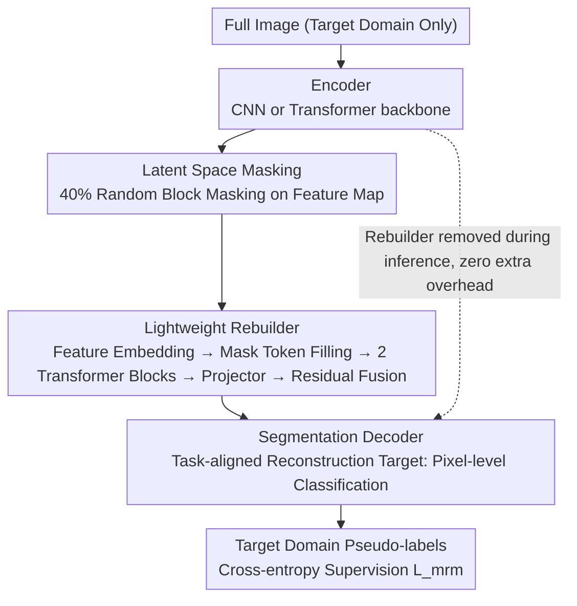

# Masked Representation Modeling for Domain-Adaptive Segmentation

**Conference**: CVPR 2026  
**arXiv**: [2509.13801](https://arxiv.org/abs/2509.13801)  
**Code**: None  
**Area**: Semantic Segmentation / Domain Adaptation / Self-Supervised Learning  
**Keywords**: Unsupervised Domain Adaptation, Masked Representation Modeling, Semantic Segmentation, Auxiliary Tasks, Feature Reconstruction  

## TL;DR
The paper proposes MRM, an auxiliary task that performs masked modeling in latent space instead of input space. By using a lightweight Rebuilder module to perform mask-reconstruction on encoder features supervised by segmentation loss, it achieves an average +2.3 mIoU improvement across four UDA baselines on GTA→Cityscapes with zero extra overhead during inference.

## Background & Motivation
Unsupervised Domain Adaptation (UDA) for semantic segmentation requires transferring labeled knowledge from a source domain to an unlabeled target domain. While auxiliary self-supervised tasks like contrastive learning have been proven to enhance feature discriminability, Masked Image Modeling (MIM, e.g., MAE) remains largely unexplored in UDA segmentation. Two core reasons exist: (1) MIM requires modifying the input structure (masking patches and feeding only visible parts), which is incompatible with segmentation architectures like DeepLab or DAFormer; (2) The pixel-level reconstruction objective of MIM is inconsistent with the semantic classification objective of segmentation, leading to optimization conflicts.

## Core Problem
How can the advantages of masked modeling (global context understanding, feature robustness) be introduced into UDA semantic segmentation while resolving the dual challenges of architectural compatibility and objective alignment?

## Method

### Overall Architecture

MRM aims to introduce the benefits of masked modeling (global context, feature robustness) into UDA segmentation without the pitfalls of MAE (modified input structure, objective misalignment). It serves as a plug-and-play auxiliary task: the complete image passes through the encoder to obtain feature $f_t$, 40% of the regions are randomly masked in the **feature space**, and a lightweight Rebuilder reconstructs the masked parts. The reconstructed features are then fed into the original segmentation decoder for pixel-level classification, supervised by pseudo-labels. After training, the Rebuilder is removed, resulting in zero additional overhead during inference. The total loss is $\mathcal{L} = \mathcal{L}_{sup} + \mathcal{L}_{uda} + \lambda \mathcal{L}_{mrm}$.

### Key Designs

**1. Masking in Latent Space instead of Input Space: Ensuring Compatibility with Any Segmentation Architecture**

MAE only feeds visible patches into the encoder, which is incompatible with the input processing of architectures like DeepLab or DAFormer. MRM reverses this—the encoder takes the full image as usual, and masking occurs only on the feature maps output by the encoder using random block masking. Thus, regardless of whether the backbone is a CNN or Transformer, the input structure remains unchanged, allowing masked modeling to be integrated into existing UDA pipelines for the first time.

**2. Lightweight Rebuilder: Small Enough to be Fully Removed After Training**

The Rebuilder is intentionally designed to be lightweight: feature embedding (linear transformation + spatial interpolation to 16×16×512) → masking/filling (learnable mask tokens replace masked regions) → only 2 Transformer blocks → projector (transposed convolution to restore original resolution). Reconstruction only replaces the masked regions, using residual fusion $f_r = M_s \odot f_o + (1-M_s) \odot f_t$ to merge the results. It is jointly optimized with the main network during training and completely removed during inference; thus, the mask rate is set to 40% (lower than MAE's 75%)—given the low capacity, excessive masking would lead to irreversible semantic loss.

**3. Task-Aligned Reconstruction Goal: Classification After Reconstruction Instead of Pixel Recovery**

MAE reconstructs original pixel values, a regression objective that conflicts with the semantic classification objective of segmentation. MRM feeds the reconstructed features directly into the segmentation decoder for pixel-level classification (cross-entropy + pseudo-labels), aligning the auxiliary task objective perfectly with the main task. Ablation studies confirm this: pixel-level regression results in -0.3 mIoU, while the classification objective brings +3.8 mIoU—objective alignment determines whether the auxiliary task is beneficial or harmful.

### Loss & Training

The MRM loss is a cross-entropy classification loss using target domain pseudo-labels, with weight $\lambda=1.0$. Crucially, MRM is applied **only to target domain images** (applying it to the source domain is harmful as it pulls features toward the source distribution). Another empirical finding is that MRM requires simultaneous training of both the encoder and decoder for optimal results; freezing either leads to reduced gains.

## Key Experimental Results

| Baseline Method | GTA→CS (baseline) | GTA→CS (+Ours) | Gain | Synthia→CS (+Ours) | Gain |
|--------|------|------|------|------|------|
| DACS | 52.1 | 55.9 | +3.8 | 55.8 | +7.5 |
| DAFormer | 68.3 | 70.3 | +2.0 | 62.6 | +1.7 |
| HRDA | 73.8 | 75.4 | +1.6 | 67.1 | +1.3 |
| MIC | 75.9 | **77.5** | +1.6 | 68.1 | +0.8 |

MIC+MRM reaches 77.5 mIoU, surpassing all Prev. SOTA methods at the time (e.g., QuadMix 76.1, GANDA 74.5).

### Ablation Study
- **Optimal Mask Rate of 40%**: Lower than MAE's 75% because the Rebuilder in MRM has smaller capacity; a high mask rate makes semantic loss irreversible.
- **Masking Without Reconstruction is Harmful (-0.2)**: This indicates that masking in feature space causes irreversible semantic loss, making the reconstruction process critical.
- **Reconstruction Objective Comparison**: Pixel Regression (-0.3) < Teacher Feature Reconstruction (+1.4/+1.6) < **Pixel Classification (+3.8)**. Auxiliary tasks must align with the main task goal.
- **Domain Selection**: Target domain only (+3.8) > Source + Target (+3.1) > Source domain only (+0.8). The essence of MRM is target domain adaptive regularization.
- **Cross-Architecture Generalization**: Effective across ResNet50/101, MiT-B2/B3, and DeepLabV2/V3+, with gains ranging from +2.1 to +4.6.

## Highlights & Insights
- **Extreme Simplicity**: The core design is captured in a simple logic (latent space masking + classification reconstruction), is completely plug-and-play, and incurs zero inference overhead.
- The analysis of MRM from an information bottleneck perspective is compelling: masking acts as structured noise injection, reducing $I(Z;X)$ while preserving $I(Z;Y)$.
- The counter-intuitive discovery that "pixel reconstruction objectives are harmful to segmentation tasks" provides valuable reference for the community.
- Applying MRM only in the target domain is effective, revealing the correct usage of auxiliary tasks in UDA.

## Limitations & Future Work
- The Rebuilder capacity is limited (only 2 Transformer blocks); increasing capacity leads to training instability.
- Only validated in UDA settings; applicability to domain generalization or source-free UDA remains unknown.
- The masking strategy is relatively simple (uniform random); semantic-guided masking might yield higher gains.
- Specifically tailored for pixel-level classification; tasks like depth estimation or panoptic segmentation require further research.

## Related Work & Insights
- **vs MAE/MIM**: MAE masks in input space and reconstructs pixels, which is incompatible with segmentation architectures and misaligned with goals. MRM masks in feature space and reconstructs with classification objectives, ensuring compatibility and better performance.
- **vs Contrastive Learning Auxiliary Tasks (SePiCo, PiPa)**: Contrastive learning only enhances encoder features, whereas MRM trains both the encoder and decoder, providing more comprehensive regularization.
- **vs MIC**: MIC performs mask consistency in image space (similar to high-ratio CutOut), while MRM performs mask reconstruction in feature space. The two are complementary—MIC+MRM achieves 77.5 mIoU.

## Related Papers

## Related Papers

- [\[CVPR 2026\] SARMAE: Masked Autoencoder for SAR Representation Learning](sarmae_masked_autoencoder_for_sar_representation_learning.md)
- [\[CVPR 2026\] Seeing Beyond: Extrapolative Domain Adaptive Panoramic Segmentation](seeing_beyond_extrapolative_domain_adaptive_panoramic_segmentation.md)
- [\[CVPR 2026\] Heuristic Self-Paced Learning for Domain Adaptive Semantic Segmentation under Adverse Conditions](heuristic_self-paced_learning_for_domain_adaptive_semantic_segmentation_under_ad.md)
- [\[CVPR 2026\] Mixture of Prototypes for Test-time Adaptive Segmentation](mixture_of_prototypes_for_test-time_adaptive_segmentation.md)
- [\[CVPR 2026\] Structure-Aware Representation Distillation for Tiny-Dense Object Segmentation](structure-aware_representation_distillation_for_tiny-dense_object_segmentation.md)

<!-- RELATED:END -->

<!-- RELATED:START -->

## Related Papers

- [\[CVPR 2026\] Seeing Beyond: Extrapolative Domain Adaptive Panoramic Segmentation](seeing_beyond_extrapolative_domain_adaptive_panoramic_segmentation.md)
- [\[CVPR 2026\] Structure-Aware Representation Distillation for Tiny-Dense Object Segmentation](structure-aware_representation_distillation_for_tiny-dense_object_segmentation.md)
- [\[CVPR 2026\] Mixture of Prototypes for Test-time Adaptive Segmentation](mixture_of_prototypes_for_test-time_adaptive_segmentation.md)
- [\[CVPR 2026\] Concept-Aware LoRA for Domain-Aligned Segmentation Dataset Generation](concept-aware_lora_for_domain-aligned_segmentation_dataset_generation.md)
- [\[CVPR 2026\] GeCo: Geometry-Consistent Regularization for Domain Generalized Semantic Segmentation](geco_geometry-consistent_regularization_for_domain_generalized_semantic_segmenta.md)

<!-- RELATED:END -->
