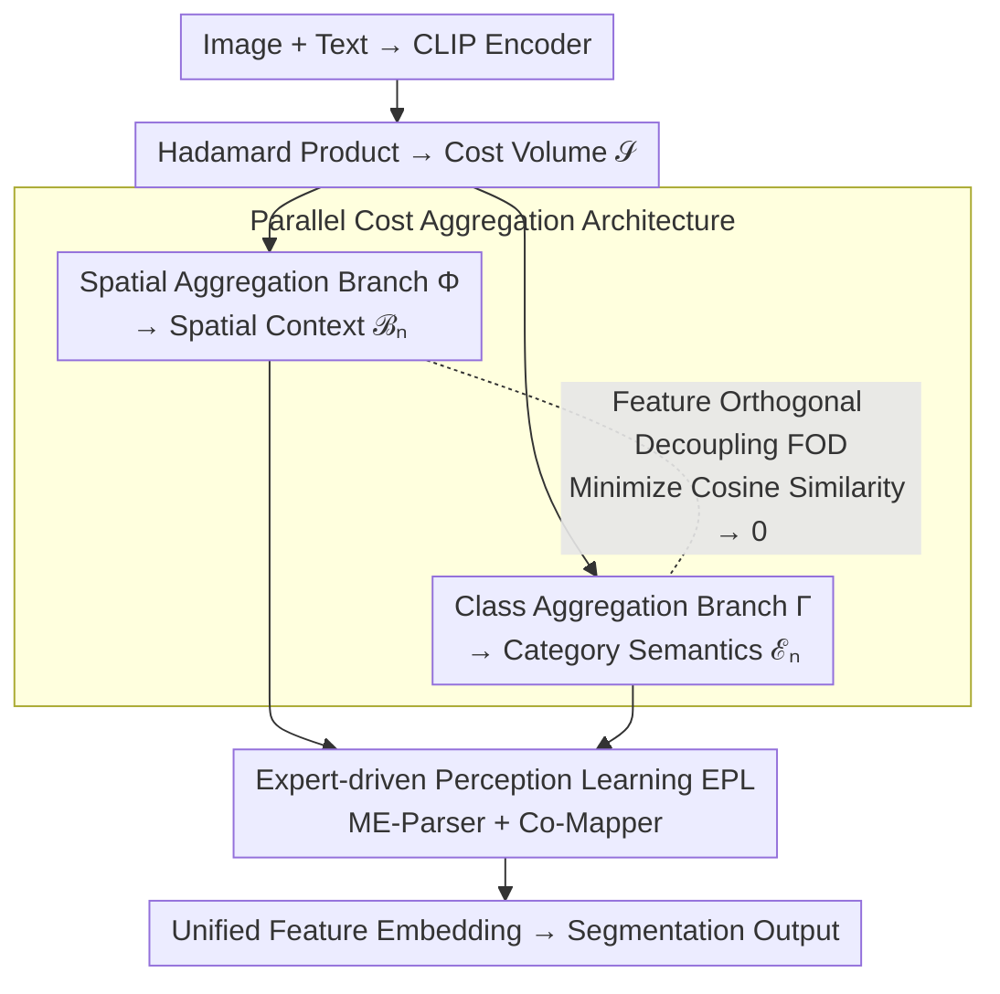

# PCA-Seg: Revisiting Cost Aggregation for Open-Vocabulary Semantic and Part Segmentation

**Conference**: CVPR 2026  
**arXiv**: [2603.17520](https://arxiv.org/abs/2603.17520)  
**Code**: [https://github.com/NUST-Machine-Intelligence-Laboratory/PCA-Seg](https://github.com/NUST-Machine-Intelligence-Laboratory/PCA-Seg)  
**Area**: Semantic Segmentation / Open-Vocabulary Segmentation  
**Keywords**: Open-vocabulary segmentation, Cost Aggregation, Parallel Architecture, Expert-driven Perception Learning, Feature Orthogonal Decoupling

## TL;DR

PCA-Seg proposes a Parallel Cost Aggregation paradigm to replace traditional serial spatial-class aggregation architectures. It efficiently integrates semantic and spatial context flows via an Expert-driven Perception Learning (EPL) module and eliminates redundancy between knowledge streams using a Feature Orthogonal Decoupling (FOD) strategy. Each parallel block adds only 0.35M parameters while achieving SOTA performance on 8 open-vocabulary semantic and part segmentation benchmarks.

## Background & Motivation

1. **Background**: Open-vocabulary semantic and part segmentation (OSPS) utilizes the powerful image-text alignment of vision-language models like CLIP to achieve segmentation of arbitrary categories. Mainstream methods (e.g., CAT-Seg, DeCLIP, PartCATSeg) extract alignment clues from cost volumes.
2. **Limitations of Prior Work**: Existing methods adopt serial architectures—spatial aggregation followed by class aggregation (or vice versa). This leads to knowledge interference between category-level semantics and spatial contexts. For instance, spatial aggregation may distort the semantics of a "truck" category, and subsequent class aggregation further amplifies this bias, leading to misclassification.
3. **Key Challenge**: The cascade behavior of serial architectures ensures that the aggregation of one type of information triggers a chain reaction in another, inevitably leading to mutual contamination of knowledge.
4. **Goal**: Design a parallel architecture where both aggregation types operate independently, while solving the challenge of efficiently integrating independent knowledge streams.
5. **Key Insight**: Observations show that simple parallelization (a single convolution capturing both types of information) actually decreases performance by 0.2%, indicating the need for a carefully designed integration mechanism.
6. **Core Idea**: Parallel aggregation + multi-expert parser fusion + orthogonal decoupling to eliminate redundancy.

## Method

### Overall Architecture

This paper addresses a long-standing issue in cost aggregation for open-vocabulary segmentation: methods like CAT-Seg serialize "spatial aggregation" and "class aggregation" into a pipeline. Aggregating one before the other causes mutual interference. PCA-Seg decomposes this serial pipeline into two parallel branches and reconstructs the knowledge cleanly.

The workflow is as follows: Images and text are processed by CLIP encoders; their Hadamard product generates the cost volume $\mathcal{S}$. This volume is fed simultaneously into a spatial aggregation branch and a class aggregation branch, yielding spatial context features $\mathcal{B}_n$ and category semantic features $\mathcal{E}_n$. The EPL module then parses and fuses the complementary knowledge into a unified representation. Meanwhile, the FOD loss constrains the two branches to be orthogonal during training, ensuring they provide information from truly distinct dimensions without redundant overlap.

### Key Designs

**1. Parallel Cost Aggregation Architecture: Decomposing the Serial Pipeline**

The issue with serial architectures lies in the cascade effect—spatial aggregation may slightly distort the semantic structure of an object, and subsequent class aggregation amplifies this deviation. PCA-Seg updates the rule from the serial $\mathcal{V}_{n+1} = \Gamma_n(\Phi_n(\mathcal{V}_n))$ to parallel branches:

$$\mathcal{B}_n = \Phi_n(\mathcal{V}_n), \quad \mathcal{E}_n = \Gamma_n(\mathcal{V}_n)$$

Where $\Phi_n$ denotes spatial aggregation and $\Gamma_n$ denotes class aggregation. Both operate on the same input $\mathcal{V}_n$ independently. Integration is deferred to the EPL module. This prevents spatial aggregation from contaminating category semantics and vice versa. The overhead is minimal: each parallel block adds only 0.35M parameters and 0.96G VRAM (compared to ~0.33M for a serial block), achieving decoupling nearly for "free."

**2. Expert-driven Perception Learning (EPL): Efficient Integration of Complementary Knowledge**

Once parallelized, the challenge becomes fusion. A naive approach (single convolution) performs 0.2% worse than the serial baseline. EPL uses two components for robust fusion. The Multi-Expert Parser (ME-Parser) uses multiple weight sets to extract complementary features from different perspectives, preventing the averaging out of branch-specific uniqueness. The Coefficient Mapper (Co-Mapper) learns a pixel-wise adaptive weight map after dimensionality reduction of semantic and spatial features. This emphasizes critical regions in the expert results, merging them into a unified feature embedding. Multi-perspective parsing combined with pixel-level adaptive weighting allows the parallel architecture to outperform the serial one.

**3. Feature Orthogonal Decoupling (FOD): Forcing Diversity at the Source**

Even with EPL, if branches learn highly redundant information, multi-expert parsing provides little benefit. FOD addresses this at the source: since category semantics and spatial context should reside in independent dimensions, an orthogonalization loss drives the cosine similarity between the two representations toward zero. Higher orthogonality implies less redundancy and stronger complementarity, allowing EPL to extract more diverse knowledge. Ablations show FOD alone provides a 0.9% boost, proving that reducing redundancy is essential for learning diverse representations.

### Loss & Training

Standard segmentation cross-entropy loss combined with the FOD orthogonalization loss. Training follows the protocols of CAT-Seg and PartCATSeg.

## Key Experimental Results

### Main Results

| Dataset | Metric (mIoU↑) | Prev. SOTA | PCA-Seg | Gain |
|--------|-------------|----------|---------|------|
| A-150 (Semantic) | mIoU | 14.9 (DeCLIP) | 15.6 | +0.7 |
| PAS-20b (Semantic) | mIoU | 81.3 (H-CLIP) | 82.4 | +1.1 |
| ADE-Part-234 (O) | mIoU | 24.1 (PartCATSeg) | 25.3 | +1.2 |
| Pascal-Part-116 (H) | hIoU | 43.8 (PartCATSeg) | 45.1 | +1.3 |

The method achieves SOTA across 8 benchmarks for both semantic and part segmentation.

### Ablation Study

| Configuration | mIoU (A-150) | Description |
|------|-------------|------|
| Serial Baseline (CAT-Seg) | 14.9 | Original serial architecture |
| Parallel Baseline (Single Conv) | 14.7 | Naive parallelization decreases performance |
| + EPL | 15.3 | Multi-expert fusion improvement |
| + FOD | 15.6 | Orthogonalization adds +0.9% |

### Key Findings

- Simple parallelization is inferior to serial aggregation (-0.2%); EPL is necessary to unlock the advantages of a parallel architecture.
- FOD provides a 0.9% improvement on A-150, highlighting the importance of redundancy reduction for diverse knowledge acquisition.
- High parameter efficiency: Each parallel block adds only 0.35M parameters (vs. 0.33M for serial).
- Larger gains are observed in part segmentation, likely because part-level tasks require finer spatial-semantic decoupling.

## Highlights & Insights

- **Discovery of Knowledge Interference**: The paper clearly identifies the cascade interference issue between spatial and class aggregation in serial architectures with strong visual evidence.
- **Utility of Orthogonalization**: Uses orthogonal constraints to ensure the independence of the two information streams, a simple yet effective approach.
- **Low Parameter Overhead**: Performance gains are achieved almost "for free," with only 0.35M additional parameters per block.

## Limitations & Future Work

- Still relies on fine-tuning CLIP's ViT attention layers, constrained by CLIP's inherent visual representation capabilities.
- Orthogonalization is a hard constraint; in some scenarios, category and spatial information might require interaction.
- Not yet validated on 3D segmentation or video segmentation.
- Future work could explore more flexible interaction modes for knowledge streams.

## Related Work & Insights

- **vs. CAT-Seg/DeCLIP**: These use serial aggregation; PCA-Seg employs parallel aggregation to eliminate interference.
- **vs. PartCATSeg**: The parallel design of PCA-Seg shows more pronounced advantages in part segmentation tasks.
- **vs. H-CLIP**: H-CLIP operates in hyperbolic space; PCA-Seg achieves similar representation decoupling in Euclidean space via orthogonalization.

## Rating

- Novelty: ⭐⭐⭐⭐ Parallel aggregation is a insightful architectural improvement over serial designs.
- Experimental Thoroughness: ⭐⭐⭐⭐⭐ Comprehensive evaluation across 8 benchmarks.
- Writing Quality: ⭐⭐⭐⭐ Strong motivation analysis and clear visualizations.
- Value: ⭐⭐⭐⭐ Significant implications for cost aggregation paradigms in open-vocabulary segmentation.

<!-- RELATED:START -->

## Related Papers

- [\[CVPR 2025\] Fine-Grained Image-Text Correspondence with Cost Aggregation for Open-Vocabulary Part Segmentation](../../CVPR2025/segmentation/fine-grained_image-text_correspondence_with_cost_aggregation_for_open-vocabulary.md)
- [\[CVPR 2026\] SPAR: Single-Pass Any-Resolution ViT for Open-Vocabulary Segmentation](spar_single-pass_any-resolution_vit_for_open-vocabulary_segmentation.md)
- [\[CVPR 2026\] Semantic Alignment in Hyperbolic Space for Open-Vocabulary Semantic Segmentation](semantic_alignment_in_hyperbolic_space_for_open-vocabulary_semantic_segmentation.md)
- [\[CVPR 2026\] HOPS: Hierarchical Open-vocabulary Part Segmentation with Attention-Aware Filtering and Affinity-Guided Enhancement](hops_hierarchical_open-vocabulary_part_segmentation_with_attention-aware_filteri.md)
- [\[CVPR 2026\] Test-Time Multi-Prompt Adaptation for Open-Vocabulary Remote Sensing Image Segmentation](test-time_multi-prompt_adaptation_for_open-vocabulary_remote_sensing_image_segme.md)

<!-- RELATED:END -->
