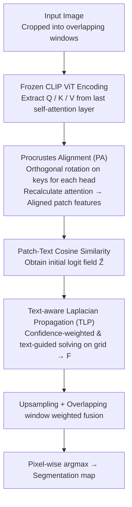

# PEARL: Geometry Aligns Semantics for Training-Free Open-Vocabulary Semantic Segmentation

**Conference**: CVPR 2026  
**arXiv**: [2603.21528](https://arxiv.org/abs/2603.21528)  
**Code**: [https://github.com/PGSmall/PEARL](https://github.com/PGSmall/PEARL)  
**Area**: Semantic Segmentation / Open-Vocabulary  
**Keywords**: Open-Vocabulary Semantic Segmentation, Training-free, Procrustes Alignment, Laplacian Propagation, CLIP

## TL;DR

PEARL proposes a two-step inference method based on Procrustes alignment and text-aware Laplacian propagation. Without introducing additional training or auxiliary backbones, it achieves a new SOTA in training-free open-vocabulary semantic segmentation by correcting the key-query geometric mismatch in the final self-attention layer of CLIP and utilizing text semantics to guide label propagation.

## Background & Motivation

**Background**: Open-vocabulary semantic segmentation (OVSS) allows models to classify each pixel based on category sets specified via natural language at inference time. Current mainstream approaches are divided into training-based and training-free routes. Training-based methods learn decoders or lightweight adapters to enhance CLIP's dense prediction capability, while training-free methods keep the backbone frozen and only modify the inference process.

**Limitations of Prior Work**: Training-free methods face two core issues. First, CLIP's contrastive pre-training emphasizes global image-text alignment rather than dense prediction, leading the self-attention in the top layers of the visual encoder to be dominated by a few background directions. This results in a severe mismatch between the geometric structure of patch features and text prototypes, making patch-text similarity unstable. Second, text is usually employed only as a classifier and rarely participates in governing information exchange between pixels—even though category relationships in the text space can indicate which classes should mutually reinforce or remain separated.

**Key Challenge**: Most existing methods perform downstream smoothing (e.g., DenseCRF, PAMR), but this only "treats the symptoms rather than the cause"—when the source geometry is flawed, subsequent smoothing only mitigates symptoms instead of eliminating the root cause. Other methods introduce auxiliary visual backbones (e.g., DINOv2), increasing complexity and latency.

**Goal**: (1) Correct the token geometric structure at the source of attention scores; (2) Transform text from a simple labeler into a structural prior to guide semantic propagation between pixels.

**Key Insight**: It is observed that in the attention maps of CLIP ViT-B/16, vanilla CLIP is diffuse and biased towards the background, while NACLIP improves this but suffers from severe fragmentation. By performing an orthogonal Procrustes rotation on the keys in the final self-attention layer, the output features can be better aligned with the query subspace.

**Core Idea**: Repair the attention geometry using orthogonal Procrustes alignment first, then diffuse semantic consistency across the entire image using text-aware Laplacian propagation—align-then-propagate.

## Method

### Overall Architecture

The PEARL pipeline is built on a frozen CLIP ViT without training any parameters, centered on the "align-then-propagate" two-step process. It follows the established sliding window inference protocol for training-free OVSS, where high-resolution images are cropped into overlapping windows and processed sequentially. Each window is encoded by the ViT, and **Procrustes Alignment (PA)** is inserted into the **final self-attention block**: an orthogonal rotation is applied to the keys of each head to align them with the query subspace, and attention is recalculated using the corrected keys to obtain geometrically aligned patch features. These features compute cosine similarity with category prototypes from the frozen text encoder to produce the initial logit field $\widetilde{Z}$. Subsequently, **Text-aware Laplacian Propagation (TLP)** performs confidence-weighted, text-guided graph Laplacian solving on a downsampled grid to output refined scores $F$. Finally, results from each window are upsampled and fused back into the full image using overlap weights, with a pixel-wise argmax yielding the segmentation map.

### Key Designs

**1. Procrustes Alignment (PA): Rotating keys back to the query subspace at the attention source**

The problem with the top-layer self-attention in CLIP is that while keys and queries originate from the same set of patches, they are pulled into inconsistent bases by contrastive pre-training. Furthermore, a few high-norm background tokens and the CLS token bias the directions, making the cosine similarity between patch features and text prototypes unstable. PA addresses this by modifying only the keys: for each head, query norms are used to weight each token, calculating the weighted centroids of queries and keys for decentering (suppressing the influence of high-norm background and CLS tokens). Then, an orthogonal Procrustes problem is solved:

$$R^* = \arg\min_{R \in O(d)} \|K_c R - Q_c\|_F^2,$$

The closed-form solution is the orthogonal factor $UV^\top$ from the SVD of the cross-covariance $K_c^\top Q_c$. Decentering is only used to solve for $R^*$; the **original** keys are rotated ($\widetilde{K}=KR^*$), and the attention scores and outputs are recalculated using $\widetilde{K}$ within the same block. Orthogonal mapping is chosen because it modifies only direction without changing local magnitudes, specifically correcting the directional consistency of patch features within the query subspace—which is precisely what cosine similarity measures. The cost is low, adding only one $d \times d$ SVD and two $N \times d$ matrix multiplications per head; SVD can also be bypassed using Newton-Schulz iteration to approximate the orthogonal factor.

**2. Text-aware Laplacian Propagation (TLP): Letting text category relationships govern pixel information exchange**

Although the similarity field repaired by PA is geometrically aligned, predictions remain independent per patch and spatially incoherent. Conventional methods use class-agnostic downstream smoothing like DenseCRF/PAMR. TLP employs text as the "referee" for smoothing: the logit field is downsampled to a small $H_g \times W_g$ grid to build a 4-connected graph, followed by confidence-weighted, text-guided graph Laplacian solving. The influence of each node is determined by data trust $\rho_i$, which considers both the peak probability after softmax (the model's certainty) and text prior consistency $u_i = p_i^\top G p_i$. Propagation between adjacent nodes is controlled by edge weights $a_{ij}$, which multiply image gradient edge detection $b_{ij}^{img}$ (to protect object boundaries) and a text consistency gate $g_{ij} = p_i^\top G p_j$ (allowing propagation only between semantically similar classes). The final refined logit is the solution to the following convex quadratic objective:

$$\mathcal{L}(F_g) = \frac{1}{2}\sum_i \rho_i \|F_{g,i} - Z_{g,i}\|^2 + \frac{\tau}{2}\sum_{(i,j)} a_{ij}\|F_{g,i} - F_{g,j}\|^2,$$

The first term pulls the result toward the initial prediction $Z_g$, while the second encourages convergence between neighbors; this is solved in a few steps using Conjugate Gradient on the small grid. The key variable is the text prototype similarity matrix $G$, which encodes co-occurrence/semantic relationships between categories, allowing similar classes like "cat" and "dog" to reinforce each other while keeping unrelated classes separated.

### Loss & Training

PEARL requires no training—all hyperparameters are fixed constants (temperature $\tau_s$, grid size $H_g \times W_g$, edge detection $\kappa$, etc.), providing plug-and-play capability at inference time.

## Key Experimental Results

### Main Results

mIoU (%) comparison on 8 standard OVSS benchmarks using CLIP ViT-B/16 without additional backbones:

| Dataset | PEARL | NACLIP | SFP | SCLIP | ClearCLIP |
|--------|-------|--------|-----|-------|-----------|
| V21 (w/ bg) | **64.1** | 58.9 | 56.8 | 59.1 | 51.8 |
| PC60 (w/ bg) | **35.1** | 32.2 | 32.3 | 30.4 | 32.6 |
| Object (w/ bg) | **37.3** | 33.2 | 32.1 | 30.5 | 33.0 |
| V20 | **86.9** | 79.7 | 83.4 | 80.4 | 80.9 |
| PC59 | **38.6** | 35.2 | 36.0 | 34.1 | 35.9 |
| City | **37.6** | 35.5 | 34.1 | 32.2 | 30.0 |
| ADE | **19.4** | 17.4 | 18.1 | 16.1 | 16.7 |
| **Mean** | **43.2** | 39.4 | 39.6 | 38.2 | 38.1 |

Comparison with methods using auxiliary backbones: PEARL (43.2) outperforms CASS+DINOv3 (42.2) without any auxiliary models.

### Ablation Study

| Configuration | Mean mIoU | V21 | PC59 | City |
|------|----------|-----|------|------|
| Vanilla CLIP (w/o PA or TLP) | 13.8 | 18.6 | 11.2 | 6.7 |
| PA Only | 40.6 | 59.2 | 35.3 | 35.0 |
| TLP Only | 29.3 | 35.4 | 25.0 | 20.5 |
| PA + TLP (Full) | **43.2** | **64.1** | **38.6** | **37.6** |

Effect of TLP as a plug-and-play module for other methods:

| Method | Original Mean | +TLP Mean | Gain |
|------|---------|----------|------|
| SCLIP | 38.2 | 42.2 | +4.0 |
| NACLIP | 39.4 | 42.3 | +2.9 |
| SFP | 39.6 | 41.5 | +1.9 |

### Key Findings

- PA is the primary contributor, increasing mean mIoU from 13.8 to 40.6 (+26.8), indicating that repairing geometry at the attention source is critical.
- TLP complements PA, providing an additional 2.6 point increase; TLP also yields 2-4 point gains for other methods as a plug-and-play module.
- Without any auxiliary backbones, PEARL surpasses methods using DINOv2/DINOv3 (e.g., CASS 42.2).
- In pixel accuracy (pAcc), PEARL achieves 67.2%, the best among methods without auxiliary backbones, even surpassing CASS+DINOv3 (67.0%).

## Highlights & Insights

- **Procrustes Alignment** is the core trick: it applies orthogonal rotation correction directly during attention calculation at minimal cost (one $d \times d$ SVD) with significant impact (+26.8 mIoU). This approach—using closed-form orthogonal alignment in feature space rather than learning parameters—is worthy of extension to other vision-language dense prediction tasks.
- **Text is more than a classifier**: PEARL cleverly uses the similarity matrix between text prototypes as a structural constraint for graph propagation. This insight is transferable to other tasks; for instance, in open-vocabulary detection, text category relationships could constrain NMS or post-processing.
- The entire method is completely training-free, requires no external data, and uses no auxiliary models. The design is exceptionally elegant—only two steps with fixed constants.

## Limitations & Future Work

- Gaps remain in fine-grained stuff categories on ADE20K (19.4 vs ProxyCLIP 19.7), as CLIP's general prompts have limited discriminative power for rare stuff classes.
- Confusion occurs when semantically similar categories like "tree" and "mountain" have similar low-frequency textures, due to a lack of depth or shape cues.
- Grid size requires manual setting per dataset (224×224 for City, 80×80 for others); adaptive grid scale selection could be a further optimization.
- Procrustes Alignment is a global single orthogonal mapping; it may not be refined enough for key-query mismatches in different semantic regions—region-adaptive alignment might perform better.

## Related Work & Insights

- **vs NACLIP**: NACLIP enhances locality by modifying attention proximity masks but suffers from fragmentation. PEARL repairs the geometric alignment at the root, performing better without imposing artificial locality constraints.
- **vs CASS (CVPR'25)**: CASS uses DINOv2/DINOv3 auxiliary backbones for visual context graph construction, which is complex and requires extra models. PEARL outperforms CASS+DINOv3 in mean mIoU using only a single CLIP model.
- **vs ProxyCLIP**: ProxyCLIP also relies on DINOv2 for region grouping; it performs better on ADE but overall weaker than PEARL.

## Rating

- Novelty: ⭐⭐⭐⭐ Orthogonal Procrustes alignment applied to CLIP self-attention correction is a brand-new entry point; text-aware Laplacian propagation is also innovative.
- Experimental Thoroughness: ⭐⭐⭐⭐⭐ 8 benchmarks, comprehensive ablations, plug-and-play validation, and supplementary pixel accuracy reports.
- Writing Quality: ⭐⭐⭐⭐⭐ Clear logical chain from observation → insight → method, with rigorous mathematical derivation and clear conceptual explanation.
- Value: ⭐⭐⭐⭐ Pushes training-free OVSS performance beyond methods using auxiliary backbones, offering high practical application value.

## Related Papers

- [\[CVPR 2026\] Looking Beyond the Window: Global-Local Aligned CLIP for Training-free Open-Vocabulary Semantic Segmentation](looking_beyond_the_window_global-local_aligned_clip_for_training-free_open-vocab.md)
- [\[CVPR 2026\] The Power of Prior: Training-Free Open-Vocabulary Semantic Segmentation with LLaVA](the_power_of_prior_training-free_open-vocabulary_semantic_segmentation_with_llav.md)
- [\[CVPR 2026\] Direct Segmentation without Logits Optimization for Training-Free Open-Vocabulary Semantic Segmentation](direct_segmentation_without_logits_optimization_for_training-free_open-vocabular.md)
- [\[CVPR 2026\] ReAttnCLIP: Training-Free Open-Vocabulary Remote Sensing Image Segmentation via Re-defined Attention in CLIP](reattnclip_training-free_open-vocabulary_remote_sensing_image_segmentation_via_r.md)
- [\[ICCV 2025\] Training-Free Class Purification for Open-Vocabulary Semantic Segmentation](../../ICCV2025/segmentation/training-free_class_purification_for_open-vocabulary_semantic_segmentation.md)

<!-- RELATED:END -->

<!-- RELATED:START -->

## Related Papers

- [\[CVPR 2026\] Looking Beyond the Window: Global-Local Aligned CLIP for Training-free Open-Vocabulary Semantic Segmentation](looking_beyond_the_window_global-local_aligned_clip_for_training-free_open-vocab.md)
- [\[CVPR 2026\] The Power of Prior: Training-Free Open-Vocabulary Semantic Segmentation with LLaVA](the_power_of_prior_training-free_open-vocabulary_semantic_segmentation_with_llav.md)
- [\[CVPR 2026\] Direct Segmentation without Logits Optimization for Training-Free Open-Vocabulary Semantic Segmentation](direct_segmentation_without_logits_optimization_for_training-free_open-vocabular.md)
- [\[CVPR 2026\] ReAttnCLIP: Training-Free Open-Vocabulary Remote Sensing Image Segmentation via Re-defined Attention in CLIP](reattnclip_training-free_open-vocabulary_remote_sensing_image_segmentation_via_r.md)
- [\[ICCV 2025\] Training-Free Class Purification for Open-Vocabulary Semantic Segmentation](../../ICCV2025/segmentation/training-free_class_purification_for_open-vocabulary_semantic_segmentation.md)

<!-- RELATED:END -->
