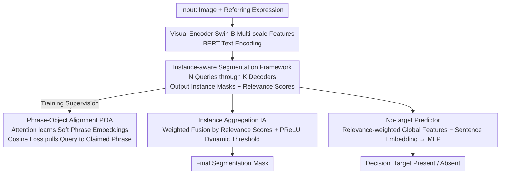

# Phrase-Instance Alignment for Generalized Referring Segmentation

**Conference**: CVPR 2026  
**arXiv**: [2411.15087](https://arxiv.org/abs/2411.15087)  
**Code**: [https://eronguyen.github.io/InstAlign](https://eronguyen.github.io/InstAlign)  
**Area**: Image Segmentation  
**Keywords**: Generalized Referring Segmentation, Phrase-Instance Alignment, Instance-level Reasoning, Multi-target Segmentation, No-target Detection

## TL;DR

This paper proposes InstAlign, which reformulates Generalized Referring Segmentation (GRES) as an instance-level reasoning problem. By establishing fine-grained correspondences between linguistic phrases and visual instances through a Phrase-Object Alignment (POA) loss and utilizing a relevance-weighted aggregation mechanism to unifiedly handle multi-target and no-target scenarios, it achieves a 3.22% increase in cIoU and a 12.25% increase in N-acc on gRefCOCO.

## Background & Motivation

1. **Background**: Generalized Referring Segmentation (GRES) is an extension of classical Referring Expression Segmentation (RES). it requires models to handle expressions such as "two people on the left," "all cars," or even "an elephant on the sofa" (where no elephant is present)—meaning descriptions may correspond to multiple objects or zero objects. Existing GRES methods (e.g., ReLA, LQMFormer, MABP) still adopt a "region-based" strategy, directly predicting a single foreground binary mask for the entire expression.

2. **Limitations of Prior Work**: This one-shot prediction of a single mask "flattens" the rich linguistic structure into an undifferentiated region. The model cannot distinguish between different visual instances corresponding to various phrases within the same expression, leading to over-segmentation or under-segmentation of related instances. For example, when describing "two dogs on the left," existing methods tend to merge the two dogs into a single blob or segment only one.

3. **Key Challenge**: The root cause is the lack of **instance-level supervision**. Although existing query-based architectures utilize multiple object queries, they only supervise the final merged mask. Individual queries are not forced to "specialize" in different instances, resulting in entanglement and semantic ambiguity among queries.

4. **Goal**: (a) How to make each object query automatically correspond to an independent visual instance? (b) How to establish explicit alignment between queries and various phrases in the expression? (c) How to unifiedly reason across multi-target and no-target scenarios?

5. **Key Insight**: The authors observe that referring expressions naturally possess a decomposable phrase structure ("left dog" vs "right dog"). If the model can perform instance-aware segmentation followed by phrase alignment, it can achieve interpretable and accurate segmentation.

6. **Core Idea**: Reformulate GRES from "direct merged mask prediction" to "phrase-conditional instance segmentation + relevance-weighted aggregation," achieving fine-grained query-to-phrase supervision through an explicit POA loss.

## Method

### Overall Architecture

The difficulty of GRES lies in the fact that a sentence may point to multiple objects or none at all. InstAlign addresses this by no longer requiring the model to output a single foreground mask for the entire sentence. Instead, it first decomposes "potential referents" in the image into a set of independent instances and then allows the language to "claim" them one by one. Specifically, given an image and a referring expression, a visual encoder extracts multi-scale features, and BERT encodes text tokens. Subsequently, $N$ learnable object queries pass through $K$ transformer decoder layers, interacting repeatedly with visual and textual features. Each query finally outputs an instance mask $\hat{s}_i$ and a relevance score $\hat{p}_i$. During training, a specialized alignment loss forces each query to correspond to a specific phrase in the expression. During inference, all instance masks are weighted and fused into the final mask based on their relevance scores, while a lightweight classifier judges "whether a target exists" based on these scores. These four designs are interconnected: instance awareness provides queries the ability to "manage their own tasks," POA informs queries which phrase they should manage, IA soft-fuses their outputs, and the no-target predictor reuses the same scores to determine the absence of targets.

### Key Designs

**1. Instance-aware Segmentation Framework: Decomposing the scene into instances before referring**

Previous GRES methods used multiple object queries but only calculated loss against the final merged mask. Consequently, queries lacked a division of labor, leading to entanglement. InstAlign directly applies instance-level supervision to each query: using Mask2Former as the backbone, it injects textual conditions into the decoder to perform bidirectional cross-attention between queries, vision, and text. This allows $N$ queries to each output an instance mask $\hat{s}_i$ and a relevance score $\hat{p}_i$. During training, Hungarian matching pairs predicted instances with ground-truth instances, with the matching cost defined as:

$$\mathcal{L}_{\text{match}}(i,j) = \lambda_{\text{score}}\mathcal{L}_{\text{score}}(\hat{p}_i,1) + \lambda_{\text{mask}}\mathcal{L}_{\text{mask}}(\hat{s}_i, s_j)$$

Matched queries learn both masks and scores, while unmatched queries are suppressed to a score of 0. This is the first introduction of instance-level supervision in GRES, forcing each query to "specialize" in one object and fundamentally eliminating query entanglement.

**2. Phrase-Object Alignment (POA) Loss: Allowing each query to claim its corresponding phrase**

Splitting queries into instances is insufficient; the model must also know which query is responsible for phrases like "left dog." POA provides explicit phrase-instance correspondence supervision in three steps. First, scaled dot-product attention calculates a relevance matrix $R_k = \text{softmax}(Q_k T_k^\top / \sqrt{C})$ between each query and the text tokens. Second, it computes a "soft phrase embedding" $P_k = R_k T_k$—note that no external syntactic parser is required; phrase boundaries are learned by the attention weights. Finally, a cosine similarity loss $\mathcal{L}_{\text{phrase}}(i) = 1 - \text{sim}(Q_k^i, P_k^i)$ pulls the query embedding toward its claimed phrase embedding. This loss is included in the Hungarian matching cost with coefficient $\lambda_{\text{phrase}}$. Compared to implicit cross-modal attention, POA provides direct, supervisable correspondence, leading to significant improvements in disambiguation (distinguishing between dogs) and compositional expressions (attributes + relations).

**3. Instance Aggregation (IA): Soft-fusing instance masks with scores**

How to synthesize the final answer from a set of scored instance masks? Hard selection (picking the highest-scoring ones) can easily miss related instances or include irrelevant ones. IA utilizes a fully differentiable continuous weighting:

$$\mathcal{M}_{\text{merged}} = \text{Sigmoid}\Big(\sum_{i=1}^N \hat{p}_i \cdot \sigma(\hat{s}_i)\Big)$$

Where $\sigma(\cdot)$ is the PReLU activation, acting as a learnable dynamic threshold to suppress background noise. Since the entire aggregation path is differentiable, the model can smoothly assign weights in multi-target and compositional scenarios rather than making binary choices.

**4. No-target Predictor: Reusing the same scores to judge "nothing is there"**

GRES also needs to identify descriptions like "an elephant on the sofa" when no such object exists. InstAlign reuses the relevance representation used for mask inference: it concatenates the relevance-weighted global query features $Q_{\text{global}} = \sum_i \hat{p}_i \cdot Q^i$ with the sentence-level text embedding $T_{\text{sen}} = \text{Average}(T_K)$ and feeds them into an MLP classifier. The intuition is that when all query relevance scores are low—meaning no instance identifies with the sentence—the model determines there is no target.

### Mechanism: An Example of Segmenting "the two dogs on the left"

Take an image with two dogs on the left, a cat, and the expression "the two dogs on the left." After 100 object queries interact with features in the decoder, suppose queries 12 and 37 lock onto the two dogs on the left, outputting instance masks and high scores (e.g., 0.9, 0.85). Other queries on the cat or background are suppressed near 0. During training, POA calculates that query 12 has the highest relevance to "left" / "dog" tokens, so its soft phrase embedding points to "left dog," and the cosine loss pulls it toward that phrase. Query 37 similarly claims the other dog. IA weights all masks: the masks for the two dogs are retained with weights 0.9 and 0.85, while the cat and background are filtered by the PReLU threshold. Finally, the no-target predictor sees high-scoring queries and predicts "target exists."

### Loss & Training

The total loss is $\mathcal{L}_{\text{total}} = \lambda_{\text{merged}}\mathcal{L}_{\text{merged}} + \lambda_{\text{inst}}\mathcal{L}_{\text{inst}} + \lambda_{\text{nt}}\mathcal{L}_{\text{nt}}$. Swin-B is used as the visual encoder (pre-trained on ImageNet22K), BERT as the text encoder, with 9 transformer decoder layers and 100 object queries. Training is conducted on a batch size of 32 for 20 epochs on 4 A5000 GPUs.

## Key Experimental Results

### Main Results

| Dataset | Metric | InstAlign | Prev. SOTA | Gain |
|--------|------|-----------|-----------|------|
| gRefCOCO val | cIoU | 68.94% | 65.72% (MABP) | +3.22% |
| gRefCOCO val | gIoU | 74.34% | 70.94% (LQMFormer) | +3.40% |
| gRefCOCO val | N-acc | 79.72% | 67.47% (LQMFormer) | +12.25% |
| gRefCOCO testA | cIoU | 73.22% | 71.85% (CoHD) | +1.37% |
| Ref-ZOM test | mIoU | 70.81% | 69.81% (CoHD) | +1.00% |
| Ref-ZOM test | Acc | 94.23% | 93.34% (CoHD) | +0.89% |

Notably, InstAlign uses only a Swin-B backbone—much smaller than LLM-based methods (e.g., SAM4MLLM-8B)—yet surpasses them in cIoU/gIoU and leads in N-acc by over 13 percentage points.

### Ablation Study

| Configuration | cIoU | gIoU | N-acc | Description |
|------|------|------|-------|------|
| w/o Instance Supervision | 63.33 | 66.95 | 70.56 | Degenerates to ReLA-style |
| Mask2Former Supervision | 66.26 | 70.32 | 76.19 | +2.93% cIoU |
| + POA (Full Model) | 68.94 | 74.34 | 79.72 | POA adds +2.68% cIoU |
| Hard Selection Aggregation | 66.67 | 69.25 | 72.96 | 2.27% worse than IA |
| IA w/o PReLU | 68.13 | 72.35 | 78.22 | PReLU contributes +0.81% |
| N=100 queries | 68.94 | 74.34 | 79.72 | Optimal |

### Key Findings

- **POA is the largest contributor**: Moving from no instance supervision to adding POA results in a cumulative gain of 5.6% cIoU and 9.16% N-acc.
- **Instance-level supervision is a necessary prerequisite**: Even without POA, introducing Mask2Former-style matching supervision significantly improves results (+2.93%).
- **100 queries is the optimal trade-off**: More queries can introduce noise and lead to performance degradation.

## Highlights & Insights

- **Redefining GRES as an instance reasoning problem**—the conceptual shift is more significant than the technical details. This allows multi-target/no-target scenarios to be handled naturally.
- **The "soft phrase embedding" in POA is clever**—it discovers query-to-word correspondences via attention weights without requiring a parser.
- **The relevance-weighted aggregation logic is generalizable** to other tasks requiring merging from multiple candidates, such as visual grounding in multi-turn dialogues.

## Limitations & Future Work

- The model still struggles with hierarchical/compositional relations, such as when attributes conflict with the main description.
- Lack of testing on open-vocabulary or larger-scale data generalization.
- POA is a soft alignment and does not utilize explicit phrase parsing information, which might be less precise for very long, complex expressions.

## Related Work & Insights

- **vs ReLA**: ReLA uses region-level relational attention without instance-level supervision; InstAlign's instance-aware design is a fundamental difference, improving N-acc from 56.37% to 79.72%.
- **vs LLM-based (GSVA, SAM4MLLM)**: These rely on large models and external data (10x larger), but InstAlign's task-specific architecture is more effective than brute-force scaling.
- **vs MABP**: MABP injects linguistic features into query initialization but uses fixed patches for supervision and lacks phrase-level alignment.

## Rating

- Novelty: ⭐⭐⭐⭐ Correctly redefines GRES as instance reasoning.
- Experimental Thoroughness: ⭐⭐⭐⭐⭐ Comprehensive benchmarks and ablation studies.
- Writing Quality: ⭐⭐⭐⭐ Clear structure and logical motivation.
- Value: ⭐⭐⭐⭐ The 12%+ N-acc improvement is a major advancement for GRES.

<!-- RELATED:START -->

## Related Papers

- [\[CVPR 2026\] LoD-Loc v3: Generalized Aerial Localization in Dense Cities using Instance Silhouette Alignment](lod-loc_v3_generalized_aerial_localization_in_dense_cities_using_instance_silhou.md)
- [\[CVPR 2026\] GeCo: Geometry-Consistent Regularization for Domain Generalized Semantic Segmentation](geco_geometry-consistent_regularization_for_domain_generalized_semantic_segmenta.md)
- [\[ICLR 2026\] AMLRIS: Alignment-aware Masked Learning for Referring Image Segmentation](../../ICLR2026/segmentation/amlris_alignment-aware_masked_learning_for_referring_image_segmentation.md)
- [\[CVPR 2026\] Semantic Alignment in Hyperbolic Space for Open-Vocabulary Semantic Segmentation](semantic_alignment_in_hyperbolic_space_for_open-vocabulary_semantic_segmentation.md)
- [\[CVPR 2026\] Towards Streaming Referring Video Segmentation via Large Language Model](towards_streaming_referring_video_segmentation_via_large_language_model.md)

<!-- RELATED:END -->
