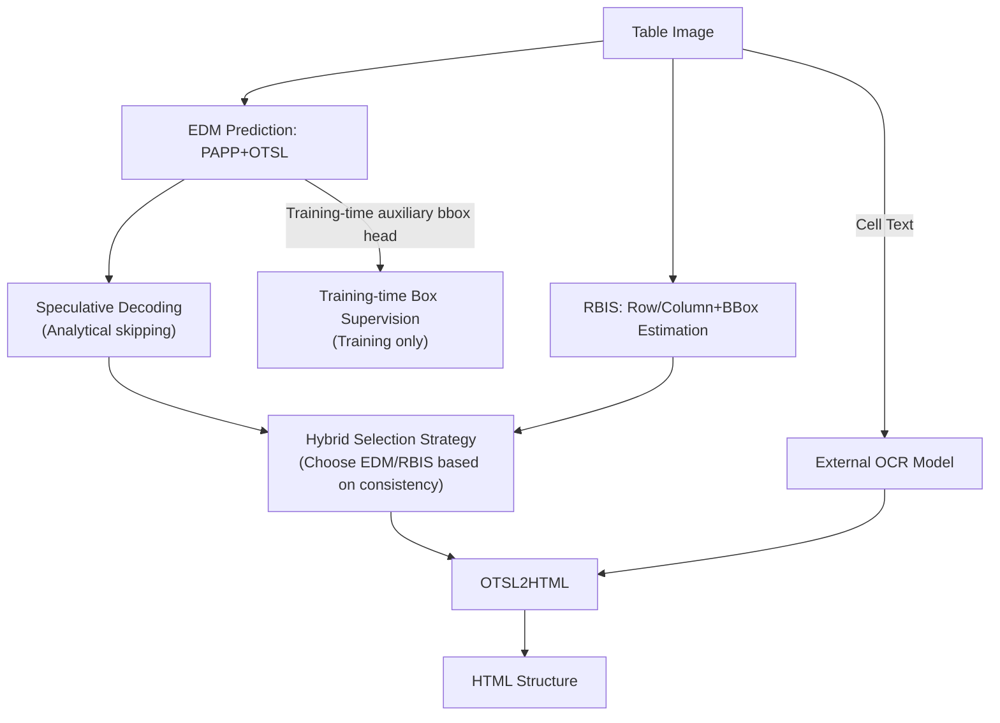

# PIX-TAB: Efficient PIXel-Precise TABle Structure Recognition Approach with Speculative Decoding and Region-Based Image Segmentation

**Conference**: CVPR 2026  
**Paper**: [CVF Open Access](https://openaccess.thecvf.com/content/CVPR2026/html/Zaytsev_PIX-TAB_Efficient_PIXel-Precise_TABle_Structure_Recognition_Approach_with_Speculative_Decoding_CVPR_2026_paper.html)  
**Code**: To be confirmed  
**Area**: Semantic Segmentation / Document Intelligence  
**Keywords**: Table Structure Recognition, pixel-level tokens, speculative decoding, region segmentation, edge deployment

## TL;DR
PIX-TAB utilizes "Position-Aware Pixel-level (PAPP)" tokens to embed row/column pixel coordinates directly into the sequence, eliminating the need for a separate bounding box head during inference. Combined with analytical speculative decoding and a flood-fill-based Region-Based Image Segmentation (RBIS) for large tables, this lightweight encoder-decoder model achieves over 3x speedup compared to full-scale versions while remaining deployable on mobile devices.

## Background & Motivation

**Background**: Table Structure Recognition (TSR) aims to recover logical relationships (rows, columns, cells) from document images and is a foundational step for information extraction. Deep learning has shifted this field from CNN-based methods (Faster/Cascade R-CNN) to Transformer-based approaches (TableFormer, TATR, TABLET) and recent Large Vision-Language Models (UniTable, OmniParser).

**Limitations of Prior Work**: Existing approaches follow two suboptimal paths. The first is a "task-splitting" pipeline where detection, structural analysis, and content recognition are performed independently, leading to cumulative errors and high computational costs. The second involves unified VLM solutions, which offer decent accuracy but are too heavy for mobile deployment. Even end-to-end multi-task learners like MTL-TabNet struggle with long, nested, or merged cells and rely on separate bounding box decoding branches, which are slow and unstable.

**Key Challenge**: There is a trade-off between accuracy, speed, and edge-side deployability. Achieving pixel-precise cell coordinates usually requires training and running a specific bounding box (bbox) decoder. To gain speed, structural precision is often sacrificed. Furthermore, dense tables with dozens of rows and complete borders—common in corporate documents—are precisely where autoregressive decoding is slowest and most prone to structural errors.

**Goal**: To build a TSR system satisfying three criteria: (1) providing pixel-precise cell structures; (2) achieving inference speed sufficient for mobile devices; and (3) decoupling from OCR so that changing languages only requires swapping the OCR model without modifying the structural model.

**Key Insight**: The authors observed that if pixel coordinates for every horizontal and vertical line are **directly embedded into the structural sequence**, the cell bounding boxes can be reconstructed by parsing the sequence alone, removing the need for a bbox decoder. Additionally, the token sequences of structured tables are highly regular between rows; this regularity can be used to predict future tokens analytically without training a draft model.

**Core Idea**: Use "Position-Aware Pixel-level (PAPP)" tokens to encode coordinates and eliminate the inference-time bbox decoder. Use "analytical speculative decoding" to bypass redundant decoding steps between rows. Finally, use "flood-fill region segmentation + hybrid selection" as a fallback for large, bordered tables.

## Method

### Overall Architecture
PIX-TAB takes a normalized table image and outputs the table structure in HTML format. The system consists of four collaborative parts: (1) an Encoder-Decoder Model (EDM) predicting PAPP and OTSL tokens; (2) a Region-Based Image Segmentation (RBIS) module using flood fill to independently estimate rows, columns, and bboxes for bordered tables; (3) an external OCR model for text recognition; and (4) an aggregation module using a hybrid selection strategy to choose between EDM and RBIS results based on consistency, followed by an OTSL2HTML conversion. The EDM is the primary path, while RBIS serves as a parallel fallback. Structural recognition is decoupled from OCR.

### Key Designs

**1. Position-Aware Pixel-level Progress (PAPP) tokens: Eliminating the bbox decoder**

To achieve pixel precision without an extra bbox decoder, PIX-TAB extends the OTSL representation. For a table normalized to $X \times Y$, it introduces two types of position tokens: row-start tokens `<rYYY>` ($\text{YYY} \in [0, Y)$) marking vertical coordinates of horizontal lines, and column-boundary tokens `<cXXX>` ($\text{XXX} \in [0, X)$) marking horizontal coordinates of vertical lines. These are interleaved with four OTSL structure tokens: `C` (cell), `L` (left-looking merge), `U` (up-looking merge), and `X` (cross merge), ending with `</table>`. Notably, the **`NL` (newline) token from original OTSL is removed**, as new rows are implicitly marked by `<rYYY>`.

Since coordinates are explicitly written as tokens, all cell bounding boxes can be **directly reconstructed** from the sequence. This representation is much more compact than equivalent HTML and only slightly longer than pure OTSL, enabling acceleration via speculative decoding.

**2. Training-time box supervision: Stabilizing spatial localization**

Although coordinates are parsed from tokens during inference, spatial localization is stabilized during training by retaining a lightweight BBoxDecoder. This decoder is **active only during training and removed during inference**. The model is trained with a joint loss: $\mathcal{L}_{\text{total}} = \mathcal{L}_{\text{structure}} + \mathcal{L}_{\text{bbox}}$. The structural term is a standard teacher-forcing cross-entropy loss. The bbox term is calculated only for "new cell" tokens using a normalized L1 loss to remain scale-insensitive:

$$\mathcal{L}_{\text{bbox}} = \frac{1}{|\mathcal{C}|}\sum_{c \in \mathcal{C}} \frac{\lVert \mathbf{b}_c - \mathbf{b}_c^{\text{gt}}\rVert_1}{\sum_{i=1}^{4}(\mathbf{b}_c^{\text{gt}})_i + \epsilon}.$$

The bbox head acts as a "training co-pilot," forcing the shared decoder to learn spatially consistent features without adding inference overhead.

**3. Analytical Speculative Decoding: Rule-based future token prediction**

Autoregressive decoding is slow for long tables, and standard speculative decoding requires a secondary draft model. PIX-TAB leverages the inter-row regularity of PAPP+OTSL sequences. After the first row, `<cXXX>` tokens typically do not repeat, and rows start with `<rYYY>` followed by OTSL tokens. An **analytical algorithm** generates speculative blocks without additional neural network passes.

The system finds a previous reference row matching the current row's prefix, appends the remaining portion, and repeats this for $K$ tokens. It estimates the vertical step from recent row gaps to update `<rYYY>` tokens. The decoder performs a single forward pass on the prefix plus the speculative block, validating tokens and stopping at the first mismatch. This saves significant decoding steps on structured tables.

**4. Region Segmentation + Hybrid Selection: Fallback for dense bordered tables**

EDM can fail on large tables with complex layouts and complete borders. As a fallback, the RBIS module runs in parallel, using flood fill and Breadth-First Search (BFS) in three stages: ① **Region Detection** (grouping 8-neighbor pixels with similar intensities); ② **Region Analysis** (updating bboxes and calculating density $\rho$); ③ **Quality Filtering** (retaining regions meeting density and size thresholds). Aggregation uses a hybrid selection criterion $\Psi$ to choose RBIS if it detects significantly more consistent rows ($N_r$) and columns ($N_c$) than the EDM:

$$\Psi = \begin{cases} \text{RBIS}, & \text{if } N_r^{\text{RBIS}} > \gamma \cdot N_r^{\text{EDM}} \ \text{and}\ N_c^{\text{RBIS}} > \gamma \cdot N_c^{\text{EDM}} \\ \text{EDM}, & \text{otherwise} \end{cases}$$

### Loss & Training
The total loss is the sum of structural cross-entropy and training-time normalized L1 bbox loss. The optimizer is Ranger (RAdam + LookAhead) with $\beta_1=0.9, \beta_2=0.95$, and a weight decay of 0.1. The training uses a batch size of 128 and a peak learning rate of 0.001, decaying after 64% of epochs. Data includes PubTabNet, FinTabNet, and synthetic extensions (PubTabNetSynth, FinTabNetSynth) totaling over a million unique tables.

## Key Experimental Results

### Main Results
Comparison with recent image-only methods on FinTabNet (FPS normalized on A100):

| Method | Image Size | Norm.FPS | TEDS_struct |
|------|---------|---------|-------------|
| RobusTabNet | 1024 | 5.19 | 97.00 |
| VAST | 608 | 1.38 | 98.63 |
| UniTable | - | - | 98.89 |
|MuTabNet | - | - | 98.87 |
| TABLET | 960 | 18.01 | 98.71 |
| **PIX-TAB (✓RBIS)** | **480** | **7.23** | **98.65** |
| **PIX-TAB (✗RBIS)** | **480** | **7.96** | **98.72** |

PIX-TAB achieves a TEDS_struct of 98.72 with a **small 480px input**, matching heavy models while being optimized for edge devices.

Mobile Performance (Samsung Fold 5 / Snapdragon 8 Gen 2):

| Method | Model | TEDS_struct | TEDS | Avg Latency (s) |
|------|------|-------------|------|------------|
| PIX-TAB | Full | 97.26 | 96.63 | 19.9 |
| PIX-TAB | Optimized | 96.64 | 96.01 | 6.6 |

The optimized mobile version provides over 3x acceleration with minimal accuracy loss.

### Ablation Study
Effects of RBIS and Speculative Decoding (SD):

| RBIS | SD | Dataset | TEDS_struct / TEDS_struct100 | FPS |
|------|----|--------|------------------------------|-----|
| ✗ | ✗ | FinTabNet | 98.72 / 89.83 | 3.80 |
| ✗ | ✓ | FinTabNet | 98.72 / 89.84 | 7.96 |
| ✓ | ✓ | FinTabNet | 98.65 / 89.81 | 7.23 |

On the MarketingStyle subset (dense bordered tables) of SynthTabNet:
- **Without RBIS**: TEDS100 = 35.08
- **With RBIS**: TEDS100 = 45.61 (+10.53%)

### Key Findings
- **Speculative decoding provides "free" speedup**: FPS improved from 3.80 to 7.96 on FinTabNet without losing accuracy, validating the analytical approach.
- **RBIS value is specific to dense tables**: While overall scores on standard sets slightly dropped due to RBIS, it significantly improved performance on complex bordered layouts.
- **Small input efficiency**: 480px inputs allow the model to run on mobile while maintaining competitive accuracy.

## Highlights & Insights
- **Dual-purpose PAPP tokens**: Embedding coordinates into tokens removes the inference-time bbox head and enables speculative decoding by creating structural regularity.
- **Analytical Speculative Decoding**: By using table-specific rules rather than a second model, the speedup cost is negligible, making it highly efficient for structured generation tasks.
- **Training-only BBox head**: This strategy stabilizes spatial learning without imposing any inference-time computational burden.
- **OCR Decoupling**: Separating OCR from structure recognition allows for easy adaptation to multi-language documents.

## Limitations & Future Work
- Overall accuracy is highly dependent on external OCR quality.
- RBIS is only effective for tables with clear borders and fails on irregular or borderless layouts.
- Speculative decoding gains depend on row pattern repetition; it offers no benefit if every row is unique.
- The hybrid selection threshold $\gamma=0.7$ is empirical and lacks an adaptive mechanism.

## Related Work & Insights
- **vs MTL-TabNet**: Inspired by its architecture but eliminates the inference-time bbox head and adds speculative decoding for better mobile performance.
- **vs OTSL / SPRINT**: Adopts the minimalist OTSL vocabulary but extends it with PAPP tokens to unify structure and coordinates.
- **vs VLM (UniTable/OmniParser)**: While VLMs are more powerful, PIX-TAB prioritizes edge-side deployability through compact modeling and engineering optimizations.

## Rating
- Novelty: ⭐⭐⭐⭐ The combination of PAPP tokens to eliminate the bbox decoder and analytical speculative decoding is clever.
- Experimental Thoroughness: ⭐⭐⭐⭐ Covers various benchmarks, mobile hardware, and ablation studies, though RBIS gains are subset-specific.
- Writing Quality: ⭐⭐⭐⭐ Clear motivation and well-defined algorithms with pseudocode.
- Value: ⭐⭐⭐⭐ High engineering value for deploying TSR on mobile devices with significant speedups.

## Related Papers

- [\[CVPR 2026\] Structure-Aware Representation Distillation for Tiny-Dense Object Segmentation](structure-aware_representation_distillation_for_tiny-dense_object_segmentation.md)
- [\[CVPR 2026\] Beyond Appearance: Camouflaged Object Detection via Geometric Structure](beyond_appearance_camouflaged_object_detection_via_geometric_structure.md)
- [\[CVPR 2025\] 2DMamba: Efficient State Space Model for Image Representation with Applications on Giga-Pixel Whole Slide Image Classification](../../CVPR2025/segmentation/2dmamba_efficient_state_space_model_for_image_representation_with_applications_o.md)
- [\[CVPR 2026\] Mitigating Objectness Bias and Region-to-Text Misalignment for Open-Vocabulary Panoptic Segmentation](mitigating_objectness_bias_and_region-to-text_misalignment_for_open-vocabulary_p.md)
- [\[AAAI 2026\] JoDiffusion: Jointly Diffusing Image with Pixel-Level Annotations for Semantic Segmentation Promotion](../../AAAI2026/segmentation/jodiffusion_jointly_diffusing_image_with_pixel-level_annotations_for_semantic_se.md)

<!-- RELATED:END -->

<!-- RELATED:START -->

## Related Papers

- [\[CVPR 2026\] Structure-Aware Representation Distillation for Tiny-Dense Object Segmentation](structure-aware_representation_distillation_for_tiny-dense_object_segmentation.md)
- [\[CVPR 2025\] 2DMamba: Efficient State Space Model for Image Representation with Applications on Giga-Pixel Whole Slide Image Classification](../../CVPR2025/segmentation/2dmamba_efficient_state_space_model_for_image_representation_with_applications_o.md)
- [\[CVPR 2026\] Dual-level Adapter Boosting Prompt-free Curvilinear Structure Segmentation](dual-level_adapter_boosting_prompt-free_curvilinear_structure_segmentation.md)
- [\[CVPR 2026\] HySeg: Learning Generative Priors for Structure-Aware Remote Sensing Segmentation](hyseg_learning_generative_priors_for_structure-aware_remote_sensing_segmentation.md)
- [\[CVPR 2026\] Beyond Appearance: Camouflaged Object Detection via Geometric Structure](beyond_appearance_camouflaged_object_detection_via_geometric_structure.md)

<!-- RELATED:END -->
