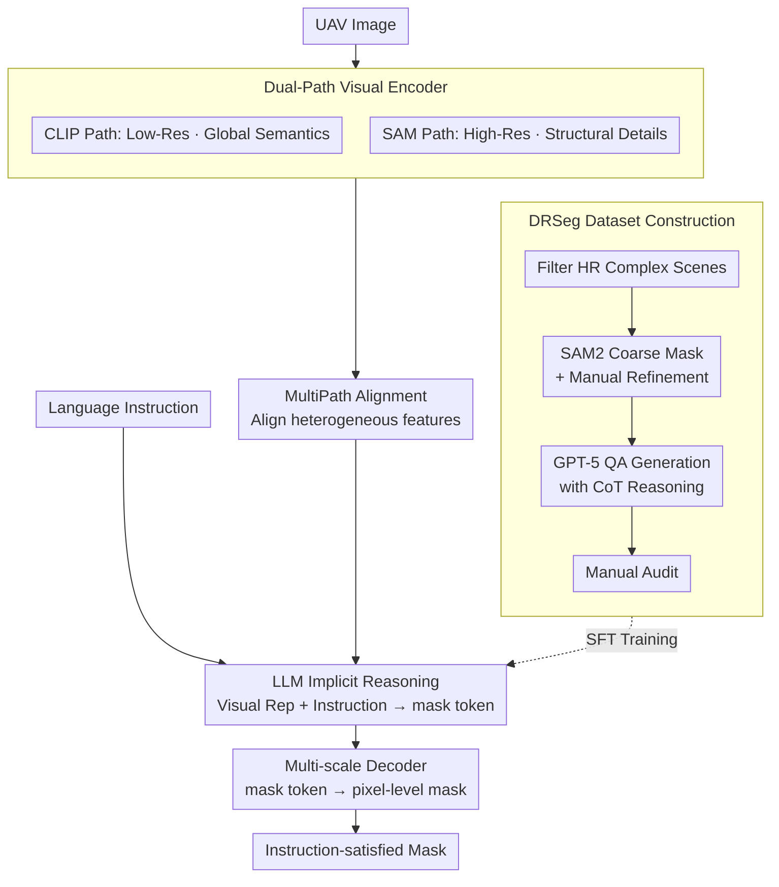

# PixDLM: A Dual-Path Multimodal Language Model for UAV Reasoning Segmentation

**Conference**: CVPR 2026 Highlight  
**arXiv**: [2604.15670](https://arxiv.org/abs/2604.15670)  
**Code**: [https://github.com/XIEFOX/PixDLM](https://github.com/XIEFOX/PixDLM)  
**Area**: Semantic Segmentation  
**Keywords**: UAV Reasoning Segmentation, Multimodal Large Language Model, Dual-path Visual Encoder, Chain-of-Thought, Pixel-level Prediction

## TL;DR

This paper defines the UAV Reasoning Segmentation task, constructs the DRSeg benchmark containing 10K high-resolution UAV images with Chain-of-Thought (CoT) annotations, and proposes a dual-path pixel-level multimodal large language model, PixDLM, as a baseline.

## Background & Motivation

**Background**: Reasoning segmentation aims to identify regions in an image that satisfy specific conditions based on free-form text instructions. Models such as LISA and PixelLM have demonstrated the ability of multimodal large language models (MLLMs) to perform implicit reasoning and pixel-level segmentation in ground-view scenarios.

**Limitations of Prior Work**: Existing reasoning segmentation models and datasets are primarily based on ground-view or nadir-view images. Their visual assumptions (moderate resolution, limited scale variation, stable camera orientation, large target size) are inapplicable to UAV imagery. UAV images face three unique challenges: (1) perspective geometry continuously changing due to high-altitude oblique views; (2) extreme scale variations and dense small objects, where many critical targets occupy only dozens of pixels; (3) ultra-high-resolution scenes requiring simultaneous reasoning over global semantics and minute high-frequency details.

**Key Challenge**: Existing MLLMs typically use low-resolution visual tokenization, causing fine-grained UAV details to be lost during compression. Furthermore, the lack of reasoning segmentation benchmarks specifically for UAV scenarios hinders systematic research progress.

**Goal**: (1) Formally define the UAV Reasoning Segmentation task and construct a dedicated benchmark dataset; (2) Propose a baseline model capable of processing both global semantics and local details.

**Key Insight**: Semantic requirements for UAV reasoning are organized into three dimensions—spatial reasoning, attribute reasoning, and scene-level reasoning—corresponding to positional relationships, visual states, and global context, respectively.

**Core Idea**: Use a dual-path visual encoder (global low-resolution path + high-resolution structural path) to preserve small objects and boundary cues, combined with LLM-driven reasoning for pixel-level segmentation.

## Method

### Overall Architecture

The core challenge PixDLM addresses is that critical objects in UAV images often occupy only a few dozen pixels. Mainstream MLLMs compress visual tokens to low resolutions, causing these small objects and fine boundaries to be erased. PixDLM establishes two complementary paths at the visual end: one for global semantics and another for high-resolution structural details. These features are aligned and fed into the LLM for instruction reasoning, followed by a decoder that restores the pixel-level mask.

The overall workflow is: UAV images simultaneously enter the dual-path visual encoder; the CLIP path captures global semantics while the SAM path preserves structural details. MultiPath Alignment aligns these heterogeneous features into a unified representation. The LLM reads this visual representation alongside natural language instructions to perform implicit reasoning and outputs a mask token. Finally, a multi-scale decoder decodes this token into a segmentation mask satisfying the instruction. Training data is derived from the newly constructed DRSeg benchmark.

### Key Designs

**1. Dual-Path Visual Encoder: Separating Semantics and Details via Off-the-shelf Encoders**

A single path is insufficient in UAV scenarios: low-resolution encoders lose dense small objects during token compression, while high-resolution encoders entail prohibitive computational costs. PixDLM decomposes the task into two complementary off-the-shelf models: the CLIP visual encoder processes low-resolution input for semantic understanding, while the SAM encoder processes high-resolution input to preserve small object contours and boundary cues. CLIP excels at "what it is," and SAM excels at "where the boundaries are." This parallel approach captures semantics without sacrificing detail and avoids training an expensive high-resolution encoder from scratch.

**2. MultiPath Alignment Module: Aligning Heterogeneous Features**

Features produced by CLIP and SAM reside at different scales and semantic levels. This lightweight module aligns and integrates semantic and structural features into a unified representation space. This allows the LLM to utilize both global semantic and local structural cues during reasoning, rather than biasing one path.

**3. DRSeg Dataset Construction: Semi-automated Baseline with Reasoning Chains**

Existing UAV datasets lack both fine-grained mask annotations and reasoning-oriented text supervision. DRSeg fills this gap via a four-stage semi-automated process based on the CODrone dataset: (1) manual filtering of complex high-resolution images with significant scale variations, dense targets, occlusion, and oblique views; (2) converting CODrone rotated boxes to coarse masks via SAM2 and semi-autonomously refining boundaries using ISAT (specifically for small objects and slender structures); (3) using GPT-5 with custom prompts to generate QA pairs covering spatial, attribute, and scene dimensions (including natural language reasoning and distilled CoT chains); (4) manual auditing for logical consistency and semantic-mask alignment. The dataset is nearly uniformly distributed across the three reasoning dimensions (~33.3% each), totaling 10K high-resolution images, 10K instance masks, and paired reasoning QA, split into 3:2:5 for training, validation, and testing.

### Loss & Training

Following the standard LISA training paradigm, a mask token is introduced with an embedding-as-mask decoder. The special token output by the LLM is decoded into segmentation results, supported by SFT fine-tuning on DRSeg.

## Key Experimental Results

### Main Results

| Model | Attribute gIoU | Scene gIoU | Spatial gIoU |
|------|---------------|------------|-------------|
| LISA-13B (zero-shot) | 52.65 | 47.08 | 42.85 |
| PixelLM-7B (zero-shot) | 46.87 | 43.07 | 41.28 |
| LISA-7B (SFT) | 59.22 | 54.45 | 57.33 |
| **PixDLM (Ours)** | **62.80** | **61.75** | **62.51** |

### Ablation Study

| Configuration | Attr gIoU | Scene gIoU | Spatial gIoU |
|------|-----------|------------|-------------|
| DRSeg + RRSIS-D + CoT | 61.13 | 55.60 | 60.55 |
| DRSeg + CoT (w/o RRSIS-D) | **62.80** | **61.75** | **62.51** |
| DRSeg (w/o CoT) | 62.51 | 61.67 | 61.98 |

### Key Findings

- PixDLM significantly outperforms zero-shot and SFT baselines across all three reasoning dimensions, with the most notable gain in scene reasoning (+7.3 vs. SFT LISA).
- Mixing RRSIS-D data actually decreased performance, indicating the importance of domain adaptation for specialized UAV data.
- The improvement brought by CoT reasoning supervision is relatively limited, though the model remains robust to noisy reasoning chains.

## Highlights & Insights

- **Clear Task Definition**: Systematizes UAV reasoning segmentation into spatial, attribute, and scene dimensions, providing a clear framework for future research.
- **Mature Data Construction**: The semi-automated GPT-5 + manual audit annotation process ensures quality while maintaining scalability.
- **Effective Dual-Path Design**: Utilizing off-the-shelf CLIP and SAM encoders avoids the cost of training high-resolution encoders from scratch while successfully capturing fine details.

## Limitations & Future Work

- 58% of instances are small objects (area < 2%), leaving significant room for improvement on extreme small targets.
- Only one target instance is annotated per image, preventing the evaluation of multi-target reasoning scenarios.
- The computational overhead of dual-path encoders is significant, potentially impacting efficiency for real-time UAV applications.
- The dataset size (10K) is relatively limited; larger-scale data might further enhance performance.

## Related Work & Insights

- **vs LISA**: LISA uses a single CLIP encoder, whereas PixDLM adds a high-resolution SAM path, showing clear advantages in UAV small object scenarios.
- **vs GeoPix/GeoPixel**: These remote sensing models use geographic priors but lack open-vocabulary reasoning capabilities and perform poorly on dense small objects.
- **vs LLaVA-HR**: While also using a dual-path approach for high resolution, PixDLM is specifically designed for pixel-level output.

## Rating

- Novelty: ⭐⭐⭐⭐ First formal definition of the UAV reasoning segmentation task; benchmark and task definition are pioneering.
- Experimental Thoroughness: ⭐⭐⭐⭐ Comprehensive multi-baseline comparisons and reasonable ablation designs.
- Writing Quality: ⭐⭐⭐⭐ Detailed and clear descriptions of task definitions and data construction.
- Value: ⭐⭐⭐⭐ Provides an important benchmark and baseline for UAV visual understanding.

<!-- RELATED:START -->

## Related Papers

- [\[CVPR 2026\] Towards Streaming Referring Video Segmentation via Large Language Model](towards_streaming_referring_video_segmentation_via_large_language_model.md)
- [\[CVPR 2025\] GLUS: Global-Local Reasoning Unified into A Single Large Language Model for Video Segmentation](../../CVPR2025/segmentation/glus_global-local_reasoning_unified_into_a_single_large_language_model_for_video.md)
- [\[ACL 2026\] AnchorSeg: Language Grounded Query Banks for Reasoning Segmentation](../../ACL2026/segmentation/anchorseg_language_grounded_query_banks_for_reasoning_segmentation.md)
- [\[CVPR 2026\] Fast Reasoning Segmentation for Images and Videos](fast_reasoning_segmentation_for_images_and_videos.md)
- [\[ICCV 2025\] HiMTok: Learning Hierarchical Mask Tokens for Image Segmentation with Large Multimodal Model](../../ICCV2025/segmentation/himtok_learning_hierarchical_mask_tokens_for_image_segmentation_with_large_multi.md)

<!-- RELATED:END -->
