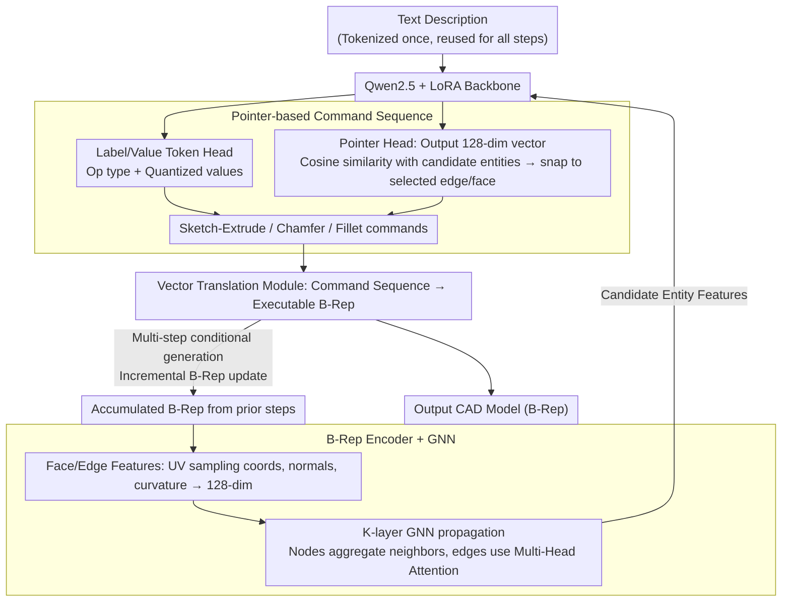

# Pointer-CAD: Unifying B-Rep and Command Sequences via Pointer-based Edges & Faces Selection

**Conference**: CVPR2026  
**arXiv**: [2603.04337](https://arxiv.org/abs/2603.04337)  
**Code**: [Snitro/Pointer-CAD](https://github.com/Snitro/Pointer-CAD)  
**Area**: 3D CAD Generation  
**Keywords**: CAD Generation, B-Rep, Pointer Network, Command Sequence, LLM, Graph Neural Network, Chamfer/Fillet

## TL;DR

Ours proposes a command sequence representation based on a Pointer mechanism, explicitly introducing B-Rep geometric entities (edges/faces) into autoregressive CAD generation. This is the first command sequence method to support chamfer/fillet operations while significantly reducing topological errors caused by quantization.

## Background & Motivation

**Time-consuming CAD modeling**: Traditional CAD design workflows (2D sketch → 3D modeling → B-Rep storage) rely heavily on manual operations, making complex designs extremely time-consuming.

**Limitations of Prior Work in command sequence methods**: Existing command sequence methods (DeepCAD, Text2CAD, etc.) encode CAD operations as token sequences. While they offer fast generation, they do not support operations requiring entity selection (such as chamfer and fillet) because these operations need to explicitly reference existing geometric entities (edges or faces).

**Key Challenge of quantization errors**: In LLM-based sequence generation, the discretization of continuous parameters introduces quantization errors. This leads to newly drawn curves failing to align with existing edges or sketch planes failing to match target faces, thereby destroying topological connectivity.

**Efficiency bottleneck of code representation**: Although code generation methods (CadQuery/FreeCAD) are flexible, their token sequences are approximately four times longer than command sequences (424 vs. 110 tokens), resulting in significantly longer inference times.

**Inadequacy of general LLMs**: General LLMs such as Claude Opus 4, Gemini 2.5 Pro, and GPT-5.2 show low success rates in directly generating CadQuery code, with poor geometric consistency (Invalid Rate (IR) as high as 24-50%).

**Ambiguity in entity selection**: Previous attempts have tried to implement entity selection via face labels and face intersection lines, but edges derived from face intersections may not be unique, leading to selection ambiguity.

## Method

### Overall Architecture

Pointer-CAD addresses the issue where command sequence methods are fast but cannot reference existing geometric entities (edges/faces), preventing chamfer/fillet operations and causing misalignments due to quantization errors. It decomposes CAD modeling into multiple steps, where each step performs conditional generation based on a text description and the B-Rep generated in previous steps. Text is tokenized only once and reused across all steps, while the B-Rep is updated incrementally after each operation. The backbone is Qwen2.5 (0.5B/1.5B) with LoRA fine-tuning. The final hidden states are connected to two independent fully connected layers: one for predicting Label/Value Tokens and another for predicting Pointers. The predicted command sequences are then converted into executable B-Rep geometry by a vector translation module.

### Key Designs

**1. Pointer-based Command Sequence: Explicitly referencing existing edges and faces via Pointer tokens**

Command sequence methods (DeepCAD, Text2CAD) encode CAD operations into tokens, but operations like chamfer/fillet must point to specific edges or faces, which pure numerical tokens cannot achieve. Pointer-CAD categorizes each token into one of three types:

| Type | Function |
|------|------|
| **Label Token** | Semantic labels indicating operation types or structural boundaries (e.g., `<ss>` for sketch start, `<sc>` for chamfer start). |
| **Value Token** | Numerical parameters (coordinates, angles, etc.), where continuous parameters are quantized into $q$-bit integers at the $2^q$ level. |
| **Pointer** | References a face or edge in the B-Rep; the LLM outputs a 128-dim vector, and the entity is selected based on cosine similarity with candidate entities. |

Three basic operations are linked by Pointers: **Sketch-Extrude** uses a Pointer to select a sketch plane from candidate faces (replacing traditional 6-parameter regression), then draws Line/Arc/Circle and extrudes $E:(e_p, e_n, b)$; **Chamfer** $C:(\mathbf{p}, c)$ uses a Pointer set $\mathbf{p}$ to select target edges with a uniform distance $c$; **Fillet** $F:(\mathbf{p}, f)$ similarly selects edges with a uniform radius $f$. The snap-to-entity nature of Pointers allows newly drawn curves to align directly with existing edges, bypassing topological fractures caused by quantization errors.

**2. B-Rep Encoder + GNN: Encoding geometric entities into features for pointer matching**

For Pointers to select the correct edges/faces, each entity must have discriminative features. Ours constructs the B-Rep as a **Face Adjacency Graph** $\mathcal{G}(V, E)$ (nodes are faces, edges are shared boundaries): face features consist of 3D coordinates, normals, Gaussian curvature, and visibility markers on a $32 \times 32$ UV sampling grid, average-pooled to 128 dimensions; edge features consist of 3D coordinates, tangents, and derivatives sampled at 32 equidistant points, average-pooled to 128 dimensions. Then, $K$ layers of GNN propagation are applied—node updates aggregate neighbor messages (similar to the GIN mechanism), and edge updates use Multi-Head Attention (MHA) to extract information from global face features. Ablation shows that GNN provides the greatest gain for modeling arc structures (Arc F1 67.14 → 85.70) because it captures topological context invisible to isolated entities.

**3. Multi-step Mechanism: Decomposing model generation into step sequences to reference previously generated geometry**

For the above designs to work, an essential prerequisite is that "existing edges and faces" must be available for Pointers to reference and for the GNN to encode. However, traditional command sequence methods output the entire sequence at once without looking back at prior geometry, so "existing entities" do not exist within the sequence. Consequently, operations like chamfer/fillet that modify existing edges/faces have no basis. Pointer-CAD decomposes the entire modeling process into a series of steps. Each step generates only one basic operation (sketch-extrude / chamfer / fillet) and autoregressively predicts the next step conditioned on the text description and the accumulated B-Rep. After each operation, the vector translation module converts the command sequence into geometry, incrementally updates the B-Rep, and feeds it back into the encoder for the next step (the VT → B-Rep → Encoder loop). Text is tokenized once and reused, while the B-Rep grows step-by-step. Because geometry accumulates over steps, subsequent Pointers have "existing entities" to reference, mirroring the actual workflow of an engineer.

### Loss & Training

The total loss is:

$$\mathcal{L} = \lambda_v \cdot \mathcal{L}_v + \lambda_p \cdot \mathcal{L}_p$$

- **Label/Value Prediction** $\mathcal{L}_v$: Cross-entropy classification loss with label smoothing.
- **Pointer Prediction** $\mathcal{L}_p$: Contrastive regression loss that allows for multiple valid candidates (equivalent coplanar/collinear entities). It maximizes cosine similarity for positive pairs and minimizes it for negative pairs, using a learnable temperature $\tau$.

## Key Experimental Results

### Main Results: Text-to-CAD Generation

**Recap-DeepCAD Dataset** (176K models, without chamfer/fillet):

| Model | Line F1↑ | Arc F1↑ | Circle F1↑ | CD mean↓ | CD median↓ | SegE↓ | FluxEE↓ |
|------|----------|---------|------------|----------|-----------|-------|---------|
| DeepCAD | 80.14 | 31.41 | 79.04 | 37.47 | 12.56 | 0.53 | 25.85 |
| Text2CAD | 88.12 | 45.19 | 87.03 | 17.48 | 3.38 | 0.44 | 17.75 |
| CADmium-7B | 85.13 | 25.68 | 74.94 | 10.53 | 0.44 | 1.21 | 32.22 |
| **Pointer-CAD-0.5B** | **97.70** | **85.70** | **98.27** | 3.81 | 0.54 | **0.13** | **2.14** |
| **Pointer-CAD-1.5B** | 98.73 | 95.14 | 98.66 | **2.58** | **0.30** | 0.11 | 2.97 |

**Recap-OmniCAD+ Dataset** (575K models, with chamfer/fillet):

| Model | Chamfer F1↑ | Fillet F1↑ | CD mean↓ | SegE↓ | FluxEE↓ |
|------|------------|-----------|----------|-------|---------|
| Others | Not Supp. | Not Supp. | 11.60-27.48 | 0.51-1.39 | 26.36-42.59 |
| **Pointer-CAD-0.5B** | **89.74** | **82.54** | 5.49 | **0.15** | **3.51** |
| **Pointer-CAD-1.5B** | 94.32 | 89.85 | **2.86** | 0.17 | 3.44 |

### Ablation Study: GNN Effectiveness

| Configuration | IR↓ | Arc F1↑ | CD mean↓ |
|------|-----|---------|----------|
| Pointer-CAD w/o GNN (MLP) | 22.73 | 67.14 | 5.13 |
| **Pointer-CAD w/ GNN** | **15.02** | **85.70** | **3.81** |
| Text2CAD w/o GNN | 30.16 | 45.19 | 17.48 |
| Text2CAD w/ GNN | 27.17 | 51.85 | 14.33 |

The gain from GNN modeling is particularly significant for Arc structures (F1 from 67.14 to 85.70).

### Key Findings

- **0.5B model outperforms 7B**: Pointer-CAD-0.5B outperforms CADmium-7B across almost all metrics, indicating that representation design is more important than model scale.
- **SegE reduced by an order of magnitude**: The Pointer mechanism effectively eliminates topological fractures caused by quantization errors via snap-to-entity (SegE: 0.44-1.21 → 0.11-0.13).
- **FluxEE significantly improved**: Entity watertightness dropped from 17-38 to 2-3, making generated models closer to valid solids.
- **General LLM Comparison**: GPT-5.2's IR reached 23.9% (nearly 1/4 of models failed), whereas Pointer-CAD-0.5B was only 14.79%.

## Highlights & Insights

- The **Pointer mechanism** innovatively introduces Pointer Network concepts into CAD command sequences, achieving the **first support for chamfer/fillet** operations within command sequence methods.
- The **multi-step conditional generation** architecture is elegant: each step generates based on accumulated B-Rep and text conditions, simulating the actual workflow of an engineer.
- Solid **data engineering**: Constructed a 575K scale dataset with multi-view descriptions automatically labeled by Qwen2.5-VL, preserving real parameters instead of normalization.
- High token efficiency: Averaging only 110 tokens/model with 2.13s inference, far superior to code representation solutions.

## Limitations & Future Work

- Currently only evaluates **text-conditioned** settings; has not extended to multi-modal inputs like images or point clouds.
- Supports **single-part modeling** only; does not involve assembly-level constraints (mating constraints, hierarchical dependencies).
- Complex models (≥4 non-sketch steps) occasionally show local positioning deviations.
- Pointers rely on cosine matching of B-Rep geometric features; ability to distinguish similar faces/edges in highly symmetric models needs verification.

## Related Work & Insights

- **B-Rep Generation**: ComplexGen, CMT, etc., directly generate B-Rep hierarchical structures, but topological relationships are complex and difficult to model.
- **CSG Representation**: Combines primitives via Boolean operations but struggles to represent surfaces (like fillets), and CSG representation is non-unique.
- **Command Sequence**: DeepCAD → SkexGen → Text2CAD → CAD-MLLM → CADFusion, gradually introducing more modalities and operations, but none support entity selection. Fan et al. attempted face-label-based selection, but edges derived from face intersections were ambiguous.
- **Code Representation**: CADmium (JSON), CadQuery/FreeCAD API solutions are flexible but suffer from long tokens and slow inference.

## Rating

- Novelty: ⭐⭐⭐⭐⭐ — Introducing the Pointer mechanism to CAD sequence generation is a key innovation, enabling entity referencing for the first time.
- Experimental Thoroughness: ⭐⭐⭐⭐ — Comprehensive dataset comparison + General LLMs + GNN ablation + Qualitative analysis, but lacks multi-modal input experiments.
- Writing Quality: ⭐⭐⭐⭐ — Clear structure, rich illustrations, and well-explained motivation.
- Value: ⭐⭐⭐⭐⭐ — Solved the core pain point of command sequence methods; the 0.5B model's superiority over the 7B model is highly practical.

<!-- RELATED:START -->

## Related Papers

- [\[CVPR 2026\] FoV-Net: Rotation-Invariant CAD B-rep Learning via Field-of-View Ray Casting](fov-net_rotation-invariant_cad_b-rep_learning_via_field-of-view_ray_casting.md)
- [\[CVPR 2026\] Annotation-Efficient Coreset Selection for Context-dependent Segmentation](annotation-efficient_coreset_selection_for_context-dependent_segmentation.md)
- [\[CVPR 2026\] From 2D Alignment to 3D Plausibility: Unifying Heterogeneous 2D Priors and Penetration-Free Diffusion for Occlusion-Robust Two-Hand Reconstruction](from_2d_alignment_to_3d_plausibility_unifying_heterogeneous_2d_priors_and_penetr.md)
- [\[ICML 2025\] ActionPiece: Contextually Tokenizing Action Sequences for Generative Recommendation](../../ICML2025/segmentation/actionpiece_contextually_tokenizing_action_sequences_for_generative_recommendati.md)
- [\[ICML 2026\] Refining Context-Entangled Content Segmentation via Curriculum Selection and Anti-Curriculum Promotion](../../ICML2026/segmentation/refining_context-entangled_content_segmentation_via_curriculum_selection_and_ant.md)

<!-- RELATED:END -->
