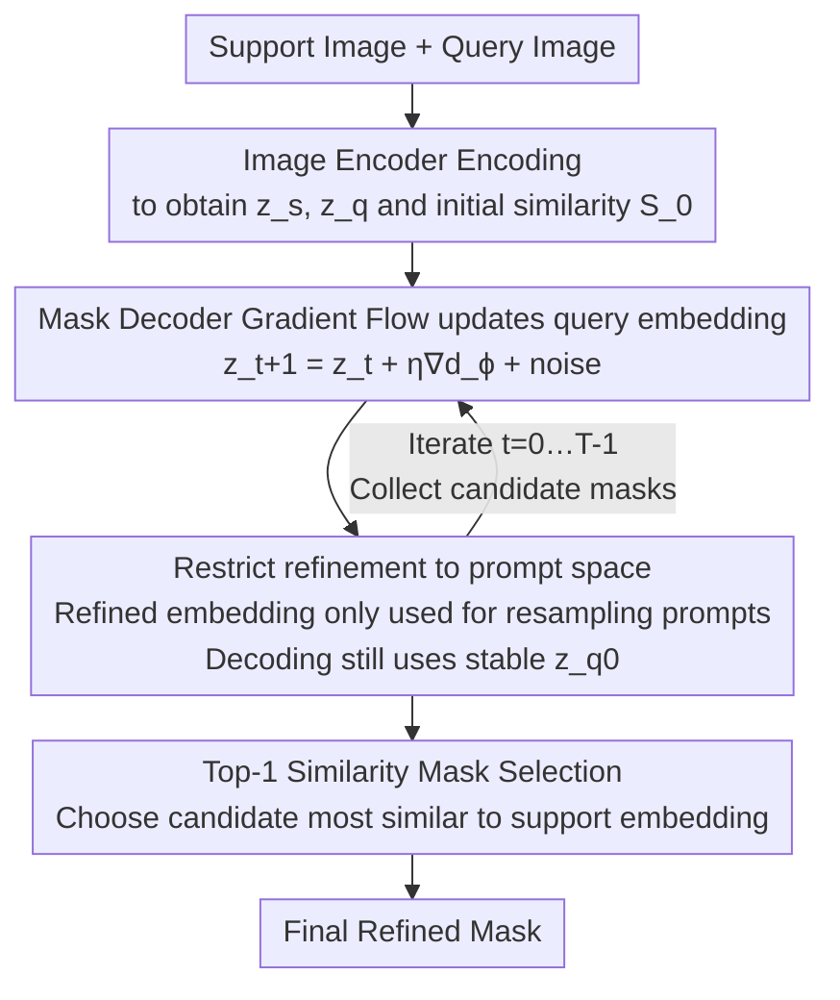

# PR-MaGIC: Prompt Refinement Via Mask Decoder Gradient Flow For In-Context Segmentation

**Conference**: CVPR 2026  
**Paper**: [CVF Open Access](https://openaccess.thecvf.com/content/CVPR2026/html/Lee_PR-MaGIC_Prompt_Refinement_Via_Mask_Decoder_Gradient_Flow_For_In-Context_CVPR_2026_paper.html)  
**Code**: [Project Page](https://postech-minjaelee.github.io/PR-MaGIC/)  
**Area**: Semantic Segmentation / In-Context Segmentation / Prompt Refinement  
**Keywords**: in-context segmentation, SAM, automatic prompt, gradient flow, test-time refinement

## TL;DR
PR-MaGIC is a **training-free, test-time** prompt refinement framework. It treats the gradient of the SAM mask decoder as a "discriminator gradient flow" backpropagated to query image embeddings, iteratively "shifting" low-quality automatically generated prompt points to more accurate positions. By using top-1 similarity to select the most robust mask from multiple candidate steps, it serves as a plug-and-play module that consistently improves performance for one/few-shot segmentation frameworks like PerSAM-F and Matcher.

## Background & Motivation
**Background**: Visual Foundation Models (VFMs) like SAM have made "promptable segmentation" mainstream. However, SAM requires manual points, boxes, or coarse masks, and additional fine-tuning is needed for new tasks. To eliminate manual intervention, a group of in-context (one/few-shot) segmentation methods have emerged. These methods use a masked support image and leverage support↔query semantic similarity to automatically sample prompt points for the SAM decoder. Typical examples include PerSAM-F (fine-tuning SAM linear combination layer masks) and Matcher (using DINOv2 for similarity + SAM as a training-free segmenter).

**Limitations of Prior Work**: The quality of automatic prompts depends entirely on the similarity map between support and query images. Given common discrepancies in color, perspective, and shape, similarity maps often "point to the wrong place." Consequently, sampled prompt points may fall on the background (false positives), be semantically ambiguous, or offer incomplete coverage. These low-quality points mislead the SAM decoder, causing mask quality to collapse. A typical case is shown in Fig. 2, where PerSAM-F / Matcher segments an elephant into fragmented pieces.

**Key Challenge**: Low-quality prompts originate from encoder-side similarity matching, yet the component that truly "understands mask quality" is the decoder. The decoder, joint-trained with the encoder during SAM's large-scale pre-training, contains rich information about what kind of embeddings yield good masks. Existing methods, however, only operate at the encoder similarity level and never incorporate decoder feedback to correct prompts.

**Goal**: To allow decoder gradient signals to back-propagate and guide prompt refinement during inference, correcting low-quality automatic prompts **without training, architectural changes, or additional data**.

**Key Insight**: The authors leverage the theoretical framework of "discriminator gradient flow." The query embedding is treated as a distribution $\rho$, and the "ideal embedding capable of producing the optimal mask" is treated as the target distribution $\mu$. Gradient flow via entropy-regularized KL divergence pushes $\rho$ toward $\mu$. Crucially, this gradient can be approximated using the logit of the SAM mask decoder, making it entirely training-free.

**Core Idea**: Utilize the logit gradient of the mask decoder to create a "gradient flow in the embedding space," iteratively updating query embeddings to resample prompts, and employing top-1 similarity to select the most stable mask from multi-step candidates as a safeguard.

## Method

### Overall Architecture
PR-MaGIC is a plug-and-play refinement layer built atop existing in-context segmentation frameworks (e.g., PerSAM-F / Matcher). It takes a support image $I_s$ (with mask) and a query image $I_q$ as input, outputting a refined query segmentation mask. The pipeline consists of three stages: first, an image encoder $E_\theta$ encodes both images into embeddings $z^s_0, z^q_0$ and calculates initial similarity for prompt sampling; then, it enters the core **gradient flow refinement loop**—at each step, the mask decoder gradient updates the query embedding, recalculates similarity, resamples prompts, and decodes a candidate mask for $T$ steps to collect a candidate set $\{\hat m_t\}_{t=0}^{T}$; finally, **top-1 support–query similarity** is used to select the final mask from the candidate set.

### Key Designs

**1. Mask decoder gradient flow: Using decoder logits as a discriminator proxy to update query embeddings**

The issue is that bad prompts stem from encoder similarity mismatches, while only the decoder knows which embeddings produce good masks. The authors formalize this as a gradient flow: let $\rho$ be the current distribution of query embeddings and $\mu$ be the "ideal embedding" distribution. The goal is to minimize the entropy-regularized KL divergence:

$$\min_\rho \; F_\mu(\rho) = \min_\rho \big\{ \mathrm{KL}(\mu\Vert\rho) - \gamma\, H(\rho) \big\},$$,

where $H(\cdot)$ is the entropy and $\gamma>0$ controls regularization strength. The gradient flow $\partial_t\rho = -\nabla F_\mu(\rho)$ of this functional corresponds to a Fokker-Planck equation, which can be equivalently written as an SDE and discretized via Euler-Maruyama:

$$v_{t+1} = v_t - \eta\,\nabla_v \log\frac{\rho_t(v)}{\mu(v)} + \sqrt{2\gamma\eta}\,\xi_t,\quad \xi_t\sim\mathcal N(0,I).$$

A key step is calculating the density ratio $\rho/\mu$, which is intractable. Following discriminator gradient flow theory, given a discriminator $D_\phi(v)$ (outputting the probability that $v$ comes from $\mu$), the density ratio is $\rho_0(v)/\mu(v) = (1-D_\phi)/D_\phi = \exp(-d_\phi(v))$, where $d_\phi$ is the logit. The update rule then becomes:

$$z^q_{t+1} = z^q_t + \eta\,\nabla_{z^q_t} d_\phi(z^q_t, P_t) + \sqrt{2\gamma\eta}\,\xi_t.$$

The **SAM mask decoder** acts directly as the "discriminator" $D_\phi$ (as it is essentially a pixel-wise classifier), and $d_\phi$ is its logit output. Thus, refinement **requires no additional training or parameters**. The authors acknowledge that using the mask decoder as a discriminator is a lightweight proxy; while a dedicated discriminator might be more theoretically rigorous, it would require training, conflicting with the "training-free" goal.

**2. Restricting refinement to prompt space: Refined embeddings only for resampling prompts, decoding uses original stable embeddings**

Directly using query embeddings modified by gradient flow for decoding poses two risks: first, feature-level changes are tied to specific architectural representations, reducing generalizability; second, the "near-optimal neighborhood" assumption for the initial embedding does not always hold, and modifying embeddings directly can introduce instability. The authors use **decoupling**: the updated $z^q_{t+1}$ is only used to recalculate similarity $S_{t+1}[i,j]=\mathrm{sim}(z^s_{0,i}, z^q_{t+1,j})$ and resample prompts $P_{t+1}$, while the actual candidate mask decoding still uses the **original stable** $z^q_0$:

$$\hat m_{t+1} = D^{\mathrm{bin}}_\phi(z^q_0;\, P_{t+1}).$$

This ensures refinement acts only on the abstract "prompt point positions," making it compatible with various visual prompting frameworks while avoiding collapse from direct embedding modification, balancing robustness and tunability. Essentially, gradient flow "moves prompts to the right place," while decoding remains grounded in the stable original embedding.

**3. Top-1 Similarity Mask Selection: Using support–query similarity to pick the most stable candidate**

Theoretically (Proposition 1), if the initial distribution $\rho_0$ falls within the neighborhood of the decoder's optimal point $\mu^\star$, the entropy-regularized KL gradient flow converges **exponentially** in a few steps. However, sensitivity analysis (Sec. 4.3) reveals this assumption often fails: a step size $\eta=10^{-2}$ improves performance early but becomes unstable after many iterations, while $\eta\in\{10^{-4},10^{-5}\}$ converges too slowly. The mIoU trajectory is often non-monotonic, and the optimal iteration step varies significantly across samples (mean $\approx$ step 3, but std $\approx$ 1.8, see Tab. 2).

Instead of gambling on a fixed step, the authors keep candidate masks from every step $T$ to form a candidate set $\mathcal M=\{\hat m_t\}$ and use a simple, reliable selector: for each candidate $\hat m_t$, the query image is cropped according to the mask and re-encoded. Masked average pooling produces a representative vector $\bar z'^q_t$, which is compared to the support representative vector $\bar z'^s$ using similarity $s_t = \mathrm{sim}(\bar z'^s, \bar z'^q_t)$. The top-1 is chosen:

$$t^\star = \arg\max_{t\in\{0,\dots,T\}} s_t,\qquad \hat m^\star = \hat m_{t^\star}.$$

This serves as a "practical safety net," preserving refinement gains when the assumption holds and reverting to a safer step when it fails.

### Loss & Training
PR-MaGIC is **completely training-free**, requiring no learnable parameters, architectural changes, or additional data. The pipeline runs exclusively at inference time. Key hyperparameters: iteration steps $T=5$; entropy regularization $\gamma=0.1$ (untuned); step size $\eta$ is $0.001$ for semantic segmentation and $0.0001$ for part segmentation (determined by 10-image validation sets from COCO-20i / PACO-part); prompt point counts follow baseline settings (Semantic: Matcher 8 pts, PerSAM-F 5 pts; Part: Matcher 5 pts, PerSAM-F 3 pts). Gradients are clipped for stability. All experiments used a single NVIDIA RTX 6000 Ada.

## Key Experimental Results

### Main Results
Evaluated on 6 datasets across 2 tasks using PerSAM-F and Matcher as baselines. Results reported as B (Baseline), T (Top-1 selection, practical version), and O (Oracle, highest mIoU from $T=5$ steps). The table below shows 1-shot mIoU(%), with bold indicating gains of T over B.

| Task | Dataset | Method | B | T (Ours) | O (Upper Bound) |
|------|--------|------|------|------|------|
| Semantic | FSS-1000 | PerSAM-F | 58.41 | **67.19** | 72.45 |
| Semantic | COCO-20i | PerSAM-F | 44.64 | **46.83** | 51.74 |
| Semantic | LVIS-92i | PerSAM-F | 42.37 | **44.48** | 47.29 |
| Semantic | COCO-20i | Matcher(1-shot) | 69.53 | **71.23** | 76.14 |
| Semantic | LVIS-92i | Matcher(1-shot) | 59.39 | **61.52** | 64.75 |
| Part | PACO-Part | Matcher(1-shot) | 50.27 | **54.08** | 56.71 |
| Part | Pascal-Part | Matcher(1-shot) | 54.76 | **58.28** | 61.13 |
| Part | DIS5K | Matcher(1-shot) | 46.65 | **55.08** | 58.10 |
| Part | DIS5K | PerSAM-F | 46.82 | **49.99** | 53.46 |

The largest gains for PerSAM-F were in semantic segmentation: FSS +8.8, COCO +2.2, LVIS +2.1. For part segmentation, Matcher(1-shot) improved by +8.4 on DIS5K and +3.8 on PACO. Matcher's performance on FSS-1000 was almost unchanged (92.08→92.06) because the baseline is already saturated at 92%, leaving little to refine—this confirms that "worse baselines yield greater refinement gains."

### Ablation Study
| Configuration | Phenomenon | Implication |
|------|------|------|
| $\eta=10^{-2}$ | Fast early growth, degradation after many iterations | Step size too large causes instability |
| $\eta=10^{-4},10^{-5}$ | Slow convergence, saturation at sub-optimal mIoU | Step size too small leads to under-refinement |
| Optimal step stats (Tab. 2) | Mean $\approx$ Step 3, std $\approx$ 1.7–1.8 | High variance in optimal steps; $T=5$ is sufficient |
| No top-1 (fixed step) | Non-monotonic mIoU trajectory, heavy $\eta/T$ dependence | Selector is a mandatory safety net |

### Key Findings
- **The neighborhood assumption is fragile**: If $\rho_0$ truly stayed near $\mu^\star$, mIoU would increase monotonically with small $T$. In practice, the frequent non-monotonicity and dependency on $\eta$ justify the inclusion of top-1 selection.
- **Significant gap between Oracle and T**: (e.g., FSS-1000 PerSAM-F: 67.19 vs 72.45) indicates the candidate set often contains better masks than the selector picks, suggesting room for improvement in mask selection.
- **Failures at large semantic gaps**: When support/query visual semantics differ greatly or support cues are ambiguous (e.g., bicycle details in Fig. 7), refinement may deviate or performance may drop; top-1 selection acts primarily as protection to prevent results from worsening.

## Highlights & Insights
- **Adapting Discriminator Gradient Flow to SAM**: The cleverest aspect is realizing the SAM mask decoder logit can naturally serve as the discriminator logit $d_\phi$. This transforms a theory typically requiring trained discriminators into a zero-parameter, inference-only prompt refinement method.
- **Smart "Refine Prompt, Not Decoder" Decoupling**: Updating embeddings only for prompt resampling while decoding with stable original embeddings ensures cross-framework compatibility and prevents embedding space collapse. This is a transferable design paradigm for "test-time refinement" tasks.
- **Honest Theoretical vs. Practical Contrast**: Instead of using Proposition 1 to mask issues, the authors use sensitivity analysis to expose the fragility of the neighborhood assumption, leading to the top-1 selector—making the methodology more credible.
- **Zero-Cost Plug-and-Play**: Consistently improves PerSAM-F / Matcher without structural changes or new data, making it ideal for scenarios with "sub-optimal baselines."

## Limitations & Future Work
- **Acknowledged Limitations**: Refinement struggles when support-query semantic gaps are large or support cues are blurred; top-1 selection mitigates but does not solve the failure of the neighborhood assumption.
- **Oracle-T Gap**: Top-1 similarity selection does not always find the best candidate; the selector is the bottleneck between the upper bound and actual performance. Stronger mask evaluation components could close this gap.
- **Task-specific Hyperparameters**: $\eta$ differs by an order of magnitude between tasks (0.001 vs 0.0001) and is not fully robust; an adaptive step size would be beneficial.
- **Proxy Discriminator**: The mask decoder as a discriminator is a compromise for being training-free. A dedicated discriminator would be more principled but requires training.
- **Baseline Dependence**: Gains are minimal for already saturated baselines (e.g., Matcher on FSS); the method primarily "fixes broken prompts."

## Related Work & Insights
- **vs. PerSAM / PerSAM-F**: PerSAM uses support/mask similarity maps for target localization, and PerSAM-F fine-tunes SAM for disambiguation. However, if prompts are misaligned due to support-query inconsistencies, they cannot recover. PR-MaGIC complements them by using decoder gradients to correct misalignment, yielding its largest semantic segmentation gain (+8.8 on FSS).
- **vs. Matcher**: Matcher uses DINOv2 similarity and SAM decoding. It is training-free but suffers from similarity map errors. As a plug-in for Matcher, PR-MaGIC significantly improves part segmentation (DIS +8.4, PACO +3.8), where fine-grained accuracy is crucial.
- **vs. SAM Tuning Variants (HQ-SAM / VRP-SAM / SAM-Adapter / MobileSAM)**: These require extra training data, structural changes, and meticulously labeled prompts. PR-MaGIC takes the opposite path: test-time, training-free, and no structural changes, moving prompt improvement from training to inference.
- **Insight**: The idea of using decoder gradients to refine upstream inputs/prompts is transferable to any pipeline where "upstream conditional signals are unstable but the downstream model understands quality" (e.g., refining prompts via captions, rewriting retrieval queries).

## Rating
- Novelty: ⭐⭐⭐⭐ Adapting discriminator gradient flow to the SAM mask decoder for training-free refinement is a fresh perspective; while the theory is established, the practical combination is clever.
- Experimental Thoroughness: ⭐⭐⭐⭐ 6 datasets, 2 tasks, 2 baselines, plus sensitivity and failure analysis; honestly addresses assumption fragility. Lacks some horizontal comparisons with very recent in-context methods.
- Writing Quality: ⭐⭐⭐⭐ Clear theoretical derivation with a self-consistent "theory-guided, empirical-safeguard" narrative. Formula density might be challenging for some.
- Value: ⭐⭐⭐⭐ Highly practical as a zero-training, plug-and-play improvement for weak baselines, though benefits diminish in saturated or extreme-gap scenarios.

<!-- RELATED:START -->

## Related Papers

- [\[AAAI 2026\] CtrlFuse: Mask-Prompt Guided Controllable Infrared and Visible Image Fusion](../../AAAI2026/segmentation/ctrlfuse_mask-prompt_guided_controllable_infrared_and_visible_image_fusion.md)
- [\[CVPR 2026\] PromptMoE: A Segmentation Refinement Framework Leveraging Mixture of Experts for Improved Prompting](promptmoe_a_segmentation_refinement_framework_leveraging_mixture_of_experts_for_.md)
- [\[CVPR 2026\] FlowDIS: Language-Guided Dichotomous Image Segmentation with Flow Matching](flowdis_language-guided_dichotomous_image_segmentation_with_flow_matching.md)
- [\[CVPR 2026\] Love Me, Love My Label: Rethinking the Role of Labels in Prompt Retrieval for Visual In-Context Learning](love_me_love_my_label_rethinking_the_role_of_labels_in_prompt_retrieval_for_visu.md)
- [\[CVPR 2026\] INSID3: Training-Free In-Context Segmentation with DINOv3](insid3_training-free_in-context_segmentation_with_dinov3.md)

<!-- RELATED:END -->
