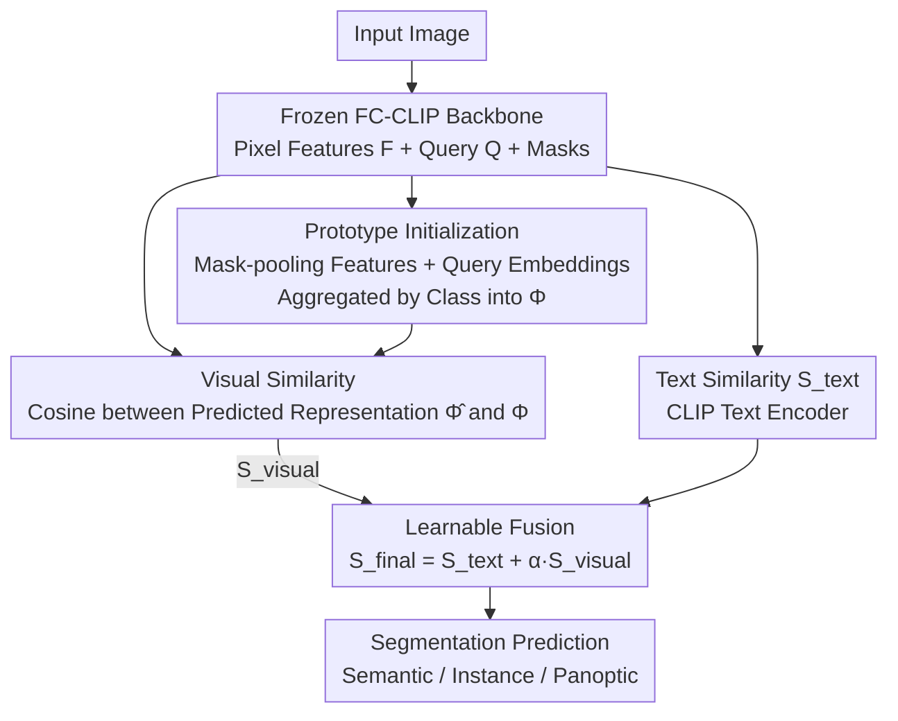

# PrAda: Few-Shot Visual Adaptation for Text-Prompted Segmentation

**Conference**: CVPR 2026  
**arXiv**: [2605.19623](https://arxiv.org/abs/2605.19623)  
**Code**: https://github.com/FocoosAI/PrAda (Available)  
**Area**: Segmentation / Open-Vocabulary Segmentation / Few-shot Adaptation  
**Keywords**: Text-prompted segmentation, few-shot visual adaptation, class prototypes, FC-CLIP, parameter-efficient

## TL;DR
Addressing the phenomenon where text-prompted segmentation models "draw correct masks but assign wrong labels" in specialized domains, this paper proposes PrAda. By freezing FC-CLIP and using only 5 annotated samples per class to learn visual prototypes, it fuses visual similarity with original text classification scores via a learnable weight $\alpha$. With a negligible increase of +0.02%~0.19% in parameters, it improves PQ/mIoU by 4~10 points across 5 benchmarks.

## Background & Motivation
**Background**: Open-vocabulary segmentation (e.g., FC-CLIP) relies on CLIP text encoders to align the class-agnostic masks of Mask2Former with "textual category descriptions," enabling segmentation of new categories without target-domain annotations. Text prompts typically outperform pure visual prompts as language encodes high-level semantics.

**Limitations of Prior Work**: Performance drops significantly when target domains deviate far from CLIP/COCO pre-training distributions (e.g., street view, industrial, medical). It was previously unclear whether this failure stemmed from inaccurate mask localization or incorrect classification.

**Key Challenge**: The authors conducted a diagnostic analysis of FC-CLIP across 28 domain-specific datasets and found that **mask IoUs are heavily concentrated in the [0.8, 1.0] range**, indicating that localization is generally accurate. The performance gap is almost entirely due to **misclassification**. Replacing predicted labels with oracle ground truth labels caused PQ to surge across all datasets. This implies that class-agnostic mask decoders generalize well, while the "text-visual alignment classification head" lacks discriminative power on unfamiliar semantics.

**Goal**: To fix the "classification" component using a few annotated samples per class from the target domain, without damaging zero-shot capabilities or causing catastrophic forgetting.

**Key Insight**: In image classification, "few-shot visual adaptation" (e.g., CoOp, CLIP-Adapter, Tip-Adapter) has addressed similar issues. However, these methods operate on **single global features** from CLIP. Since segmentation is at the pixel/segment level, these methods cannot be directly applied. The authors thus propose a new task: **FSVA-Seg (Few-Shot Visual Adaptation for Text-Prompted Segmentation)**.

**Core Idea**: Learn a set of **visual prototypes** from a few samples. Use the visual similarity provided by these prototypes to complement text classification scores, adaptively weighted by a learnable scalar—training only the prototypes and this scalar while keeping the backbone frozen.

## Method

### Overall Architecture
PrAda is built on a frozen FC-CLIP. The input image passes through the frozen backbone to produce pixel features $F$, a set of queries $Q$, and predicted masks $\{\hat m_i\}$. In the offline phase, using 5 samples per class with mask annotations, "pixel-level mask-pooling features" are summed with "corresponding query embeddings" and aggregated into a class prototype matrix $\Phi$. During inference, a visual representation $\hat\Phi_i$ is computed for each predicted mask and compared with prototypes via cosine similarity to obtain $S_{\text{visual}}$. Simultaneously, FC-CLIP provides the text score $S_{\text{text}}$. The final score is $S_{\text{final}}=S_{\text{text}}+\alpha S_{\text{visual}}$. During training, only the prototypes $\Phi$ and scalar $\alpha$ are optimized, keeping the backbone entirely frozen.

### Key Designs

**1. Misclassification Diagnosis: Diagnosing the Bottleneck before Prescription**
The authors decomposed FC-CLIP failures into localization versus classification errors. Across 28 datasets, IoU matching showed that predicted masks often have an IoU near 0.8 with ground truth (proving that the mask decoder's class-agnostic localization is robust). Oracle experiments, replacing predicted classes with ground truth, showed significant PQ gains. Both pieces of evidence point to **classification** as the bottleneck, especially in domains semantically distant from pre-training distributions (e.g., SegInW). This diagnosis led to the design: **freeze the mask side and only repair classification**.

**2. Dual-source Prototype Initialization: Pixel Details + Query Semantic Complementarity**
Prototypes must capture both appearance and semantics. Pixel features $F$ capture fine-grained appearance but do not specifically encode category semantics. Queries $Q$ are jointly optimized by mask prediction and classification, carrying high-level semantics but lacking detail. The authors combine them. For each visual sample $v_i=(m_i,c_i)$, pixel features are compressed via mask average pooling:

$$\phi_i=\frac{\sum_{j=1}^{H\cdot W} m_{i,j} F_j}{\sum_{j=1}^{H\cdot W} m_{i,j}}$$

Since there is no direct correspondence between sample masks and model queries, the authors pass reference images through frozen FC-CLIP and use **IoU matching** to find the query $q_i$ corresponding to the best-matched mask for $m_i$. Each class prototype is the mean sum of "query + pooling features" for all samples in that class:

$$\Phi_k=\frac{1}{|\mathcal{V}_k|}\sum_{i:\,v_i\in\mathcal{V}_k}\left(q_i+\phi_i\right),\quad k=1,\dots,|\mathcal{C}|$$

**3. Prototype Visual Similarity: Replacing Classification with "Prototype Matching"**
During inference, for each predicted mask $\hat m_i$, a mask-pooling representation $\hat\phi_i$ is calculated and added to its query to get $\hat\Phi_i=q_i+\hat\phi_i$. Cosine similarity is then computed against the prototype matrix:

$$S_{\text{visual}}=\frac{\hat\Phi\cdot\Phi^{T}}{\|\hat\Phi\|_2\,\|\Phi\|_2}$$

To handle "void" cases, a no-class prototype is added to the set. This replaces unreliable text-visual alignment in unfamiliar domains with a direct comparison against real target-domain prototypes.

**4. Learnable $\alpha$ Fusion + Prototype-only Training: Parameter Efficiency without Forgetting**
The reliability of text prompts versus visual samples varies by domain. A **learnable scalar $\alpha$** is used for adaptive balancing:

$$S_{\text{final}}=S_{\text{text}}+\alpha S_{\text{visual}}$$

During training, **only $\Phi$ and $\alpha$ are optimized** using cross-entropy loss on $S_{\text{final}}$. This avoids catastrophic forgetting associated with fine-tuning the backbone, preserves zero-shot capabilities for familiar categories, and incurs minimal parameter overhead (+0.02% on Cityscapes, +0.19% on ADE20K).

### Loss & Training
Cross-entropy loss is applied only to the fused score $S_{\text{final}}$. Trainable parameters are limited to class prototypes $\Phi$ and scalar $\alpha$. The adaptation data consists of 5 randomly sampled training images per class (averaged over 5 seeds). Backbones include CLIP-R50 and ConvNeXt-L (denoted as PrAda-R50 / PrAda-L). The backbone and decoders remain frozen.

## Key Experimental Results

### Main Results
On ADE20K / Cityscapes / Mapillary (Panoptic PQ, Semantic mIoU, Instance AP) with 5 shots per class and ConvNeXt-L:

| Dataset | Metric | PrAda-L | FC-CLIP-L (zero-shot) | Best FSVA Baseline | Gain |
|--------|------|---------|------------------------|----------------|------|
| ADE20K | PQ | 31.4 | 26.8 | CLIP-Adapter 31.1 | +4.6 / +0.3 |
| ADE20K | mIoU | 38.2 | 34.1 | TipAdapter-F 38.5 | +4.1 |
| Cityscapes | PQ | 49.8 | 44.0 | CLIP-Adapter 48.6 | +5.8 / +1.2 |
| Cityscapes | mIoU | 66.2 | 56.2 | CLIP-Adapter 64.3 | +10.0 / +1.9 |
| Mapillary | PQ | 23.6 | 18.2 | CLIP-Adapter 19.8 | +5.4 / +3.8 |
| Mapillary | mIoU | 38.1 | 27.9 | TipAdapter-F 31.0 | +10.2 / +9.4 |

Gains are most pronounced in domains with high domain shift (e.g., Cityscapes). On ADE20K, which is closer to COCO, improvements are more moderate. In instance AP, PrAda-L (18.1) is slightly below CLIP-Adapter (19.2), which the authors attribute to better score calibration in the latter.

### Ablation Study
Prototype configuration ablation (ConvNeXt-L):

| Configuration | ADE20K PQ | Cityscapes PQ | Description |
|------|-----------|---------------|------|
| No Prototype | 14.6 | 44.2 | Degenerates to pure FC-CLIP |
| Random Prototype | 26.8 | 48.4 | Significant jump just by having learnable protos |
| Class Embedding | 30.1 | 48.4 | Decent results but 3x more parameters (116K) |
| Query Only | 31.7 | 49.3 | Semantic source is strong alone |
| Mask-pooling Only | 28.9 | 49.3 | Appearance source is slightly weaker |
| Ours (query + pooling) | **32.2** | **50.1** | Dual-source complementary, 39K parameters |

### Key Findings
- **Diagnosis-driven Approach**: Identifies misclassification as the primary failure mode in specialized domains, dictating the "freeze mask, fix classification" strategy.
- **Dual-source Complementarity**: Combining query (semantics) and mask-pooling (appearance) is superior to using either alone and more efficient than class embeddings.
- **Extreme Sample Efficiency**: With just 1 shot per class, ADE20K PQ jumps from 14.6 to 24.5; returns diminish after 5 shots.
- **Negligible Parameter Overhead**: Optimized parameters (~39K) represent +0.02%~0.19% of the backbone but yield 4~10 PQ/mIoU gains.

## Highlights & Insights
- **"Diagnosis before Prescription"**: By isolating the bottleneck to classification via IoU distributions and oracle experiments, the authors avoid blind fine-tuning. This paradigm is transferable to various domain adaptation problems.
- **Target Domain Prototypes as Refinement**: When textual alignment fails, comparing against actual target samples provides a more reliable signal. The learnable $\alpha$ allows per-domain adaptation between "trusting text" and "trusting vision."
- **Correct Mapping to Segmentation**: Instead of applying global feature adaptation (which fails in segmentation), PrAda correctly ports few-shot adaptation to the segment level.

## Limitations & Future Work
- **Architecture Dependence**: Prototype initialization is tightly coupled with the query + pixel-decoder structure of FC-CLIP.
- **Localization Bottleneck**: The method only addresses classification; if mask localization itself is poor in a domain, PrAda cannot help.
- **Instance AP Gap**: Slightly underperforms CLIP-Adapter in instance segmentation metrics, likely due to unaddressed score calibration issues.
- **Gap with Heavyweight Methods**: On ShowOrTell, it still trails Matcher/GFSAM (which use dual backbones and per-class inference).

## Related Work & Insights
- **vs. kNN-CLIP / Prompt-DINO**: These combine text and visual prompts but require large amounts of labeled data; PrAda is the first true "few-shot" adaptation for text-prompted segmentation.
- **vs. CoOp / CLIP-Adapter**: These operate on global features for image classification; PrAda adapts them for segment-level tasks and outperforms them significantly in street-view domains.
- **vs. Matcher / GFSAM**: These rely on DINOv2+SAM and per-class forward passes. PrAda achieves competitive results with a faster, single-forward architecture.

## Rating
- Novelty: ⭐⭐⭐⭐ First to propose the FSVA-Seg task with a clean diagnostic solution.
- Experimental Thoroughness: ⭐⭐⭐⭐⭐ 5 benchmarks, 28+ datasets, 3 segmentation tasks, multiple seeds.
- Writing Quality: ⭐⭐⭐⭐ Logical flow driven by diagnostic experiments.
- Value: ⭐⭐⭐⭐ Practical for low-annotation deployments in professional domains.

<!-- RELATED:START -->

## Related Papers

- [\[CVPR 2026\] Cross-Domain Few-Shot Segmentation via Multi-view Progressive Adaptation](cross-domain_few-shot_segmentation_via_multi-view_progressive_adaptation.md)
- [\[CVPR 2026\] Bayesian Decomposition and Semantic Completion for Few-shot Semantic Segmentation](bayesian_decomposition_and_semantic_completion_for_few-shot_semantic_segmentatio.md)
- [\[CVPR 2026\] Selective, Regularized, and Calibrated: Harnessing Vision Foundation Models for Cross-Domain Few-Shot Semantic Segmentation](selective_regularized_and_calibrated_harnessing_vision_foundation_models_for_cro.md)
- [\[CVPR 2026\] Mitigating Objectness Bias and Region-to-Text Misalignment for Open-Vocabulary Panoptic Segmentation](mitigating_objectness_bias_and_region-to-text_misalignment_for_open-vocabulary_p.md)
- [\[CVPR 2026\] Beyond Text: Visual Description Assembly by Probabilistic Model for CLIP-based Weakly Supervised Semantic Segmentation](beyond_text_visual_description_assembly_by_probabilistic_model_for_clip-based_we.md)

<!-- RELATED:END -->
