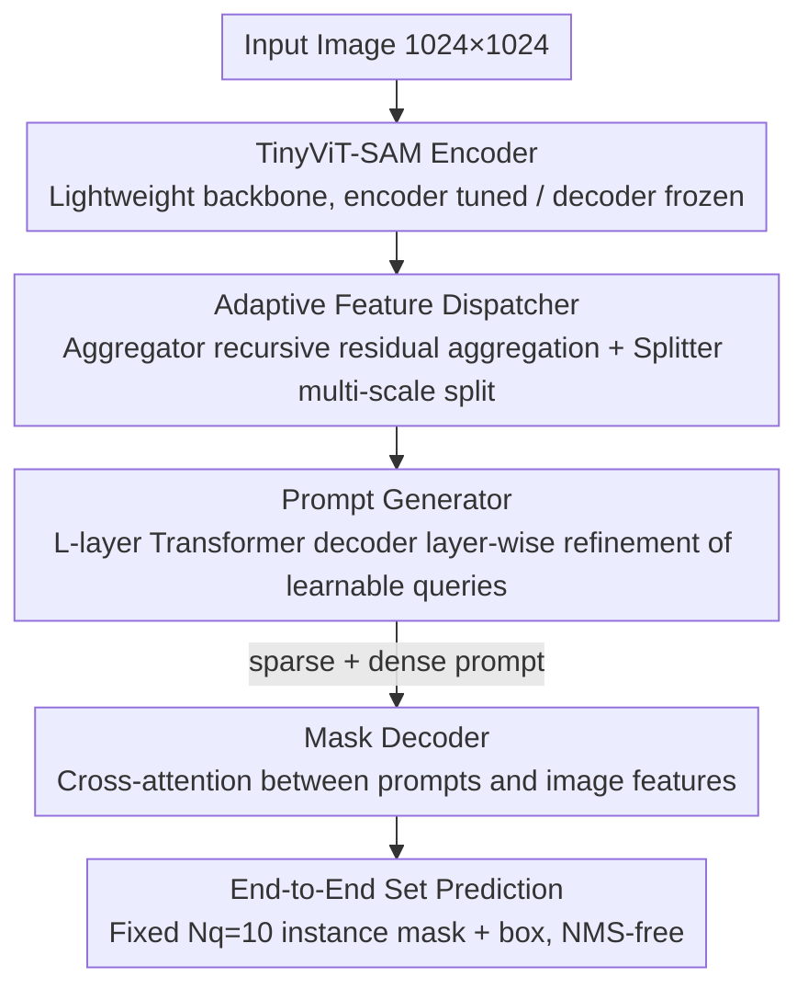

# Prompt-Driven Lightweight Foundation Model for Instance Segmentation-Based Fault Detection in Freight Trains

**Conference**: CVPR 2026  
**arXiv**: [2603.12624](https://arxiv.org/abs/2603.12624)  
**Code**: [https://github.com/MVME-HBUT/SAM_FTI-FDet.git](https://github.com/MVME-HBUT/SAM_FTI-FDet.git)  
**Area**: Instance Segmentation / Industrial Inspection / Foundation Model Adaptation  
**Keywords**: SAM, Self-Prompt Generation, Lightweight, Freight Train Fault Detection, Foundation Model Transfer  

## TL;DR
This paper proposes SAM FTI-FDet, which introduces a Transformer decoder-based Prompt Generator to enable the lightweight TinyViT-SAM to automatically generate task-related query prompts. This avoids manual interaction and achieves instance-level fault detection for freight train components, reaching 74.6 $AP_{box}$ and 74.2 $AP_{mask}$ on a custom dataset.

## Background & Motivation
**Background**: Critical components of freight trains (e.g., brake shoes, bearing saddles) are prone to wear after long-term operation, and traditional manual inspection is inefficient and relies heavily on experience.  
**Limitations of Prior Work**: Although CNN/Transformer-based detection methods are widely deployed, they face three core pain points: (1) Poor generalization—models trained at one inspection station experience performance drops when moved to new sites; (2) Imprecise boundaries—traditional object detection only provides bounding boxes, failing to quantitatively assess wear (e.g., remaining thickness of brake shoes); (3) Deployment constraints—high-precision models are computationally intensive and difficult to run in real-time on edge devices along railways.  
**Key Challenge**: As a foundation model, SAM possesses strong segmentation generalization but relies on external prompts (clicks, boxes) and is sensitive to prompt locations, making it unsuitable for fully automated industrial scenarios.

## Core Problem
How to transfer the general segmentation knowledge of SAM to the specific domain of freight train fault detection while simultaneously addressing three challenges: (1) eliminating SAM's reliance on manual prompts to achieve full automation; (2) maintaining a lightweight architecture for edge deployment; and (3) ensuring instance segmentation accuracy in industrial scenes with complex structures and frequent occlusions.

## Method

### Overall Architecture

SAM FTI-FDet aims to adapt SAM's general segmentation capability for freight train fault detection without manual prompts or high computational costs. The overall structure follows the SAM encoder-decoder paradigm: the input image (1024×1024) is encoded by TinyViT-SAM, the Adaptive Feature Dispatcher fuses multi-scale features, the Prompt Generator automatically produces query prompts, and the Mask Decoder combines prompts with image features to output instance masks and bounding boxes. During inference, the model predicts up to 10 instances per image using only the output from the final decoder layer, followed by morphological post-processing—all without manual interaction.

### Key Designs

**1. TinyViT-SAM Lightweight Backbone + Frozen Decoder Transfer Strategy: Preventing Overfitting on Small Data**
The backbone replaces the original SAM's ViT-B/H with TinyViT (distilled from MobileSAM), significantly reducing parameter count and computation for edge deployment. A key finding in adaptation is that freezing the decoder while fine-tuning the encoder (uf/f configuration) yields the best results—fine-tuning the encoder learns domain-specific features while freezing the decoder preserves pre-trained general decoding capabilities, acting as strong regularization for small datasets (only 4410 images).

**2. Adaptive Feature Dispatcher: Compensating for Lightweight Backbone Representation**
While TinyViT is lightweight, its feature representation is limited. This module, consisting of a Feature Aggregator and a Feature Splitter, reintegrates multi-layer features. The Aggregator reduces TinyViT layer features to 32 channels and fuses them using recursive residual aggregation $m_i = m_{i-1} + \text{Conv2D}(m_{i-1}) + \tilde{F}_i$. The Splitter then decomposes the unified feature $F_{agg}$ into multi-resolution branches for various downstream scales.

**3. Prompt Generator: Automated Prompt Generation to Eliminate Manual Clicks**
This is the core contribution ("Prompt-Driven"). To solve SAM's reliance on manual prompts, this module initializes a set of learnable query vectors $Q_0$ (length $N_q$) and refines them through $L$ Transformer Decoder layers. Each layer performs self-attention among queries and cross-attention with image features. These queries act as both sparse and dense prompts for the Mask Decoder. Unlike box-based prompts (e.g., RSPrompter), query prompts encode semantic priors directly, leading to faster convergence and higher accuracy.

**4. End-to-End Set Prediction: Fixed Query Count Eliminates NMS**
The Prompt Generator produces $N_q=10$ sets of prompts simultaneously. This fixed-query design, inspired by DETR, allows the model to output a fixed number of instances per forward pass (selecting the final output during inference), eliminating the need for NMS post-processing. $N_q$ determines instance coverage, while the number of point embeddings $K_p$ per query ensures robustness.

### Loss & Training
- AdamW optimizer, initial lr=1e-4, cosine annealing + linear warmup, 150 epochs.
- Batch size=4, dual RTX 4090 GPUs.
- DeepSpeed ZeRO Stage 2 + FP16 mixed-precision training for efficiency.
- Data Augmentation: Horizontal flip + large-scale jittering.
- The Prompt Generator utilizes only the last three lowest-resolution feature maps from the Feature Splitter.

## Key Experimental Results

| Dataset | Metric | Ours | Prev. SOTA | Gain |
| :--- | :--- | :--- | :--- | :--- |
| Freight Train | $AP_{box}$ | 74.6 | 74.3 (Mask2Former+Swin-T) | +0.3 |
| Freight Train | $AP_{mask}$ | 74.2 | 73.8 (Mask2Former+Swin-T) | +0.4 |
| Freight Train | Model size (MB) | 148.2 | 739.5 (Mask2Former+Swin-T) | -80% |
| Freight Train | Parameters (M) | 36.3 | 49.0 (Mask2Former+Swin-T) | -26% |
| MS-COCO | $AP_{box}$ | 38.7 | 37.9 (FastSAM) | +0.8 |
| MS-COCO | $AP_{mask}$ | 33.7 | 32.6 (FastSAM) | +1.1 |
| Noise Test | $AP_{box}$ | 60.8 | 57.5 (Mask R-CNN) | +3.3 |
| Brake Shoe Wear | Severe Detection | 97.5% | 93.9% (Mask R-CNN) | +3.6% |

### Ablation Study
- **Prompt Type is Crucial**: Query prompts vs. box prompts: query prompts outperformed SAM-det's bbox prompts by 16.5 points in $AP_{mask}$ (74.2 vs. 57.7), indicating semantic-level prompts are superior to spatial constraints.
- **Freezing Strategy**: Encoder fine-tuning + decoder frozen (uf/f) was optimal; full freezing dropped $AP_{box}$ by 7.7, while full unfreezing dropped it by 1.4.
- **Feature Layer Selection**: Using the last two layers [2,3] yielded the best results (74.6 $AP_{box}$).
- **Prompt Shape**: $N_q=10, K_p=4$ was optimal. $N_q$ significantly impacts coverage, while $K_p$ affects robustness.
- **Pre-training Data**: SA-1B pre-training outperformed ImageNet pre-training.

## Highlights & Insights
- **Transferable Self-Prompting**: The transition from manual interaction to automated prompt generation is highly practical for industrial scenarios where human interaction is impossible (e.g., assembly line inspection).
- **Frozen Decoder as Regularization**: Using the pre-trained decoder's general capabilities while only tuning the encoder effectively prevents overfitting on small industrial datasets.
- **Quantitative Assessment**: Beyond detection, the mask area is used to estimate wear levels (light/moderate/severe), providing higher industrial value than simple bounding boxes.
- **Recursive Residual Aggregation**: $m_i = m_{i-1} + \text{Conv}(m_{i-1}) + \tilde{F}_i$ effectively compensates for the representation limits of lightweight backbones.

## Limitations & Future Work
- The dataset scale (4410 images) is small and limited to the Chinese railway system; cross-national generalization remains unverified.
- Fixed $N_q=10$ cannot handle extremely dense scenes with more than 10 instances.
- Missed detections still occur for extremely small or low-saliency defects.
- Only static images are processed; temporal fault detection in video streams is not yet explored.

## Related Work & Insights
- **vs RSPrompter**: While RSPrompter uses box prompts to guide SAM, this method uses query prompts. Experiments show query prompts converge faster and achieve higher precision ($AP_{mask}$ 74.2 vs. 71.9) by encoding semantics rather than just spatial boxes.
- **vs Mask2Former**: Achieves similar accuracy but with a 5x smaller model size (148MB vs. 740MB), making it better for edge deployment.
- **vs FastSAM**: FastSAM is faster/lighter (9.1M parameters) but is $2.2$ points lower in $AP_{mask}$ and lacks domain adaptation.

## Rating
- Novelty: ⭐⭐⭐ (Self-prompting SAM exists, but query-based design for industrial adaptation has incremental value)
- Experimental Thoroughness: ⭐⭐⭐⭐⭐ (Extensive ablations on 10 aspects including prompt type, freezing, noise, and generalization)
- Writing Quality: ⭐⭐⭐⭐ (Clear structure and formulas, though some descriptions are verbose)
- Value: ⭐⭐⭐ (High practical utility for industrial applications)

<!-- RELATED:START -->

- **RSPrompter**: Learning to Prompt for Remote Sensing Instance Segmentation based on Visual Foundation Model (CVPR 2023)
- **MobileSAM**: Faster Segment Anything (arXiv 2023)
- **DETR**: End-to-End Object Detection with Transformers (ECCV 2020)

<!-- RELATED:END -->

## Related Papers

- [\[CVPR 2026\] PR-MaGIC: Prompt Refinement Via Mask Decoder Gradient Flow For In-Context Segmentation](pr-magic_prompt_refinement_via_mask_decoder_gradient_flow_for_in-context_segment.md)
- [\[CVPR 2026\] MV3DIS: Multi-View Mask Matching via 3D Guides for Zero-Shot 3D Instance Segmentation](mv3dis_multi-view_mask_matching_via_3d_guides_for_zero-shot_3d_instance_segmenta.md)
- [\[CVPR 2026\] TF-SSD: A Strong Pipeline via Synergic Mask Filter for Training-free Co-salient Object Detection](tf-ssd_a_strong_pipeline_via_synergic_mask_filter_for_training-free_co-salient_o.md)
- [\[CVPR 2026\] BiPA: Bilevel Prompt Adaptation for Underwater Instance Segmentation](bipa_bilevel_prompt_adaptation_for_underwater_instance_segmentation.md)
- [\[CVPR 2026\] Boxes2Pixels: Learning Defect Segmentation from Noisy SAM Masks](boxes2pixels_learning_defect_segmentation_from_noisy_sam_masks.md)

<!-- RELATED:END -->
