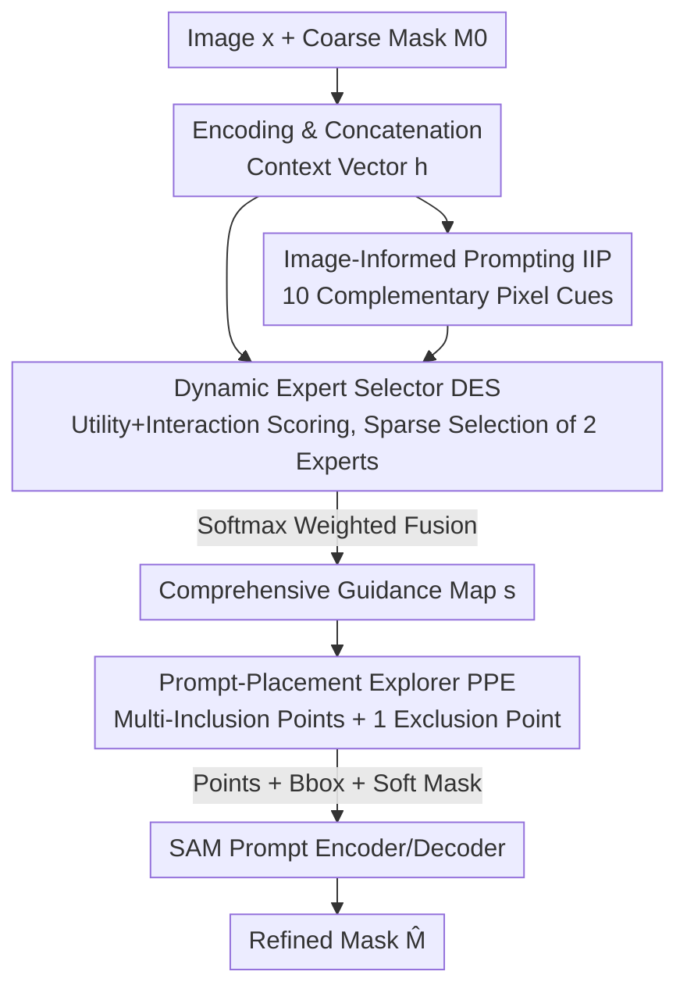

# PromptMoE: A Segmentation Refinement Framework Leveraging Mixture of Experts for Improved Prompting

**Conference**: CVPR 2026  
**Paper**: [CVF Open Access](https://openaccess.thecvf.com/content/CVPR2026/html/Price_PromptMoE_A_Segmentation_Refinement_Framework_Leveraging_Mixture_of_Experts_for_CVPR_2026_paper.html)  
**Code**: None  
**Area**: Segmentation Refinement  
**Keywords**: Segmentation refinement, Mixture of Experts, SAM, prompt generation, model-agnostic

## TL;DR
PromptMoE transforms the task of "generating prompts for SAM to refine coarse masks" from a fixed heuristic rule into a Mixture of Experts (MoE) problem: using 10 complementary pixel-wise visual cues as experts, a sparse router selects the two most relevant experts to fuse into a guidance map, while a spatially diverse sampling module places prompts on the guidance map. This achieves an average improvement of +6.24 IoU / +8.99 BIoU over the strongest baseline across 5 benchmarks.

## Background & Motivation
**Background**: The goal of segmentation refinement is to re-process a coarse mask $M_0$ from a base predictor into a mask with more accurate boundaries. Following the emergence of SAM, works like SAMRefiner and DualSight redefined refinement as a "generating suitable prompts for SAM" problem—instead of designing new refinement networks, they construct point/box/mask prompts to let a frozen SAM output cleaner results. This approach is model-agnostic: it is not tied to a specific base predictor and does not require retraining for every task.

**Limitations of Prior Work**: Current prompt-based refiners rely on **fixed prompting rules**, which are fragile under four failure modes, categorized as C1–C4: **C1 Semantic Ambiguity**—SAM optimizes for "match between mask and prompt" rather than class semantics; a single positive point might segment a whole person, a jacket, or a tie, failing to constrain the target; **C2 Intra-prompt Interference**—multiple prompt components may perform well individually but bias toward a sub-region (e.g., the center of a car front) when combined, suppressing the true structure; **C3 Noisy Input**—coarse masks often have holes or background leakage, misleading fixed edge-distance heuristics (e.g., the false center of a doughnut might be picked as an inclusion point); **C4 Diverse Image Features**—visual cues for prompt generation are highly scene-dependent, and cues effective for one image may fail in another.

**Key Challenge**: SAMRefiner uses a fixed edge-distance heuristic + single positive point, making it fragile for complex/hollow/thin structures (C1/C3); DualSight uses heuristic multi-point maximization for coverage but ignores the initial mask and exclusion points, often pushing points to incorrect boundary positions. Both suffer from the same fundamental issue—**using a content-agnostic fixed strategy to handle diverse failure modes**, leading to collapse when failure modes or image domains change.

**Goal + Core Idea**: Rather than betting on a single fixed heuristic, it is better to prepare a **set** of complementary visual cue experts and **dynamically** select and fuse the most appropriate experts per image to guide prompt generation. In short: treat prompt generation as a prompt-level sparse MoE—**using image-informed experts to replace fixed distance heuristics (addressing C3/C4), sparse routing to avoid signal dilution (addressing C4), and spatially diverse sampling to balance coverage and confidence (addressing C1/C2)**.

## Method

### Overall Architecture
The input consists of an image $x$ and a coarse binary mask $M_0$ provided by an arbitrary base predictor, and the output is the refined mask $\hat{M}$. The entire pipeline revolves around the **Image-Informed Prompting (IIP)** framework, centered on three collaborative modules.

First, the image and mask are encoded and concatenated into a joint context vector $h$ that summarizes the "image-mask pair" features. This $h$ drives two key components of IIP: the **Dynamic Expert Selector (DES)** uses $h$ to predict the expected utility of each expert for the current pair and the additional gain from combining experts, **activating only** a few highly efficient and complementary experts. This avoids dense evaluation of all experts and signal dilution. The selected experts produce pixel-wise guidance maps, fused via softmax weighting into a comprehensive guidance map $s$. Next, the **Prompt-Placement Explorer (PPE)** uses this map to iteratively select high-score pixels as inclusion points while enforcing a minimum spatial interval to cover the target, and selects one exclusion point in low-score background areas. Finally, these points, the tight bounding box of $M_0$, and a soft-encoded version of $M_0$ are fed into the SAM prompt encoder to decode $\hat{M}$.

### Key Designs

**1. Image-Informed Prompting: Replacing Fixed Heuristics with Complementary Visual Experts**

Addressing C3 (noisy input) and C4 (scene diversity)—fixed heuristics fail entirely if they misjudge hollow or thin structures. IIP defines a set of experts $E = \{f_1, \dots, f_{|E|}\}$ (10 in total). Each expert $e_i$ calculates a normalized pixel-wise guidance map from $x$ and $M_0$:

$$r_{e_i} = f_{e_i}(x, M_0) \in [0,1]^{H \times W}$$

Where higher values indicate a higher probability of the pixel belonging to the target. These experts cover four signal types: (i) appearance (color, brightness, texture), (ii) geometry (distance to boundary), (iii) depth consistency (using Marigold monocular depth), and (iv) region/proposal-level structure (using SAM region proposals). It mixes traditional image processing cues with learned model signals, ensuring robustness to noise and generalizability. Crucially, as the analysis shows, the most frequently selected "optimal" expert is only optimal for 16.06% of samples, proving that no single cue can handle all cases.

**2. Dynamic Expert Selector: Sparse Routing for Efficient Fusion**

To address C4 without signal dilution, DES acts as a lightweight sparse router. Given $(x, M_0)$, it predicts scores before activation instead of running all experts.

**Single Expert Utility** $U_{e_i}$: Using context vector $h$, an embedding $v_{e_i} \in \mathbb{R}^D$ is learned for each expert. Concatenating the context-expert alignment $h \odot v_{e_i}$, context $h$, and expert embedding $v_{e_i}$ into $\omega_{e_i} \in \mathbb{R}^{3D}$, a small MLP predicts a utility scalar:

$$U_{e_i} = \mathrm{MLP}_U(\omega_{e_i}) \in [0,1]$$

**Pairwise Interaction** $I_{e_i,e_j}$: Inspired by NLI layers, this captures joint capacity by concatenating element-wise sum, Hadamard product, absolute difference of expert embeddings, and context $h$ into $\varepsilon_{e_i,e_j} \in \mathbb{R}^{4D}$. A second MLP predicts the extra gain: $I_{e_i,e_j} = \mathrm{MLP}_I(\varepsilon_{e_i,e_j}) \in [0,1]$. Final pairwise utility is:

$$S_{e_i,e_j} = U_{e_i} + U_{e_j} + I_{e_i,e_j}$$

At inference, it selects the $\arg\max$ pair $(e_{i^*}, e_{j^*})$ and uses softmax of their individual utilities as fusion weights $(w_{i^*}, w_{j^*})$ to generate the final guidance map:

$$r_{e_{i^*},e_{j^*}} = w_{i^*} r_{e_{i^*}} + w_{j^*} r_{e_{j^*}}$$

**3. Prompt-Placement Explorer: Shape-Adaptive Suppression Radius**

To address C1/C2, PPE avoids clustering points in a single high-confidence sub-region. It places the first point at the global maximum of the guidance map $p_0 = \arg\max_p r_0(p)$. For subsequent points, it dynamically suppresses neighborhoods. Given a suppression factor $\tau \in (0,1]$, it takes $n = \lceil \tau |M_t| \rceil$ (the position at the $\tau$-th quantile) and sets the radius $\rho_t = \mathrm{dist}_{M_t}(n, p_t)$. All pixels within $\rho_t$ of $p_t$ are excluded. This **shape-adaptivity** allows the radius to automatically expand in thin/branched structures and contract in compact areas, balancing coverage and detail.

### Loss & Training
DES is pre-trained on VOC 2012 train (1464 images) with coarse masks from DeepLabV3/FCN/MobileNetV3. The two router heads are 3-layer MLPs. Training involves three phases: fitting utility to "regret," training the interaction head for gain, and joint fine-tuning. SAM remains frozen throughout—PromptMoE only learns "how to pick experts and place points."

## Key Experimental Results

### Main Results
On five benchmarks (BIG / DAVIS585 / ECSSD / MSRA-B / VOC), reporting $\Delta$IoU/$\Delta$BIoU (positive = improvement) relative to unrefined masks using SAM ViT-H:

| Method | BIG | DAVIS585 | ECSSD | MSRA-B | VOC | Avg ΔIoU / ΔBIoU |
|------|-----|----------|-------|--------|-----|--------------------|
| Unrefined (Base) | 78.25 / 70.11 | 80.05 / 83.00 | 81.41 / 70.23 | 75.15 / 61.88 | 66.73 / 60.08 | 76.32 / 69.06 |
| CascadePSP-Slow | +4.97 / +6.27 | −1.29 / −1.47 | +0.62 / +0.98 | +0.93 / +2.71 | +1.71 / +0.73 | +1.39 / +1.85 |
| SAMRefiner | +6.84 / +9.50 | +3.33 / +2.03 | +5.10 / +9.69 | +4.67 / +10.35 | +7.05 / +9.74 | +5.40 / +8.26 |
| **PromptMoE (Ours)** | +8.54 / +11.01 | **+3.64 / +2.35** | **+5.99 / +10.67** | **+5.10 / +10.48** | **+7.94 / +10.43** | **+6.24 / +8.99** |

### Ablation Study
Ablation of components (Avg $\Delta$IoU/$\Delta$BIoU):

| Config | ΔIoU | ΔBIoU | Note |
|------|------|-------|------|
| 1 Pos Point (PP) | −18.82 | −15.14 | Single point is insufficient without box |
| + Bounding Box (B) | −0.71 | +3.62 | Box is the most critical constraint |
| + Coarse Mask (M) | +4.71 | +7.81 | Soft mask contributes significantly |
| + PPE | +6.00 | +8.83 | Spatially diverse sampling gain |
| + PPE + DES (Full) | +6.24 | +8.99 | Dynamic selection final boost |

### Key Findings
- **Box is essential**: Removing the box drops performance from +6.24 to −18.82.
- **Experts: Less is more**: Selecting 2 experts is optimal; using all 10 (+6.01) is worse than selecting 2, confirming signal dilution.
- **No universal expert**: The most frequent "best" expert only wins 16.06% of the time, justifying the dynamic selection.
- **Efficiency**: DES reduces refinement time by ~59.9% while improving accuracy. PromptMoE-Lite further reduces latency by 37.9% with negligible loss.

## Highlights & Insights
- **MoE at the Prompt Level**: Previous MoE-SAM works modified the architecture, losing task-generality. PromptMoE keeps SAM frozen and routes "image processing experts," ensuring model-agnostic generalizability.
- **Pairwise Interaction Modeling**: By using an interaction head to predict gain, it captures why experts can interfere when combined—a design borrowed from NLI logic.
- **Shape-Adaptive Radius**: The quantile-based radius in PPE is an elegant, lightweight trick to ensure points are both at high-confidence areas and spatially distributed.

## Limitations & Future Work
- **Thin/Porous Structures**: Inherits SAM's inherent weakness in segmentation of thin structures.
- **Computational Weight**: Assessing all experts and pairwise enumerations has overhead, addressed by DES and the Lite version but still higher than a single point heuristic.
- **Manual Expert Design**: The 10 experts are hand-picked. Future work could explore end-to-end expert learning.

## Related Work & Insights
- **vs SAMRefiner**: SAMRefiner is fragile for hollow/thin structures due to fixed heuristics. PromptMoE addresses this via dynamic expert selection.
- **vs DualSight**: DualSight's multi-point sampling is content-agnostic. PromptMoE's PPE is content-aware, ensuring points land in meaningful regions.
- **vs Architecture-level MoE-SAM**: PromptMoE routes at the prompt level, preserving model-agnosticism.

## Rating
- Novelty: ⭐⭐⭐⭐⭐ 
- Experimental Thoroughness: ⭐⭐⭐⭐⭐ 
- Writing Quality: ⭐⭐⭐⭐ 
- Value: ⭐⭐⭐⭐

<!-- RELATED:START -->

## Related Papers

- [\[AAAI 2026\] Generalizable Slum Detection from Satellite Imagery with Mixture-of-Experts](../../AAAI2026/segmentation/generalizable_slum_detection_from_satellite_imagery_with_mixture-of-experts.md)
- [\[CVPR 2026\] M4-SAM: Multi-Modal Mixture-of-Experts with Memory-Augmented SAM for RGB-D Video Salient Object Detection](m4-sam_multi-modal_mixture-of-experts_with_memory-augmented_sam_for_rgb-d_video_.md)
- [\[CVPR 2026\] PR-MaGIC: Prompt Refinement Via Mask Decoder Gradient Flow For In-Context Segmentation](pr-magic_prompt_refinement_via_mask_decoder_gradient_flow_for_in-context_segment.md)
- [\[CVPR 2026\] Mixture of Prototypes for Test-time Adaptive Segmentation](mixture_of_prototypes_for_test-time_adaptive_segmentation.md)
- [\[CVPR 2025\] Spatio-Semantic Expert Routing Architecture with Mixture-of-Experts for Referring Image Segmentation](../../CVPR2025/segmentation/spatio-semantic_expert_routing_architecture_with_mixture-of-experts_for_referrin.md)

<!-- RELATED:END -->
