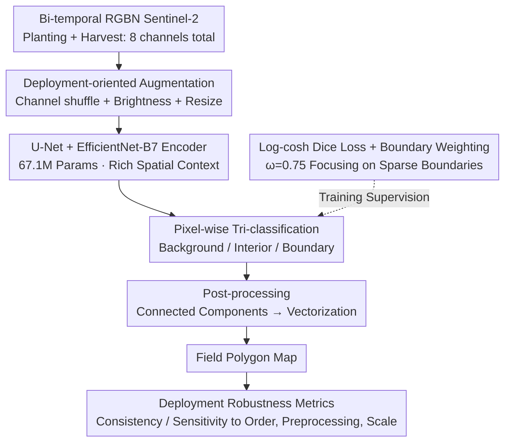

# PRUE: A Practical Recipe for Field Boundary Segmentation at Scale

**Conference**: CVPR 2026  
**arXiv**: [2603.27101](https://arxiv.org/abs/2603.27101)  
**Code**: [https://github.com/fieldsoftheworld/ftw-prue](https://github.com/fieldsoftheworld/ftw-prue)  
**Area**: Semantic Segmentation / Remote Sensing  
**Keywords**: Agricultural field boundary segmentation, Geospatial Foundation Models, U-Net, Deployment robustness, Large-scale mapping

## TL;DR

This paper provides a systematic evaluation of 18 segmentation and Geospatial Foundation Models (GFM), proposing PRUE—a field boundary segmentation recipe combining a U-Net backbone, composite loss functions, and targeted data augmentation. It achieves 76% IoU and 47% object-F1 on the FTW benchmark, improvements of 6% and 9% over the baseline respectively, while introducing a new set of metrics for evaluating deployment robustness.

## Background & Motivation

1. **Background**: Large-scale field boundary maps are essential for agricultural monitoring. Deep learning methods, particularly U-Net semantic segmentation, have become the mainstream for field boundary extraction from satellite imagery.

2. **Limitations of Prior Work**: Existing methods are highly sensitive to variations in lighting, spatial scale, and geographic shifts. Deploying the best models across large regions leads to quality issues such as tiling artifacts and boundary discontinuities.

3. **Key Challenge**: Traditional evaluations focus only on patch-level metrics like IoU/F1, which fail to reflect actual deployment problems in large-scale mapping, including translation consistency, sensitivity to input order, preprocessing specifications, and spatial scale.

4. **Goal**: To systematically identify the optimal model architecture-loss-augmentation combination while proposing a set of deployment-oriented robustness metrics to enable reliable national-scale mapping.

5. **Key Insight**: The problem is modeled as a "bake-off" system evaluation, conducting unified experiments across 18 models from three categories: semantic segmentation, instance segmentation, and GFMs, while ablating design choices.

6. **Core Idea**: Through systematic exploration of the model design space (rather than architectural innovation), the study combines U-Net+EfficientNet-B7, log-cosh Dice loss, channel shuffle, and brightness/scale augmentation to jointly optimize accuracy and deployment robustness.

## Method

### Overall Architecture

PRUE does not introduce new modules but systematically explores the design space of "architecture + loss + augmentation" to select the most stable combination for field boundary segmentation. The input consists of bi-temporal RGBN Sentinel-2 imagery—4 channels each for the planting and harvest seasons, totaling 8 channels—allowing the model to observe both crop growth and post-harvest bare ground texture. These 8 channels are fed into an encoder-decoder to output pixel-wise probabilities for three classes: background, field interior, and boundary. Instance extraction is performed via connected component analysis of "interior" regions, segmented by boundaries, and finally vectorized into individual field polygons. The pipeline follows "segmentation → pixel classification → instance extraction → vectorization," where accuracy and tiling quality benefit from the initial segmentation performance. The following diagram illustrates the recipe:

### Key Designs

**1. U-Net + EfficientNet-B7 Encoder: Trading larger backbone for richer spatial context**

Agricultural field shapes are highly variable, especially irregular smallholder farms. Insufficient backbone representation leads to adjacent fields merging. The authors compared FCN, UPerNet, FCSiam, and various U-Net variants, eventually selecting U-Net with an EfficientNet-B7 encoder. Compared to the B3 used in the FTW baseline, it increases model capacity (67.1M parameters) and captures broader spatial context without over-fitting. Its size represents a sweet spot in the accuracy-throughput trade-off, being an order of magnitude smaller than GFMs while achieving a throughput of 306.94 km²/s.

**2. Log-cosh Dice Loss + Boundary Weighting: Forcing attention on sparse boundary pixels**

Boundary pixels occupy a tiny fraction of the image. Standard losses are overwhelmed by background and interior pixels, leading to poor boundary learning. The authors compared CE, Dice, Focal, Tversky, and Jaccard, selecting log-cosh Dice. The log-cosh transformation smooths the Dice loss, mitigating gradient oscillations in early training stages and stabilizing the optimization landscape. A normalized weight of $[0.05, 0.20, 0.75]$ is applied, setting the boundary weight to $\omega=0.75$. This explicitly tells the model that boundaries are the priority. This step provided significant gains: IoU jumped from 0.68 to 0.74 with weighting, and further to 0.77 with log-cosh Dice.

**3. Deployment-oriented Augmentation (Channel Shuffle + Brightness + Resize): Simulating real-world variance during training**

High patch-level accuracy in the lab often fails in large-scale mapping due to variations in temporal order, radiometric preprocessing, or imagery resolution. Three augmentations were designed: Channel shuffle randomly swaps planting/harvest channels for temporal order invariance; Brightness augmentation simulates differences in Sentinel-2 radiometric normalization; Resize augmentation simulates spatial resolution variations. These are complementary: Channel shuffle reduced order sensitivity from 0.07/0.11 to 0.00/0.00, while Brightness+Resize reduced scale sensitivity from 0.15/0.12 to 0.00/0.01.

**4. Deployment Robustness Metrics: Establishing standards for map utility beyond IoU**

Traditional metrics like IoU/F1 cannot predict seam quality in large-scale mosaics. The authors added four metrics: **Translation Consistency** (overlap consistency across different crops), **Input Order Sensitivity** (performance fluctuation under channel reordering), **Preprocessing Invariance** (fluctuation across radiometric normalization schemes), and **Spatial Scale Sensitivity** (fluctuation across resolutions). The latter three aim for a value of 0. These metrics quantify how augmentations resolve specific deployment vulnerabilities.

### Loss & Training

The total loss is log-cosh Dice with class weights $[0.05, 0.20, 0.75]$. Adam is used for training, with the learning rate selected from $\{10^{-4}, 3\times10^{-4}, 3\times10^{-3}, 10^{-2}, 3\times10^{-2}\}$. For presence-only countries (where only positive samples are labeled), unknown labels are masked to avoid penalizing the model for unlabeled fields.

## Key Experimental Results

### Main Results

| Model | Category | IoU ↑ | Object-F1 ↑ | AP0.5 ↑ | Params (M) | Throughput (km²/s) |
|-------|----------|-------|-------------|---------|------------|--------------------|
| **PRUE (Ours)** | Sem. Seg. | **0.76** | **0.47** | 0.40 | 67.1 | 306.94 |
| FTW-Baseline | Sem. Seg. | 0.70 | 0.38 | 0.39 | 13.2 | 623.28 |
| Mask2Former | Inst./Pan. | 0.68 | 0.39 | 0.44 | 68.8 | 26.66 |
| Clay (ViT-L) | GFM | 0.67 | 0.36 | 0.41 | 363.8 | 10.98 |
| Galileo (ViT-B) | GFM | 0.66 | 0.32 | 0.37 | 119.0 | * |
| SAM (fine-tuned) | Inst. Seg. | 0.45 | 0.37 | 0.19 | 642.7 | 0.17 |
| Del-Any (zero-shot) | Inst. Seg. | 0.37 | 0.09 | 0.10 | 56.9 | 87.32 |

### Ablation Study

| Config | Object-F1 ↑ | IoU ↑ | Order Δ ↓ | Brightness Δ ↓ | Scale Δ ↓ | Consistency ↑ |
|--------|------------|-------|-----------|----------------|-----------|---------------|
| FTW-Baseline | 0.39 | 0.68 | 0.07/0.11 | 0.04/0.05 | 0.15/0.12 | 0.93 |
| +Brightness+Resize | 0.38 | 0.66 | 0.06/0.10 | 0.02/0.03 | 0.00/0.01 | 0.95 |
| +Channel shuffle | 0.39 | 0.68 | 0.00/0.00 | 0.04/0.05 | 0.17/0.14 | 0.94 |
| +ω=0.75 | 0.42 | 0.74 | 0.08/0.11 | 0.07/0.07 | 0.29/0.15 | 0.95 |
| +log-cosh Dice | 0.44 | 0.77 | 0.09/0.13 | 0.06/0.05 | 0.36/0.20 | 0.94 |
| **PRUE (Full)** | **0.47** | **0.76** | **0.00/0.00** | **0.00/0.00** | **0.01/0.01** | **0.95** |

### Key Findings

- Despite having 3-10x more parameters, GFMs lag behind the optimized U-Net. The best GFM, Clay (ViT-L, 363.8M), still has a 9% lower IoU than PRUE, suggesting that GFM patch embeddings lack sufficient resolution for this task.
- Systematic design optimization (Loss+Aug+Weight) is more important than architecture; the same U-Net achieved a 9% F1 improvement through optimized recipes.
- Augmentations are complementary: Channel shuffle eliminates order dependency, while Brightness+Resize eliminates radiometric and scale dependency.
- Instance segmentation models (SAM, Delineate Anything) perform poorly in zero-shot settings because field boundaries do not conform to typical bounding box assumptions.

## Highlights & Insights

- **Deployment-oriented Metric System**: First to propose systematic deployment robustness metrics for geospatial segmentation. This methodology is transferable to any RS task requiring large-scale mosaicked inference.
- **"Recipe" vs. "Architecture" Mindset**: Proves that systematic engineering (loss, aug, weights) on mature architectures outperforms more complex models or GFMs.
- The Channel shuffle trick for temporal order invariance is simple, cost-free, and directly applicable to multi-temporal RS tasks.

## Limitations & Future Work

- Still relies on connected component analysis for instance extraction; the ability to separate adjacent fields is limited by boundary prediction quality.
- Uses only bi-temporal inputs, ignoring full time-series information (e.g., as used in PASTIS).
- Evaluated only on 10m Sentinel-2; transferability to higher resolutions (e.g., 3m PlanetScope) is not fully verified.
- National maps cover only 5 countries; global scalability requires verification across more geographies.

## Related Work & Insights

- **vs. FTW Baseline**: PRUE improves IoU by 6% and F1 by 9% via systematic optimization.
- **vs. GFMs**: GFMs provide strong representations but lack resolution and have throughputs 1-2 orders of magnitude lower.
- **vs. Delineate Anything**: YOLOv11-based instance segmentation yields poor zero-shot results (IoU=0.37), indicating that task-specific training remains necessary.

## Rating

- Novelty: ⭐⭐⭐ No new modules, but original contribution in robustness metrics and systematic optimization.
- Experimental Thoroughness: ⭐⭐⭐⭐⭐ Comprehensive comparison of 18 models and deep ablation across multiple dimensions.
- Writing Quality: ⭐⭐⭐⭐ Clear structure and convincing motivation for deployment metrics.
- Value: ⭐⭐⭐⭐ High practical value for the RS community, providing reproducible best practices.

<!-- RELATED:START -->

## Related Papers

- [\[CVPR 2026\] GABI: Geometry-Aware Boundary Integration for Spacecraft Segmentation](gabi_geometry-aware_boundary_integration_for_spacecraft_segmentation.md)
- [\[CVPR 2026\] FoV-Net: Rotation-Invariant CAD B-rep Learning via Field-of-View Ray Casting](fov-net_rotation-invariant_cad_b-rep_learning_via_field-of-view_ray_casting.md)
- [\[CVPR 2026\] XSeg: A Large-scale X-ray Contraband Segmentation Benchmark for Real-World Security Screening](xseg_a_large-scale_x-ray_contraband_segmentation_benchmark_for_real-world_securi.md)
- [\[CVPR 2026\] Unsupervised Multi-Scale Segmentation of 3D Subcellular World with Stable Diffusion Foundation Model](unsupervised_multi-scale_segmentation_of_3d_subcellular_world_with_stable_diffus.md)
- [\[CVPR 2026\] Making Training-Free Diffusion Segmentors Scale with the Generative Power](making_training-free_diffusion_segmentors_scale_with_the_generative_power.md)

<!-- RELATED:END -->
