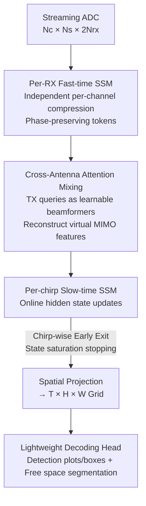

# RAVEN: Radar Adaptive Vision Encoders for Efficient Chirp-wise Object Detection and Segmentation

**Conference**: CVPR 2026  
**Paper**: [CVF Open Access](https://openaccess.thecvf.com/content/CVPR2026/html/Sen_RAVEN_Radar_Adaptive_Vision_Encoders_for_Efficient_Chirp_wise_Object_Detection_CVPR_2026_paper.html)  
**Code**: TBD  
**Area**: Radar Perception / Object Detection / Free Space Segmentation  
**Keywords**: FMCW Radar, State Space Models, Virtual MIMO, Streaming Chirp-wise Inference, Early Exit

## TL;DR
RAVEN treats the raw ADC stream of mmWave FMCW radar as a temporal sequence based on "chirp arrival time." It employs independent State Space Models (SSMs) for each receiving channel to preserve the phase structure of the MIMO array, utilizes a lightweight cross-attention mechanism as a "learnable beamformer" to reconstruct virtual antenna features, and enables detection/segmentation results before a frame is fully collected through chirp-wise early exit. It achieves SOTA performance on two automotive radar datasets while reducing computation by up to $170\times$ and end-to-end latency by $4\times$.

## Background & Motivation
**Background**: Millimeter-wave radar is more robust than cameras and LiDAR in adverse weather/lighting conditions, provides direct velocity measurements via Doppler, and has lower power consumption and size, making it a critical sensor for autonomous driving and UAVs. Standard radar perception pipelines follow a "frame-based" paradigm—collecting all ADC samples for a full frame, performing a series of FFTs along range/angle/Doppler dimensions to construct high-resolution RAD (range–angle–Doppler) tensors, and then decoding them using dense CNNs or Transformers.

**Limitations of Prior Work**: The frame-based paradigm has two major drawbacks. First, **latency is locked** to at least one frame interval, as computation cannot start until all chirps are received. Second, RAD tensors are large and computationally expensive (e.g., a $256\times64\times12$ 3D grid for $3\text{TX}\times4\text{RX}$), making transmission and inference costs surge with antenna count and bandwidth, which is prohibitive for embedded platforms and high-speed scenarios. Streaming chirp-wise models (updating state as chirps arrive) are an alternative, but existing lightweight sequential methods perform poorly on complex tasks like object detection.

**Key Challenge**: The authors identify two root causes for the performance drop in existing streaming methods. First, they often **compress or mix receive channels too early** in the pipeline (e.g., averaging RX channels into a scalar), which is equivalent to applying a fixed uniform beamformer that erases the relative phase differences encoding the angle in MIMO arrays. Consequently, downstream tokens lose spatial resolution. Second, in DDM (Doppler Division Multiplexing) systems, echoes from different transmit antennas are interleaved in the frequency domain; failing to explicitly separate them early leads to aliasing of virtual array elements, degrading angle estimation and detection accuracy.

**Goal**: To develop an encoder that is both **streaming-friendly** and keeps the **MIMO structure explicitly accessible**, while enabling early decision-making before a full frame is received.

**Key Insight**: Instead of treating ADC data as generic time-series, the authors exploit the signal and array physics of FMCW MIMO—where targets generate beat frequencies tied to range/Doppler, and an $N_{rx}$-element array encodes angles through deterministic phase shifts between antennas (steering vectors). Since angular information is hidden in inter-channel phase differences, the radar data should be processed independently per channel before explicit cross-antenna mixing, rather than relying on deep networks to learn geometry implicitly.

**Core Idea**: A physics-inspired hybrid architecture: "Per-RX independent SSMs (phase preservation) + Cross-attention with learnable TX queries (virtual MIMO reconstruction without FFT/RAD) + Chirp-wise SSM with calibrated stopping criteria (early exit)," replacing early-channel-mixing frame-based or streaming schemes.

## Method

### Overall Architecture
RAVEN transforms streaming ADC samples into BEV detection boxes and free-space segmentation maps through a five-stage pipeline: ① **Fast-time per-RX SSM**—each RX channel uses an independent small SSM (Mamba block) to compress the I/Q sequence of a chirp into a compact token preserving range/phase info per antenna; ② **Cross-antenna attention**—RX tokens from the same chirp are fused via lightweight attention to reconstruct virtual MIMO features; ③ **Slow-time per-chirp SSM**—processing tokens in chirp order and maintaining hidden states for online/anytime inference; ④ **Spatial projection**—mapping sequential features onto a $T\times H\times W$ grid for 2D decoding; ⑤ **Lightweight decoding head**—a shallow CNN decodes detection heatmaps/boxes and free-space masks. Combined with multi-prefix supervision during training and calibrated stopping criteria during inference, the model can make decisions using only a fraction of chirps in a frame.

Input notation: A frame consists of $N_c$ chirps (slow-time), each with $N_s$ fast-time samples, across $N_{rx}$ receiving and $N_{tx}$ transmitting channels. For complex I/Q data, the channel dimension is $2N_{rx}$, and the full frame is $\mathbf{X}\in\mathbb{R}^{N_c\times N_s\times 2N_{rx}}$.

### Key Designs

**1. Parallel Per-RX Fast-time SSM Encoder: Preserving phase differences for angle encoding**

To address the loss of spatial resolution from early channel mixing, RAVEN avoids compressing RX channels into scalars at the input. Instead, it assigns a **dedicated** state space encoder $\mathrm{SSM}_r:\mathbb{R}^{N_s\times2}\to\mathbb{R}^{N_s\times2}$ (Mamba implementation) to each receiving channel $r$. The fast-time I/Q sequence $\mathbf{x}_{r,k}$ for the $k$-th chirp is encoded and adaptively pooled into a 2D token $\mathbf{f}_{r,k}=\mathrm{Pool}_1(\tilde{\mathbf{z}}_{r,k}^\top)\in\mathbb{R}^2$. Stacking these yields $\mathbf{F}_k\in\mathbb{R}^{N_{rx}\times2}$. The "independence" ensures that the phase/amplitude profile across RX channels—determined by array geometry—is preserved for the next stage to recover angular information. The linear-time streaming nature of SSMs ensures this step is both compact and efficient.

**2. Cross-antenna Attention Mixing: Using learnable TX queries as "beamformers" to reconstruct virtual MIMO**

This design explicitly handles DDM systems where TX echoes are interleaved. For each chirp, RX tokens are projected and added with learnable RX embeddings $\mathbf{H}^{rx}_k=\mathbf{W}_{in}\mathbf{F}_k+\mathbf{E}^{rx}$. A set of **learnable TX queries** $\mathbf{Q}\in\mathbb{R}^{N_{tx}\times d}$ is introduced to perform cross-attention (query=TX, key/value=RX):

$$\mathrm{Attn}(\mathbf{q},\mathbf{k},\mathbf{v})=\mathrm{softmax}\!\left(\frac{\mathbf{q}\mathbf{k}^\top}{\sqrt{d}}\right)\mathbf{v}\in\mathbb{R}^{N_{tx}\times d}$$

Adding TX-side residuals and an FFN yields $\mathbf{T}\in\mathbb{R}^{N_{tx}\times d}$. These TX queries act like learnable steering vectors searching the RX token field to separate contributions from different transmitters. Then, for each virtual element pair $(r,t)$, corresponding RX and TX tokens are concatenated and projected into a 2D feature $\mathbf{p}_{r,t}=\mathbf{W}_{pair}[\mathbf{h}^{rx}_r;\mathbf{t}_t]\in\mathbb{R}^2$. Stacking and normalizing these results in a per-chirp output $\mathbf{y}_k\in\mathbb{R}^{2N_{rx}N_{tx}}$. This **reconstructs virtual array features directly from streaming signals**—bypassing RAD tensor construction and expensive FFT pipelines while retaining the spatial precision needed for localization.

**3. Per-chirp Slow-time SSM + Sub-frame Early Exit: Deciding "when to stop" based on state saturation**

To reduce latency from "per-frame" to "sub-frame," the slow-time SSM processes inputs $\mathbf{Z}=[\mathbf{z}_1,\dots,\mathbf{z}_{N_c}]$ sequentially to support anytime decisions. This is based on a physical observation: while Doppler FFT requires $N_c$ chirps for velocity resolution $\Delta v$, detection tasks can often tolerate coarser resolution. Thus, detection performance tends to saturate after a small number of chirps.

Training uses **multi-prefix deep supervision**: a set of prefix lengths $\mathcal{L}=\{L_1,\dots,L_M\}$ is chosen, and predictions from each prefix $\mathbf{Z}^{(L)}_*$ are supervised by the same ground truth: $\mathcal{L}_{task}=\sum_{L\in\mathcal{L}}[\ell_{det}(\widehat{\mathrm{Det}}^{(L)},\mathrm{Det}^\star)+\ell_{seg}(\widehat{\mathrm{Seg}}^{(L)},\mathrm{Seg}^\star)]$. Inference uses a **calibrated stopping criterion**: calculating the "novelty" of the hidden state $\mathbf{z}_L$ relative to previous chirps via minimum cosine distance $d_L=\min_{1\le j<L}(1-\frac{\mathbf{z}_L^\top \mathbf{z}_j}{\|\mathbf{z}_L\|\|\mathbf{z}_j\|})$. When the average novelty per block $\bar{d}_m$ falls below a threshold $\tau$ (experimentally $\tau=0.2$), the model stops, saving further FLOPs and latency.

### Loss & Training
On RADIal, free-space segmentation and vehicle detection are jointly trained: Jaccard (IoU) loss for segmentation, Focal loss + Smooth L1 for detection. Adam optimizer ($lr=1\times10^{-4}$, weight decay=$5\times10^{-6}$), batch size 8, 200 epochs. On RaDICaL, BEV occupancy segmentation is trained using BCE loss for 300 epochs. Multi-prefix supervision is the key to enabling early exit capability.

## Key Experimental Results

### Main Results
Evaluation was conducted on two 77GHz automotive datasets: RaDICaL (4RX×2TX TDM) and RADIal (12TX×16RX DDM, 192 virtual antennas). Efficiency is measured in MACs, parameter count, and single-frame latency on an RTX 4060 Mobile GPU.

RaDICaL Occupancy Segmentation (Selected Table 1):

| Model | GMACs ↓ | Params(M) ↓ | Dice ↑ | Chamfer ↓ |
|------|---------|-------------|--------|-----------|
| FFT-RadNet | 41.74 | 4.25 | 0.996 | 0.076 |
| UNet | 15.14 | 17.27 | 0.996 | 0.078 |
| SSMRadNet | 0.108 | 0.566 | 0.996 | 0.086 |
| ChirpNet-Attn | 0.350 | 3.761 | 0.991 | 0.091 |
| **RAVEN (Ours)** | **0.053** | **0.347** | **0.997** | 0.082 |

RAVEN uses 0.053 GMACs to achieve 0.997 Dice, representing roughly **$790\times$ lower computation and $12\times$ fewer parameters** than FFT-RadNet, with near-SOTA boundary quality.

RADIal Segmentation + Detection (Selected Table 2):

| Model | mIoU ↑ | F1 ↑ | mAP ↑ | RE(m) ↓ | GMACs ↓ | Params(M) ↓ | Lat.(ms) ↓ |
|------|--------|------|-------|---------|---------|-------------|-------------|
| FFT-RadNet | 0.74 | 0.88 | 0.97 | 0.14 | 146.82 | 3.80 | 53.59 |
| TransRadar | 0.82 | 0.93 | 0.95 | 0.15 | 171.50 | 3.70 | — |
| T-FFTRadNet | 0.79 | 0.87 | 0.88 | 0.16 | 97.00 | 9.60 | 52.90 |
| SSMRadNet | 0.79 | 0.77 | 0.83 | 0.14 | 1.67 | 0.31 | 14.20 |
| **RAVEN (Sub-frame)** | 0.85 | 0.89 | 0.88 | 0.17 | **0.27** | 1.51 | **9.15** |
| **RAVEN (Full Frame)** | **0.90** | **0.93** | 0.95 | **0.12** | 1.02 | 1.51 | 20.08 |

The full-frame RAVEN achieves 0.90 mIoU and 0.93 F1 with the lowest range/angle errors, using only 1.02 GMACs—about **$170\times$ more efficient** than TransRadar (171.5) and matching or exceeding its accuracy.

### Ablation Study
The core ablation focuses on the early exit/chirp budget analysis:

| Configuration | Performance | Description |
|------|------|------|
| Full Frame (256 chirps) | mIoU 0.90 / 20.08ms | Accuracy upper bound with full frame intake. |
| Sub-frame (Adaptive) | mIoU 0.85 / 9.15ms / 0.27 GMACs | Latency nearly halved, compute reduced to 1/4. |
| Chirp budget reduction | $>2\times$ speedup | Minimal accuracy loss for 32~64 chirps. |

### Key Findings
- **Cross-antenna attention is crucial for detection**: Preserving the virtual MIMO structure allows RAVEN to compete with heavy FFT/Transformer models in mAP and angular error, whereas earlier streaming models that mix channels (e.g., ChirpNet GRU) fail to reach this level.
- **Chirp information has a clear "knee point"**: Saturation signals occur early; performance plateaus around 64 chirps, while memory and latency continue to grow linearly, making early termination a nearly free speedup.
- **Scene quality determines early exit reliability**: In structured multi-car scenes, early chirps form a hypothesis refined by later chirps. In cluttered/noisy scenes, state distance signals become unstable, indicating that early exit has natural physical boundaries.

## Highlights & Insights
- **"Beamforming" as Learnable Attention**: Using TX queries to search the RX token field and reconstruct virtual arrays essentially replaces the heavy FFT + RAD tensor pipeline with attention. This is a practical example of "attention as a beamformer."
- **Nnovelty-based Early Exit**: Rather than using heavy auxiliary heads, RAVEN uses the "novelty saturation" of the slow-time SSM state as a stopping signal, which is physically interpretable (corresponding to Doppler information saturation).
- **Physics Priors for Efficiency**: By designing encoders based on FMCW MIMO array physics rather than treating ADC data as generic time-series, a small model (0.35M~1.5M parameters) outperforms frame-based models with hundreds of GMACs.

## Limitations & Future Work
- **DDMA separation relies on learning**: Cross-attention "approximates" separation rather than using explicit matched filtering; performance in highly cluttered environments with complex multi-path interference needs further validation.
- **Early exit failure in noise**: In cluttered scenes, the chirp state signal can become erratic, potentially leading to unreliable early stops. A fallback mechanism for high-uncertainty scenarios is needed.
- **Dataset Labels**: Ground truth comes from camera/LiDAR projections, which may contain noise. Generalization across diverse driving conditions and multi-modal fusion remains future work.

## Related Work & Insights
- **vs. Frame-based Pipelines (e.g., TransRadar)**: Frame-based models require the full RAD tensor, leading to high GMACs and locked latency. RAVEN uses $1/170$ of the compute by reconstructing virtual array features directly in a streaming fashion.
- **vs. Lightweight Streaming Models (e.g., ChirpNet)**: Previous streaming models often lost spatial locality by mixing RX channels too early. RAVEN's key differentiator is the independent per-RX processing followed by explicit cross-antenna attention.
- **vs. General Early Exit (e.g., MSDNet)**: While general methods use auxiliary classifiers, RAVEN leverages the physical saturation of radar Doppler information through simple SSM state distance metrics.

## Rating
- Novelty: ⭐⭐⭐⭐⭐ "Attention as learnable beamforming" combined with SSM saturation for early exit is a highly original integration of radar physics into streaming architectures.
- Experimental Thoroughness: ⭐⭐⭐⭐ Covering two datasets and various baselines (CNN/Transformer/RNN/SSM) with comprehensive efficiency metrics.
- Writing Quality: ⭐⭐⭐⭐⭐ Clear logical chain from motivation to design, consistent notation, and intuitive diagrams.
- Value: ⭐⭐⭐⭐⭐ Highly practical for edge deployment in automotive and UAV radar perception.

<!-- RELATED:START -->

1. **Mamba: Linear-Time Sequence Modeling with Selective State Spaces**, Gu et al., 2023.
2. **RADIal: A Multi-modal Antenna-level Automotive Radar Dataset**, Rebut et al., 2022.
3. **TransRadar: Adaptive-Directional Transformer for Real-Time Radar Object Detection**, 2023.

<!-- RELATED:END -->

## Related Papers

- [\[CVPR 2026\] Efficient Video Object Segmentation and Tracking with Recurrent Dynamic Submodel](efficient_video_object_segmentation_and_tracking_with_recurrent_dynamic_submodel.md)
- [\[CVPR 2026\] MARSS: Radar Semantic Segmentation via Modular Attention and State Space Models](marss_radar_semantic_segmentation_via_modular_attention_and_state_space_models.md)
- [\[CVPR 2026\] Training-Free Open-Vocabulary Camouflaged Object Segmentation via Fine-Grained Object Binding and Adaptive Hybrid Prompt](training-free_open-vocabulary_camouflaged_object_segmentation_via_fine-grained_o.md)
- [\[CVPR 2026\] RDNet: Region Proportion-Aware Dynamic Adaptive Salient Object Detection Network in Optical Remote Sensing Images](rdnet_region_proportion-aware_dynamic_adaptive_salient_object_detection_network_.md)
- [\[CVPR 2026\] MPM: Mutual Pair Merging for Efficient Vision Transformers](mpm_mutual_pair_merging_for_efficient_vision_transformers.md)

<!-- RELATED:END -->
