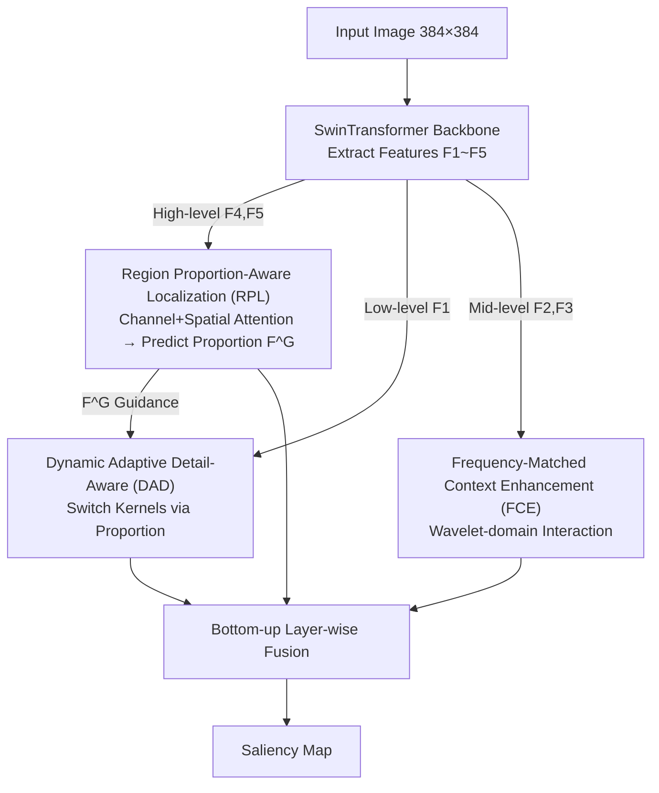

# RDNet: Region Proportion-Aware Dynamic Adaptive Salient Object Detection Network in Optical Remote Sensing Images

**Conference**: CVPR2026  
**arXiv**: [2603.12215](https://arxiv.org/abs/2603.12215)  
**Code**: TBD  
**Area**: Semantic Segmentation / Salient Object Detection  
**Keywords**: Remote sensing image saliency detection, dynamic adaptive convolution, wavelet transform, region proportion awareness, SwinTransformer

## TL;DR

To address the challenge of significant target scale variation in remote sensing images, this paper proposes RDNet, a region proportion-aware dynamic adaptive salient object detection network. It dynamically selects convolution kernel combinations through Proportion Guidance and combines wavelet-domain frequency interaction with cross-attention localization modules, significantly outperforming SOTA methods across three ORSI-SOD datasets.

## Background & Motivation

1.  **Extreme Target Scale Variation**: Targets in the same scene can range from extremely small (airplanes) to extremely large (stadiums). Fixed convolution kernel strategies fail to balance both—large kernels introduce excessive background noise for small targets, while small kernels fail to capture the complete region of large targets.
2.  **High Computational Overhead of Self-Attention**: Existing methods perform self-attention directly on full-resolution features for inter-layer interaction, which is computationally expensive and dilutes target information by mixing high and low-frequency components.
3.  **CNN Backbones Lack Global Modeling**: CNN-based feature extractors rely on local kernels, making it difficult to capture global context and long-range dependencies.
4.  **Uniform Multi-scale Schemes**: Most methods apply the same multi-scale convolution combinations to all samples without considering the varying proportion of target regions across different images.
5.  **Insufficient Context Utilization in Mid-level Features**: While high-level features contain semantic localizing information and low-level features contain details, mid-level context interaction lacks effective and lightweight designs.
6.  **Complex Remote Sensing Scenes**: Cluttered backgrounds and similar texture interference make accurate boundary segmentation particularly difficult.

## Method

### Overall Architecture

RDNet addresses the extreme scale span of remote sensing targets by utilizing SwinTransformer as a backbone to extract five levels of features $\{F_i^R\}_{i=1}^{5}$ (input 384×384). Three modules are designed based on feature hierarchy, followed by bottom-up fusion to output the saliency map: high-level features $F_4^R, F_5^R$ are processed by RPL for localization and target proportion prediction $F^G$; mid-level features $F_2^R, F_3^R$ are processed by FCE for context enhancement; and low-level feature $F_1^R$ is processed by DAD for detail perception guided by $F^G$. The core mechanism is to first "assess target proportion" and then dynamically decide the convolution strategy.

### Key Designs

**1. Region Proportion-Aware Localization (RPL): Estimating "Size Tiers" to Guide Subsequent Convolutions**

Unlike methods using static multi-scale kernels, RPL first applies **channel attention** (GAP + two-layer 1×1 Conv + Sigmoid) and **spatial attention** (Channel Max Pool + Sigmoid) to $F_4^R$ and $F_5^R$. After concatenation, a 3×3 Conv produces localization feature $F^A$. The **Proportion Guidance (PG) Block** applies GAP followed by two FC layers to $F_5^R$ to output the target region proportion $F^G \in \mathbb{R}^{4 \times 1}$, supervised by MSE Loss. This proportion serves as the basis for dynamic kernel selection in DAD.

**2. Dynamic Adaptive Detail-Aware Module (DAD): Switching Kernel Combinations by Region Proportion**

Fixed kernels mismatch varying target scales: large kernels catch large objects but introduce noise for small ones, and vice versa. DAD uses the proportion estimated by PG to classify targets into three tiers:

| Region Proportion | Kernel Combination | Design Motivation |
| :--- | :--- | :--- |
| **> 50%** | 1×1, 3×3, 5×5, 7×7, 9×9 (5 types) | Large kernels capture total area; small kernels refine edges |
| **25%–50%** | 1×1, 3×3, 5×5, 7×7 (4 types) | Balanced mid-scale strategy |
| **< 25%** | 1×1, 3×3, 5×5 (3 types) | Avoids noise from overly large kernels |

A dual-branch structure is used: the Detail Extractor (lower branch) fuses multi-kernel outputs into $F_1^D$; the Detail Optimizer (upper branch) generates weight $W$ using similar kernels and Sigmoid. The final result is $F^P = F_1^D \otimes W \oplus F_1^D$.

**3. Frequency-Matched Context Enhancement Module (FCE): Inter-layer Interaction in the Wavelet Domain**

FCE performs **wavelet interaction** to avoid the high cost of full-resolution self-attention. It applies Discrete Wavelet Transform (DWT) to $F_2^R$ and $F_3^R$ to obtain LL, LH, HL, HH components. Matrix multiplication is performed between corresponding frequency components (reducing complexity to **1/4** of standard attention), followed by IDWT. Subsequent **feature enhancement** involves concatenation, channel/spatial attention, and a 3×3 Conv to obtain $F^W$.

### Loss & Training

$$L_{total} = \frac{1}{N} \sum_{i=1}^{N} (L_{bce} + L_{iou} + L_{fm} + L_{mse})$$

-   BCE Loss: Pixel-level cross-entropy.
-   IoU Loss: Region overlap.
-   F-measure Loss: Precision-recall harmonic mean.
-   MSE Loss: Supervised region proportion prediction $F^G$.

## Key Experimental Results

### Main Results: SOTA Across Three Datasets

| Method | EORSSD M↓ | EORSSD $F_\beta$↑ | EORSSD $E_\xi$↑ | ORSSD M↓ | ORSSD $F_\beta$↑ | ORSSD $E_\xi$↑ | ORSI-4199 M↓ | ORSI-4199 $F_\beta$↑ |
| :--- | :--- | :--- | :--- | :--- | :--- | :--- | :--- | :--- |
| GeleNet | 0.0066 | 0.8367 | 0.9678 | 0.0083 | 0.8879 | 0.9787 | 0.0266 | 0.8711 |
| ADSTNet | 0.0065 | 0.8321 | 0.9633 | 0.0089 | 0.8856 | 0.9800 | 0.0319 | 0.8615 |
| HFCNet | 0.0051 | 0.7845 | 0.9280 | 0.0073 | 0.8581 | 0.9554 | 0.0270 | 0.8272 |
| **RDNet (Ours)** | **0.0049** | **0.8563** | **0.9718** | **0.0066** | **0.9080** | **0.9852** | **0.0254** | **0.8781** |

-   On EORSSD, MAE decreased by 3.9% compared to HFCNet, and $F_\beta$ improved by 9.1% on average.
-   On ORSSD, $F_\beta$ reached 0.908, a 2.5% Gain over ADSTNet.
-   T-test p-values across all 21 methods are extremely low, indicating statistical significance.

### Ablation Study

| Setting | M↓ | $F_\beta$↑ | $S_\alpha$↑ |
| :--- | :--- | :--- | :--- |
| w/o DAD | 0.0052 | 0.8550 | 0.9273 |
| w/o FCE | 0.0061 | 0.8453 | 0.9224 |
| w/o RPL | 0.0054 | 0.8561 | 0.9329 |
| **Full RDNet** | **0.0049** | **0.8563** | **0.9327** |

-   MAE increases most without FCE (0.0061 vs 0.0049), indicating that mid-level context interaction is the most critical component.
-   Backbone comparison: SwinTransformer >> PVT > ResNet > VGG >> ViT.
-   Threshold setting: The current tier division [<25%, 25%-50%, >50%] is optimal.

### Model Efficiency

-   FLOPs: 48.7G (compared to GeleNet 11.7G and PA-KRN 617.7G).
-   Inference Speed: 13.6 FPS (moderate speed due to intensive matrix operations).

## Highlights & Insights

1.  **Region Proportion-Guided Dynamic Kernel Selection** is the core novelty. It introduces a classification mindset into detection—predicting the target "size category" before deciding the convolution strategy avoids kernel mismatch.
2.  **Frequency-Matched Interaction in the Wavelet Domain** shifts feature interaction from the spatial to the frequency domain. Interacting identical frequency components reduces computation 4x and prevents interference between high and low frequencies.
3.  **Three-module Hierarchical Design** (high-level localization + mid-level context + low-level detail) provides a clear logic with specific functional assignments.
4.  **Experimental Thoroughness**: Includes comparisons with 21 methods, 7 sets of ablation studies, t-test significance, and failure case analysis.

## Limitations & Future Work

1.  **Slow Inference Speed**: 13.6 FPS is insufficient for real-time remote sensing applications; intensive matrix operations are a bottleneck.
2.  **Coarse Categorization**: Dividing region proportions into three discrete tiers might be less precise than continuous regression.
3.  **High-level Semantic Dependency**: PG Block relies solely on $F_5^R$, which may lead to inaccurate proportion predictions for extremely small targets.
4.  **Failure Cases**: Missed detections still occur for extremely tiny/thin targets, and false positives occur when background textures mirror targets.
5.  **Limited Generalization Testing**: Evaluation was only performed on remote sensing datasets; performance on natural image SOD datasets is untested.
6.  **Heavy Backbone**: The SwinTransformer backbone limits deployment possibilities on edge devices.

## Related Work & Insights

-   **vs ADSTNet / GeleNet** (Prev. SOTA): RDNet outperforms them across all datasets due to its region proportion adaptive mechanism.
-   **vs ASTT** (Transformer methods): Achieves a 13.6% Gain in $F_\beta$, benefiting from hierarchical design over simple global attention.
-   **vs MCCNet / CorrNet** (Context interaction methods): FCE's wavelet interaction is more effective and lightweight than direct concatenation or attention.
-   **vs VST** (Vision Transformer): MAE reduced by 28.9%, suggesting Swin's hierarchical window attention is better suited for dense prediction than ViT's flat structure.

## Rating

-   Novelty: ⭐⭐⭐⭐ — Dynamic kernel selection and wavelet interaction are practically significant.
-   Experimental Thoroughness: ⭐⭐⭐⭐⭐ — Extensive comparisons and rigorous statistical testing.
-   Writing Quality: ⭐⭐⭐⭐ — Clear structure and complete derivations.
-   Value: ⭐⭐⭐⭐ — Provides an effective solution for scale issues in RS-SOD, despite real-time limitations.

## Related Papers

- [\[CVPR 2025\] G2HFNet: GeoGran-Aware Hierarchical Feature Fusion Network for Salient Object Detection in Optical Remote Sensing Images](../../CVPR2025/segmentation/binwang2hfnet_geogran-aware_hierarchical_feature_fusion_network_for_salient_obje.md)
- [\[CVPR 2026\] Uncertainty-Aware Modality Fusion for Unaligned RGB-T Salient Object Detection](uncertainty-aware_modality_fusion_for_unaligned_rgb-t_salient_object_detection.md)
- [\[CVPR 2026\] AFRO: Bootstrap Dynamic-Aware 3D Visual Representation for Scalable Robot Learning](bootstrap_dynamic-aware_3d_visual_representation_for_scalable_robot_learning.md)
- [\[CVPR 2026\] F2Net: A Frequency-Fused Network for Ultra-High Resolution Remote Sensing Segmentation](f2net_a_frequency-fused_network_for_ultra-high_resolution_remote_sensing_segment.md)
- [\[CVPR 2025\] RSONet: Region-guided Selective Optimization Network for RGB-T Salient Object Detection](../../CVPR2025/segmentation/rsonet_region-guided_selective_optimization_network_for_rgb-t_salient_object_det.md)

<!-- RELATED:END -->

<!-- RELATED:START -->

## Related Papers

- [\[CVPR 2026\] Uncertainty-Aware Modality Fusion for Unaligned RGB-T Salient Object Detection](uncertainty-aware_modality_fusion_for_unaligned_rgb-t_salient_object_detection.md)
- [\[CVPR 2026\] F2Net: A Frequency-Fused Network for Ultra-High Resolution Remote Sensing Segmentation](f2net_a_frequency-fused_network_for_ultra-high_resolution_remote_sensing_segment.md)
- [\[CVPR 2026\] Generalizable Co-Salient Object Detection via Mixed Content-Style Modulation](generalizable_co-salient_object_detection_via_mixed_content-style_modulation.md)
- [\[CVPR 2026\] ReSAM: Refine, Requery, and Reinforce: Self-Prompting Point-Supervised Segmentation for Remote Sensing Images](resam_refine_requery_and_reinforce_self-prompting_point-supervised_segmentation_.md)
- [\[CVPR 2026\] SAQN: Semantic-based Adaptive Query Network for 3D Referring Expression Segmentation](saqn_semantic-based_adaptive_query_network_for_3d_referring_expression_segmentat.md)

<!-- RELATED:END -->
