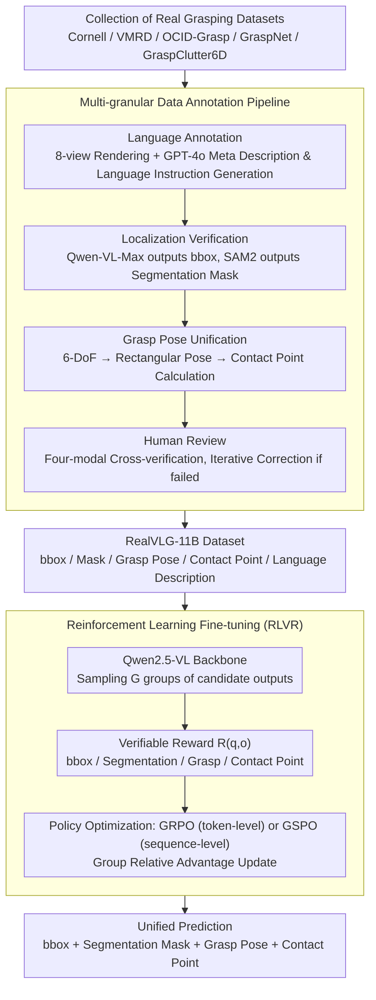

# RealVLG-R1: A Large-Scale Real-World Visual-Language Grounding Benchmark for Robotic Perception and Manipulation

**Conference**: CVPR2026  
**arXiv**: [2603.14880](https://arxiv.org/abs/2603.14880)  
**Code**: [lif314/RealVLG-R1](https://github.com/lif314/RealVLG-R1)  
**Area**: Semantic Segmentation  
**Keywords**: Visual-Language Grounding, Robotic Grasping, Reinforcement Learning Fine-tuning, Multi-granular Annotation, Zero-shot Generalization, Large-scale Vision-Language Models

## TL;DR

Ours proposes the RealVLG framework, comprising the 11B-level real-world multi-granular annotated dataset RealVLG-11B and the Reinforcement Learning (RL) fine-tuned unified model RealVLG-R1. This work unifies Visual-Language Grounding (VLG) and robotic grasping into the same paradigm for the first time, achieving end-to-end prediction from natural language instructions to bounding boxes, segmentation masks, grasp poses, and contact points, while demonstrating zero-shot generalization capabilities.

## Background & Motivation

**VLG and Grasping Disjoint**: Existing visual-language grounding research focuses on coarse-grained object-level localization (bounding box / segmentation mask), while traditional robotic grasping methods rely on geometric cues and lack linguistic semantic guidance, resulting in a significant gap between the two.

**Insufficient Synthetic Data Quality**: Datasets like Grasp-Anything use diffusion models to generate low-resolution synthetic scenes, and grasp annotations are automatically generated by RAGT-3/3 with limited quality. Language descriptions only cover scene or object category levels.

**Lack of Fine-grained Language Descriptions**: Language annotations in existing grasping datasets are coarse, lacking precise descriptions of target object attributes and spatial relations, which fails to support language-driven fine-grained operations.

**SFT Difficulty with Multi-solution Problems**: Grasping poses inherently possess multiple feasible solutions. However, Supervised Fine-Tuning (SFT) forces fitting to a single label, leading to "averaged" predictions that are physically infeasible.

**Insufficient Real-world Dataset Scale**: Annotations in existing real-world grasping datasets are inconsistent and lack multi-modal aligned annotations for segmentation, detection, and language.

**Lack of Zero-shot Capability**: Grasping methods trained in closed environments have poor scalability and cannot be directly deployed in unseen real-world scenes.

## Method

### Overall Architecture

RealVLG aims to unify Visual-Language Grounding (VLG) and robotic grasping into a single model, enabling natural language instructions to map directly to bounding boxes, segmentation masks, grasp poses, and contact points. It consists of two components: the RealVLG-11B dataset—integrating real grasping datasets such as Cornell, VMRD, OCID-Grasp, GraspNet, and GraspClutter6D, unified via an annotation pipeline to include bboxes, segmentation masks, rectangular grasp poses, contact points, and natural language descriptions (covering ~165,000 images, 800+ object instances, 1.3 million annotations, and ~11 billion grasp examples); and the RealVLG-R1 model—using Qwen2.5-VL as the backbone and fine-tuned via Reinforcement Learning from Verifiable Rewards (RLVR) to unifiedly predict the four categories of output. The following diagram illustrates the "Dataset Construction" and "Model Training" pipelines.

### Key Designs

**1. Multi-granular Data Annotation Pipeline: Producing High-Quality Real-World Annotations via Four-Modal Cross-Verification**

Existing grasp data are either low-quality synthetics or limited to scene/class-level language descriptions. This work establishes quality via a four-step pipeline: (1) **Language Annotation**—rendering 3D models from 8 views for GPT-4o to generate Meta Descriptions, then combining these with images to generate Language Instructions containing category, color, shape, and spatial relations; (2) **Localization Verification**—Qwen-VL-Max performs grounding on image + language to output bboxes, and SAM2 generates masks; (3) **Grasp Pose Unification**—converting 6-DoF poses into a unified rectangular representation and calculating contact points based on masks; (4) **Human Review**—cross-verifying four-modal consistency and iteratively correcting failures.

**2. Reinforcement Learning Fine-tuning (RLVR): Solving Multi-solution Grasping via Verifiable Rewards**

Grasping poses inherently have multiple feasible solutions; SFT forced onto a single label results in "averaging" that is physically infeasible. Ours adopts the RLVR paradigm, replacing fixed labels with a verifiable reward function $R(q,o)$: sampling $G$ candidate outputs from the old policy, calculating group relative advantage $\hat{A}_i$, and updating the policy. Two interchangeable algorithms are provided: GRPO for token-level importance weighting, and GSPO for sequence-level importance weights $s_i(\theta) = \left(\frac{\pi_\theta(y_i|x)}{\pi_{\theta_{old}}(y_i|x)}\right)^{1/|y_i|}$ to normalize variance. In experiments, RL fine-tuning achieved a Gain of over 30% in grasping compared to SFT, as the rewards allow "multiple correct solutions" without forcing convergence to a mean.

### Loss & Training

Rewards are designed per task, requiring a `<think>...</think><answer>...</answer>` format:

- **Bbox Reward**: Binary reward based on IoU threshold $R_{Bbox} = \mathbf{1}(\text{IoU}(B_p, B_{gt}) \geq \tau)$
- **Segmentation Reward**: IoU coarse localization + S-measure fine-grained mask quality $R_{Seg} = \mathbf{1}(\text{IoU}) + S_\alpha(M_p, M_{gt})$
- **Grasp Reward**: Negative sum of Huber losses for $(x, y, \cos\theta, \sin\theta, w)$ components
- **Contact Point Reward**: Rectangular alignment IoU binary reward + L2 distance penalty for the two contact points

## Key Experimental Results

### Data Quality Assessment

| Dataset | MTLD ↑ | CLIP Score ↑ | $R_s$ ↑ | $R_g$ ↑ | $R_c$ ↑ |
|--------|--------|-------------|---------|---------|---------|
| Grasp-Anything | 27.45 | 0.54 | – | 0.38 | 0.69 |
| Grasp-Anything++ | 15.14 | 0.52 | – | 0.31 | 0.62 |
| **RealVLG-11B** | **36.49** | **0.65** | **0.99** | **0.69** | **0.87** |

RealVLG-11B surpasses synthetic datasets across language diversity (MTLD), visual-language alignment (CLIP Score), and spatial consistency.

### Main Results on RealVLG Benchmark

| Model | Seen Bbox (gIoU) | Seen Grasp (mIoU/gAcc) | Novel Bbox (gIoU) | Novel Grasp (mIoU/gAcc) |
|------|-----------------|----------------------|-----------------|----------------------|
| Qwen-VL-Max | 92.3 | 16.0/16.7 | 88.4 | 8.1/5.4 |
| Qwen2.5VL-3B + SFT | 56.4 | 3.4/1.7 | 57.2 | 4.4/1.5 |
| RealVLG-R1-3B (GRPO) | 87.2 | **34.7/40.3** | 78.5 | 16.3/17.1 |
| RealVLG-R1-7B (GSPO) | **89.0** | 33.6/32.8 | **88.5** | 16.5/18.3 |

### Ablation Study & Key Findings

1. **SFT vs RL Fine-tuning**: SFT shows only an ~5% gIoU Gain over the base model, whereas GRPO/GSPO achieve over 30%, proving the significant advantage of RL for multi-solution grasping tasks.
2. **GRPO vs GSPO**: GRPO achieves higher grasping accuracy on smaller models (3B: mIoU 34.7 vs 29.2), while GSPO offers better stability on larger models with a 100% Rv rate.
3. **Zero-shot Generalization**: In Novel (unseen object) scenarios, RealVLG-R1-7B (GSPO) maintains a Bbox gIoU of 88.5% and a grasp mIoU/gAcc of 16.5/18.3%, demonstrating non-trivial generalization.
4. **Output Validity Rate**: The closed-source Qwen-VL-Max has an Rv of only 60-70%, whereas all RealVLG-R1 configurations reach 96-100%, indicating that RL fine-tuning significantly improves structured output consistency.
5. **Only 10% Training Data**: RealVLG-R1 and SFT trained for 10 epochs using only 10% of the training set, reflecting high data efficiency.

## Highlights & Insights

- **First Unified VLG + Grasping Framework**: Unifies semantic localization and physical interaction reasoning into one model; the first end-to-end robotic perception model based on LVLM.
- **High-Quality Data Annotation Pipeline**: Fourfold assurance via GPT-4o generation, Qwen-VL-Max verification, SAM2 segmentation, and human review.
- **11B-level Real-world Grasping Dataset**: The largest real-world perception dataset containing both semantic and visual information.
- **RL for Multi-solution Problems**: Elegantly solves the core challenge of multi-feasible grasp poses by replacing fixed labels with verifiable rewards.
- **Zero-shot Deployment Capability**: Executes perception and manipulation in unseen real-world environments without scene-specific fine-tuning.

## Limitations & Future Work

- Currently supports only 2D rectangular grasp poses; not extended to 3D space and 6-DoF grasping.
- Grasping accuracy in Novel scenarios (mIoU ~16%) still has room for improvement compared to detection performance.
- Segmentation depends entirely on SAM2 as a frozen module; the model itself does not directly generate masks.
- Closed-loop operation success rates on real robots were not reported.
- Dataset primarily covers tabletop scenes; generalization to complex industrial and outdoor environments is unverified.
- Inference requires sampling G groups of responses for advantage estimation, which may limit efficiency.

## Related Work & Insights

- **Visual-Language Grounding**: GLIP, Shikra, GroundingDINO focus on Bbox/Seg localization without grasp reasoning.
- **Grasping Datasets**: Cornell and GraspNet-1Billion provide real-world annotations but lack language; Grasp-Anything includes language but consists of low-quality synthetic data.
- **Language-driven Grasping**: Existing methods often rely on pre-segmented inputs, leading to severe multi-stage error accumulation and poor open-world generalization.
- **RL Fine-tuning LLMs**: DeepSeek-R1 proposed the RLVR paradigm for reasoning tasks; Ours extends this to visual localization and robotic grasping.

## Rating

- Novelty: ⭐⭐⭐⭐ — First to unify VLG and grasping, migrating the RLVR paradigm from NLP reasoning to embodied perception.
- Experimental Thoroughness: ⭐⭐⭐⭐ — Comprehensive data quality assessment, Benchmark, and multi-baseline comparisons, though lacking real-robot closed-loop experiments.
- Writing Quality: ⭐⭐⭐⭐ — Clear structure, detailed dataset construction process, and complete formula derivations.
- Value: ⭐⭐⭐⭐ — The dataset and Benchmark hold long-term value for the community; the unified framework approach is worth following.

<!-- RELATED:START -->

## Related Papers

- [\[CVPR 2026\] XSeg: A Large-scale X-ray Contraband Segmentation Benchmark for Real-World Security Screening](xseg_a_large-scale_x-ray_contraband_segmentation_benchmark_for_real-world_securi.md)
- [\[ICCV 2025\] RAGNet: Large-scale Reasoning-based Affordance Segmentation Benchmark towards General Grasping](../../ICCV2025/segmentation/ragnet_large-scale_reasoning-based_affordance_segmentation_benchmark_towards_gen.md)
- [\[ICCV 2025\] Advancing Visual Large Language Model for Multi-granular Versatile Perception](../../ICCV2025/segmentation/advancing_visual_large_language_model_for_multi-granular_versatile_perception.md)
- [\[CVPR 2026\] CLP: A Real-World Dataset of Contaminated Lens Protectors for Robust Semantic Segmentation](clp_a_real-world_dataset_of_contaminated_lens_protectors_for_robust_semantic_seg.md)
- [\[ICCV 2025\] Learning Precise Affordances from Egocentric Videos for Robotic Manipulation](../../ICCV2025/segmentation/learning_precise_affordances_from_egocentric_videos_for_robotic_manipulation.md)

<!-- RELATED:END -->
