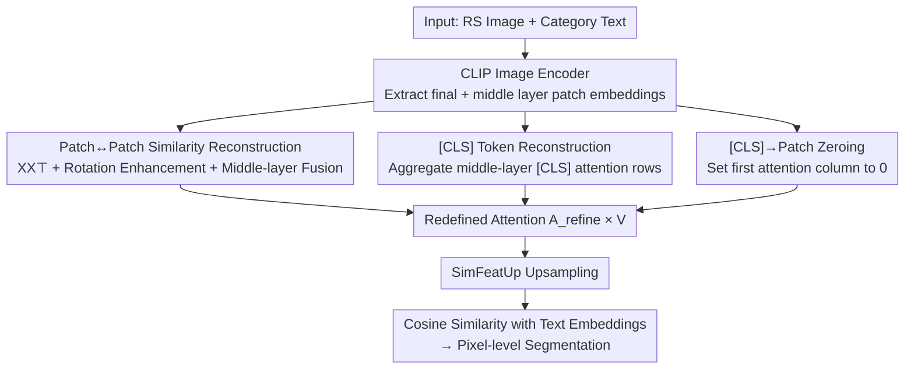

# ReAttnCLIP: Training-Free Open-Vocabulary Remote Sensing Image Segmentation via Re-defined Attention in CLIP

**Conference**: CVPR 2026  
**Paper**: [CVF Open Access](https://openaccess.thecvf.com/content/CVPR2026/html/Niu_ReAttnCLIP_Training-Free_Open-Vocabulary_Remote_Sensing_Image_Segmentation_via_Re-defined_Attention_CVPR_2026_paper.html)  
**Code**: To be confirmed  
**Area**: Semantic Segmentation / Open-Vocabulary / Remote Sensing  
**Keywords**: Open-vocabulary segmentation, Remote sensing, CLIP, Training-free, Attention redefinition

## TL;DR
ReAttnCLIP decomposes the attention map of the final CLIP layer into three components—"patch↔patch, [CLS]→patch, and patch→[CLS]"—and applies specialized modifications to each. It replaces patch-patch attention with raw patch embedding similarity (enhanced by rotation and middle-layer fusion), reconstructs a more informative global [CLS] representation using middle-layer attention, and zeros out the [CLS]-to-patch column. Without any training, it achieves SOTA performance across 10 remote sensing datasets (Ours +1.7% in open-vocabulary mean IoU and +1.1% in object extraction).

## Background & Motivation

**Background**: Remote sensing (RS) image segmentation is a fundamental task for disaster monitoring, precision agriculture, and urban planning. Traditional approaches rely on large-scale pixel-level annotations to train closed-vocabulary models. To overcome fixed category constraints, open-vocabulary segmentation has emerged, yet most methods still require fine-tuning on curated data, leading to high deployment costs. Consequently, the "training-free" paradigm has become a new standard—directly reusing large-scale pre-trained models like CLIP to extract transferable features with zero extra training overhead.

**Limitations of Prior Work**: CLIP's pre-training goal is **image-level** vision-language alignment (relying on the [CLS] token for global similarity), whereas segmentation requires **pixel-level** discriminative patch representations; there is a fundamental mismatch between the two. Existing training-free adaptation methods (such as SCLIP which uses query-query attention, or SCSA/SegEarth-OV which use key-key attention) all **reconstruct the attention map as a single entity** without decomposing the distinct roles played by different regions within the map. In RS scenarios characterized by extreme scale variations, heterogeneous objects, and complex target distributions, this "holistic reconstruction" fails to simultaneously capture global semantics and local details, resulting in suboptimal representations.

**Key Challenge**: In the final layer attention map $A\in\mathbb{R}^{197\times197}$ of CLIP, each patch output $x_i = A_{i0}v_{\text{CLS}} + \sum_{j=1}^{196}A_{ij}v_j$ essentially receives two streams of information simultaneously—global information from [CLS] ($A_{i0}$) and information from other patches (the patch-patch submatrix). Modifying these two streams as a monolithic block inevitably leads to performance trade-offs.

**Key Insight**: This work is the first to **decompose the attention map into three interpretable components** based on semantics: (i) patch↔patch (modeling inter-region relationships), (ii) patch→[CLS] (how [CLS] is constructed), and (iii) [CLS]→patch (the influence of [CLS] on local representations), followed by individual diagnosis and treatment for each block.

**Core Idea**: Instead of reconstructing the entire attention map, the authors **redefine attention component-wise**. For inter-patch relationships, standard QK attention with projection bias is replaced by the simplest raw embedding similarity $XX^\top$. For [CLS], a more category-diverse representation is reconstructed using middle-layer attention. Finally, the [CLS]→patch bias is directly zeroed out.

## Method

### Overall Architecture
ReAttnCLIP is a **purely inference-time** method. It utilizes the off-the-shelf CLIP ViT-B/16 image encoder and only modifies the **attention map of the last transformer block**. The refined attention is multiplied by the values to obtain dense patch features, which are then upsampled using the SimFeatUp module (shared with SegEarth-OV) to calculate cosine similarity with category embeddings from the CLIP text encoder for pixel-level segmentation. No new parameters are trained (SimFeatUp uses pre-trained weights).

The core lies in rewriting the original attention map $A$ as a "redefined attention" $A_{\text{refine}}$, composed of three blocks (corresponding to Eq. 15 in the paper):

$$A_{\text{refine}}=\begin{pmatrix}\bar A^{(l)}_{0,0} & \bar A^{(l)}_{0,1:196}\\[2pt] \mathbf{0} & S\end{pmatrix}$$

where the bottom-right $S\in\mathbb{R}^{N\times N}$ is the redesigned patch↔patch similarity, the first row $\bar A^{(l)}_{0,:}$ is the [CLS] row reconstructed from middle layers, and the entire bottom-left column is zeroed out.

### Key Designs

**1. Patch↔Patch Similarity Reconstruction: Replacing Biased QK Attention with Raw Embedding Similarity + Rotation Enhancement**

The limitation of standard QK attention $A=\mathrm{softmax}(QK^\top/\sqrt d)$ is that $Q$ and $K$ pass through independent projection matrices $W^Q$ and $W^K$, introducing "projection bias"—distorting relationships between similar patches. While SCLIP/SegEarth-OV used weighted sums of $QQ^\top, KK^\top, VV^\top$, this work takes it further by **removing all learnable projections** and directly measuring the similarity between raw patch embeddings:

$$\text{Attention}^{\text{raw}}_{i,j}=\frac{x_i^\top x_j}{\sqrt d}$$

This provides a clean, interpretable baseline reflecting the intrinsic geometric relationship in the embedding space. Visualizations show $XX^\top$ is more focused on intra-class regions than RCS/SCSA.

Two enhancements address RS characteristics: **Rotation Enhancement** applies $0^\circ, 90^\circ, 180^\circ, 270^\circ$ rotations, calculates $S^{(r,k)}=X^{(r,k)}X^{(r,k)\top}$ for each rotation $r$ and layer $k$, and averages them into $S_{\text{rot}}$ (using layers 9–11). **Middle-layer Fusion** then combines this with QK maps from intermediate layers: $S=\alpha S_{\text{rot}}+\sum_{l\in L}\beta_l A^{(l)}$.

**2. [CLS] Token Reconstruction: Aggregating Richer Global Representations from Middle Layers**

Using CLIP for dense prediction often involves discarding [CLS]; however, patches interact heavily with [CLS] during pre-training, which injects global context that can pollute local discriminability. While SegEarth-OV subtracts the **final-layer** [CLS] embedding from patches, the authors discovered that the **final-layer [CLS] carries minimal category information**. Visualizing the entropy of [CLS] attention shows it decreases monotonically with depth, indicating that deep [CLS] attention collapses onto few patches.

Thus, [CLS] is **reconstructed from middle layers**. For selected intermediate layers $l\in L$, the first row of the attention map $A^{(l)}_{0,:}\in\mathbb{R}^{N+1}$ is extracted and averaged:

$$\bar A^{(l)}_{0,:}=\frac{1}{|L|}\sum_{l\in L}A^{(l)}_{0,:}$$

This composite attention vector integrates spatial and semantic information across depths, providing a more robust, category-diverse reference for debiasing.

**3. [CLS]→Patch Influence Zeroing: Cutting Residual Bias from Global Token to Local Patches**

The first column $A_{i0}$ of the attention matrix represents the contribution of [CLS] to the $i$-th patch. This global→local channel injects unnecessary global bias into patch representations. Since [CLS] has already influenced patches during the pre-training phases, the authors set this entire column to zero:

$$A_{\text{refine}}[i,0]=0,\quad i=1,\dots,N$$

This is the simplest and most direct "cut." It complements Design 2: while reconstruction provides a better debiasing reference (the minuend), zeroing cuts the direct pollution of [CLS] in the attention forward pass (the multiplier).

### Loss & Training
This method is **training-free** and requires no loss functions. The inference setup uses CLIP ViT-B/16, input scaled to $448\times448$ with $224\times224$ sliding window inference, and 80 averaged OpenAI text templates. All experiments are conducted on a single V100 GPU.

## Key Experimental Results

### Main Results

On 8 open-vocabulary RS segmentation datasets (mIoU), ReAttnCLIP sets a new SOTA on all datasets, averaging 40.9 vs. 39.2 for SegEarth-OV (+1.7):

| Method | OpenEarthMap | LoveDA | iSAID | Potsdam | UDD5 | VDD | Average |
|------|------|------|------|------|------|------|------|
| MaskCLIP (ECCV22) | 25.1 | 27.8 | 14.5 | 31.7 | 32.4 | 32.9 | 27.2 |
| SCLIP (ECCV24) | 29.3 | 30.4 | 16.1 | 36.6 | 38.7 | 37.9 | 31.1 |
| ClearCLIP (ECCV24) | 31.0 | 32.4 | 18.2 | 40.9 | 41.8 | 39.3 | 33.4 |
| ResCLIP (CVPR25) | 34.3 | 29.6 | 8.8 | 42.6 | 41.9 | 39.6 | 32.6 |
| SegEarth-OV (CVPR25) | 40.3 | 36.9 | 21.7 | 47.1 | 50.6 | 45.3 | 39.2 |
| **Ours** | **41.1** | **37.0** | **23.2** | **48.7** | **53.7** | **49.7** | **40.9** |

For object extraction (mIoU), the method also leads:

| Method | WHUSAT.II | Massachusetts | Average |
|------|------|------|------|
| SegEarth-OV | 28.4 | 11.5 | 20.0 |
| **Ours** | **29.7** | **12.4** | **21.1** |

### Ablation Study

Module decomposition (mIoU across three datasets):

| P-P | CLS | CLS-Patch | UDD5 | VDD | WHUSAT.II |
|------|------|------|------|------|------|
| | | | 50.4 | 45.3 | 28.4 |
| ✓ | | | 53.1 | 47.8 | 29.0 |
| | ✓ | | 52.5 | 46.8 | 28.9 |
| | | ✓ | 51.5 | 46.7 | 28.8 |
| ✓ | ✓ | ✓ | **53.7** | **49.7** | **29.5** |

### Key Findings
- **P-P module provides the most contribution**: Enabling it alone on UDD5 increases mIoU from 50.4 to 53.1. $XX^\top$ is the primary driver (+2.8).
- **Complementary modules**: Enabling P-P, CLS, and CLS-Patch together achieves the best scores across all datasets, validating the "component-wise redefinition" hypothesis.
- **Robust Layer Selection**: Results remain stable across different layer intervals for XXT Fusion.
- **Overhead**: Improved accuracy comes with increased cost (52.3 ms / 60.2 GFLOPs vs. SegEarth-OV’s 22.8 ms / 27.8 GFLOPs), remaining within an acceptable range.

## Highlights & Insights
- **Decomposition over Reconstruction**: Instead of reconstructing the whole attention map, the work decomposes it into three interpretable parts. Each modification is independently effective.
- **Entropy-driven [CLS] Analysis**: Using entropy to prove the poverty of final-layer [CLS] information provides a strong logical chain for why middle-layer reconstruction is necessary.
- **Raw $XX^\top$ Similarity**: Removing all projections to eliminate bias is a simple yet effective "back-to-basics" trick with high interpretability and performance.
- **Plug-and-Play Capability**: When added to MaskCLIP, SCLIP, or ClearCLIP, it yields significant gains (+9.5 in RS, +9.7 in natural images), suggesting it addresses common issues in dense CLIP prediction.

## Limitations & Future Work
- **Domain Gap**: Improvements on LoveDA are marginal (+0.1) due to blurry images and the domain gap between natural and RS images in the backbone.
- **High Overhead**: Rotation enhancement and multi-layer fusion double the FLOPs and latency, which may hinder real-time deployment on large-scale RS data.
- **Manual Hyperparameters**: Weights like $\lambda$ and $\alpha$ are determined empirically per dataset, potentially limiting out-of-the-box generalization to new sensors.

## Related Work & Insights
- **vs. SegEarth-OV (CVPR25)**: Shares the SimFeatUp module but improves upon it by using middle-layer [CLS] reconstruction and component-wise attention modification (+1.7% gain).
- **vs. SCLIP/SCSA**: Moves beyond keeping projections for symmetric similarity to completely removing them for raw $XX^\top$ with rotation enhancement.
- **vs. ResCLIP (CVPR25)**: Both utilize middle-layer information; ReAttnCLIP applies it more systematically to both patch similarity and [CLS] reconstruction.

## Rating
- Novelty: ⭐⭐⭐⭐ The decomposition perspective is clear and original, though the "raw materials" (middle layers, similarity) follow established patterns.
- Experimental Thoroughness: ⭐⭐⭐⭐ Solid results across 10 datasets and multiple tasks, including cross-domain (natural image) validation.
- Writing Quality: ⭐⭐⭐⭐ Clear "phenomenon-to-design" derivation using entropy analysis.
- Value: ⭐⭐⭐⭐ Training-free and plug-and-play SOTA method for RS, applicable to natural images, despite increased computational overhead.

<!-- RELATED:START -->

## Related Papers

- [\[CVPR 2026\] Test-Time Multi-Prompt Adaptation for Open-Vocabulary Remote Sensing Image Segmentation](test-time_multi-prompt_adaptation_for_open-vocabulary_remote_sensing_image_segme.md)
- [\[CVPR 2026\] Looking Beyond the Window: Global-Local Aligned CLIP for Training-free Open-Vocabulary Semantic Segmentation](looking_beyond_the_window_global-local_aligned_clip_for_training-free_open-vocab.md)
- [\[CVPR 2026\] PEARL: Geometry Aligns Semantics for Training-Free Open-Vocabulary Semantic Segmentation](pearl_geometry_aligns_semantics_for_training-free_open-vocabulary_semantic_segme.md)
- [\[CVPR 2026\] Direct Segmentation without Logits Optimization for Training-Free Open-Vocabulary Semantic Segmentation](direct_segmentation_without_logits_optimization_for_training-free_open-vocabular.md)
- [\[CVPR 2026\] The Power of Prior: Training-Free Open-Vocabulary Semantic Segmentation with LLaVA](the_power_of_prior_training-free_open-vocabulary_semantic_segmentation_with_llav.md)

<!-- RELATED:END -->
