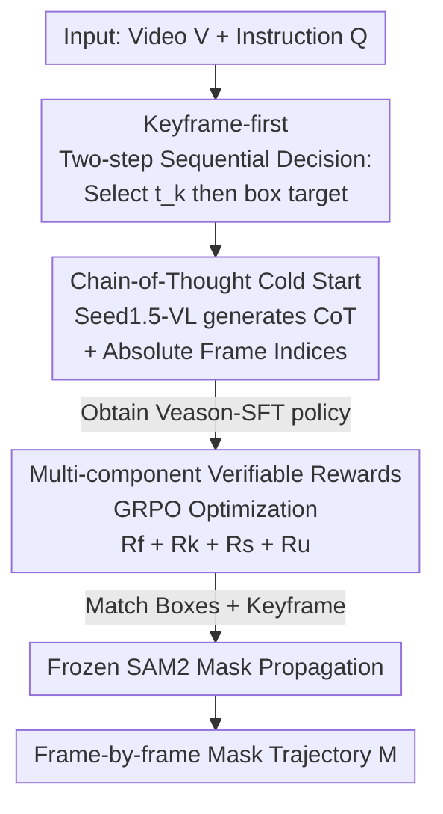

# Reinforcing Video Object Segmentation to Think before it Segments

**Conference**: CVPR 2026  
**Paper**: [CVF Open Access](https://openaccess.thecvf.com/content/CVPR2026/html/Gong_Reinforcing_Video_Object_Segmentation_to_Think_before_it_Segments_CVPR_2026_paper.html)  
**Code**: None  
**Area**: Video Understanding / Video Object Segmentation / Reinforcement Learning  
**Keywords**: Video Reasoning Segmentation, Keyframe Selection, GRPO, Chain-of-Thought, Verifiable Rewards

## TL;DR
Veason-R1 reformulates "Video Reasoning Segmentation (VRS)" as a two-step sequential decision-making process: "select a keyframe first, then locate the target within that frame." It trains a single policy using Chain-of-Thought (CoT) SFT for cold-starting and GRPO reinforcement learning (with three types of verifiable rewards: temporal, spatial, and consistency). Using only the ReVOS dataset, it achieves SOTA results on ReVOS, ReasonVOS, and MeViS while significantly improving robustness against hallucinations.

## Background & Motivation

**Background**: Video Reasoning Segmentation (VRS) aims to output a frame-by-frame pixel mask trajectory for a target based on a natural language instruction. Unlike Referring Video Object Segmentation (RVOS, where instructions explicitly name the object, e.g., "the person on the skateboard"), VRS instructions are often implicit—e.g., "The person who entered after the door opened and then handed over the key"—requiring world knowledge and sequence-level causal/abductive reasoning. The mainstream approach uses Large Vision-Language Models (LVLMs) to compress video semantics into a special `<SEG>` token, which is then decoded by a segmentation head.

**Limitations of Prior Work**: This "token-centric" route has two major issues. First, packing video-level information into a single `<SEG>` token lacks a structured reasoning trajectory, leading to high semantic ambiguity and fragile behavior in long videos, frequent occlusions, or dynamic scenes, often resulting in masks on the wrong targets. Second, to align this specialized token with image embeddings, these methods typically rely on multi-source large-scale corpus pre-training (MeViS/ReVOS/Ref-COCO/Video-VQA), which is data-intensive yet still struggles with spatio-temporal challenges like motion and occlusion.

**Key Challenge**: Segmentation quality fundamentally depends on "where to locate"—if the keyframe is chosen incorrectly, subsequent grounding will fail regardless of precision. However, token-based schemes couple "frame selection" and "localization" within an uninterpretable token, lacks both explicit keyframe decision-making and verifiable intermediate signals to constrain the reasoning process.

**Key Insight**: The authors note that RL fine-tuning (especially GRPO introduced by DeepSeek-R1) can stimulate structured reasoning in LLMs through "verifiable rewards + group relative advantage," which is also effective for image-level reasoning segmentation. This motivates explicitly decomposing VRS into a sequential decision: "decide the keyframe first, then perform fine-grained grounding," ensuring each step is supervised by verifiable rewards.

**Core Idea**: This paper proposes Veason-R1, a visual reinforcement learning framework that "thinks before it segments." It uses CoT imitation (CoT-SFT) to inject a hierarchical prior of "video-level semantics → frame-level localization" into the policy. This is followed by preference optimization using critic-free GRPO coupled with three types of verifiable rewards—temporal localization, spatial alignment, and cross-frame consistency—to truly couple temporal decision-making with fine-grained visual grounding.

## Method

### Overall Architecture
Given $T$ video frames $V=\{v_t\}_{t=1}^T$ and a reasoning instruction $Q_{txt}$, the goal of VRS is to output a mask sequence $M\in[0,1]^{T\times H\times W}$. Veason-R1 no longer entangles target semantics within a special token; instead, it explicitly decomposes the task into two sequential decisions: (i) the model analyzes $(V,Q_{txt})$ to predict a keyframe index $t_k$, where the target is most prominent; (ii) it performs spatial grounding on $t_k$ to predict a set of boxes $B_{t_k}=\{b_i\}_{i=1}^{N_k}$, where each $b_i=(x_1,y_1,x_2,y_2)$. The final masks are generated by feeding these boxes into a frozen SAM2 for standard propagation. The definition of "Keyframe = the frame where the target is visually most prominent" is shared across both CoT supervision and RL stages.

The training consists of two stages using Qwen2.5-VL as the backbone: **Stage 1 (Veason-SFT)** constructs a CoT corpus for supervised fine-tuning to acquire video-level reasoning and coarse localization capabilities; **Stage 2 (Veason-R1)** utilizes GRPO with verifiable rewards for reinforcement, resulting in tighter spatio-temporal grounding and more coherent reasoning chains.

### Key Designs

**1. Keyframe-first Two-step Sequential Decision: Liberating "where to look first" from the black box**

The performance of token-centric models suffers because the decision of "which frame to locate" is hidden within an uninterpretable vector. Veason-R1 explicitly models VRS as a two-step decision: "select keyframe $t_k$ first, then perform grounding." This decomposition is effective because it breaks down an entangled spatio-temporal problem into two distinct, verifiable sub-problems: "temporal decision (which frame)" and "spatial localization (where in the frame)." Ablation studies show that fixing the keyframe to the "first frame containing the target" drops J&F by 4.7 and 5.5 on referring and reasoning subsets, respectively; conversely, training only keyframe detection without grounding leads to drops of 8.4 and 5.8. This indicates that temporal and spatial modeling must be jointly executed yet explicitly supervised.

**2. Chain-of-Thought Cold Start + Absolute Frame Indexing: Teaching the policy "how to think" before reinforcement**

Directly applying RL to LVLMs is fragile under complex temporal dynamics. Thus, a CoT supervised cold start (Veason-SFT) is performed: using Seed1.5-VL to automatically generate step-by-step reasoning trajectories. For each video, a pseudo-keyframe is randomly selected from the "top-5 mask area frames" (to avoid index overfitting). The model then (i) analyzes the scene, (ii) justifies why this frame represents the target, and (iii) locates the target. Reasoning chains are wrapped in `<think>...</think>`, and final answers are placed in `<answer>...</answer>`. A crucial trick is **Absolute Frame Indexing**: labeling each sampled frame with its global absolute index in the video (e.g., `<0>`, `<7>`, `<23>`) rather than a relative index within a clip (which would always be `<0>...<3>`). Relative indexing induces the model to take shortcuts by collapsing onto fixed indices, whereas absolute indices act as "instance-specific temporal anchors," mitigating positional ambiguity. Ablations show that removing CoT reasoning drops J&F by 12.8/8.5.

**3. Multi-component Verifiable Rewards + GRPO: Shaping reasoning quality with four calculable signals**

Cold starting provides an initialization, but GRPO reinforcement with verifiable rewards tightens spatio-temporal grounding. Each round, $G$ candidate completions are sampled, and raw rewards $r(o_i)$ are converted into relative advantages $A_i$ via group Z-score normalization. The total reward is the sum of four components with coefficients set to 1.0:

$$R_{total}=\alpha_f R_f+\alpha_k R_k+\alpha_s R_s+\alpha_u R_u$$

Each term governs a complementary "axis": $R_f$ is a format compliance reward; $R_k$ is a temporal localization reward, encouraging the selection of the most prominent frame defined as the ratio of the target area at $t_k$ to the maximum area across sampled frames $R_k=C_{t_k}/\max_{t\in S}(C_t)$; $R_s$ is a spatial alignment reward using Hungarian matching on IoU scores $R_s=\frac{1}{\max(N_k,N_k^{gt})}\sum_{(i,j)\in C'}\text{IoU}(b_i,b_j^{gt})$; $R_u$ is a unified consistency reward, which feeds the matched boxes into a frozen SAM2 to generate video-level masks $M$ and computes the average IoU $R_u=\frac{1}{\hat T}\sum_{t\in S}\text{IoU}(m_t,m_t^{gt})$. $R_u$ is the term that truly couples keyframe selection with grounding accuracy by using downstream propagation quality to supervise upstream decisions.

### Loss & Training
SFT stage: Qwen2.5-VL + LoRA (rank=8), using LLaMA-Factory, learning rate $1\times10^{-4}$ with cosine decay, 1 epoch. RL stage: Using VERL, global batch 16, sampling 8 candidates per prompt, 1 epoch, learning rate $1\times10^{-6}$, on 4 A100 GPUs. Training samples are entirely from ReVOS—SFT uses the self-built CoT corpus, and GRPO samples 10,000 prompts.

## Key Experimental Results

### Main Results
Evaluation uses region similarity $\mathcal{J}$, contour accuracy $\mathcal{F}$, and their mean $\mathcal{J}\&\mathcal{F}$ as primary metrics, with a robustness score $\mathcal{R}$ measuring anti-hallucination capabilities.

| Dataset | Metric | Veason-R1-7B | Prev. SOTA | Gain |
|--------|------|------|----------|------|
| ReVOS (Overall) | $\mathcal{J}\&\mathcal{F}$ | 61.3 | 60.0 (VRS-HQ-13B) | +1.3 |
| ReVOS | Robustness $\mathcal{R}$ | 27.0 (28.5 for 3B) | 19.7 (VRS-HQ-7B) | +8.8 (vs 3B) |
| ReasonVOS | $\mathcal{J}\&\mathcal{F}$ | 59.9 | 49.9 (GLUS-7B) | +10.0 |
| MeViS (Zero-shot) | $\mathcal{J}\&\mathcal{F}$ | 52.2 | 51.3 (GLUS-7B) | +0.9 |

Notably, Veason-R1-3B trained only on ReVOS matches the 13B VRS-HQ (59.9 vs 60.0) on ReVOS, while the 7B version outperforms it by 1.3. On MeViS, it achieves zero-shot SOTA, proving that "thinking before segmenting" learns transferable inductive biases.

### Ablation Study
| Configuration | Referring $\mathcal{J}\&\mathcal{F}$ | Reasoning $\mathcal{J}\&\mathcal{F}$ | Note |
|------|------|------|------|
| Ours (Full) | 63.0 | 56.8 | Full model (based on 3B) |
| w/o $R_s$ | 61.0 | 53.9 | No spatial alignment reward; largest drop (−2.0 / −2.9) |
| w/o $R_k$ | 61.6 | 54.9 | No temporal localization reward |
| w/o $R_u$ | 62.4 | 56.1 | No consistency reward (−0.6 / −0.7) |
| Pure GRPO | 60.0 | 54.2 | No CoT-SFT, gap of 3.0 / 2.6 |
| CoT-SFT only | 51.1 | 41.6 | SFT without RL |
| Grounding-only | 58.3 | 51.3 | No frame selection, −4.7 / −5.5 |
| Qwen2.5-VL (base) | 20.9 | 19.5 | Baseline without fine-tuning |

### Key Findings
- **Spatial Alignment Reward $R_s$ is most critical**: Removing it results in the steepest performance decline, indicating that precise intra-frame localization is the cornerstone of segmentation quality.
- **CoT and GRPO are Complementary**: While pure GRPO significantly outperforms CoT-SFT, combining them yields an additional 3.0/2.6 gain, suggesting that structured reasoning chains provide a superior initialization for preference optimization.
- **Explicit Keyframe Selection is Necessary**: Models without explicit frame selection drop significantly (+4.7~5.5), proving that temporal and spatial modeling must be explicitly coupled and supervised.
- **Correlation between Keyframe Prominence and Accuracy**: Pearson R is around 0.55/0.52 for MOSE/OVIS but lower for LV-VIS (0.26), indicating that clutter/motion/occlusion significantly weaken this correlation and justify the design of multi-component rewards.

## Highlights & Insights
- **Promoting "which frame to look at" to a first-class explicit decision**: Unlike traditional methods where the `<SEG>` token acts as an implicit black box, this work makes keyframe selection an independent, supervised, and rewarded step. This enhances interpretability (via `<think>` trajectories) and allows for specific correction of temporal errors.
- **The Unified Consistency Reward $R_u$ is a stroke of genius**: Using a frozen SAM2 to propagate predicted boxes and then calculating IoU effectively uses downstream segmentation quality to supervise upstream "keyframe + box" decisions. This couples the two-step decision process into a single rewardable signal.
- **Surprising Data Efficiency**: Achieving SOTA using only the ReVOS dataset while outperforming 13B models trained on multi-source data suggests that "verifiable reasoning" is more robust and efficient than simple "token-data scaling."
- **Practical Utility of Absolute Frame Indexing**: Replacing relative clip-level indexing with global absolute numbering prevents "shortcut learning" where models collapse onto fixed indices. This is a low-cost trick applicable to any video temporal localization task.

## Limitations & Future Work
- **Dependency on pseudo-CoT and external signals**: CoT trajectories are generated by Seed1.5-VL, and masks depend on frozen SAM2 propagation, making these potential sources of error and performance ceilings.
- **Sequential Error Propagation**: Errors in keyframe selection propagate downward to grounding and mask generation without an end-to-end correction loop.
- **Single Keyframe Assumption**: The method assumes a target is most prominent in a single frame, which may not hold for instructions requiring complex multi-frame joint positioning. Future work will explore end-to-end mask-level rewards, streaming/low-latency policies, and evaluations on long-form, open-world videos.

## Related Work & Insights
- **vs VRS-HQ / VISA / VideoLISA (Token-centric VRS)**: These models entangle semantics in specialized tokens, requiring large-scale data and offering low interpretability. Veason-R1 uses explicit "select → locate" sequences and verifiable rewards to exceed their performance with less data.
- **vs Omni-R1 (GRPO for VRS)**: Omni-R1 utilizes a dual-system cascade with multi-source training. Veason-R1 employs a single end-to-end policy on a single dataset, achieving higher overall $\mathcal{J}\&\mathcal{F}$.
- **vs Seg-Zero / VisionReasoner (Image RL Segmentation)**: While they design task-alignment rewards for images, Veason-R1 extends this to the temporal dimension with rewards $R_k$ and $R_u$.

## Rating
- Novelty: ⭐⭐⭐⭐⭐ First framework to combine GRPO with structured SFT for joint keyframe selection and grounding in VRS.
- Experimental Thoroughness: ⭐⭐⭐⭐⭐ Comprehensive results across three benchmarks, detailed ablations of rewards/training/indexing, and correlation analysis.
- Writing Quality: ⭐⭐⭐⭐ Clear reward definitions and logical progression, despite minor figure-numbering inconsistencies.
- Value: ⭐⭐⭐⭐⭐ Matches 13B models with single-dataset training, shows strong zero-shot generalization, and offers a transferable verifiable reward paradigm for video tasks.

<!-- RELATED:START -->

## Related Papers

- [\[CVPR 2026\] InterRVOS: Interaction-Aware Referring Video Object Segmentation](interrvos_interaction-aware_referring_video_object_segmentation.md)
- [\[CVPR 2026\] Efficient Video Object Segmentation and Tracking with Recurrent Dynamic Submodel](efficient_video_object_segmentation_and_tracking_with_recurrent_dynamic_submodel.md)
- [\[CVPR 2026\] SAMIX: Reinforcing SAM2 with Semantic Adapter and Reference Selecting Policy for Mix-Supervised Segmentation](samix_reinforcing_sam2_with_semantic_adapter_and_reference_selecting_policy_for_.md)
- [\[CVPR 2026\] Long-RVOS: A Comprehensive Benchmark for Long-term Referring Video Object Segmentation](long-rvos_a_comprehensive_benchmark_for_long-term_referring_video_object_segment.md)
- [\[CVPR 2026\] DeRVOS: Decoupling Consistent Trajectory Generation and Multimodal Understanding for Referring Video Object Segmentation](dervos_decoupling_consistent_trajectory_generation_and_multimodal_understanding_.md)

<!-- RELATED:END -->
