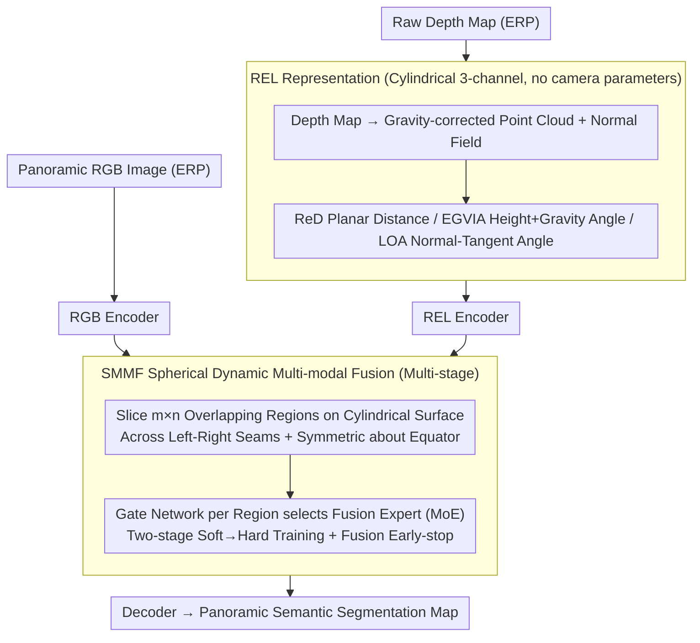

# REL-SF4PASS: Panoramic Semantic Segmentation with REL Depth Representation and Spherical Fusion

**Conference**: CVPR 2026  
**arXiv**: [2601.16788](https://arxiv.org/abs/2601.16788)  
**Code**: None  
**Area**: Semantic Segmentation  
**Keywords**: Panoramic Semantic Segmentation, Depth Representation, Multi-modal Fusion, Cylindrical Coordinates, RGB-D

## TL;DR

Proposes REL depth representation (a three-channel Rectified Depth + EGVIA + LOA based on cylindrical coordinates) and Spherical Dynamic Multi-modal Fusion (SMMF) for panoramic semantic segmentation. It achieves a 63.06% mean mIoU on Stanford2D3D (a 2.35% improvement over the HHA baseline) and reduces performance variance by approximately 70% under 3D perturbations.

## Background & Motivation

**Background**: Panoramic Semantic Segmentation (PASS) aims to achieve complete scene perception based on a $360^{\circ} \times 180^{\circ}$ ultra-wide field of view, widely applied in autonomous driving, AR/VR, and other fields. Mainstream methods use Equirectangular Projection (ERP) to convert spherical data into 2D images for processing.

**Limitations of Prior Work**: The widely used HHA representation in RGB-D methods has two critical flaws: (a) the second degree of freedom for the normal direction (lateral azimuth) is missing, leading to incomplete information; (b) HHA calculation depends on camera pose and intrinsic parameters (such as focal length), making it inconvenient for processing pure image data.

**Key Challenge**: Panoramic images are based on ERP projection, where distortion and local feature differences vary significantly across different regions. However, existing multi-modal fusion strategies treat all regions identically, lack region-adaptive capabilities. Meanwhile, cylindrical unfolding disrupts the continuity of scene structures.

**Goal**: Design a more complete panoramic depth representation scheme and achieve region-adaptive multi-modal fusion to improve the accuracy and robustness of semantic segmentation in panoramic scenes.

**Key Insight**: Utilize the cylindrical geometry inherently used by ERP projection to design a three-channel representation, REL, based on cylindrical coordinates. Achieve region-level adaptive fusion with spherical awareness by sampling overlapping regions on the cylindrical surface.

**Core Idea**: Represent 3D position and normal direction completely using cylindrical coordinates $\rho\theta z$ (REL), and implement different fusion strategies for different regions via Spherical Dynamic MoE Fusion (SMMF).

## Method

### Overall Architecture

REL-SF4PASS addresses two pain points in panoramic ($360^{\circ} \times 180^{\circ}$) RGB-D segmentation: "incomplete depth representation" and "region-agnostic fusion," corresponding to two core designs: REL representation and SMMF fusion. It employs a dual-branch structure: parallel encoding for RGB and REL depth branches. The front end first converts the raw depth map into a three-channel REL representation in cylindrical coordinates. During the encoding process, SMMF fusion units are inserted at multiple stages, allowing each spatial region to independently decide whether and how to fuse. Finally, the decoder outputs the semantic segmentation map.

### Key Designs

**1. REL Representation: Recovering the Dimension Lost by HHA Using Cylindrical Coordinates**

Panoramic images are expanded using Equirectangular Projection (ERP). Applying the HHA representation from planar RGB-D has two major drawbacks: the normal direction lacks the second degree of freedom (lateral azimuth), and HHA depends on camera pose and focal length for calculation. REL reconstructs depth directly following the cylindrical geometry $\rho\theta z$ inherent to ERP. Each of the three channels serves a purpose: Rectified Depth (ReD) takes the planar distance $\rho = d\cos\varphi$, removing interference from the height direction; EGVIA leverages a statistical observation—the normalized height $H$ and the normal-gravity angle $A$ are highly linearly correlated in panoramic images, thus it fuses both using $\lambda A + (1-\lambda)H$ for horizontal regions and uses only $A$ for vertical regions; LOA takes the angle between the normal and the tangent $\hat{T}$, exactly filling the second degree of freedom for the normal missing in HHA. The entire representation requires only the raw depth map and does not depend on any camera intrinsic or extrinsic parameters, making it device-agnostic and more stable under 3D perturbations.

**2. SMMF: Allowing Each Region to Decide How to Fuse**

After ERP expansion, distortion varies significantly across different regions. Applying a uniform RGB-depth fusion method to all positions is unreasonable. Instead of slicing regions on the original map, SMMF directly samples $m \times n$ overlapping regions on the cylindrical surface—allowing regions to cross the left-right seams horizontally and expanding symmetrically from the equator ($\varphi=0^{\circ}$) vertically, thereby mitigating the fragmentation of scene structure caused by cylindrical unfolding. Each region is equipped with a Gate Network, using an MoE architecture to independently select one of $B$ expert fusion operations, which includes a "No fusion, RGB only" option (since pure depth performs poorly for segmentation alone, depth is not used independently). Training follows the two-stage soft-hard scheduling of DynMM: a "soft" stage where experts participate with soft probabilities, followed by a "hard" stage that forces a one-hot selection of a single expert, balancing training stability with clear inference choices. On top of this, a "fusion early-stop" constraint is added—if a fusion unit at a certain level selects "No fusion," all subsequent fusion units are forced to skip fusion, avoiding redundant calculations in regions where depth information is not needed.

### Loss & Training

Standard semantic segmentation cross-entropy loss is used, combined with the two-stage scheduling of SMMF: during the soft training phase, all expert probabilities are non-zero for collective learning; during the hard training phase, probabilities converge to one-hot, fixing the fusion expert for each region.

## Key Experimental Results

### Main Results (Stanford2D3D Panoramic Dataset)

| Method | Modality | 3-fold Mean mIoU | Fold1 mIoU |
|---|---|---|---|
| Trans4PASS+ (2024) | RGB | 53.7% | 53.6% |
| SGTA4PASS (2023) | RGB | 55.3% | 56.4% |
| Twin (2025) | RGB | 55.85% | - |
| SFSS (2024) | RGB-HHA | 60.60% | - |
| CMX* (Reproduced) | RGB-HHA | 60.71% | 63.98% |
| **REL-SF4PASS (Ours)** | **RGB-REL** | **63.06%** | **67.37%** |

### 3D Perturbation Robustness (SGA Verification, 16 Rotation Combinations)

| Representation | Mean mIoU Range | Performance Variance |
|---|---|---|
| HHA + SMMF | 59.13~65.85% | High Variance |
| REL + SMMF (Ours) | 63.39~67.37% | **Variance Reduced by ~70%** |

### Key Findings

- REL outperforms HHA under all 16 3D perturbation configurations, verifying the robustness of cylindrical coordinate representation to rotation.
- SMMF region-level fusion is more effective than uniform fusion; regions near the equator are semantically richer and require more sophisticated fusion.
- REL does not depend on camera parameters, making it easier to generalize across different acquisition devices.
- RGB-REL reaches 63.06% mean mIoU, surpassing all known methods, including RGB-HHA.

## Highlights & Insights

- **Natural Adaptation to Cylindrical Coordinates**: Panoramic images are generated from cylindrical projections; using cylindrical coordinates to represent depth information is geometrically self-consistent.
- **Discovery of Plane-Normal Relationships**: The statistical discovery that $H$ and $A$ are highly correlated in panoramic images is the key insight for designing EGVIA.
- **Parameter-Free**: REL can be calculated using only the depth map, greatly simplifying the data processing pipeline.
- **70% Variance Reduction**: The improvement in robustness against 3D perturbations holds significant practical engineering value.

## Limitations & Future Work

- Validated only on the single Stanford2D3D dataset; lacks evaluation in outdoor scenes.
- The number of regions $m \times n$ in SMMF requires manual setting; adaptive determination might be superior.
- Not yet combined with the latest DINOv2 or large-scale pre-trained backbones.
- Whether the information gain of the LOA channel is stable in near-vertical surface scenes requires further analysis.

## Related Work & Insights

- **HHA Representation** is a classic design for RGB-D segmentation (Gupta et al.); REL serves as a direct upgrade and replacement.
- Cross-modal feature rectification and fusion modules proposed by **CMX** are the design inspirations for SMMF.
- The sample-adaptive fusion of **DynMM** is extended by SMMF to the region level, providing finer granularity.

## Rating

- Novelty: ⭐⭐⭐⭐ (REL representation is rigorously designed with a natural cylindrical coordinate approach)
- Experimental Thoroughness: ⭐⭐⭐ (Single dataset, but detailed robustness analysis)
- Writing Quality: ⭐⭐⭐⭐ (Clear mathematical derivation and sufficient explanation of physical meaning)
- Value: ⭐⭐⭐⭐ (Practical contribution to the field of panoramic segmentation, directly replaceable for HHA)

<!-- RELATED:START -->

## Related Papers

- [\[CVPR 2026\] Unified Spherical Frontend: Learning Rotation-Equivariant Representations of Spherical Images from Any Camera](unified_spherical_frontend_learning_rotation-equivariant_representations_of_sphe.md)
- [\[CVPR 2026\] Seeing Beyond: Extrapolative Domain Adaptive Panoramic Segmentation](seeing_beyond_extrapolative_domain_adaptive_panoramic_segmentation.md)
- [\[CVPR 2026\] Denoise and Align: Towards Source-Free UDA for Robust Panoramic Semantic Segmentation](denoise_and_align_towards_source-free_uda_for_robust_panoramic_semantic_segmenta.md)
- [\[CVPR 2026\] GeomPrompt: Geometric Prompt Learning for RGB-D Semantic Segmentation Under Missing and Degraded Depth](geomprompt_rgbd_segmentation.md)
- [\[CVPR 2026\] GeoSURGE: Geo-localization using Semantic Fusion with Hierarchy of Geographic Embeddings](geosurge_geo-localization_using_semantic_fusion_with_hierarchy_of_geographic_emb.md)

<!-- RELATED:END -->
