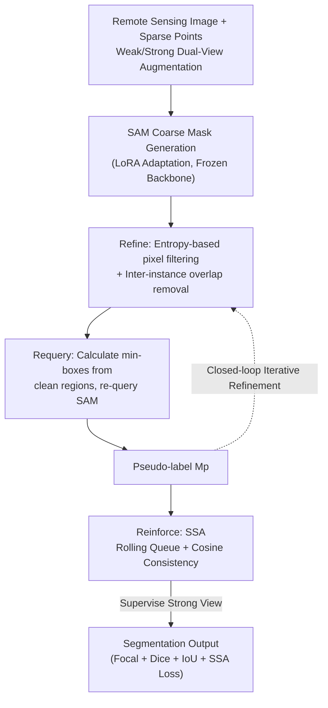

# ReSAM: Refine, Requery, and Reinforce: Self-Prompting Point-Supervised Segmentation for Remote Sensing Images

**Conference**: CVPR 2026  
**Paper**: [CVF Open Access](https://openaccess.thecvf.com/content/CVPR2026/html/Subhani_ReSAM_Refine_Requery_and_Reinforce_Self-Prompting_Point_Supervised_Segmentation_for_Remote_CVPR_2026_paper.html)  
**Code**: https://github.com/MNaseerSubhani/ReSAM.git  
**Area**: Remote Sensing Segmentation / Weakly Supervised Learning  
**Keywords**: Point-Supervised Segmentation, SAM Adaptation, Self-Prompting, Remote Sensing Images, Semantic Alignment

## TL;DR
ReSAM converts sparse clicks for each instance into coarse masks through Segment Anything Model (SAM), which are then back-projected into compact boxes serving as "self-prompts" to requery SAM. By employing a lightweight rolling queue for cross-augmentation semantic alignment, ReSAM approaches full-mask supervision performance (reducing gaps to 1.3% / 4.9% / 8.5%) across three remote sensing datasets using only 1-point labels, while saving 84% VRAM compared to prototype-based alignment methods.

## Background & Motivation

**Background**: Instance segmentation in high-resolution remote sensing images (RSI) is critical for agriculture, urban planning, and environmental monitoring. However, a single 10k×10k satellite image may contain thousands of fine-grained objects, making pixel-wise annotation extremely costly. Foundation models like SAM exhibit impressive zero-shot capabilities on natural images. Consequently, a mainstream approach adapts SAM to remote sensing: ROS-SAM uses LoRA fine-tuning with multi-scale/boundary enhancement, and RS-Prompter learns to generate prompt embeddings for remote sensing categories—yet these still rely on **full supervision** with dense pixel labels.

**Limitations of Prior Work**: Point-level supervision is used to save annotation costs, but point labels are inherently incomplete—they lack information regarding object contours and spatial extent. Worse, SAM's mask decoder exhibits **semantic ambiguity** when given only clicks: in dense scenes, one point may cause multiple adjacent objects to merge into a single mask. Since SAM predicts masks independently for each prompt without mutual awareness, it generates **overlapping or fragmented** masks in cluttered remote sensing scenes—the "overlap region" shown in paper Fig. 2 does not correspond to a real object but represents mask leakage. SAM's predictions may be locally accurate but are globally inconsistent.

**Key Challenge**: Existing point-supervised methods (like PointSAM) rely on **prototype banks** for feature alignment to correct noisy pseudo-labels. While effective, prototype banks are memory-intensive and difficult to scale—they generate prototypes from a fixed number of samples, assuming this sampling is representative of the feature distribution, an assumption that fails on large-scale or heterogeneous datasets. This creates a hard trade-off between "alignment quality" and "memory/scalability."

**Goal**: Under the premise of **only sparse point annotations**, (1) convert unreliable point supervision into structured, non-overlapping regional cues; (2) suppress error accumulation from pseudo-label noise without relying on massive prototype banks.

**Key Insight**: Point annotations are weak, but SAM demonstrates significantly higher quality when receiving box prompts. Could the model **itself** transform points into coarse masks, derive boxes from those masks, and "re-query" SAM using those boxes? Simultaneously, a rolling queue storing only recent embeddings could replace heavy prototype banks for consistency regularization.

**Core Idea**: A closed-loop **Refine–Requery–Reinforce (R³)** framework—Point → Refined non-overlapping mask (Refine) → Self-constructed box prompt to re-query SAM (Requery) → Soft semantic alignment to stabilize embeddings (Reinforce). This utilizes self-prompting instead of dense labels to progressively improve SAM's segmentation quality and domain robustness.

## Method

### Overall Architecture

ReSAM operates within a "weak-strong dual-view" self-training framework: each training image is augmented twice. The weak view $I_w$ (simple operations like horizontal flips) generates pseudo-masks, while the strong view $I_s$ (strong perturbations like color/brightness/contrast/shadows) undergoes supervision. The goal is consistency between the two: $\phi_m(\phi_i(I_w),\phi_p(p^*)) \approx \phi_m(\phi_i(I_s),\phi_p(p))$. The image encoder, prompt encoder, and mask decoder of SAM are **shared and frozen** across three stages, with LoRA (rank 4) inserted only into the image encoder's query/key/value projections to learn domain-specific attention.

The entire pipeline is a closed loop: given a weak view and sparse positive points $P^+=\{p_i\}$, SAM generates coarse masks → **Refine** uses entropy maps to filter confident pixels and remove inter-instance overlaps, yielding clean instance regions; **Requery** calculates the minimum bounding box for each clean region, using them as new prompts to re-query SAM for more accurate pseudo-labels $M_p$; **Reinforce** uses Soft Semantic Alignment (SSA) during training to pull the instance embeddings of weak/strong views closer, suppressing error drift. Finally, $M_p$ serves as the pseudo-ground truth to supervise the strong view.

### Key Designs

**1. Refine: Purifying Coarse Masks into Non-conflicting Instance Regions via Entropy Confidence and Overlap Suppression**

SAM's point-generated masks often leak or merge adjacent objects. Refine addresses this in two steps. First is **per-instance confidence filtering**: for the probability map $\hat{M}^{(k)}_{ij}$ of each instance $k$, Shannon entropy $H^{(k)}_{ij}=-[\hat{M}^{(k)}_{ij}\log\hat{M}^{(k)}_{ij}+(1-\hat{M}^{(k)}_{ij})\log(1-\hat{M}^{(k)}_{ij})]$ is calculated and normalized to $[0,1]$. Low entropy indicates high confidence. Only pixels with both high probability and low entropy are kept: $C^{(k)}_{ij}=1$ iff $\hat{M}^{(k)}_{ij}(1-H^{(k)}_{ij})>\epsilon$ (where $\epsilon=0.2$).

Second is **explicit overlap removal**: an overlap map $O_{ij}=1$ is calculated when $\sum_{k}C^{(k)}_{ij}>1$. Overlapping regions are removed from each instance, yielding refined masks $M^{\text{ref},(k)}_{ij}=C^{(k)}_{ij}(1-O_{ij})$. This ensures each pixel belongs to at most one instance, preventing cross-object leakage. This is effective because it avoids "guessing" boundaries and instead discards pixels that SAM is uncertain about (high entropy) or contradictory (claimed by multiple instances).

**2. Requery: "Self-Requerying" to Upgrade Point Supervision to Box Supervision**

SAM's mask quality is significantly better with box prompts than point prompts, yet boxes are not provided in point-supervised settings. Requery allows the model to **generate its own boxes**: for each refined region $M^{\text{ref},(k)}$, the minimum bounding box $B=\text{Box}(M^{\text{ref},(k)})$ is extracted to form a new prompt $P_B=\{B\}$. SAM is re-queried under the weak view to obtain $M_p=\Phi_m(\Phi_i(I_w),\Phi_p(P_B))$. This converts "uncertain point supervision" into "structured regional queries," producing more precise masks as pseudo-ground truths. The clean masks from the Refine stage ensure the derived boxes are compact and free of leakage, which in turn guides SAM to produce continuous, boundary-adhering masks.

**3. Reinforce (SSA): Stabilizing Pseudo-labels with Rolling Queues + Soft Cosine Alignment**

Despite improved spatial precision from re-querying, self-training is susceptible to **confirmation bias**, where early noise amplifies through the embedding-to-mask path. While PointSAM uses prototype banks to mitigate noise, SSA provides a lightweight alternative by normalizing L2 instance embeddings $s_i, h_i$ from the weak/strong views ($\hat{s}_i=s_i/\|s_i\|$, $\hat{h}_i=h_i/\|h_i\|$) and pushing them into FIFO queues $\mathcal{Q}_s, \mathcal{Q}_h$ of length $q$ (standard $q=128$). The loss encourages the cosine similarity of corresponding embeddings to approach 1:

$$\mathcal{L}_{\text{SSAL}}=\frac{1}{q}\sum_{i=1}^{q}\big(1-\hat{s}_i^\top\hat{h}_i\big)$$

Unlike contrastive learning, this requires **no negative samples or margins**. It provides a "soft" semantic guidance signal, regularizing the representation manifold and reducing gradient variance. This saves memory (84% less VRAM on WHU vs. PointSAM) while maintaining instance-aware alignment by leveraging the invariance between dual views.

### Loss & Training

The total loss combines segmentation quality and semantic stability: $\mathcal{L}_{\text{total}}=\mathcal{L}_{\text{focal}}+\mathcal{L}_{\text{dice}}+\mathcal{L}_{\text{iou}}+\beta\,\mathcal{L}_{\text{SSAL}}$, where $\beta=0.1$. The backbone uses SAM(ViT-B) and SAM2(Hiera-B+). LoRA rank is 4, updating only A/B low-rank matrices. Optimization uses Adam (lr $5\times10^{-4}$, weight decay $1\times10^{-4}$), batch size 1, on A100 80GB with an EMA strategy for parameter updates. Sparse positive/negative points (1/2/3) are sampled, with **no** full masks or boxes provided during training.

## Key Experimental Results

### Main Results

Comparison on NWPU VHR-10, WHU, and HRSID-Inshore benchmarks against Direct test (Vanilla SAM), Self-Training, DePT, Tribe, WeSAM, and PointSAM. Results for the 1-point / SAM-based setting (mIoU / F1):

| Dataset | Direct SAM | PointSAM (Prev. SOTA) | ReSAM (Ours) | Full Superv. Upper Bound | Gap to Upper Bound |
|--------|-----------|---------------------|---------------|-----------|-----------|
| WHU | 61.03 / 70.69 | 72.63 / 80.39 | **75.86 / 83.80** | 77.15 / 84.55 | 1.3% IoU |
| HRSID-Inshore | 46.56 / 56.06 | 56.06 / 68.38 | **58.40 / 70.11** | 63.29 / 75.32 | 4.9% IoU |
| NWPU VHR-10 | 58.06 / 68.80 | 66.66 / 76.03 | **70.25 / 79.80** | 78.73 / 86.74 | 8.5% IoU |

On NWPU, ReSAM achieves up to +3.5 IoU / +3.7 F1 gain over PointSAM. Performance increases monotonically from 1 to 3 points, pressing the gap to full supervision within 9 IoU points. ReSAM achieves the best performance across almost all settings on WHU.

### Ablation Study

WHU, 1-point, component breakdown ($\Delta$ relative to Vanilla SAM mIoU):

| Configuration | mIoU | $\Delta$ | Description |
|------|------|---------|------|
| Baseline (Direct SAM) | 61.0 | – | Vanilla SAM point prompts |
| Self-Training only | 64.9 | +3.9 | Basic teacher-student self-training |
| ReSAM w/o Requery | 69.4 | +8.4 | Removing self-generated box requery |
| ReSAM w/o SSA | 71.1 | +10.1 | Removing soft semantic alignment |
| Full ReSAM (R³) | **75.8** | **+14.8** | Complete model |

### Key Findings
- **Requery is the largest contributor**: The jump from Self-Training (64.9) to the full model (75.8) minus the impact of removing Requery (69.4) shows that self-generated box prompting provides a larger boost than basic self-training by resolving uncertain regions and boundary conflicts.
- **SSA Provides Complementary Stability**: SSA improves performance from 71.1 to 75.8 (~+4.7). Without SSA, mIoU in NWPU peaks early but drops to ~65% later due to noisy labels; SSA smooths this degradation and maintains an upward trend.
- **Significant VRAM Advantage**: ReSAM saves 84% training VRAM compared to PointSAM on WHU by replacing prototype banks with rolling queues.
- **Diminishing Returns with More Points**: 1 point is already sufficient to approach upper bounds, highlighting the value of "cheap annotation."

## Highlights & Insights
- **Self-Prompting Loop**: The core insight is that SAM performs better under box prompts than point prompts, and high-quality boxes can be derived for free from purified masks—correcting the model's weak patterns using its own strong patterns without extra annotation.
- **Dual Confidence Filtering**: Using entropy and probability via $\hat{M}(1-H)>\epsilon$ combined with explicit overlap removal provides a parameter-free, interpretable way to handle instance leakage.
- **Lightweight Alignment**: Using a FIFO queue + cosine loss without negative samples extracts the essence of cross-view consistency from contrastive learning while saving 84% VRAM, offering significant scalability for large-scale remote sensing data.

## Limitations & Future Work
- **Dense Scene Noise**: The authors admit noisy pseudo-labels still hinder performance in highly dense images; the 2-point setting on HRSID only matches PointSAM, indicating that dense, cluttered small objects remain a challenge.
- **Two-Stage Overhead**: The Refine-to-Requery process requires two forward passes (generating coarse masks and re-querying), resulting in higher training/inference costs compared to single-stage methods.
- **Stability of SAM2**: The performance of the SAM2 backbone is inconsistent, occasionally being outperformed by the original SAM in specific settings (e.g., WHU 3-point), which lacks a clear explanation in the text.

## Related Work & Insights
- **vs. PointSAM**: ReSAM replaces prototype-based error correction with "self-generated box requerying" and SSA rolling queues, yielding higher performance in most settings while saving 84% VRAM.
- **vs. WeSAM / DePT / Tribe**: These methods utilize prompt guidance without explicit overlap suppression or cross-view embedding alignment. ReSAM leads across three benchmarks primarily due to its leakage-removal refinement and SSA stability.
- **vs. ROS-SAM / RS-Prompter (Full Supervision)**: While fully supervised methods are more accurate, they require dense pixel labels. ReSAM proves that point-level self-prompting is a scalable and cost-effective adaptation route.

## Rating
- Novelty: ⭐⭐⭐⭐ The "Refine -> Back-project Box -> Requery" loop is a clever, closed-loop approach, and the use of rolling queues for alignment solves real VRAM/scalability issues.
- Experimental Thoroughness: ⭐⭐⭐⭐ Solid results across three datasets and two backbones, with clear ablation studies. Systematic analysis of multi-class semantic or negative sample scenarios is less emphasized.
- Writing Quality: ⭐⭐⭐⭐ Clear motivation and framework descriptions.
- Value: ⭐⭐⭐⭐ High practical value for large-scale remote sensing annotation; the "self-prompting correction" paradigm is transferable to other foundation models.

<!-- RELATED:START -->

## Related Papers

- [\[AAAI 2026\] S5: Scalable Semi-Supervised Semantic Segmentation in Remote Sensing](../../AAAI2026/segmentation/s5_scalable_semi-supervised_semantic_segmentation_in_remote_sensing.md)
- [\[CVPR 2026\] F2Net: A Frequency-Fused Network for Ultra-High Resolution Remote Sensing Segmentation](f2net_a_frequency-fused_network_for_ultra-high_resolution_remote_sensing_segment.md)
- [\[CVPR 2026\] RDNet: Region Proportion-Aware Dynamic Adaptive Salient Object Detection Network in Optical Remote Sensing Images](rdnet_region_proportion-aware_dynamic_adaptive_salient_object_detection_network_.md)
- [\[CVPR 2026\] SGMA: Semantic-Guided Modality-Aware Segmentation for Remote Sensing with Incomplete Multimodal Data](sgma_semantic-guided_modality-aware_segmentation_for_remote_sensing_with_incompl.md)
- [\[CVPR 2026\] Test-Time Multi-Prompt Adaptation for Open-Vocabulary Remote Sensing Image Segmentation](test-time_multi-prompt_adaptation_for_open-vocabulary_remote_sensing_image_segme.md)

<!-- RELATED:END -->
