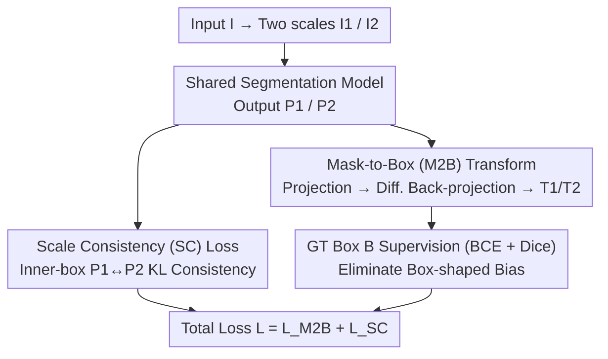

# Rethinking Box Supervision: Bias-Free Weakly Supervised Medical Segmentation

**Conference**: CVPR 2026  
**Paper**: [CVF Open Access](https://openaccess.thecvf.com/content/CVPR2026/html/Wei_Rethinking_Box_Supervision_Bias-Free_Weakly_Supervised_Medical_Segmentation_CVPR_2026_paper.html)  
**Code**: To be confirmed  
**Area**: Semantic Segmentation / Weakly Supervised Learning / Medical Imaging  
**Keywords**: Weakly supervised segmentation, box supervision, medical imaging, differentiable transformation, scale consistency

## TL;DR
Addressing the "box-shaped bias" where box supervision causes predictions to tend toward rectangles, the authors propose the WeakMed framework. It uses a differentiable Mask-to-Box (M2B) transformation to project predicted masks onto box-aligned representations to eliminate shape bias, and a Scale Consistency (SC) loss to compensate for fine-grained information lost by M2B. Both components are only enabled during training, require no architectural changes, and incur zero inference overhead. WeakMed significantly outperforms existing weakly supervised methods across 9 tasks, 9 datasets, and 6 modalities, approaching full supervision performance.

## Background & Motivation
**Background**: Mainstream medical image segmentation still relies on full supervision, ranging from U-Net variants (UNet++, nnU-Net, SANet) to CNN-Transformer hybrids or pure Transformer architectures (TransFuse, MedT). These require dense pixel-level annotations. To reduce costs, weakly supervised learning using sparse signals like scribbles, points, or bounding boxes has emerged. **Bounding boxes** are particularly attractive as they are inexpensive to annotate and can leverage large-scale detection data.

**Limitations of Prior Work**: ① Pixel-level annotation is expensive and subjective—blurred lesion boundaries and similarity to surrounding tissues lead to noisy labels and impaired generalization. ② Although cheap, bounding boxes **inherently lack shape information and introduce structural bias**, often causing over-rectangular predictions. ③ Existing box-supervised methods (BoxInst, DiscoBox, BoxLevelSet) still suffer from the coarseness of boxes, leading to sub-optimal boundary localization. ④ Medical-specific box-supervised methods (e.g., BoxPolyp, WeakPolyp) mostly rely on heuristic pseudo-label generation and iterative refinement, which are prone to error accumulation, training instability, and are often task-specific (e.g., polyps only) without supporting multi-object scenarios.

**Key Challenge**: Bounding boxes provide reliable **spatial localization** constraints but simultaneously impose incorrect **shape priors** (box-shaped bias). The fundamental problem is how to "keep the localization while removing the box shape," decoupling localization constraints from shape learning.

**Goal**: To build a universal, plug-and-play, architecture-agnostic box-supervised framework that eliminates box-shaped bias, compensates for the under-constrained nature of box supervision, and naturally supports multi-object and cross-modal generalization.

**Key Insight**: Rather than "forcing" the prediction to fit the box using non-differentiable tight-box extraction or heuristic pseudo-labels, the box constraint is reformulated as a **differentiable projection operation**. The model is only required to be consistent with the box after being projected into a "box-aligned space," rather than directly forcing the prediction to be rectangular. Information lost in the projection is then recovered via consistency regularization.

**Core Idea**: Use a differentiable **Mask-to-Box transformation** for "shape-free, space-preserving" box-aligned supervision (debiasing), combined with a **Scale Consistency loss** for cross-scale pixel-level regularization (resolving ambiguity). These two complementary components allow box-only supervision to approach full supervision performance.

## Method

### Overall Architecture
WeakMed consists of two stages: "Segmentation + Supervision." In the segmentation stage, a standard backbone (PVTv2-B2) extracts multi-scale features and fuses them for prediction; **this part remains unchanged**. The core lies in the supervision stage: given an input image $I$, two scaled versions $I_1, I_2$ are generated and fed into the same segmentation model to obtain predictions $P_1, P_2$ (then unified to the same resolution). An M2B transformation is applied to each prediction to obtain box-aligned representations $T_1, T_2$, which are supervised by the ground-truth box $B$ (eliminating box bias). Since M2B is a many-to-one mapping causing under-constraints, an SC loss constrains $P_1$ and $P_2$ to be consistent within the box, providing complementary pixel-level regularization. Both components are used only during training and discarded at inference, ensuring zero extra cost and seamless integration.

### Key Designs

**1. Mask-to-Box (M2B) Differentiable Transformation: Eliminating Box-shaped Bias via Projection**

Directly supervising prediction masks with GT boxes forces rectangular outputs. Traditional tight-box extraction relies on non-differentiable geometric operations sensitive to fragmented or noisy predictions. M2B instead supervises the **box-aligned representation** $T$ through a differentiable three-step process: ① **Projection**: Given prediction $P\in[0,1]^{H\times W}$ and box $[x,y,w,h]$, the local region $P'$ is cropped. **Max pooling** is performed along horizontal and vertical axes to obtain two 1D descriptors $P_w=\max(P',\dim{=}0)$ and $P_h=\max(P',\dim{=}1)$, which encode row/column occupancy while discarding fine-grained shape. ② **Back-projection**: The descriptors are expanded back to 2D: $\hat{P}_w = \mathbf{1}_h\cdot P_w$ (column expansion) and $\hat{P}_h = P_h\cdot\mathbf{1}_w^\top$ (row expansion). Their intersection $T' = \min(\hat{P}_w,\hat{P}_h)$ recovers a box-aligned support region, which replaces the corresponding area in $P$ to form $T$. This is applied independently for multi-object scenarios. ③ **Supervision**: Since $T$ and the box mask $B$ reside in the same "box-aligned space," BCE + Dice supervision reduces the mismatch between dense predictions and coarse boxes: $L_{M2B}=0.5[L_{BCE}(T_1,B)+L_{BCE}(T_2,B)]+0.5[L_{Dice}(T_1,B)+L_{Dice}(T_2,B)]$. Essentially, M2B acts as an operator projecting dense predictions into a "box constraint space"—removing shape ambiguity while retaining spatial support, thus **not forcing** rectangular outputs and allowing flexibility for shape refinement. This distinguishes it from pseudo-labeling methods (no pseudo-mask generation, no iterative refinement, native multi-object support).

**2. Scale Consistency (SC) Loss: Compensating for M2B Under-constraint**

The trade-off for M2B is the loss of fine-grained information during projection—**multiple different predictions can map to the same box-aligned representation** (many-to-one), leading to ambiguity. The SC loss provides complementary pixel-level regularization: by feeding two scales of the same image to get $P_1, P_2$, consistency is enforced **within the box region $\Omega_B$** using symmetric KL divergence:

$$L_{SC} = \sum_{(i,j)\in\Omega_B}\frac{KL(P_1^{i,j}\,\|\,P_2^{i,j}) + KL(P_2^{i,j}\,\|\,P_1^{i,j})}{2|\Omega_B|}$$

Unlike standard consistency regularization, SC is **specifically designed to compensate for M2B information loss**. Without additional labels, it uses the self-supervised constraint that predictions of the same object across scales should be consistent to tighten the ambiguity space left by M2B. Total loss is computed as $L_{Total}=L_{M2B}+L_{SC}$ ($\lambda_{M2B}=\lambda_{SC}=1$). Ablations show SC is almost ineffective alone (as box supervision remains under-constrained), but yields a +2.7% Dice gain when combined with M2B, confirming their complementary relationship.

### Loss & Training
Ground-truth boxes are generated from segmentation masks; **masks are not used during training**. Implemented in PyTorch on a single V100; SGD (momentum 0.9, weight decay $1\times10^{-4}$), initial lr 0.01, batch 16, 16 epochs with lr multiplied by 0.5 every 3 epochs. During inference, probability maps are binarized at a 0.5 threshold. Both losses are training-only.

## Key Experimental Results

### Main Results
Comparison with weakly supervised methods on the SUN-SEG polyp dataset (Dice / IoU, %; BoxSup is the baseline with same architecture but without M2B/SC):

| Method | Supervision | Val Dice | Val IoU | Test Dice | Test IoU |
|------|------|------|------|------|------|
| BoxLevelSet | Box | 72.4 | 63.0 | 72.5 | 63.6 |
| DiscoBox | Box | 75.2 | 65.3 | 72.8 | 63.3 |
| BoxTeacher | Box | 77.3 | 66.9 | 78.1 | 68.2 |
| CDSP | Box | 77.9 | 67.1 | 79.1 | 69.4 |
| BoxSup-pvt (Baseline) | Box | 77.3 | 65.3 | 77.7 | 66.0 |
| **WeakMed-pvt (Ours)** | Box | **85.6** | **78.2** | **85.9** | **79.0** |

Using PVTv2-B2, WeakMed reaches 85.9% Test Dice, +8.2% over BoxSup and +13.4% over BoxLevelSet. It also maintains a lead with the Res2Net-50 backbone (82.4 vs BoxSup 75.2), proving cross-architecture robustness.

Average results across 8 datasets (6 modalities) (Dice / IoU, %):

| Method | Avg Dice | Avg IoU |
|------|------|------|
| BoxInst | 64.5 | 53.5 |
| DiscoBox | 77.6 | 69.0 |
| BoxLevelSet | 67.0 | 56.6 |
| BoxSup | 76.9 | 64.1 |
| **WeakMed (Ours)** | **90.9** | **84.7** |

WeakMed leads across Nuclei, WBC, ISIC, X-ray, REFUGE, Spleen, LiTS, and KiTS, with an average Dice of 90.9% far exceeding second-best, demonstrating strong generalization.

### Ablation Study
Component ablation on SUN-SEG (PVTv2-B2 backbone, Test Dice):

| Configuration | Test Dice | Note |
|------|------|------|
| BoxSup (Baseline) | 77.7 | Box only, no M2B/SC |
| + M2B | 83.2 | Adds M2B, removes box bias, +5.5% |
| + SC (Alone) | 77.9 | SC alone is nearly useless (under-constrained) |
| + M2B + SC (Full) | 85.9 | Complementary effect, further +2.7% |

### Key Findings
- **M2B is the primary driver**: Removing M2B drops Dice from 83.2% to 77.7%, proving its critical role in eliminating box-shaped bias. SC is only effective when paired with M2B.
- **Approaching or exceeding full supervision**: With only box labels, WeakMed achieves performance comparable to or even better than fully supervised methods like UNet/UNet++/PraNet/SANet/PNS+ on SUN-SEG. The authors hypothesize that in medical scenarios with noisy/blurry labels, coarse box supervision provides more stable signals insensitive to boundary uncertainty.
- **Data efficiency and scalability**: On KiTS/LiTS, while BoxSup saturates quickly as data increases, WeakMed continues to improve, showing better scalability.
- **Small lesion robustness**: WeakMed maintains strong performance for small lesions (normalized scale <0.5); performance slightly drops for larger lesions (>0.5) due to complex boundaries, but remains robust overall.

## Highlights & Insights
- **Reformulating box constraints as a differentiable projection operator**: M2B uses axis-aligned max pooling and intersection to project masks into box space. It is elegant, purely differentiable, and avoids the pitfalls of pseudo-labeling.
- **"Shape-free, space-preserving" decoupling**: By explicitly separating localization constraints from shape learning—leaving shape to the network’s freedom—it strikes at the root of box-shaped bias. This perspective is valuable for other box-supervised tasks, including instance segmentation in natural images.
- **Clear logic for complementary regularization**: Identifying the many-to-one side effect of M2B and addressing it with cross-scale consistency is a textbook example of "problem → side effect → targeted patch."
- **Zero inference cost + Architecture agnostic**: The framework is easy to migrate, and the broad coverage across 9 tasks and 6 modalities highlights its universal applicability.

## Limitations & Future Work
- **Lack of temporal modeling**: It does not utilize temporal consistency in videos or longitudinal imaging, which could provide additional constraints for dynamic tasks.
- **Large target limitations**: When objects occupy a large portion of the image, the spatial diversity and background contrast provided by box supervision are weakened, limiting fine-grained boundary learning.
- **Difficulty with extremely thin/irregular structures**: The coarseness of box supervision struggles to provide enough geometric constraints for highly irregular or slender shapes.
- **Reliance on box quality**: Sub-optimal or loose boxes introduce noise, as the signal is ultimately upper-bounded by annotation quality.
- Future work involves temporal modeling, hybrid supervision (box + points/scribbles), geometric priors, and uncertainty-aware supervision.

## Related Work & Insights
- **vs BoxInst / DiscoBox / BoxLevelSet (Natural Image Box Supervision)**: These still suffer from coarse localized boundaries; WeakMed's M2B and SC yield significantly higher average Dice in medical multi-modal settings.
- **vs WeakPolyp / BoxPolyp (Medical Box Supervision)**: These often rely on pseudo-mask generation and iterative refinement, which accumulate errors and are task-bound. WeakMed is pseudo-label-free, iteration-free, and generalizes across 9 tasks.
- **vs Full Supervision (UNet/UNet++/SANet, etc.)**: While these require dense labels, WeakMed achieves comparable results using only boxes, proving to be a highly practical low-cost alternative.

## Rating
- Novelty: ⭐⭐⭐⭐ Combination of differentiable M2B projection and targeted SC compensation is novel with a clear decoupling perspective.
- Experimental Thoroughness: ⭐⭐⭐⭐⭐ Comprehensive coverage across 9 tasks, 9 datasets, 6 modalities, multiple backbones, and detailed ablations.
- Writing Quality: ⭐⭐⭐⭐ Logical flow from motivation to solution is strong, though minor OCR noise exists in some formulas.
- Value: ⭐⭐⭐⭐⭐ Plug-and-play, zero inference cost, and strong generalization make it highly practical for reducing annotation costs in medical segmentation.

<!-- RELATED:START -->

## Related Papers

- [\[CVPR 2026\] Frequency-Aware Affinity for Weakly Supervised Semantic Segmentation](frequency-aware_affinity_for_weakly_supervised_semantic_segmentation.md)
- [\[CVPR 2026\] Leveraging Class Distributions in CLIP for Weakly Supervised Semantic Segmentation](leveraging_class_distributions_in_clip_for_weakly_supervised_semantic_segmentati.md)
- [\[CVPR 2026\] Beyond Text: Visual Description Assembly by Probabilistic Model for CLIP-based Weakly Supervised Semantic Segmentation](beyond_text_visual_description_assembly_by_probabilistic_model_for_clip-based_we.md)
- [\[CVPR 2026\] Conversational Image Segmentation: Grounding Abstract Concepts with Scalable Supervision](conversational_image_segmentation_grounding_abstract_concepts_with_scalable_supe.md)
- [\[CVPR 2026\] GeoMotion: Rethinking Motion Segmentation via Latent 4D Geometry](geomotion_rethinking_motion_segmentation_via_latent_4d_geometry.md)

<!-- RELATED:END -->
