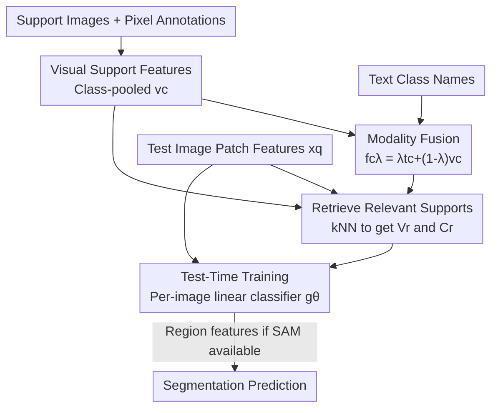

# Retrieve and Segment: Are a Few Examples Enough to Bridge the Supervision Gap in Open-Vocabulary Segmentation?

**Conference**: CVPR 2026  
**Paper**: [CVF Open Access](https://openaccess.thecvf.com/content/CVPR2026/html/Aravanis_Retrieve_and_Segment_Are_a_Few_Examples_Enough_to_Bridge_CVPR_2026_paper.html)  
**Code**: None  
**Area**: Segmentation / Open-Vocabulary Segmentation  
**Keywords**: Open-vocabulary segmentation, retrieval augmentation, test-time adaptation, few-shot, modality fusion

## TL;DR
Addressing the gap where Open-Vocabulary Segmentation (OVS) lags behind fully-supervised models, this paper proposes RNS, a retrieval-augmented test-time adapter that complements text prompts with "a few pixel-annotated support images." By training a per-image lightweight linear classifier using "learned per-image fusion" of retrieved visual and text support features, RNS narrows the zero-shot to fully-supervised gap to 11.5 mIoU in less than 1 second on an A100.

## Background & Motivation

**Background**: The mainstream approach to Open-Vocabulary Segmentation (OVS) utilizes vision-language models (VLMs) like CLIP to align image patch features with category text features in a shared embedding space. This allows for classifying every pixel using arbitrary text prompts (class names/descriptions) at test time without a fixed category list, extending VLM zero-shot capabilities from "image-level" to "pixel-level."

**Limitations of Prior Work**: However, OVS still lags significantly behind fully-supervised segmentation, and recent improvements have reached a "plateau." Two root causes for this gap are: (i) VLMs are trained on "image-level" image-text pairs, creating a natural misalignment between coarse supervision and the "fine-grained pixel prediction" required for segmentation; (ii) Natural language is inherently ambiguous—given only a class name, models often misclassify "riders" as "motorcycles" or hallucinate "potted plants" in the background.

**Key Challenge**: Text provides open-vocabulary generalization but lacks pixel-level precision; relying solely on visual examples fails completely when "certain classes lack support images" and can confuse visually similar objects (e.g., motorcycle vs. bicycle). Each modality has its blind spots, and existing methods (kNN-CLIP, FREEDA) use **hand-crafted "late fusion"**, where independent predictions are combined using manually tuned weights, which often becomes counterproductive as the number of support images increases.

**Goal**: While maintaining open-vocabulary capabilities, Ours aims to fill the supervision gap using "small amounts" of pixel-annotated visual examples and handle various imperfections in the real open world: cases where some classes have only text, some have only visual support, and support sets that expand dynamically over time.

**Key Insight**: The features of modern large-scale VLMs are already strong and generalizable enough that retraining the backbone is unnecessary—one only needs to "guide" predictions on top of frozen features. Consequently, instead of training a global classifier, it is better to **train an extremely lightweight classifier separately and temporarily for each test image**, feeding it only support samples that are truly relevant to that specific test image (filtered via retrieval).

**Core Idea**: Combine retrieval augmentation with test-time training (TTT). Relevant visual features are retrieved from the support set via kNN based on test image patches, followed by **learned per-image fusion** with text features (rather than manual late fusion) to train a per-image exclusive linear classifier online via cross-entropy.

## Method

### Overall Architecture
The task setting for RNS (Retrieve and Segment) is as follows: given a test image and a set of test-time categories $C$, each category has either text examples (class names/descriptions) or a few pixel-annotated visual examples (support images). The goal is to classify each pixel. The entire pipeline consists of three stages: **Support Construction** (offline pooling of support images into compact "visual class features" fused with text features to obtain two support feature sets), **Test-Time Training** (retrieving relevant support features for each test image and training a lightweight linear classifier $g_\theta$ via cross-entropy), and **Inference** (applying this per-image classifier to test image patch/region features to produce the segmentation map). The backbone remains frozen throughout, and only the linear head is trained, enabling test-time training for a single image in less than 1 second on an A100.

### Key Designs

**1. Visual Support Features: compressing support images into "class-pooled prototypes" instead of storing raw images**

The challenge is to allow the support set to expand dynamically while maintaining a small memory footprint, which precludes storing raw images or full patch features. The approach is: extract the patch feature matrix $X^i\in\mathbb{R}^{n\times d}$ for a support image $I^i$, downsample and reshape the full-resolution pixel annotations into patch-level labels (no longer 0/1 after interpolation), perform L1 normalization by class to obtain $P^i\in[0,1]^{n\times C}$, and then use this to weight-pool patch features into "per-image visual class features":

$$v^i_c=\sum_{j=1}^{n}P^i_{jc}\,x^i_j.$$

The union of $v^i_c$ from all support images forms the **visual support feature set** $V$. When a new support image is added, one only needs to incrementally update $V$, the aggregated class features $v_c$, and the subsequent fusion features. The entire support set naturally supports online expansion. This stores only a few class prototype vectors, occupying minimal memory while retaining discriminative information from the visual modality.

**2. Learned Modality Fusion: fusing text and vision into a "fused class feature" bundle using mixing coefficient λ**

The challenge is the "modality gap" between visual and text features in VLMs. Since categorization is performed on image patch features, **directly using text features as visual classifiers yields poor results** (confirmed by experiments). The approach for class $c$ is to first aggregate its visual class features across all support images $v_c=\sum_{i\in I_c}v^i_c$, and then linearly mix them with the text class feature $t_c$:

$$f_{c\lambda}=\lambda\,t_c+(1-\lambda)\,v_c,\quad\lambda\in[0,1].$$.

Critically, **Ours does not use a single λ**, but calculates a set for a group of coefficients $\Lambda\subseteq[0,1]$, resulting in a **fused support feature set** $F=\{f_{c\lambda}\}$. This captures both text-side semantic priors and visual-side fine-grained discrimination, ensuring representation at different proportions for both sides. Experiments show that using multiple $\lambda$ values significantly outperforms a single one (e.g., fixing $\lambda=0.8$ causes a 5-point drop in low-shot scenarios). Unlike kNN-CLIP/FREEDA, which perform "late manual fusion" of two independent predictions, fusion here occurs at the feature level and is truly learned into the classifier during training.

**3. Retrieval-Driven Test-Time Adaptation: training per-image classifiers online via relevant supports**

The challenge is that support sets can be large, and most classes may be irrelevant to the current test image; feeding everything in is slow and introduces interference. The approach is to take the $k$-nearest neighbors from the visual support set for each patch feature $x^q_j$ of the test image and take their union to obtain the **retrieved visual support set**:

$$V_r=\bigcup_{j=1}^{n}\text{kNN}(V,\,x^q_j).$$

A linear classifier $g_\theta$ is then trained with an objective containing two terms. The **visual support loss** requires the classifier to predict the ground truth class for each retrieved visual feature: $L_v=\sum_{v\in V_r}w_{l(v)}\,\text{CE}(g_\theta(v),\mathbf{1}_{l(v)})$. The **fusion support loss** injects text signals by training on the fused features only for "classes that appeared in the retrieved set" $C_r$: $L_f=\sum_{c\in C_r}w_c\sum_{\lambda\in\Lambda}\text{CE}(g_\theta(f_{c\lambda}),\mathbf{1}_c)$, with total loss $L=L_v+\beta_f L_f$. After training, $g_\theta$ is applied to test image patch features to produce low-resolution predictions, which are then upsampled. Compared to training a global classifier offline, this "retrieve-relevant + temporary-per-image-training" approach selects the most relevant visual class features for each test image. Replacing the retrieval set with a random subset significantly degrades performance, proving that "retrieval relevance" is critical.

**4. Class Relevance Weight $w_c$: suppressing irrelevant retrieved classes via image-text similarity**

A pain point is that kNN retrieval inevitably collects some support features irrelevant to the test image, which can contaminate training. The approach assigns a relevance weight $w_c$ to each class, estimated via the dot product of the global test image feature $x^q$ (global average pooling of patch features) and the text class feature followed by softmax:

$$w_c=s_C\big((x^q)^\top t_c\big),\qquad x^q=\frac1n\sum_{j=1}^{n}x^q_j,$$

which is multiplied into each sample in $L_v$ and $L_f$. This effectively re-weights retrieval results based on "how much this image globally looks like class $c$," suppressing irrelevant classes and magnifying those actually present in the test image. Ablations show that removing $w_c$ drops performance across all sample sizes (0.39 drop at B=1, 0.48 drop at B=10), serving as a safety buffer for retrieval tolerance.

**5. Unified Handling of Incomplete Support: supplementing missing vision with pseudo-labels and missing text with average text**

The challenge is that support is often incomplete in the open world, and RNS aims to use "one objective" for all settings. **For classes missing visual support** (text names only, $C_d$): zero-shot predictions $\hat P^q$ are used to hard-assign test image patches to the most likely classes, followed by L1 normalization to get $\tilde P^q$. For classes $C_d\cap C_q$ that are indeed predicted, visual class features are pooled via pseudo-labels $v_c=\sum_j\tilde P^q_{jc}x^q_j$, followed by fusion (4). Since pseudo-labels are uncertain, an additional KL pseudo-label loss $L_p=\sum_{c\in C_d\cap C_q}w_c\sum_\lambda \text{KL}(\hat p_{c\lambda}\,\|\,g_\theta(f_{c\lambda}))$ is added, making the total loss $L=L_v+\beta_f L_f+\beta_p L_p$. Removing this term in the "missing vision" setting leads to a sharp performance drop. **For classes missing text support**: they are replaced by the "average text feature of named classes" as a neutral semantic prior, ensuring all classes participate equally in the loss without bias. If no text is available at all, it degenerates to a vision-only baseline with $\Lambda=\{0\}$ and $w_c=1$. Furthermore, when SAM provides region proposals, patch features are mask-pooled via L1 normalization into region features $x^q_r=\sum_j\bar S_{jr}x^q_j$ for classification at the region level rather than the patch level, further boosting accuracy.

## Key Experimental Results

Datasets: Average mIoU reported across 6 OVS benchmarks (VOC, Context, COCO Object, COCO-Stuff, Cityscapes, ADE20K), plus comparisons with fully supervised models on C-59, FoodSeg103, and CUB. Backbones use OpenCLIP ViT-B/16 (MaskCLIP trick) and DINOv3.txt ViT-L/16; region proposals use SAM 2.1 Hiera-L. Comparisons are made against Zero-shot, kNN-CLIP, and FREEDA (all modified to use ground truth support images).

### Main Results (Table 2, DINOv3.txt + SAM)

| Method | Pixel Annotations | VOC | City | ADE | C-59 | Food | CUB | Avg |
|:---|:---|:---|:---|:---|:---|:---|:---|:---|
| Zero-shot DINOv3.txt+SAM | 0 | 31.3 | 39.3 | 27.7 | 36.3 | 27.2 | 5.8 | 27.9 |
| CAT-Seg (OVS, trained on COCO) | 118k | 82.5 | 47.0 | 37.9 | 63.3 | 33.3 | 22.9 | 47.8 |
| **+ RNS (B=1)** | 66 | 73.2 | 59.1 | 37.3 | 52.7 | 42.8 | 34.0 | 49.9 |
| **+ RNS (B=20)** | 964 | 82.1 | 61.7 | 47.8 | 62.5 | 52.2 | 65.2 | **61.9** |
| Full Supervision (Best per dataset) | 20k | 90.4 | 87.0 | 63.0 | 70.3 | 45.1 | 84.6 | 73.4 |

RNS (B=20) raises the zero-shot score from 27.9 up to 61.9 (+34), narrowing the gap with full supervision to 11.5 while using two orders of magnitude fewer pixel annotations (964) than CAT-Seg (118k), outperforming CAT-Seg on average by 14.1. Gains are particularly striking on fine-grained datasets far from the COCO domain (CUB 5.8→65.2, Food 27.2→52.2).

### Ablation Study (Table 1, Average mIoU, parenthesis denotes relative difference to full RNS)

| Configuration | B=1 | B=5 | B=10 | Description |
|:---|:---|:---|:---|:---|
| RNS (Full) | 41.59 | 47.87 | 49.02 | All components |
| w/o $w_c$ | 41.20 (−0.39) | 47.43 (−0.44) | 48.54 (−0.48) | No class relevance weight |
| w/o $w_c$, $\Lambda=\{0.8\}$ | 36.40 (−5.19) | 46.55 (−1.32) | 48.38 (−0.64) | Fixed single λ |
| w/o text | 34.11 (−7.48) | 45.71 (−2.16) | 48.00 (−1.02) | Dropping text completely |

### Key Findings
- **Text is most valuable when "samples are sparse"**: Dropping text results in a 7.48 point loss at B=1, while at B=20 performance is nearly equal to w/o-text—text priors fill the gap of insufficient visual support; visual support naturally dominates as support images increase.
- **Learned Fusion > Manual Late Fusion**: kNN-CLIP's fusion heuristic is useful at B=1 but becomes counterproductive after B=5, indicating manual fusion sensitivity to support scale; the gap between RNS and kNN-CLIP widens on stronger backbones (DINOv3), showing RNS benefits more from representation gains.
- **Retrieval relevance is the lifeline**: Replacing the retrieval set $V_r$ with a random subset of $V$ leads to a significant drop; selecting a random subset from "retrieved classes" is clearly better than selecting from the entire set, proving the value of "adapting on semantically relevant classes."
- **Robustness to incomplete support depends on pseudo-label loss**: In "missing vision" settings, removing $L_p$ causes a sharp drop; kNN-CLIP/FREEDA quickly fall below zero-shot levels because they do not handle missing classes.
- **Test-time Retrieval vs. Offline Training**: Offline training of a linear classifier on visual class features is comparable to RNS (w/o text) at B=1~3 but degrades as samples increase; combining a fully-supervised pretrained backbone with RNS test-time adaptation yields the best results, confirming that "online training on test-image-relevant support" is superior to "offline training on the entire support set."

## Highlights & Insights
- **The "retrieval + per-image temporary classifier training" paradigm is efficient**: With a frozen backbone and training only the linear head, it takes <1 second on an A100 while closing over half the gap between zero-shot and full supervision—it reduces the required annotation from hundreds of thousands to hundreds, a real leap in data efficiency.
- **Multi-λ fusion is an underrated design detail**: Rather than locking in a single mixing ratio, allowing a set of λ into the training set lets the classifier choose from multiple "text-dominant vs. vision-dominant" possibilities. Fixing $\lambda=0.8$ causes a 5-point drop in low-shot cases, showing high cost-effectiveness for this step.
- **A single loss handles four support settings**: Full / missing vision / missing text / pure text zero-shot settings are all covered by the same framework, transitioning smoothly via pseudo-label loss and "average text replacement." This is elegant and can be directly migrated to continual learning scenarios where category lists grow over time.
- **Personalized segmentation with zero modification**: Adding a few samples of a specific instance (e.g., "a plate with a kingfisher") to the support set allows distinguishing that instance from generic categories—dynamic support sets naturally support personalization "for free."

## Limitations & Future Work
- **Reliance on retrieval quality and backbone features**: The method relies on "VLM features being strong enough and kNN successfully retrieving relevant support." If the backbone aligns patch features poorly in a specific domain, both retrieval and fusion will fail; the paper also admits that region proposals (SAM) increase accuracy but significantly add to inference overhead.
- **Pseudo-labels propagate zero-shot errors**: For classes missing visual support, zero-shot predictions are used as pseudo-labels; hallucinations/confusions from the zero-shot model are learned into the classifier. Failure cases (e.g., misclassifying an orange towel as a swimsuit due to over-reliance on color) stem from such insufficient context.
- **Online training for every test image**: While <1 second per image, the cumulative overhead for large-scale batch inference is not negligible compared to a one-time trained global model; hyper-parameters (learning rate, iterations) were tuned using a validation split from the support set in closed-set comparisons, and setting robust hyperparameters in open settings is not fully discussed.
- **Potential improvements**: Explore replacing multi-λ fusion with learnable per-class λ, or making class relevance weights $w_c$ participate differentiably in end-to-end training; investigate sharing/caching classifiers across test images to amortize online training costs.

## Related Work & Insights
- **vs. kNN-CLIP**: Both use "class vector support sets derived from pixel-annotated images" for retrieval, but kNN-CLIP non-parametrically labels regions via k-nearest neighbors and uses manual late fusion for text and vision. RNS switches to "retrieval + learned per-image fusion + online classifier training," which does not suffer from heuristic failure as support images increase and benefits more from strong backbones.
- **vs. FREEDA**: Conceptually similar, but the original FREEDA expands text into a visual classifier via "generated" visual examples and merges it with a zero-shot text classifier. After adapting it to use real support images for fair comparison, Ours finds that FREEDA gains very little from combining text and vision, suggesting a low ceiling for non-parametric + manual fusion.
- **vs. Power-of-One (Parallel Work)**: The latter performs one-shot fine-tuning of text embeddings and some backbone layers for each class, requiring access to raw images and tuning internal VLM layers. RNS only trains a test-time linear head on pre-extracted features, which is lighter and leaves the backbone untouched.
- **vs. CAT-SAM / COSINE**: CAT-SAM uses conditional tuning for few-shot adaptation of SAM but does not combine text and visual support; COSINE unifies text and image prompt segmentation but evaluates only via single-modality prompts on multi-class OVS. RNS differentiates itself via "text+visual dual support + single objective + robustness to incompleteness."

## Rating
- Novelty: ⭐⭐⭐⭐ The combination of "retrieval augmentation + per-image test-time classifier training + learned multi-λ fusion" is novel and represents a paradigm upgrade over manual late fusion.
- Experimental Thoroughness: ⭐⭐⭐⭐⭐ Covers 6 benchmarks, two backbones, four support settings, retrieval mechanisms/offline baselines/personalized segmentation, with solid ablations.
- Writing Quality: ⭐⭐⭐⭐ Formulas and settings are clearly stated; some branches for incomplete support are slightly dense, but overall readability is high.
- Value: ⭐⭐⭐⭐⭐ Narrowing the zero-shot to full-supervision gap to 11.5 with only hundreds of annotations is a practical advancement for data efficiency and dynamic open-world expansion.

<!-- RELATED:START -->

## Related Papers

- [\[CVPR 2026\] Test-Time Multi-Prompt Adaptation for Open-Vocabulary Remote Sensing Image Segmentation](test-time_multi-prompt_adaptation_for_open-vocabulary_remote_sensing_image_segme.md)
- [\[CVPR 2026\] S2C2Seg: Semantic-Spatial Consistency and Category Optimization for Open-Vocabulary Segmentation](s2c2seg_semantic-spatial_consistency_and_category_optimization_for_open-vocabula.md)
- [\[CVPR 2026\] SPAR: Single-Pass Any-Resolution ViT for Open-Vocabulary Segmentation](spar_single-pass_any-resolution_vit_for_open-vocabulary_segmentation.md)
- [\[CVPR 2026\] MARIS: Marine Open-Vocabulary Instance Segmentation](maris_marine_open-vocabulary_instance_segmentation.md)
- [\[CVPR 2026\] PCA-Seg: Revisiting Cost Aggregation for Open-Vocabulary Semantic and Part Segmentation](pca-seg_revisiting_cost_aggregation_for_openvocabulary_semantic_and_part_segmentat.md)

<!-- RELATED:END -->
